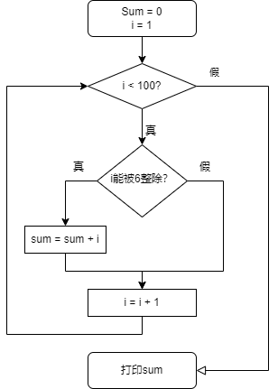
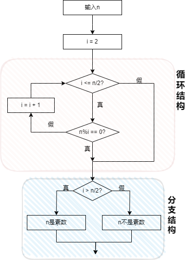
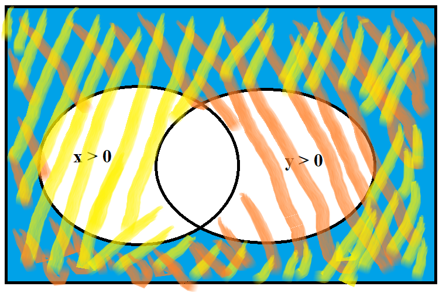

# C语言程序设计(第3版) 何钦铭 颜晖 主编

## 课后习题答案

### 习题1-认识C语言

##### 1.合法的标识符

对C语言来说，下列标识符中哪些是合法的，哪些是不合法的?

```c
total _debug Counter1 begin_  合法
```

```c
Large&Tall 非法
```

C语言的标识符由字母、数字、下划线组成，其中第一个字符必须是字母或下划线。

&是特殊字符，所以Large&Tall非法

小知识：main不是C的保留字，可以把main定义为局部变量，如果和在前者在同一翻译单元（经过预处理、包含了头文件的源文件）中，会产生重定义的编译错误。“-”不是标识符的合法组成，不要看错了。

##### 2.改写本章 1.4 节中的流程图 1.2

求 1～100 中能被 6 整除的所有整数的和。



<center style="color:#C0C0C0">图1.2 改写流程图</center>

##### 3.改写本章 1.4 节中的程序

求 1～100 中能被 6 整除的所有整数的和，并在编程环境中验证该程序的运行结果。

```c
#include<stdio.h>

int main(){
    int sum = 0;
    int i = 1;
    for(i = 1; i <= 100; i++){
    	if(i % 6 == 0)
    		sum += i;
	}
    printf("%d", sum);
    
    return 0;
}

运行结果：816
```

##### 4.判断素数

对于给定的整数 n（n＞1），请设计一个流程图判别 n 是否为一个素数（只能被 1 和自己整除的整数），并分析该流程图中哪些是顺序结构、哪些是分支结构与循环结构

答：循环结构和分支结构如下图，从最上边的两个实线框和下面两个大的阴影框一同构成了顺序结构。



<center style="color:#C0C0C0">图1.4 判定素数流程图</center>

### 练习2-用C语言编写简单程序

##### 【练习 2-1】Programming in C is fun!

编写程序，在屏幕上显示一个短句“Programming in C is fun!”。

```c
#include<stdio.h>

int main()
{
	printf("Programming in C is fun!\n");
	
	return 0;
}
```

##### 【练习 2-2】 运行结果是什么？

下列语句的运行结果是什么？与例 2-2 的运行结果有何不同？为什么？

```c
printf("Programming is fun. And Programming in C is even more fun!\n");
```

答：运行结果：Programming is fun. And Programming in C is even more fun!

例2-2是分两行输出结果，因为两行都采用了换行符号。

##### 【练习 2-3】输出倒三角图案

编写程序，在屏幕上显示如下图案。

```c
* * * *
 * * *
  * *
   *
```

答：

```c
#include<stdio.h>

int main()
{
    printf("* * * *\n");
    printf(" * * *\n");
    printf("  * *\n");
    printf("   *\n");
    return 0;
}
```

##### 【练习 2-4】 华氏温度转换成摄氏温度

编写程序，求华氏温度 150°F 对应的摄氏温度（计算公式同例 2-3）

答：

```c
#include<stdio.h>

int main()
{
	int celsius, fahr; 
	fahr = 150;
 	celsius = 5 * (fahr - 32) / 9;
	printf("fahr = 150, celsius = %d", celsius); 
	return 0;	
}
```

##### 【练习 2-5】 改写表达式

算术表达式` 5*(fahr-32)/9 `能改写成` 5(fahr-32)/9 `吗？为什么？如果将其改写为` 5/9*(fahr-32)`，会影响运算结果吗？

答：

​		不能，` 5(fahr-32)/9 `不是合法表达式，因为`*`运算符不能省略，` 5/9*(fahr-32)`的结果为0。

##### 【练习 2-6】 自由落体

一个物体从 100 米的高空自由落下，编写程序，求它在前 3 秒内下落的垂直距离。设重力加速度为 10m/s^2。

答：

```c
#include<stdio.h>

int main()
{
    float h = 0;
    int t = 3;
    const int g = 10;
    h = 1 / 2.0 * g * t * t;

    printf("height = %.2f", h);
    
    return 0;
}
```

##### 【练习 2-7】输入、输出语句的顺序

输入提示和输入语句的顺序应该如何安排？例 2-5 中，scanf("%d%d%lf", &money, &year,  &rate) 能改写为 scanf("%d%lf%d", &money, &year, &rate) 吗？为什么？能改写为 scanf("%d%lf%d", &money, &rate, &year) 吗？如果可以，其对应的输入数据是什么？

解答：

​		前者不能，因为%lf和year的数据类型不匹配，%d和rate的数据类型不匹配。

​		后者能，对应的输入数据是1000 0.025 3。

##### 【练习 2-8】任意华氏温度转换摄氏温度

编写程序，输入华氏温度，输出对应的摄氏温度，计算公式同例 2-3。

解答：

```c
#include<stdio.h>

int main()
{
    int fahr = 0;
    int celsius = 0;
    scanf("%d", &fahr);
    celsius = 5 * (fahr - 32)/9;

    printf("Celsius = %d\n", celsius);

    return 0;
}
```

##### 【练习 2-9】整数四则运算

输入 2 个正整数，计算并输出它们的和、差、积、 商。试编写相应程序。

解答：

```c
#include<stdio.h>

int main()
{
    int a, b;
    scanf("%d %d", &a, &b);

    printf("%d + %d = %d\n", a, b, a + b);
    printf("%d - %d = %d\n", a, b, a - b);
    printf("%d * %d = %d\n", a, b, a * b);
    printf("%d / %d = %d\n", a, b, a / b);
    
    return 0;
}
```

##### 【练习 2-10】计算分段函数

（判断 x 是否不为 0）：输入 x ，计算并输出下列分 段函数 f(x) 的值（保留 1 位小数）。试编写相应程序。
$$
y = f(x) =  \begin{cases}    \frac {1}{x} & x ≠ 0 \\    0 & x = 0 \end{cases}
$$

解答：

```c
#include<stdio.h>
int main()
{
    double x = 0;
    double result = 0;
    scanf("%lf", &x);

    if(x == 0)
        result = x;
    else
        result = 1 / x;

    printf("f(%.1f) = %.1f\n", x, result);

    return 0;
}
```

##### 【练习 2-11】计算分段函数

（判断 x 是否小于 0）：输入 x ，计算并输出下列分段函数 f(x)的值（保留 2 位小数）。可包含头文件 math.h，并调用 sqrt （） 函数求平方根，调用 pow（） 函数求幂。试编写相应程序。
$$
y = f(x) =  \begin{cases}    (x+1)^2+2x+\frac {1}{x} & x < 0 \\    \sqrt{x} & x ≥ 0 \end{cases}
$$

解答：

```c
#include<stdio.h>
#include<math.h>
int main()
{
    double x = 0;
    double result = 0;
    scanf("%lf", &x);

    if(x < 0)
        result = (x + 1) * (x + 1) + 2 * x + 1 / x;
    else
        result = sqrt(x);

    printf("f(%.1f) = %.3f\n", x, result);

    return 0;
}
```

##### 【练习 2-12】输出华氏 - 摄氏温度转换表

输入两个整数 lower 和 upper，输出 一张华氏 - 摄氏温度转换表，华氏温度的取值范围是 [lower, upper] ，每次增加 2°F，计算公式同例 2-6 。试编写相应程序。

解答：

```c
#include<stdio.h>

int main()
{
    int lower, upper;
    int fahr = 0;
    double celsius = 0;
    scanf("%d %d", &lower, &upper);
    if(lower > upper)
        printf("Invalid.\n");
    else
    {
        printf("fahr celsius\n");
        for(fahr = lower; fahr <= upper; fahr = fahr + 2)
        {
            celsius = 5 * (fahr - 32)/9.0;
            printf("%d%6.1f\n", fahr, celsius);
        }
    }

    return 0;
}
```

##### 【练习 2-13】求给定序列前 n 项和

（1+1/2+1/3+ …1/n）：输入一个正整数 n ，计算序列 1+1/2+1/3+ …的前 n 项之和。试编写相应程序。

解答：

```c
#include<stdio.h>

int main()
{
    double sum = 0;
    int n;
    scanf("%d", &n);

    for(int i = 1; i <= n; i++)
        sum += 1.0/i;

    printf("sum = %.6f", sum);
    
    return 0;
}
```

##### 【练习 2-14】求给定序列前 n 项和

（1+1/3+1/5+ …）：输入一个正整数 n ，计算 序列 1+1/3+1/5+ …的前 n 项之和。试编写相应程序。

解答：

```c
#include<stdio.h>

int main()
{
    double sum = 0, denominator = 1;
    int n;
    scanf("%d", &n);
    
    for(int i = 1; i <= n; i++)
    {
        sum += 1/denominator;
        denominator += 2;
    }

    printf("sum = %.6f", sum);
    
    return 0;
}
```

##### 【练习 2-15】求给定序列前 n 项和

（ 1-1/4+1/7-1/10 …）：输入一个正整数 n ， 计算序列 1-1/4+1/7-1/10+1/13-1/16 …的前 n 项之和。试编写相应程序。

解答：

```c
#include<stdio.h>

int main()
{
    double sum = 0, denominator = 1, flag = 1;
    int n;
    scanf("%d", &n);

    for(int i = 1; i <= n; i++)
    {
        sum += flag / denominator;
        flag = flag * (-1);
        denominator += 3;
    }

    printf("sum = %.3f", sum);

    return 0;
}
```

##### 【练习 2-16】执行下列程序段后， sum的值____。

```c
for (i = 1; i <= 10; i++){ 
 sum = 0; 
 sum = sum + i; 
}
```

解答：

​		sum的值是10，注意一下每次循环sum都要先被赋值10；

##### 【练习 2-17】生成 3 的乘方表

输入一个正整数 n，生成一张 3 的乘方表，输 出 $3^0$到 $3^n$的值。可包含头文件 math.h, 并调用幂函数计算 3 的乘方。试编写相应程序。

解答：

```c
#include<stdio.h>
#include<math.h>

int main()
{
    int n;
    scanf("%d", &n);
    int value;
    for(int i = 0; i <= n; i++)
    {
        value = pow(3, i);
        printf("pow(3,%d) = %d\n", i, value);
    }

    return 0;
}
```

##### 【练习 2-18】求组合数

根据下列公式可以算出从 n 个不同元素中取出 m 个 元素（m≤n）的组合数。输入两个正整数 m 和 n （m≤n），计算并输出组合数。 要求定义和调用函数 fact(n) 计算 n! ，函数类型是 double 。
$$
C^m_n = \frac{n!}{m!(n-m)!}
$$

解答：

```c
#include<stdio.h>

double fact(int n)
{
    int i;
    double product = 1;

    for(int i = 1; i <= n; i++)
        product *= i;

    return product;
}

int main()
{
    int n, m;
    scanf("%d %d", &m, &n);
    int result = fact(n)/(fact(m) * fact(n - m));

    printf("result = %d", result);

    return 0;
}
```

### 习题2-用C语言编写简单程序

##### 1.求整数均值

输入 4 个整数，计算并输出这些整数的和与平均值，其中平均 值精确到小数点后 1 位。试编写相应程序。

解答：

```c
#include<stdio.h>

int main()
{
    int a, b, c, d, sum;
    double average;
    scanf("%d %d %d %d", &a, &b, &c, &d);

    sum = a + b + c + d;
    average = sum / 4.0;
    printf("Sum = %d; Average = %.1f", sum, average);

    return 0;
}
```

##### 2.阶梯电价

为了倡导居民节约用电， 某省电力公司执行“阶梯电价”， 安装一 户一表的居民用户电价分两个“阶梯”：月用电量 50 千瓦时（含 50 千瓦时） 以内的，电价为 0.53 元/ 千瓦时；超过 50 千瓦时，超出的用电量电价上调 0.05  元/ 千瓦时。输入用户的月用电量（千瓦时） ，计算并输出该用户应支付的电费 （元）。试编写相应程序。

解答：

```c
#include<stdio.h>

int main()
{
    double x, cost;
    scanf("%lf", &x);

    if(x < 0)
        printf("Invalid Value!\n");
    else if(x <= 50)
        cost = x * 0.53;
    else
        cost = (x - 50) * 0.58 + 50 * 0.53;
    if(x >= 0)
        printf("cost = %.2f", cost);

    return 0;
}
```

##### 3.序列求和

输入两个正整数*m*和*n*（0<*m*≤*n*），求$\sum_{i=m}^{n}(i^2 + \frac{1}{i})$，结果保留6位小数。试编写相应程序。

解答：

```c
#include<stdio.h>

int main()
{
    int m, n;
    scanf("%d %d", &m, &n);
    double sum = 0;
    for(int i = m; i <= n; i++)
    	sum += 1.0 * i * i + 1.0 / i;
   
    printf("sum = %.6f", sum);

    return 0;
}
```

##### 4.求交错数列前n项和

输入一个正整数n，计算交错序列 1-2/3+3/5-4/7+5/9-6/11+... 的前n项之和。试编写相应程序。

解答：

```c
#include<stdio.h>

int main()
{
    double sum = 0, denominator = 1, numerator = 1;
    int n;
    scanf("%d", &n);
    double flag = 1;

    for(int i = 1; i <= n; i++)
    {
        sum += flag * numerator / denominator;
        flag = -flag;
        numerator ++;
        denominator += 2;
    }

    printf("%.3f\n", sum);
    
    return 0;
}
```

##### 5.平方根求和

输入一个正整数n，计算平方根序列$1+\sqrt{2}+\sqrt{3}+⋯+\sqrt{n}$的值（保留2位小数）。可包含头文件`math.h`，并调用`sqrt`函数求平方根。试编写相应程序。

解答：

```c
#include<stdio.h>
#include<math.h>

int main()
{
    double sum = 0;
    int n;
    scanf("%d", &n);

    for(int i = 1; i <= n; i++)
        sum += sqrt(i);

    printf("sum = %.2f", sum);

    return 0;
}
```

##### 6.求给定序列前 n 项和

（1！+2！+…）：输入一个正整数 n ，求 e=1！+2！3！+… +n！的值。要求定义和调用 fact （n）计算 n！，函数类型是 double 。试编写相应程序。

解答：

```c
#include<stdio.h>

double factorial(int n)
{
    double product = 1;
    for(double i = 1; i <= n; i++)
        product *= i;

    return product;
}

int main()
{
    int n;
    scanf("%d", &n);
    int sum = 0;
    
    for(int i = 1; i <=n; i++)
        sum += factorial(i);

    printf("%d", sum);
    
    return 0;
}
```


### 练习3-分支结构

##### 【练习 3-1 】还需要增加测试用例吗

例 3-4 中使用 else-if 语句求解多分段函数， 为了检查 else-if  语句的三个分支是否正确， 已经设计了三组测试用例， 请问还需要增加测试用例吗？为什么？如果要增加，请给出具体的测试用例并运行程序。

解答：

​		最好再增加两组测试用例：x = 0、x = 15，对分段函数的边界情况进行测试。

##### 【练习 3-2 】计算符号函数的值

 输入一个整数 x ，计算并输出下列分段函数 sign(x) 的值。
$$
y = sign(x) =  \begin{cases}    -1 & x < 0 \\ 0 & x = 0 \\  1 & x > 0 \end{cases}
$$

解答：

```c
int main()
{
    int x;
    scanf("%d", &x);
    int y = 0;

    if(x < 0)
        y = -1;
    else if(x == 0)
        y = 0;
    else
        y = 1;

    printf("sign(%d) = %d", x, y);

    return 0;
}
```

##### 【练习 3-3 】统计学生平均成绩与及格人数

输入一个正整数 n ，再输入 n 个 学生的成绩，计算平均成绩，并统计所有及格学生的人数。试编写相应程序。

解答：

​		注意没有学生要特殊处理一下，否则有可能发生除零错误。

```c
#include<stdio.h>

int main()
{
    int n, count = 0;
    double total = 0, average = 0;

    scanf("%d", &n);
    int stu;
    for(int i = 0; i < n; i ++)
    {
        scanf("%d ", &stu);
        total += stu;
        if(stu >= 60)
            count ++;
    }
    if(n > 0)
    	average = total / n;

    printf("average = %.1f\ncount = %d", average, count);
    
    return 0;
}
```

##### 【练习 3-4 】统计字符

输入 10 个字符，统计其中英文字母、空格或回车、数字字符和其他字符的个数。试编写相应程序。

解答：

```c
#include<stdio.h>

int main()
{
    int letter, blank, digit, other;
    char ch;
    letter = blank = digit = other = 0;

    for(int i = 1; i <= 10; i++)
    {
        ch = getchar();
        if(ch >= 'A' && ch <= 'Z' || ch >= 'a' && ch <= 'z')
            letter ++;
        else if(ch == ' ' || ch == '\n')
            blank ++;
        else if(ch >= '0' && ch <= '9')
            digit ++;
        else
            other ++;
    }

    printf("letter = %d, blank = %d, digit = %d, other = %d", letter, blank, digit, other);
        
    return 0;
}
```

##### 【练习 3-5】输出闰年

输出 21 世纪中截至某个年份之前的所有闰年年份。判断闰年的条件是： 能被 4 整除但不能被 100整除，或者能被 400 整除。试编写相应程序。

解答：

```c
#include<stdio.h>
#define YEAR_BEGIN 2001
#define YEAR_END 2100

int main()
{
    int year;
    int count = 0;
    scanf("%d", &year);

    if(year < YEAR_BEGIN || year > YEAR_END)
        printf("Invalid year!\n");
    else
    {
        for(int i = YEAR_BEGIN; i <= year; i ++)
        {
            if((i % 4 == 0 && i % 100 != 0) || (i % 400 == 0))
            {
                count ++;
                printf("%d\n", i);
            }
        }
        if(count == 0)
        printf("None\n");
    }
    
    return 0;
}
```

##### 【练习 3-6 】去掉break会怎样？

在例 3-8 程序中，如果把 switch 语句中所有的 break 都去掉，运行结果会改变吗？如果有变化，输出什么？为什么？

解答：

​		会改变，会从满足输入的常量表达式那个case开始顺序执行所有语句，直到执行default后面的price = 0.0，所以会输出price = 0。

##### 【练习 3-7 】成绩转换

输入一个百分制成绩，将其转换为五分制成绩。百分制成绩到五分制成绩的转换规则：大于或等于 90 分为 A，小于 90 分且大于或等于 80 分为 B，小于 80分且大于或等于 70分为 C，小于 70 分且大于或等于 60 分为 D，小于 60 分为 E。试编写相应程序。

解答：

```c
#include<stdio.h>

int main()
{
    int grade;
    scanf("%d", &grade);
    grade /= 10;

    switch( grade )
    {
        case 10:
        case 9:
            printf("A\n");
            break;
         case 8:
            printf("B\n");
            break;
         case 7:
            printf("C\n");
            break;
         case 6:
            printf("D\n");
            break;
         default:
            printf("E\n");
            break;
    }

    return 0;
}
```

##### 【练习 3-8 】查询水果的单价

有 4 种水果，苹果（ apples ）、梨（pears）、桔子（oranges）和葡萄（ grapes），单价分别是 3.00 元/ 公斤，2.50 元/ 公斤， 4.10 元/ 公斤和 10.20 元/ 公斤。在屏幕上显示以下菜单（编号和选项） ，用户 可以连续查询水果的单价， 当查询次数超过 5 次时，自动退出查询； 不到 5 次 时，用户可以选择退出。当用户输入编号 1 ～4，显示相应水果的单价（保留两位小数）；输入 0 ，退出查询；输入其他编号，显示价格为 0 。试编写相应程序。 

​		[1] apples

​		[2] pears  

​		[3] oranges  

​		[4] grapes  

​		[0] Exit

解答：

```c
#include<stdio.h>

int main()
{
    double price;
    int choice, i;

    printf("[1] apple\n");
    printf("[2] pear\n");
    printf("[3] orange\n");
    printf("[4] grape\n");
    printf("[0] exit\n");

    for(i = 1; i <= 5; i ++)
    {
    scanf("%d", &choice);

    if(choice == 0)
        break;

    switch(choice)
    {
        case 1:price = 3.00; break;
        case 2:price = 2.50; break;
        case 3:price = 4.10; break;
        case 4:price = 10.20; break;
        default: price = 0.0; break;
    }

    printf("price = %.2f\n", price);
    }
    
    return 0;
}
```

##### 【练习 3-9】 使用嵌套if-else语句重新编写3-4

请读者重新编写例 3-4 的程序，要求使用嵌套的 if - else 语句，并上机运行。

解答：

```c
#include<stdio.h>

int main()
{
		double x, y;
		
		printf("Enter x:");
		scanf("%lf", &x);
		if(x < 0)
		{
			y = 0;
		}
		else
		{
			if(x <= 15)
			{
				y = 4 * x / 3;
			}
			else
			{
				y = 2.5 * x - 10.5;
			}
		}
		printf("f(%.2f) = %.2f\n", x, y);
		
		return 0;
}
```

##### 【练习 3-10 】嵌套的if-else语句条件判断

在例 3-12 中，改写 if 语句前， y= x + 1; 和 y= x + 2; 两条语句的执行条件是什么？改写后呢？

解答：

​		改写前，x∈[-∞，1)时执行 y = x + 1，x∈[1，2）时执行y = x + 2；

​		改写后，x∈[-∞，1)时执行 y = x + 1，x∈[2，+∞）时执行y = x + 2

### 习题3-分支结构

#### 一、选择题

(见参考答案)

#### 二、填空题

(见参考答案)

#### 三、程序设计题

##### 1.比较大小

输入 3 个整数，按从小到大的顺序输出。试编写相应程序。

解答：

```c
#include<stdio.h>

int main()
{
    int a, b, c;
    scanf("%d %d %d", &a, &b, &c);
    int tmp;

    if(a > b)
    {
        tmp = a;
        a = b;
        b = tmp;
    }
    if(a > c)
    {
        tmp = a;
        a = c;
        c = tmp;
    }
    if(b > c)
    {
        tmp = b;
        b = c;
        c = tmp;
    }

    printf("%d->%d->%d\n", a, b, c);

    return 0;
}
```

##### 2.高速公路超速处罚

按照规定，在高速公路上行驶的机动车，超过本车道限 速的 10%则处 200 元罚款；若超出50%，就要吊销驾驶证。请编写程序根据车速和限速判别对该机动车的处理。

解答：

​		注意一下，`%`在C语言中有其他功能，要用`printf()`输出百分号字符，需要使用双写的`%%`。

```c
#include<stdio.h>

int main()
{
    int speed, limit;
    scanf("%d %d", &speed, &limit);
	double q;
	
    q = 1.0 * (speed - limit) / limit;

    if(q < 0.1)
        printf("OK\n");
    else if(q >= 0.1 && q < 0.5)
        printf("Exceed %.f%%. Ticket 200", 100 * q);
    else
        printf("Exceed %.f%%. License Revoked", 100 * q);

    return 0;
}
```

##### 3.出租车计价

某城市普通出租车收费标准如下： 起步里程 3 公里，起步费 10 元；超起步里程后 10 公里内，每公里 2 元，超过 10 公里以上的部分加收 50% 的空驶补贴费，即每公里 3 元；营运过程中，因路阻及乘客要求临时停车的，按每 5 分钟 2 元计收（不足 5 分钟则不收费）。运价计费尾数四舍五入， 保留到元。 编写程序，输入行驶里程 ( 公里) 与等待时间 ( 分钟) ，计算并输出乘客应支付的车费( 元) 。

答案：

​		很明显参考答案是错的，超起步里程后 10 公里内，指的是3~10公里是2元/公里。

```c
#include<stdio.h>

int main()
{
    double mile, price;
    int time;

    price = 0;
    
    scanf("%lf %d", &mile, &time);

    if(mile <= 3)
        price += 10;
    else if(mile <= 10)
        price += 10 + 2 * (mile - 3);
    else
        price += 10 + 2 * 7 + 3 * (mile - 10);

    price += (time / 5) * 2;

    printf("%.0f", price);

    return 0;
}
```

##### 4.统计学生成绩

输入一个正整数 n ，再输入 n 个学生的成绩，统计五分制成绩的分布。百分制成绩到五分制成绩的转换规则：大于或等于 90 分为 A，小于 90 分且大于或等于 80 分为 B，小于 80分且大于或等于 70 分为 C，小于 70 分且 大于或等于 60 分为 D，小于 60分为 E。试编写相应程序。

解答：

```c
#include<stdio.h>

int main()
{
    int grade;
    int n;
    int A, B, C, D, E;
    A = B = C = D = E = 0;
    scanf("%d", &n);

    for(int i = 0; i < n; i ++)
    {
        scanf("%d", &grade);
        grade /= 10;
        switch(grade)
        {
            case 10:
            case 9:
                A ++;
                break;
            case 8:
                B ++;
                break;
            case 7:
                C ++;
                break;
            case 6:
                D ++;
                break;
            case 5:
            case 4:
            case 3:
            case 2:
            case 1:
            case 0:
                E ++;
                break;
        }
    }

    printf("%d %d %d %d %d", A, B, C, D, E);

    return 0;
}
```

##### 5.三角形判断

输入平面上任意三个点的坐标（ x1，y1）、（x2，y2）、（x3，y3）， 检验他们能否构成三角形。 如果这 3 个点能构成一个三角形， 输出周长和面积（保留 2 位小数）；否则，输出“ Impossible ”。试编写相应程序。

提示：在一个三角形中，任意两边之和大于第三边。三角形面积计算公式如下：
$$
area = \sqrt{s(s-a)(s-b)(s-c)},其中s=(a+b+c)/2
$$
解答：

```c
#include<stdio.h>
#include<math.h>

int main()
{
    double a, b, c, s, area;
    double x1, y1, x2, y2, x3, y3;
    scanf("%lf %lf %lf %lf %lf %lf", &x1, &y1, &x2, &y2, &x3, &y3);

    a = sqrt(pow((x1 - x2),2) + pow((y1 - y2),2));
    b = sqrt(pow((x2 - x3),2) + pow((y2 - y3),2));
    c = sqrt(pow((x1 - x3),2) + pow((y1 - y3),2));

    s = (a + b + c)/2;
    area = sqrt(s * (s - a) * (s - b) * (s - c));

    if(area == 0)
        printf("Impossible");
    else
        printf("L = %.2f, A = %.2f\n", 2 * s, area);
    
    return 0;
}
```

### 练习4-循环结构

##### 【练习 4-1 】修改例4-1程序

在例 4-1 程序中，如果对 item 赋初值 0 ，运行结果是什么？为什么？如果将精度改为 $10^{-3}$，运行结果有变化吗？为什么？

解答：

​		运行结果是0，因为fabs(0) = 0，不满足while循环的条件，所以会跳过while循环，pi = 0。

​		把精度改小(值增大)会导致循环次数减少，运行结果会发生改变，改之前的结果是3.1418，改之后的结果是3.1436。

##### 【练习 4-2 】 修改例 4-2 程序

运行例 4-2 程序时，如果将最后一个输入数据改为 -2，运行结果有变化吗？如果第一个输入数据是 -1 ，运行结果是什么？为什么？

解答：

​		不会有变化，因为都是负数，都可以满足循环终止条件，负数并不会被统计。

​		如果第一个输入的数据是-1，那就不会执行while循环，直接执行最后的语句，打印“Grade average is 0 \n”。

##### 【练习 4-3 】有精度要求的序列求和

序列求和$（1-1/4+1/7-1/10+1/13-1/16+ …）$：输入一个正实数 eps ， 计算序列 $1-1/4+1/7-1/10+1/13-1/16+ …$的值，精确到最后一项的绝对值小于 eps（保留 6 位小数）。试编写相应程序。

解答：

​		为什么要用do-while，因为有两个特殊的边界点要过，如果eps>=精度，那么应该直接输出首项1，如果用while会导致sum对序列一项都不统计，导致错误。故使用do-while，无论如何先走一遍循环，统计第一项的值。

```c
#include<stdio.h>
#include<math.h>

int main()
{
    double denominator, flag;
    double sum, eps, item;

    scanf("%lf", &eps);
    denominator = flag = item = 1.0;
    sum = 0.0;

    do
    {
        item = flag / denominator;
        sum += item;
        flag = - flag;
        denominator += 3;
    }while(fabs(item) > eps );

    printf("sum = %f", sum);

    return 0;
}
```

##### 【练习 4-4 】修改例 4-3 程序

如果将例 4-3 程序中的 do-while 语句改为下列 while 语句，会影响程序的功能吗？为什么？再增加一条什么语句，就可以实现同样的功能？

```c
while(number != 0){ 
 number = number / 10; 
 count ++; 
} 
```

解答：

​		会影响功能，如果输入0，则不会进入while循环，导致输出0位数，不符合题意。

​		可以添加一句条件判断语句，对number == 0单独处理即可。

```c
if(number == 0) count ++;
```

##### 【练习 4-5 】修改例 4-4 程序

例 4-4 程序中的第 9 ～15 行可以用下列 for 语句替代吗？为什么？

```c
	for(i = 2; i <= m / 2; i ++)
		if(m % i == 0) printf("No!\n");
		else printf("%d is a prime number!\n", m);
```

解答：

​		不可以，替换后的语句等价于下面的语句，某个`i`满足`m%i != 0`不能得出任何结论，而修改后的程序，每遇到一个不能整除`m`的`i`都会输出一次`printf("%d is a prime number!\n", m);`显然是不对的。

```c
#include<stdio.h>

int main(void)
{
	int i, m;
	
	printf("Enter a number:");
	scanf("%d", &m);
	
	for(i = 2; i <= m / 2; i ++)
    {
		if(m % i == 0) printf("No!\n");
		else printf("%d is a prime number!\n", m);
    }
    
	return 0;
}
```

##### 【练习 4-6】猜数字游戏

先输入 2 个不超过 100 的正整数，分别是被猜数 mynumber和允许猜测的最大次数 n，再输入你所猜的数 yournumber，与被猜数 mynumber进行比较，若相等，显示猜中， ；若不等，显示与被猜数的大小关系， 最多允许猜 n 次。如果 1 次就猜出该数，提示“ Bingo! ”；如果 3 次以内猜到该数，则提示“Lucky You! ”; 如果超过 3 次但不超过 n 次猜到该数，则提示“Good  Guess!”; 如果超过 n 次都没有猜到，则提示“ Game Over”; 如果在到达 n 次之前，用户输入了一个负数， 也输出“Game Over”，并结束程序。 试编写相应程序。

解答：

​		本题内层不要用switch语句，否则跳出循环比较麻烦。

```c
#include<stdio.h>

int main()
{
    int num, n;
    int count = 0;
    int guess;
    scanf("%d %d", &num, &n);

    do{
        scanf("%d", &guess);
        count ++;
        if(guess < 0)
        {
            printf("Game Over\n");
            break;
        }
        else if(guess > num)
        {
            printf("Too big\n");
        }
        else if(guess < num)
        {
            printf("Too small\n");
        }
        else
        {
            if(count == 1)
            {
                printf("Bingo!\n");
                break;
            }
            else if(count <= 3)
            {
                printf("Lucky You!");
                break;
            }
            else if(count <= n)
            {
                printf("Good Guess!");
                break;
            }
            else
            {
                printf("Game Over");
                break;
            }
        }
    }while(guess > 0);

    return 0;
}
```

##### 【练习 4-7 】求 e 的值

自然常数 *e* 可以用级数 $1+1/1!+1/2!+⋯+1/n!+⋯ $来近似计算。本题要求对给定的非负整数 *n*，求该级数的前 *n*+1 项和。要求使用嵌套循环。试编写相应程序。

解答：

​		注意一下item的初始化位置、e求和语句的位置即可。

```c
#include<stdio.h>

int main()
{
    double n;
    double e, item;
    e = 0;

    scanf("%lf", &n);
    for(int i = 1; i <= n + 1; i ++)
    {
        item = 1;
        for(int j = 1; j < i; j ++)
        {
            item *= j;
        }
        e += 1 / item;
    }

    printf("%.8f\n", e);

    return 0;
}
```

##### 【练习 4-8 】例4-8-1输入0会怎样

运行例 4-8 的源程序 1 时，如果先输入 0 ，即输入数据个数 n=0 ， 表示不再输入任何成绩，运行结果是什么？如何修改程序以应对这种情况？

解答：

​		程序不会结束运行，而是等待用户输入学生成绩，这与n = 0矛盾。

​		可以在第二个`scanf()`前加一条n > 0才执行后面语句的if条件判断。

##### 【练习 4-9 】例4-8-2输入第一个数为负

运行例 4-8 的源程序 2 时，如果输入的第一个数就是负数， 表示 不再输入任何成绩，运行结果是什么？如何修改程序以应对这种情况？

解答：

​		运行结果最大值是个负数；需要加一条单独的if语句判断为负数时特殊处理。

##### 【练习 4-10 】找出最小的值

输入一个正整数 n, 再输入 n 个整数，输出最小值。试编写相应程序。

解答：

​		方法一：先把min定义为一个最大正整数，可以少写一个`scanf()`。

```c
#include<stdio.h>
#define max 2147483647

int main()
{
    int n, num, min;
    scanf("%d", &n);
    min = max;
    
    for(int i = 1; i <= n ; i ++)
    {
        scanf("%d", &num);
        if(num < min)
            min = num;
    }

    printf("min = %d", min);

    return 0;
}
```

​		方法二：循环前先把min定义为第一个数，后面正常写，和第一个方法相比for的循环条件也要改变。

```c
#include<stdio.h>

int main()
{
    int n, num, min;
    scanf("%d", &n);
    scanf("%d", &num);

    min = num;
    for(int i = 1; i < n ; i ++)
    {
        scanf("%d", &num);
        if(num < min)
            min = num;
    }

    printf("min = %d", min);

    return 0;
}
```

##### 【练习 4-11 】统计素数并求和

输入 2 个正整数 m和 n（1≤m≤n≤500），统计并输出 m和 n 之间素数的个数以及这些素数的和。素数就是只能被 1 和自身整除的正整数， 1 不是素数，2 是素数。试编写相应程序。

解答：

​		使用优化过的素数算法通过OJ测试点运行时间为2ms，比没优化的算法快了2ms :）

```c
#include<stdio.h>
#include<math.h>

int main()
{
    int count, sum;
    int isPrime;
    int m, n, k;

    scanf("%d %d", &m, &n);
    sum = count = 0;

    for(int i = 2; i <= n; i ++)
    {
        isPrime = 1;
        k = sqrt(i);
        for(int j = 2; j <= k; j ++)
        {
            if(i % j == 0)
            {
            	isPrime = 0;
                break;
            }
        }
        if(isPrime == 1)
        {
            if(i >= m && i <= n)
            {
                count ++;
                sum += i;
            }
        }
    }

    printf("%d %d\n", count, sum);
    
    return 0;
}
```

### 习题4-循环结构

#### 一、选择题

(见参考答案)

#### 二、填空题

(见参考答案)

#### 三、程序设计题

##### 1.求奇数和

解答：

​		do-while里面不要再加多余的条件判断了，因为如果取了负数或者0，取余也不会满足 n % 2 == 1，所以可以放心只保留while后面的条件判断。

```c
#include<stdio.h>

int main()
{
    int num;
    int sum = 0;
    
    do
    {
        scanf("%d", &num);
		if(num % 2 == 1)
        {
            sum += num;
        }
    }while(num > 0);

    printf("%d\n", sum);

    return 0;
}
```

##### 2.展开式求和

已知函数$e^x$可以展开为下面的幂级数。输入 1 个实数 x，计算并输出下式的值，直到最后一项的绝对值小于 0.00001，计算结果保留 4 位小数。要求定义和调用函数 fact(n) 计算 n 的阶乘，可以调用 pow( ) 函数求幂。试编写相应程序。
$$
e^x=1+x+\frac{x^2}{2!}+\frac{x^3}{3!}+\frac{x^4}{4!}+…+\frac{x^k}{k!}+ …
$$

解答：

```c
#include<stdio.h>
#include<math.h>

double fact(double x)
{
    double product = 1;
    for(int i = 2; i <= x; i ++)
    {
        product *= i;
    }

    return product;
}

int main()
{
    double x, sum, item;
    int i;

    scanf("%lf", &x);
    i = sum = 0;                     //第6行

    do
    {
        item = pow(x, i) / fact(i);
        sum += item;
        i ++;
    }while(fabs(item) >= 0.00001);  //第13行

    printf("%.4f", sum);

    return 0;
}
```

​		本题和4-3有点区别，精度值已经给定了，所以可以不用do-while，提前把item的值赋1，让while循环可以正常进入即可。把上述代码6~13行替换为以下代码，可以实现相同功能。

```c
	i = sum = item = 1;

    while(fabs(item) >= 0.00001)
    {
        item = pow(x, i) / fact(i);
        sum += item;
        i ++;
    }
```

##### 3.求序列和

输入一个正整数 n ，输出 2/1+3/2+5/3+8/5 + …的前 n 项之和， 保留 2 位小数。该序列从第 2 项起，每一项的分子是前一项分子与分母的和， 分母是前一项的分子。试编写相应程序。

解答：

```c
#include<stdio.h>

int main()
{
    double sum;
    double numerator, denominator, tmp;
    int n;

    scanf("%d", &n);
    numerator = 2;
    denominator = 1;
    sum = 0;

    for(int i = 1; i <= n; i ++)
    {
        sum += numerator / denominator;
        tmp = numerator;
        numerator += denominator;
        denominator = tmp;
    }

    printf("%.2f", sum);

    return 0;
}
```

##### 4.求序列和

输入 2 个正整数 a 和 n，求 a+aa+aaa+aa…a(n 个 a)之和。例如， 输入 2 和 3，输出 246(2+22+222)。试编写相应程序。

解答：

```c
#include<stdio.h>

int main()
{
    int n, a, t, sum;

    t = sum = 0;
    scanf("%d %d", &a, &n);

    for(int i = 1; i <= n; i ++)
    {
        t = a + 10 * t;
        sum += t;
    }

    printf("s = %d\n", sum);
    
    return 0;
}
```

##### 5.换硬币

将一笔零钱换成5分、2分和1分的硬币，要求每种硬币至少有一枚，有几种不同的换法？

要求按5分、2分和1分硬币的**数量依次从大到小**的顺序，输出各种换法。每行输出一种换法，格式为：“fen5:5分硬币数量, fen2:2分硬币数量，fen1:1分硬币数量, total:硬币总数量”。最后一行输出“count = 换法个数”。

解答：

​		注意题目要求，要按**优先换大面额零钱**的规则来换硬币，所以要从最外层换5分，最内层换1分，而且从最大值递减考虑所有方案。

```c
#include<stdio.h>

int main()
{
    int five, two, one;
    int count = 0;
    int x;
    
    scanf("%d", &x);
    for(five = x / 5; five > 0; five --)
    {
        for(two = x / 2; two > 0; two --)
        {
            for(one = x; one > 0; one --)
            {
                if(x == 5 * five + 2 * two + 1 * one)
                {
                    count ++;
                    printf("fen5:%d, fen2:%d, fen1:%d, total:%d\n", five, two, one, five + two + one);
                }
            }
        }
    }

    printf("count = %d", count);

    return 0;
}
```

##### 6.输出水仙花数

水仙花数是指一个*N*位正整数（*N*≥3），它的每个位上的数字的*N*次幂之和等于它本身。例如：$153=1^3+5^3+3^3$。 本题要求编写程序，计算所有*N*位水仙花数。

解答：

​		PTA上OJ的pow()执行效率太低了，放到OJ上运行会超时(3600ms/2500ms)。需要自己写一个mypow()，顺便学习一下简易的求幂函数怎么写，后来实践发现二者运行速度大约差8倍(400ms/2500ms)。

```c
#include<stdio.h>

int mypow(int a, int n)
{
    int result = 1;
    for(int i = 0; i < n; i ++)
    {
        result *= a;
    }

    return result;
}

int main()
{
    int tmp, n, digit, sum;

    scanf("%d", &n);
    
    for(int i = mypow(10, n - 1); i <= mypow(10, n) - 1; i ++)
    {
        tmp = i;
        sum = 0;
        while(tmp > 0)
        {
            digit = tmp % 10;
            sum += mypow(digit, n);
            tmp = tmp/10;
        }
        if(i == sum)
        {
            printf("%d\n", i);
        }
    }

    return 0;
}
```

##### 7.求最大公约数和最小公倍数

输入两个正整数 m和 n（m≤1000，n≤1000）， 求其最大公约数和最小公倍数。试编写相应程序。

解答：

​		方法一：要先用lcm记录下m和n的乘积，防止辗转相除法之后m和n的值改变，然后利用gcd和m*n的关系解出lcm

```c
#include<stdio.h>

int main()
{
    int gcd, lcm, m, n, t;

    scanf("%d %d", &m, &n);
    lcm = m * n;
    while(n != 0)
    {
        t = m % n;
        m = n;
        n = t;
    }
    gcd = m;
    lcm /= gcd;

    printf("%d %d\n", gcd, lcm);
    
    return 0;
}
```

​		方法二：如果你忘了gcd和lcm的关系，那这题就惨了（数学好，算法才能好！），要多写很多步骤，不过不用担心，暴力破解也是可以的。先求lcm，因为先求gcd会改变m、n的值，还要设置辅助变量。

```c
#include<stdio.h>

int main()
{
    int gcd, lcm, m, n, t;

    scanf("%d %d", &m, &n);
    
    lcm = m * n;
    for(int i = 1; i <= n; i ++)
    {
        for(int j = 1; j <= m; j ++)
        {
            if(m * i ==  n * j && m * i < lcm)
            {
                lcm = m * i;
            }
        }
    }
    
    while(n != 0)
    {
        t = m % n;
        m = n;
        n = t;
    }
    gcd = m;

    printf("%d %d\n", gcd, lcm);
    
    return 0;
}
```

##### 8.高空坠球

皮球从 height （米）高度自由落下， 触地后反弹到原高度的一半， 再落下，再反弹……如此反复。 问皮球在第 n 次落地时， 在空中一共经过多少距离？第 n 次反弹的高度是多少？输出保留 1 位小数。试编写相应程序。

解答：

​		本题难点在于n = 0、n = 1都是特殊情况，n = 0自然不用说，n = 1其实是唯一一次小球落地时只走半程的情况，n取其它正整数时，小球每次落地都走了一段上升和一段下降，所以你很难用一段相对统一的表达式表达各变量之间的关系，但分类讨论就使得问题变得容易。

```c
#include<stdio.h>
typedef long long ll;

int main()
{
    ll h, n;
    int count;
    double s, ns, t;

    scanf("%lld %lld", &h, &n);
    
    if(n == 0)
    {
    	s = 0;
    	ns = 0;
	}
	else
	{
		s = h;
		ns = h / 2.0;
		for(int i = 1; i < n; i ++)
    	{
	        s += 2 * ns;
	        ns /= 2;
    	}
	}

    printf("%.1f %.1f\n", s, ns);

    return 0;
}
```

##### 9.打菱形星号“ *”图案

输入一个正整数 n（n 为奇数），打印一个高度为 n 的 “*”菱形图案。例如，当 n 为 7 时，打印出以下图案。试编写相应程序。

```c
      * 
    * * * 
  * * * * * 
* * * * * * * 
  * * * * * 
    * * * 
      * 
```

解答：

​		方法一：正统教科书解法，详细过程请看专题4.c的绘制菱形。

```c
#include<stdio.h>

int main()
{
    int i, j, m, n; 
    scanf("%d", &n);
    m = n / 2;
	for (i = 1; i <= m + 1; i ++)
    {
    	for (j = 1; j <= 2 * (m - i + 1); j ++) 
    	{
        	printf (" ");
    	}     
    	for (j = 1; j <= 2 * i - 1; j ++)
    	{
        	printf ("* ");
    	}     
    	printf ("\n");
	}
    
    for (i = m; i >= 1; i--)
    {
    	for (j = 1; j <= 2 * (m - i + 1); j ++) 
    	{
        	printf (" ");
    	}     
    	for (j = 1; j <= 2 * i - 1; j ++)
    	{
        	printf ("* ");
    	}     
    	printf ("\n");
	}
    
    return 0;
}
```

​		方法二：不用分上下半讨论的写法(当然，本方法还可以优化为不需要blank和count的形式)

​		两个for循环可以遍历n * n的方阵，关键就是何时打印“空格”、何时打印“*”、何时换行。

​		利用空格变量blank和五角星打印统计变量count，找出变量和行数的对应关系。注意可以利用绝对值函数，从正中间向两端找出关于变量和行数i上下半对称的表达式，以避免对菱形上下半分类讨论。

​		每行打印完把count值和blank值复位，准备进行下一行打印。

```c
#include<stdio.h>
#include<math.h>

int main()
{
    int n;
    int blank, count;

    scanf("%d", &n);
    for(int i = 1; i <= n; i ++)
    {
        blank = 2 * fabs(n / 2 + 1 - i);
        count = 0;
       for(int j = 1; j <= n; j ++)
       {
           if(blank > 0)
           {
               printf(" ");
               blank --;
           }
           else if(blank == 0)
           {
               printf("* ");
               count ++;
           }
           if(count == (n - 2 * fabs(n / 2 + 1 - i)))
           {
               printf("\n");
               break;
           }
       }
    }

    return 0;
}
```


##### 10.猴子吃桃问题

猴子第一天摘下若干个桃子，当即吃了一半，还不过瘾，又多吃了一个； 第二天早上将剩下的桃子吃掉一半， 又多吃了一个。 以后每天早上都吃了前一天剩下的一半加一个。 到第 n 天早上想再吃时，见只剩下一个桃子了。 问：第一天共摘了多少桃子？试编写相应程序。 （提示：采取逆向思维的方法， 从后往前推断。）

解答：

```c
#include<stdio.h>

int main()
{
    int n;
    int x;

    x = 1;
    scanf("%d", &n);
    while(n > 1)
    {
        x = (1 + x) * 2;
        n --;
    }

    printf("%d", x);
    
    return 0;
}
```

##### 11.兔子繁衍问题

一对兔子，从出生后第 3 个月起每个月都生一对兔子。小兔子长到第 3 个月后每个月又生一对兔子。 假如兔子都不死， 请问第 1 个月出生的一对兔子，至少需要繁衍到第几个月时兔子总数才可以达到 n 对？输入一个不超过 10000 的正整数 n，输出兔子总数达到 n 最少需要的月数。试编写相应程序。

解答：

​		表面上是兔子繁衍问题，实际上找规律就知道是求斐波那契数列的第month项的问题。

```c
#include<stdio.h>

int main()
{
    int x1, x2, tmp, n, month;

    scanf("%d", &n);
    x1 = x2 = 1;
    if(n == 1)
        month = 1;
    else
    {
        month = 2;
        while(x2 < n)
        {
            tmp = x1 + x2;
            x1 = x2;
            x2 = tmp;
            month ++;
        }
    }
    
    printf("%d", month);
    
    return 0;
}
```


### 练习5-函数

##### 【练习5-1】求m到n之和

本题要求实现一个计算*m*~*n*（*m*<*n*）之间所有整数的和的简单函数。

函数接口定义：

```c++
int sum( int m, int n );
```

解答：

```c
int sum( int m, int n )
{
    int result;

    result = 0;
    for(int i = m; i <= n; i ++)
    {
        result += i;
    }

    return result;
}
```

##### 【练习5-2】找两个数中最大者

本题要求对两个整数a和b，输出其中较大的数。

函数接口定义：

```c++
int max( int a, int b );
```

解答：

```c
int max( int a, int b )
{
    return ((a > b) ? a : b);
}
```

##### 【练习5-3】 数字金字塔

本题要求实现函数输入一个正整数n，输出n行数字金字塔。

函数接口定义：

```c
void pyramid( int n );
```

输出样例：

```out
    1 
   2 2 
  3 3 3 
 4 4 4 4 
5 5 5 5 5 
```

---

解答：

```c
void pyramid( int n )
{
    for(int i = 1; i <= n; i ++)
    {
        for(int j = 1; j <= n - i; j ++)
        {
            printf(" ");
        }
        for(int j = 1; j <= i; j ++)
        {
            printf("%d ", i);
        }
        printf("\n");
    }
}
```

##### 【练习 5-4】 静态局部变量

思考：若把例 5-9 中静态变量 f 定义成普通局部变量，还能实现计算 n ！吗？请上机检验。若把 f 换成全局变量又会如何？

解答：

​		不能。返回后 f 单元被系统回收，不再保存原有数据，每次函数f的值都会被赋值1，会返回n。若把 f 换成全局变量，则能实现计算 n ！，因为 f 的作用范围和生命周期一直存在。

### 习题5-函数

#### 一、选择题

（见参考答案）

##### 6．以下正确的说法是 ___ 。 

A．实参与其对应的形参共同占用一个存储单元 

B．实参与其对应的形参各占用独立的存储单元 

C．只有当实参与其对应的形参同名时才占用一个共同的存储单元 

D．形参是虚拟的，不占用内存单元

解答：

​		形参是虚拟的，不占用存储单元 。只有当函数调用，发生实参向形参的数据传递时，系统才分配给形参存储单元，调用完之后就释放，可以概括为“用之建，用完撤”，所以形参不占内存单元。 实参是系统分配开始就分配内存给它的，程序结束之后才释放。答案选D。

#### 二、填空题

（见参考答案）

#### 三、程序设计题

##### 习题5-1 符号函数

本题要求实现符号函数sign(x)。

函数接口定义：

```c++
int sign( int x );
```

其中`x`是用户传入的整型参数。符号函数的定义为：若`x`大于0，`sign(x)` = 1；若`x`等于0，`sign(x)` = 0；否则，`sign(x)` = −1。

裁判测试程序样例：

```c++
#include <stdio.h>

int sign( int x );

int main()
{
    int x;

    scanf("%d", &x);
    printf("sign(%d) = %d\n", x, sign(x));
    
    return 0;
}

/* 你的代码将被嵌在这里 */
```

---

解答：

```c
int sign( int x )
{
    int ret;
    
    if(x > 0)
        ret = 1;
    else if(x == 0)
        ret = 0;
    else
        ret = -1;

    return ret;
}
```

##### 习题5-2 使用函数求奇数和

本题要求实现一个函数，计算N个整数中所有奇数的和，同时实现一个判断奇偶性的函数。

函数接口定义：

```c++
int even( int n );
int OddSum( int List[], int N );
```

其中函数`even`将根据用户传入的参数`n`的奇偶性返回相应值：当`n`为偶数时返回1，否则返回0。函数`OddSum`负责计算并返回传入的`N`个整数`List[]`中所有奇数的和。

裁判测试程序样例：

```c++
#include <stdio.h>

#define MAXN 10

int even( int n );
int OddSum( int List[], int N );

int main()
{    
    int List[MAXN], N, i;

    scanf("%d", &N);
    printf("Sum of ( ");
    for ( i=0; i<N; i++ ) {
        scanf("%d", &List[i]);
        if ( even(List[i])==0 )
            printf("%d ", List[i]);
    }
    printf(") = %d\n", OddSum(List, N));
    
    return 0;
}

/* 你的代码将被嵌在这里 */
```

---

解答：

```c
int even( int n )
{
    return !(n % 2);
}

int OddSum( int List[], int N )
{
    int sum = 0;

    for(int i = 0; i < N; i ++)
    {
        if(even(List[i]))
        {
            ;
        }
        else
            sum += List[i];
    }
    
    return sum;
}
```

##### 习题5-3 使用函数计算两点间的距离

本题要求实现一个函数，对给定平面任意两点坐标(*x*1,*y*1)和(*x*2,*y*2)，求这两点之间的距离。

函数接口定义：

```c++
double dist( double x1, double y1, double x2, double y2 );
```

其中用户传入的参数为平面上两个点的坐标(`x1`, `y1`)和(`x2`, `y2`)，函数`dist`应返回两点间的距离。

裁判测试程序样例：

```c++
#include <stdio.h>
#include <math.h>

double dist( double x1, double y1, double x2, double y2 );

int main()
{    
    double x1, y1, x2, y2;

    scanf("%lf %lf %lf %lf", &x1, &y1, &x2, &y2);
    printf("dist = %.2f\n", dist(x1, y1, x2, y2));
    
    return 0;
}

/* 你的代码将被嵌在这里 */
```

---

解答：

```c
double dist( double x1, double y1, double x2, double y2 )
{
    double d;

    d = sqrt((x1-x2) * (x1-x2) + (y1-y2) * (y1-y2));

    return d;
}
```

##### 习题5-4 使用函数求素数和

本题要求实现一个判断素数的简单函数、以及利用该函数计算给定区间内素数和的函数。

素数就是只能被1和自身整除的正整数。注意：1不是素数，2是素数。

函数接口定义：

```c++
int prime( int p );
int PrimeSum( int m, int n );
```

其中函数`prime`当用户传入参数`p`为素数时返回1，否则返回0；函数`PrimeSum`返回区间[`m`, `n`]内所有素数的和。题目保证用户传入的参数`m`≤`n`。

裁判测试程序样例：

```c++
#include <stdio.h>
#include <math.h>

int prime( int p );
int PrimeSum( int m, int n );
    
int main()
{
    int m, n, p;

    scanf("%d %d", &m, &n);
    printf("Sum of ( ");
    for( p=m; p<=n; p++ ) {
        if( prime(p) != 0 )
            printf("%d ", p);
    }
    printf(") = %d\n", PrimeSum(m, n));

    return 0;
}

/* 你的代码将被嵌在这里 */
```

---

解答：

```c
int prime( int p )
{
    int isprime = 1;
    if(p <= 1)
    {
        isprime = 0;
    }
    else
    {
        for(int i = 2; i <= sqrt(p); i ++)
        {
            if(p % i == 0)
            {
                isprime = 0;
                break;
            }
        }
    }

    return isprime;
}

int PrimeSum( int m, int n )
{
    int sum = 0;
    
    for(int i = m; i <= n; i ++)
    {
        if(prime(i))
            sum += i;
    }

    return sum;
}
```

##### 习题5-5 使用函数统计指定数字的个数

本题要求实现一个统计整数中指定数字的个数的简单函数。

函数接口定义：

```c++
int CountDigit( int number, int digit );
```

其中`number`是不超过长整型的整数，`digit`为[0, 9]区间内的整数。函数`CountDigit`应返回`number`中`digit`出现的次数。

裁判测试程序样例：

```c++
#include <stdio.h>

int CountDigit( int number, int digit );
    
int main()
{
    int number, digit;

    scanf("%d %d", &number, &digit);
    printf("Number of digit %d in %d: %d\n", digit, number, CountDigit(number, digit));
    
    return 0;
}

/* 你的代码将被嵌在这里 */
```

---

解答：

```c
int CountDigit( int number, int digit )
{
    int n;

    n = 0;
    if(number == 0)
    {
        n = 1;
    }
    else if(number < 0)
    {
        number = -number;
    }
    while(number != 0)
    {
        if(number % 10 == digit)
        {
            n ++;
        }
        number /= 10;
    }

    return n;
}
```

##### 习题5-6 使用函数输出水仙花数

水仙花数是指一个*N*位正整数（*N*≥3），它的每个位上的数字的***N*次幂**之和等于它本身。例如：$153=1^3+5^3+3^3$。 本题要求编写两个函数，一个判断给定整数是否水仙花数，另一个按从小到大的顺序打印出给定区间(*m*,*n*)内所有的水仙花数。

函数接口定义：

```c++
int narcissistic( int number );
void PrintN( int m, int n );
```

函数`narcissistic`判断`number`是否为水仙花数，是则返回1，否则返回0。

函数`PrintN`则打印**开区间**(`m`, `n`)内所有的水仙花数，每个数字占一行。题目保证100≤`m`≤`n`≤10000。

裁判测试程序样例：

```c++
#include <stdio.h>

int narcissistic( int number );
void PrintN( int m, int n );
    
int main()
{
    int m, n;
  
    scanf("%d %d", &m, &n);
    if ( narcissistic(m) ) printf("%d is a narcissistic number\n", m);
    PrintN(m, n);
    if ( narcissistic(n) ) printf("%d is a narcissistic number\n", n);

    return 0;
}

/* 你的代码将被嵌在这里 */
```

解答：

```c
int narcissistic( int number )
{
    int ret, sum;
    int n = 1;
    int tmp, digit, digitpow;

    tmp = number;
    while(tmp > 9)
    {
        tmp /= 10;
        n ++;
    }

    sum = ret = 0;
    tmp = number;
    while(tmp != 0)
    {
        digit = tmp % 10;
        digitpow = 1;
        for(int i = 1; i <= n; i ++)
        {
            digitpow *= digit;
        }
        sum += digitpow;
        tmp /= 10;
    }

    if(sum == number)
    {
        ret = 1;
    }

    return ret;
}

void PrintN( int m, int n )
{
    for(int i = m + 1; i < n; i ++)
    {
        if(narcissistic(i))
        {
            printf("%d\n", i);
        }
    }
}
```

##### 习题5-7 使用函数求余弦函数的近似值

本题要求实现一个函数，用下列公式求cos(*x*)的近似值，精确到最后一项的绝对值小于*e*：
$$
cos(x)=x^0/0!−x^2/2!+x^4/4!−x^6/6!+⋯
$$
函数接口定义：

```c++
double funcos( double e, double x );
```

其中用户传入的参数为误差上限`e`和自变量`x`；函数`funcos`应返回用给定公式计算出来、并且满足误差要求的cos(*x*)的近似值。输入输出均在双精度范围内。

裁判测试程序样例：

```c++
#include <stdio.h>
#include <math.h>

double funcos( double e, double x );

int main()
{    
    double e, x;

    scanf("%lf %lf", &e, &x);
    printf("cos(%.2f) = %.6f\n", x, funcos(e, x));
    
    return 0;
}

/* 你的代码将被嵌在这里 */
```

---

解答：

​		算阶乘时，fact变量要设为double型，int型不能表示太大的数。

```c
double funcos( double e, double x )
{
    double item, ret, flag;
    double i, fact;
    
    fact = item = flag = 1;
    i = ret = 0;
    while(fabs(item) >= e)
    {
        item = flag * pow(x, i) / fact;
        ret += item;
        flag = -flag;
        i += 2;
        fact *= i * (i - 1);
    }

    return ret;
}
```

### 练习6-回顾数据类型和表达式

##### 【练习 6-1 】转换进制输出

输入一个十进制数，输出相应的八进制数和十六进制数。例如：输入 31，输出 37 和 1F。

解答：

​		注意十六进制要以大写形式输出。

```c
#include<stdio.h>

int main()
{
    int a;
    scanf("%d", &a);
    
    printf("八进制 = %o 十六进制 = %X", a, a);
    
    return 0;
}
```

##### 【练习 6-2 】代码段模拟

在程序段： 

```c
printf("input a, b: ");  
scanf("%o%d", &a, &b);  
printf("%d %5d\n", a, b); /* %5d 指定变量 b 的输出宽度为 5 */
```

  中，如果将 `scanf("%o%d", &a, &b) `改为 `scanf("%x%d", &a, &b)` ，仍然输入<u>17 17</u>， 输出是什么？

答：

​		输出<u>23   17</u>中间三个空格。

##### 【练习 6-3 】大小写字母转换

 如果字符型变量 ch 的值是大写字母， 怎样的运算可以把它转换为小写字母？

解答：

```c
char ch;
ch = ch - 'A' + 'a';
```

##### 【练习 6-4 】证明下列等价关系

（1）a&&(b||c) 等价于 a&&b||a&&c 。 

（2）a||(b&&c) 等价于(a||b)&&(a||c) 。 

（3）!(a&&b)等价于 !a||!b 。 

（4）!(a||b)等价于!a&&!b。

解答：

(1)

|  a   |  b   |  c   | a&&(b\|\|c) | a&&b\|\|a&&c |
| :--: | :--: | :--: | :---------: | :----------: |
|  0   |  0   |  0   |      0      |      0       |
|  0   |  0   |  1   |      0      |      0       |
|  0   |  1   |  0   |      0      |      0       |
|  0   |  1   |  1   |      0      |      0       |
|  1   |  0   |  0   |      0      |      0       |
|  1   |  0   |  1   |      1      |      1       |
|  1   |  1   |  0   |      1      |      1       |
|  1   |  1   |  1   |      1      |      1       |

(2)

|  a   |  b   |  c   | a\|\|(b&&c) | (a\|\|b)&&(a\|\|c) |
| :--: | :--: | :--: | :---------: | :----------------: |
|  0   |  0   |  0   |      0      |         0          |
|  0   |  0   |  1   |      0      |         0          |
|  0   |  1   |  0   |      0      |         0          |
|  0   |  1   |  1   |      1      |         1          |
|  1   |  0   |  0   |      1      |         1          |
|  1   |  0   |  1   |      1      |         1          |
|  1   |  1   |  0   |      1      |         1          |
|  1   |  1   |  1   |      1      |         1          |

(3)

|  a   |  b   | !(a&&b) | !a\|\|!b |
| :--: | :--: | :-----: | :------: |
|  0   |  0   |    1    |    1     |
|  0   |  1   |    1    |    1     |
|  1   |  0   |    1    |    1     |
|  1   |  1   |    0    |    0     |

(4)

|  a   |  b   | !(a\|\|b) | !a&&!b |
| :--: | :--: | :-------: | :----: |
|  0   |  0   |     1     |   1    |
|  0   |  1   |     0     |   0    |
|  1   |  0   |     0     |   0    |
|  1   |  1   |     0     |   0    |

### 习题6-回顾数据类型和表达式

#### 一、选择题

##### 1.类型转换

设 float x=2.5, y=4.7; int a=7; ，printf( “%.1f ”, x+a%3*(int)(x+y)%2/4) 的结果为：<u>2.5</u>

解答：a%3为1，1*(int)(x+y为7，7%2/4为0。

所以结果其实就为x，因为x+0，编译器会把结果扩展为float类型。

##### 2.代码释义

```c
int num =1234,s=0; 
while(num!=0){ 
s+=num%10; 
num/=10; 
} 
printf("%d", s);
```

解答：程序表达的意思是各位上的数之和

##### 3.位运算相关

设字符型变量 x 的值是 064 ，表达式“ ~ x ^ x << 2 & x ”的值是：<u>0333</u>

解答：这道题有点意思

char x = 064，为**八进制**表示，对应二进制码为00110100

注意**位运算的优先级**：~ 大于 << 大于 & 大于 ^

~x =  11001011

x << 2 =  11010000

x << 2 & x = 00010000

~x ^ x << 2 & x = 11001011 ^ 00010000 = 11011011 = 0333

最终的结果按八进制输出。

##### 4.C语言逻辑表达式

设 a 为整型变量，不能正确表达数学关系：<u>A</u>

A.`10<a<15`

B.`a==11|| a==12 || a==13 || a==14`

C.`a>10 && a<15`

D.`!(a<=10) && !(a>=15) `

解答：

C语言表达式，10<a是一个0或1的结果，所以`10<a<15`是用C语言表达数学关系10<a<15的经典错误。

##### 5.赋值与逗号表达式

设以下变量均为 int 类型，表达式的值不为 9 的是 <u>C</u> 。 

A． (x=y=8,x+y,x+1)  

B． (x=y=8,x+y,y+1)  

C． (x=8,x+1,y=8,x+y)  

D． (y=8,y+1,x=y,x+1)

解答：

赋值运算符从右向左结合，而括号表达式是以最后一个表达式作为整个表达式的结果，易得答案。

#### 二、填空题

##### 1.原码反码补码

-127的原码即<u>11111111</u>，负数的反码是对原码除符号位取反，为<u>10000000</u>，补码为反码+1，所以为<u>10000001</u>

##### 2.逻辑表达式与关系表达式

逻辑表达式 x && 1 等价于关系表达式：<u>x != 0</u>

##### 3.条件表达式

设 int a=5, b=6; 则表达式 (++a==b--)? ++a : --b 的值是 <u>7</u> 。

解答：++a的值为6，条件表达式++a == b -- 成立，值为1，之后才会执行b--，所以接下来执行++a，并把表达式的结果作为条件表达式的结果，结果为7。

##### 4.关系表达式

设 c = 'w', a = 1, b = 2, d = -5, 则表达式 'x'+1>c, 'y'!=c+2, -a-5*b<=d+1, b==(a=2) 的值分别为 <u>1 、 0 、 1 、 1</u>

##### 5.代码输出

运行以下程序后，如果从键盘上输入 china#< 回车 >，则输出结果为：<u>c1 = 2， c2 = 5</u>

```c
#include <stdio.h> 
int main(void) 
{ 
int c1 = 0, c2 = 0; char ch; 
while((ch = getchar()) != ’#’)
	switch(ch) 
	{ 
    	case ‘a’:
    	case ‘h’: c1++;
    	default: c2++; 
	} 
	printf( “c1=%d,c2=%dn”, c1, c2);
	return 0; 
}
```


#### 三、程序设计题

##### 习题6-1 分类统计字符个数

本题要求实现一个函数，统计给定字符串中英文字母、空格或回车、数字字符和其他字符的个数。

**函数接口定义：**

```c++
void StringCount( char s[] );
```

其中 `char s[]` 是用户传入的字符串。函数`StringCount`须在一行内按照

```
letter = 英文字母个数, blank = 空格或回车个数, digit = 数字字符个数, other = 其他字符个数
```

的格式输出。

**裁判测试程序样例：**

```c++
#include <stdio.h>
#define MAXS 15

void StringCount( char s[] );
void ReadString( char s[] ); /* 由裁判实现，略去不表 */

int main()
{
    char s[MAXS];

    ReadString(s);
    StringCount(s);

    return 0;
}

/* Your function will be put here */
```

**输入样例：**

```in
aZ &
09 Az
```

**输出样例：**

```out
letter = 4, blank = 3, digit = 2, other = 1
```

---

解答：

```c
void StringCount( char s[] )
{
    int letter, blank, digit, other;

    letter = blank = digit = other = 0;
    
    int i = 0;
    while(s[i] != '\0')
    {
        if(s[i] >= 'a' && s[i] <= 'z' || s[i] >= 'A' && s[i] <= 'Z' )
            letter ++;
        else if(s[i] == ' ' || s[i] == '\n')
            blank ++;
        else if(s[i] >= '0' && s[i] <= '9')
            digit ++;
        else
            other ++;
        i ++;
    }

    printf("letter = %d, blank = %d, digit = %d, other = %d\n", letter, blank, digit, other);

    return 0;
}
```

##### 习题6-2 使用函数求特殊a串数列和

给定两个均不超过9的正整数*a*和*n*，要求编写函数求*a*+*aa*+*aaa*++⋯+*aa*⋯*a*（*n*个*a*）之和。

**函数接口定义：**

```c++
int fn( int a, int n );
int SumA( int a, int n );
```

其中函数`fn`须返回的是`n`个`a`组成的数字；`SumA`返回要求的和。

**裁判测试程序样例：**

```c++
#include <stdio.h>

int fn( int a, int n );
int SumA( int a, int n );
    
int main()
{
    int a, n;

    scanf("%d %d", &a, &n);
    printf("fn(%d, %d) = %d\n", a, n, fn(a,n));        
    printf("s = %d\n", SumA(a,n));    
    
    return 0;
}

/* 你的代码将被嵌在这里 */
```

**输入样例：**

```in
2 3
```

**输出样例：**

```out
fn(2, 3) = 222
s = 246
```

---

解答：

```c
int fn( int a, int n )
{
    int sum = 0;

    for(int i = 1; i <= n; i ++)
    {
        sum *= 10;
        sum += a;
    }

    return sum;
}

int SumA( int a, int n )
{
    int sumA = 0;
    
    for(int i = 1; i <= n; i ++)
    {
        sumA += fn(a, i);
    }

    return sumA;
}
```

##### 习题6-3 使用函数输出指定范围内的完数

本题要求实现一个计算整数因子和的简单函数，并利用其实现另一个函数，输出两正整数*m*和*n*（0<*m*≤*n*≤10000）之间的所有完数。所谓完数就是该数恰好等于除自身外的因子之和。例如：6=1+2+3，其中1、2、3为6的因子。

**函数接口定义：**

```c++
int factorsum( int number );
void PrintPN( int m, int n );
```

其中函数`factorsum`须返回`int number`的因子和；函数`PrintPN`要逐行输出给定范围[`m`, `n`]内每个完数的因子累加形式的分解式，每个完数占一行，格式为“完数 = 因子1 + 因子2 + ... + 因子k”，其中完数和因子均按递增顺序给出。如果给定区间内没有完数，则输出一行“No perfect number”。

**裁判测试程序样例：**

```c++
#include <stdio.h>

int factorsum( int number );
void PrintPN( int m, int n );
    
int main()
{
    int m, n;

    scanf("%d %d", &m, &n);
    if ( factorsum(m) == m ) printf("%d is a perfect number\n", m);
    if ( factorsum(n) == n ) printf("%d is a perfect number\n", n);
    PrintPN(m, n);

    return 0;
}

/* 你的代码将被嵌在这里 */
```

**输入样例1：**

```in
6 30
```

**输出样例1：**

```out
6 is a perfect number
6 = 1 + 2 + 3
28 = 1 + 2 + 4 + 7 + 14
```

**输入样例2：**

```in
7 25
```

**输出样例2：**

```out
No perfect number
```

---

解答：

​		因为数组是后面章节的内容，所以本题暂时不使用数组。

```c
int factorsum( int number )
{
    int sum = 0;
    for(int k = 1; k <= number / 2; k ++)
    {
        if(number % k == 0)
            sum += k;
    }
    
    return sum;
}

void PrintPN( int m, int n )
{
    int flag = 1;
    for(int i = m; i <= n; i ++)
    {
        if(i == factorsum(i))
        {
            flag = 0;
            printf("%d =", i);
            for(int k = 1; k <= i / 2; k ++)
            {
                if(i % k == 0)
                {
                    printf(" %d", k);
                    if(k != i / 2)
                        printf(" +");
                }
            }
            printf("\n");
        }
    }

    if(flag)
        printf("No perfect number\n");
}
```

##### 习题6-4 使用函数输出指定范围内的Fibonacci数

本题要求实现一个计算Fibonacci数的简单函数，并利用其实现另一个函数，输出两正整数*m*和*n*（0<*m*≤*n*≤10000）之间的所有Fibonacci数。所谓Fibonacci数列就是满足任一项数字是前两项的和（最开始两项均定义为1）的数列。

**函数接口定义：**

```c++
int fib( int n );
void PrintFN( int m, int n );
```

其中函数`fib`须返回第`n`项Fibonacci数；函数`PrintFN`要在一行中输出给定范围[`m`, `n`]内的所有Fibonacci数，相邻数字间有一个空格，行末不得有多余空格。如果给定区间内没有Fibonacci数，则输出一行“No Fibonacci number”。

**裁判测试程序样例：**

```c++
#include <stdio.h>

int fib( int n );
void PrintFN( int m, int n );
    
int main()
{
    int m, n, t;

    scanf("%d %d %d", &m, &n, &t);
    printf("fib(%d) = %d\n", t, fib(t));
    PrintFN(m, n);

    return 0;
}

/* 你的代码将被嵌在这里 */
```

**输入样例1：**

```in
20 100 7
```

**输出样例1：**

```out
fib(7) = 13
21 34 55 89
```

**输入样例2：**

```
2000 2500 8
```

**输出样例2：**

```
fib(8) = 21
No Fibonacci number
```

---

解答：

```c
int fib( int n )
{
    int ret;
    int x1, x2, tmp;
    x1 = x2 = 1;
    if(n == 1)
    {
        ret = 1;
    }
    else
    {
        for(int i = 1; i < n; i ++)
        {
            tmp = x1 + x2;
            x1 = x2;
            x2 = tmp;
        }
        ret = x1;
    }
    
    return ret;
}

void PrintFN( int m, int n )
{
    int flag = 1;
    for(int j = 1; fib(j) <= n; j ++)
    {
        if(fib(j) >= m && fib(j) <= n)
        {
            flag = 0;
            printf("%d", fib(j));
            if(fib(j + 1) <= n)
                printf(" ");
        }
    }

    if(flag)
        printf("No Fibonacci number\n");
}
```

##### 习题6-5 使用函数验证哥德巴赫猜想

本题要求实现一个判断素数的简单函数，并利用该函数验证哥德巴赫猜想：任何一个不小于6的偶数均可表示为两个奇素数之和。素数就是只能被1和自身整除的正整数。注意：1不是素数，2是素数。

**函数接口定义：**

```c++
int prime( int p );
void Goldbach( int n );
```

其中函数`prime`当用户传入参数`p`为素数时返回1，否则返回0；函数`Goldbach`按照格式“`n`=*p*+*q*”输出`n`的素数分解，其中*p*≤*q*均为素数。又因为这样的分解不唯一（例如24可以分解为5+19，还可以分解为7+17），要求必须输出所有解中*p*最小的解。

**裁判测试程序样例：**

```c++
#include <stdio.h>
#include <math.h>

int prime( int p );
void Goldbach( int n );
    
int main()
{
    int m, n, i, cnt;

    scanf("%d %d", &m, &n);
    if ( prime(m) != 0 ) printf("%d is a prime number\n", m);
    if ( m < 6 ) m = 6;
    if ( m%2 ) m++;
    cnt = 0;
    for( i=m; i<=n; i+=2 ) {
        Goldbach(i);
        cnt++;
        if ( cnt%5 ) printf(", ");
        else printf("\n");
    }

    return 0;
}

/* 你的代码将被嵌在这里 */
```

**输入样例：**

```in
89 100
```

**输出样例：**

```out
89 is a prime number
90=7+83, 92=3+89, 94=5+89, 96=7+89, 98=19+79
100=3+97, 
```

---

解答：

```c
int prime( int p )
{
    int isprime = 1;
    if(p <= 1)
    {
        isprime = 0;
    }
    else
    {
        for(int i = 2; i <= sqrt(p); i ++)
        {
            if(p % i == 0)
            {
                isprime = 0;
                break;
            }
        }
    }

    return isprime;
}

void Goldbach( int n )
{
    for(int i = 1; i <= n / 2; i ++)
    {
        if(prime(i) && prime(n - i))
        {
            printf("%d=%d+%d", n, i, n - i);
            break;
        }
    }
}
```

##### 习题6-6 使用函数输出一个整数的逆序数

本题要求实现一个求整数的逆序数的简单函数。

**函数接口定义：**

```c++
int reverse( int number );
```

其中函数`reverse`须返回用户传入的整型`number`的逆序数。

**裁判测试程序样例：**

```c++
#include <stdio.h>

int reverse( int number );
    
int main()
{
    int n;

    scanf("%d", &n);
    printf("%d\n", reverse(n));

    return 0;
}

/* 你的代码将被嵌在这里 */
```

**输入样例：**

```in
-12340
```

**输出样例：**

```out
-4321
```

---

解答：

​		正负数统一用一个不等于的条件表达式判断处理。

```c
int reverse( int number )
{
    int ret = 0;
    int digit;
    
    while(number != 0)
    {
        digit = number % 10;
        ret = 10 * ret + digit;
        number /= 10;
    }

    return ret;
}
```

##### 习题6-7 简单计算器

模拟简单运算器的工作。假设计算器只能进行加减乘除运算，运算数和结果都是整数，四种运算符的优先级相同，按从左到右的顺序计算。

**输入格式:**

输入在一行中给出一个四则运算算式，没有空格，且至少有一个操作数。遇等号”=”说明输入结束。

**输出格式:**

在一行中输出算式的运算结果，或者如果除法分母为0或有非法运算符，则输出错误信息“ERROR”。

**输入样例:**

```in
1+2*10-10/2=
```

**输出样例:**

```out
10
```

---

解答：

​		第一感觉是用getchar()，然后利用减'0'把字符转化成整数运算，后来发现只能适用于操作数小于10的场合，遂改变思路，利用scanf。

```c
#include<stdio.h>

int main()
{
    int a, b;
    int error = 0;
    char ch;

    scanf("%d", &a);
    while((ch = getchar()) != '=')
    {
        if(ch == '+')
        {
            scanf("%d", &b);
            a += b;
        }
        else if(ch == '-')
        {
            scanf("%d", &b);
            a -= b;
        }
        else if(ch == '*')
        {
            scanf("%d", &b);
            a *= b;
        }
        else if(ch == '/')
        {
            scanf("%d", &b);
            if(b == 0)
            {
                error = 1;
                break;
            }
            a /= b;
        }
        else
        {
            error = 1;
        }
    }

    if(error == 1)
    {
        printf("ERROR\n");
    }
    else
    {
        printf("%d", a);
    }

    return 0;
}
```

##### 习题6-8 统计一行文本的单词个数

本题目要求编写程序统计一行字符中单词的个数。所谓“单词”是指连续不含空格的字符串，各单词之间用空格分隔，空格数可以是多个。

**输入格式**:

输入给出一行字符。

**输出格式**:

在一行中输出单词个数。

**输入样例:**

```in
Let's go to room 209.
```

**输出样例:**

```out
5
```

---

解答：

​		由于有可能有**多个空格**存在，所以要严格判定单词的界线，第一个非空格开始的为单词的头，直到第一个空格为止，这之间的算一个单词。

​		最后一个单词由于读到回车直接出循环了，所以**不会正常结束**，如果满足这个情况应该把最后一个单词补充统计上。

​		比较容易错的边界条件：

​		①开头、**中间有多个空格**，长、短字符串；

​		②**空格结尾**

​		③**1个最短单词**，前有空格

​		④**全空格**

```c
#include<stdio.h>

int main()
{
    int count = 0;
    int begin = 0;
    char ch;
    
    while((ch = getchar()) != '\n')
    {
        if(ch != ' ')
        {
            begin = 1;
        }
        else if(begin == 1)
        {
            count ++;
            begin = 0;
        }
    }

    if(ch == '\n' && begin == 1)
    {
        count ++;
    }
    printf("%d\n", count);

    return 0;
}
```

### 练习7-数组

#### 一、例题

##### 【例题7-1】输出交换最小值

输入个正整数n（1<n≤10），再输入n个正整数，将它们存入数组a中。

①输出最小值和它所对应的下标。

②将最小值与第一个数交换，输出交换后的n个数。

---

```c
#include<stdio.h>

int main(void)
{
	int i, index, n;
	int a[10];
	
	printf("Enter n:");
	scanf("%d", &n);
	
	printf("Enter %d integers:", n);
	for(i = 0; i < n; i ++)
		scanf("%d", &a[i]);
		
	index = 0;
	for(i = 1; i < n; i ++)
		if(a[i] < a[index])
			index = i;
		printf("min is %d\t sub is %d\n", a[index], index);
	
	int temp;
	temp = a[index];
	a[index] = a[0];
	a[0] = temp;
	for(i = 0; i < n; i ++)
		printf("%d ", a[i]);
	
	return 0;
}
```

##### 【例题7-2】选择排序法

​		输入一个正整数n（1<n≤10），再输入n个整数，用选择排序法将它们从小到大排序后输出。

```c
#include<stdio.h>

int main(void)
{
	int i, index, k, n, temp;
	int a[10];
	
	printf("Enter n:");
	scanf("%d", &n);
	printf("Enter %d integers:", n);
	for(i = 0; i < n; i ++)
		scanf("%d", &a[i]);
		
	for(k = 0; k < n - 1; k ++)
	{
		index = k;
		for(i = k + 1; i < n; i ++)
			if(a[i] < a[index])
			{
				index = i;
			}
		temp = a[index];
		a[index] = a[k];
		a[k] = temp;
	}
	
	printf("After sorted:");
	for(i = 0; i < n; i ++)
		printf("%d ", a[i]);
	printf("\n");
		
	return 0;
}
```

##### 【例题7-3】判断字符串回文

输入一个以回车符为结束标志的字符串（少于80个字符），判断该字符串是否为回文。回文就是字符串中心对称，如"abcba"、"abccba"是回文，"abcdba"不是回文。

​		在C语言中，字符串的存储和运算可以用一维字符数组来实现。数组长度取上限80，以回车符'\n'作为输入结束符。

```c
#include<stdio.h>

int main()
{
    int i, k;
    char line[80];
    
    printf("Enter a string:");
    k = 0;
    while((line[k] = getchar()) != '\n')
        k ++;
    line[k] = '\0';
    
    i = 0;
    k = k - 1;
    while(i < k)
    {
        if(line[i] != line[k])
            break;
        i ++;
        k --;
    }
    if(i >= k)
        printf("It is a palindrome.\n");
    else
        printf("It is not a palindrome.\n");
    
    return 0;
}
```

​		本例题中，需要了解利用getchar()输入字符串的方法，以及用双指针判断回文字符串的思想。

​		程序中 line[k] = '\0';不能省略，否则字符串就不能正常结束，影响后面的操作。

##### 【例题7-4】提取字符串中的数字

输入一个以回车符为结束标志的字符串（少于10个字符），提取其中的所有数字字符（'0'、'1'、...、'9')，将其转换为一个**十进制整数**输出。

​		由于字符串少于10个字符，数组长度就取其上限10，以回车符'\n'作为输入结束符。

```c
#include<stdio.h>

int main(void)
{
    int i, number;
    char str[10];
    
    printf("Enter a string:");
    i = 0;
    while((str[i] = getchar()) != '\n')
        i ++;
    str[i] = '\0';
    
    number = 0;
    for(i = 0; str[i] != '\0'; i ++)
        if(str[i] >= '0' && str[i] <= '9')
            number = number * 10 + str[i] - '0';
    
    printf("digit = %d\n", number);
    
    return 0;
}
```

##### 【例题7-5】进制转换

​		输入一个以'#'为结束标志的字符串（少于10个字符），滤去所有的非十六进制字符（不区分大小写），组成一个新的表示十六进制数字的字符串，输出该字符串并将其转换为十进制数后输出。

​		表示十六进制数字的字符为数字字符'0'、'1'、'2'、...、'9'，大写英文字母'A'、'B'、'C'、'D'、'E'、'F'以及小写字母'a'、'b'、'c'、'd'、'e'、'f'。将十六进制字符hexad[i]转换成十进制数number的表达式如下：

```c
number = number * 16 + hexad[i] - '0'   //hexad[i]是数字字符
number = number * 16 + hexad[i] - 'A' + 10  //hexad[i]是大写英文字母
number = number * 16 + hexad[i] - 'a' + 10   //hexad[i]是小写英文字母
```

---

```c
/*进制转换*/
#include<stdio.h>
int main(void)
{
    int i, k;
    char hexad[80], str[80];
    long number;
    
    printf("Enter a string:");
    i = 0;
    while((str[i] = getchar()) != '#')
        i ++;
    str[i] = '\0';
    
    k = 0;
    for(i = 0; str[i] != '\0'; i ++)
        if(str[i] >= '0' && str[i] <= '9' || str[i] >= 'a' && str[i] <= 'f' || str[i] >= 'A' && str[i] <= 'F' )
        {
            hexad[k] = str[i];
            k ++;
        }
    hexad[k] = '\0';
    
    printf("New string:");
    for(i = 0; hexad[i] != '\0'; i ++)
        putchar(hexad[i]);
    printf("\n");
    
    number = 0;
    for(i = 0; hexad[i] != '\0'; i ++)
    {
        if(hexad[i] >= '0' && hexad[i] <= '9')
            number = number * 16 + hexad[i] - '0';
        else if(hexad[i] >= 'A' && hexad[i] <= 'F')
		   number = number * 16 + hexad[i] - 'A' + 10; 
        else if(hexad[i] >= 'a' && hexad[i] <= 'f')
		   number = number * 16 + hexad[i] - 'a' + 10; 
    }
    
    printf("Number = %ld\n", number);
    
    return 0;
}
```

​		字符转十六进制数字的转换思想是关键。

#### 二、练习

##### 【练习 7-1 】程序改写

将例 7-3 程序中的 break 语句去掉， 输出结果有变化吗？假设输入数据不变， 输出什么？

解答：会有变化，会输出所有值为x的数的下标。当输入数据仍为 2 9 8 1 9 时，输出将是 index is 1<回车> index is 4

##### 【练习7-2】 求最大值及其下标

本题要求编写程序，找出给定的*n*个数中的最大值及其对应的最小下标（下标从0开始）。

**输入格式:**

输入在第一行中给出一个正整数*n*（1<*n*≤10）。第二行输入*n*个整数，用空格分开。

**输出格式:**

在一行中输出最大值及最大值的最小下标，中间用一个空格分开。

**输入样例:**

```in
6
2 8 10 1 9 10
```

**输出样例:**

```out
10 2
```

---

解答：

​		要找出**最大值的最小下标**，关键就是假设第一个数最大，下标也设为0，此后**遇到更大的数才更新**，这样就能保证下标为第一个遇到的最大的数的下标。

​		而且很容易解决**边界问题**，1个数时就是初始化`a[maxid`]和`maxid`的值，10个相同数，也是初始化的`a[maxid`]和`maxid`的值。

```c
#include<stdio.h>

int main()
{
    int n, max, maxid, a[10];
    scanf("%d", &n);

    for(int i = 0; i < n; i ++)
    {
        scanf("%d", &a[i]);
    }

    maxid = 0;
    for(int j = 0; j < n; j ++)
    {
        if(a[j] > a[maxid])
        {
            maxid = j;
            max = a[j];
        }
    }

    printf("%d %d\n", a[maxid], maxid);

    return 0;
}
```

##### 【练习7-3 】将数组中的数逆序存放

本题要求编写程序，将给定的*n*个整数存入数组中，将数组中的这*n*个数逆序存放，再按顺序输出数组中的元素。

**输入格式:**

输入在第一行中给出一个正整数*n*（1≤*n*≤10）。第二行输入*n*个整数，用空格分开。

**输出格式:**

在一行中输出这*n*个整数的处理结果，相邻数字中间用一个空格分开，行末不得有多余空格。

**输入样例:**

```in
4
10 8 1 2
```

**输出样例:**

```out
2 1 8 10
```

---

解答：

```c
#include<stdio.h>

int main()
{
    int n, a[10];
    
    scanf("%d", &n);
    for(int i = 0; i < n; i ++)
    {
        scanf("%d", &a[n - i - 1]);
    }
    for(int j = 0; j < n; j ++)
    {
        printf("%d", a[j]);
        if(j != n - 1)
            printf(" ");
    }

    return 0;
}
```

##### 【练习7-4】 找出不是两个数组共有的元素

给定两个整型数组，本题要求找出不是两者共有的元素。

**输入格式:**

输入分别在两行中给出两个整型数组，每行先给出正整数*N*（≤20），随后是*N*个整数，其间以空格分隔。

**输出格式:**

在一行中按照数字给出的顺序输出不是两数组共有的元素，数字间以空格分隔，但行末不得有多余的空格。题目保证至少存在一个这样的数字。同一数字不重复输出。

**输入样例:**

```c
10 3 -5 2 8 0 3 5 -15 9 100
11 6 4 8 2 6 -5 9 0 100 8 1
```

**输出样例:**

```c
3 5 -15 6 4 1
```

---

解答：

​		代码主要分为三部分，第一部分是**读入两组数组**a、b，第二部分是先用两层for循环，**找出a数组中与b数组不共有的数**，存入c数组中，然后再类似用两层for循环，**找出b数组中与a数组不共有的数**，存入c数组中。第三部分是关键，关键是**数组去重**，要**去除掉同样的数字**，而且要保证顺序，样例输入的数据经过一、二部分程序处理可以得到`c[7] = 3 3 5 -15 6 4 6 1`，要去重才能得到`3 5 -15 6 4 1`。

​		下面的代码去重使用的是**移动覆盖法**，当检测到重复的两个数`c[i]`和`c[j]`时，就从**后一个`c[j]`**开始，把`c[j]`后面的数字循环覆盖到前一个数，这样就能保证顺序不出错，即保留第一个重复的数。如果要保留最后一个重复的数也是类似的道理，只不过改成从`c[i]`开始，让后面的数往前覆盖。

```c
#include<stdio.h>

int main()
{
    int an, bn, a[20], b[20], c[20];

    scanf("%d", &an);
    for(int i = 0; i < an; i ++)
    {
        scanf("%d", &a[i]);
    }
    scanf("%d", &bn);
    for(int i = 0; i < bn; i ++)
    {
        scanf("%d", &b[i]);
    }

    int x = 0;
    for(int j = 0; j < an; j ++)
    {
        int flag = 0;
        for(int k = 0; k < bn; k ++)
        {
            if(a[j] == b[k])
            {
                flag = 1;
                break;
            }
        }
        if(flag == 0)
        {
            c[x ++] = a[j];
        }
    }
    
    for(int k = 0; k < bn; k ++)
    {
        int flag = 0;
        for(int j = 0; j < an; j ++)
        {
            if(b[k] == a[j])
            {
                flag = 1;
                break;
            }
        }
        if(flag == 0)
        {
            c[x ++] = b[k];
        }
    }

    for(int i = 0; i < x; i ++)
    {
        for(int j = i + 1; j < x; j ++)
        {
            if(c[i] == c[j])
            {
                for(int k = j; k < x - 1; k ++)
                {
                    c[k] = c[k + 1];
                }
                x --;
            }
        }
    }

    for(int i = 0; i < x; i ++)
    {
        printf("%d", c[i]);
        if(i != x - 1)
        {
            printf(" ");
        }
    }
    
    return 0;
}
```

数组去重，如果要**保留最后一个重复的数**，这里还提供一个**标志法**，核心代码如下。

```c
    int n = 0;
    for(int i = 0; i < x; i ++)
    {
        int flag = 0;
        for(int j = i + 1; j < x; j ++)
        {
            if(c[i] == c[j])
            {
                flag = 1;
                break;
            }
        }
        if(flag == 0)
        {
            c[n ++] = c[i];
        }
    }
```

此外，还有一些更巧妙的方法，比如把数组里重复的数置为一个**不可能取到的数**，最后输出数组里不为这些数的数即可。

​		注意到，原题解的**代码复制**情况过多，可以利用函数封装，让结构更清晰，程序可读性更强。

```c
#include<stdio.h>

int x = 0;
int c[20];

void inputArray(int a[], int size) 
{
    for (int i = 0; i < size; i++)
    {
        scanf("%d", &a[i]);
    }
}

void checkArray(int a[], int an, int b[], int bn)
{
    for(int i = 0; i < an; i ++)
    {
        int flag = 0;
        for(int j = 0; j < bn; j ++)
        {
            if(a[i] == b[j])
            {
                flag = 1;
                break;
            }
        }
        if(flag == 0)
        {
            c[x ++] = a[i];
        }
    }
}

void dedupArray(int c[])
{
    for(int i = 0; i < x; i ++)
    {
        for(int j = i + 1; j < x; j ++)
        {
            if(c[i] == c[j])
            {
                for(int k = j; k < x - 1; k ++)
                {
                    c[k] = c[k + 1];
                }
                x --;
            }
        }
    }
}

void printArray(int c[], int size)
{
    for(int i = 0; i < size; i ++)
    {
        printf("%d", c[i]);
        if(i != size - 1)
        {
            printf(" ");
        }
    }
}

int main()
{
    int an, bn, a[20], b[20];
    
    scanf("%d", &an);
     inputArray(a, an);
    scanf("%d", &bn);
     inputArray(b, bn);

    checkArray(a, an, b, bn);
    checkArray(b, bn, a, an);

    dedupArray(c);

    printArray(c, x);

    return 0;
}
```

##### 【练习 7-5】行优先与列优先

​		给二维数组赋值时， 如果把列下标作为外循环的循环变量， 行下标作为内循环 的循环变量，输入的数据在二维数组中如何存放？用下列 for 语句替换例 7-7 中的对应语句，将输入的 6 个数存入二维数组中， 假设输入数据不变， 输出什么？与例 7-7 中的输出结果一样吗？为什么？

```c
for( j=0;j<2;j++) 
	for( i=0;i<3;i++) 
		scanf( “%d”,&a[i][j]);	
```

解答：

​		当把列下标作为外循环的循环变量，行下标作为内循环的循环变量时，输入的数据将以**列优先**的方式存放。 当用上述 for 循环方式时， 输出结果为： `max=a[2][0]=10 `，与原例 7-7  不一样，因为当用上述方式输入时，二维数组中存放值如下：

```c
//本例-列优先  max = a[2][0] = 10
3   -9 
2    6 
10  -1 
//原例-行优先  max = a[1][0] = 10
3    2
10  -9
6    1
```

##### 【练习 7-6】遍历上三角/下三角/全矩阵

​		在例 7-9 的程序中， 如果将遍历上三角矩阵改为遍历下三角矩阵， 需要怎样修改程序？运行结果有变化吗？如果改为遍历整个矩阵， 需要怎样修改程序？输出是什么？ 为什么？

---

解答：

​		遍历上三角矩阵，加条件判断`i<=j`时，将行列互换。

​		遍历下三角矩阵，加条件判断`i>=j`时，将行列互换。

​		遍历全部矩阵，不用条件判断，然后将行列互换。

​		只有遍历上下三角矩阵，并行列互换时，能达到转置矩阵的效果，如果遍历全矩阵，行列各互换一次，最终还是原矩阵。

##### 【练习7-7】 矩阵运算

给定一个*n*×*n*的方阵，本题要求计算该矩阵除副对角线、最后一列和最后一行以外的所有元素之和。副对角线为从矩阵的右上角至左下角的连线。

**输入格式:**

输入第一行给出正整数*n*（1<*n*≤10）；随后*n*行，每行给出*n*个整数，其间以空格分隔。

**输出格式:**

在一行中给出该矩阵除副对角线、最后一列和最后一行以外的所有元素之和。

**输入样例:**

```in
4
2 3 4 1
5 6 1 1
7 1 8 1
1 1 1 1
```

**输出样例:**

```out
35
```

---

解答：

```c
#include<stdio.h>

int main()
{
    int n;
    int a[10][10];
    int sum = 0;
    scanf("%d", &n);
    for(int i = 0; i < n; i ++)
    {
        for(int j = 0; j < n; j ++)
        {
            scanf("%d", &a[i][j]);
        }
    }

    for(int i = 0; i < n; i ++)
    {
        for(int j = 0; j < n; j ++)
        {
            if(i + j != n - 1 && i != n - 1 && j != n - 1)
            {
                sum += a[i][j];
            }
        }
    }

    printf("%d", sum);

    return 0;
}
```

##### 【练习7-8】 方阵循环右移

本题要求编写程序，将给定*n*×*n*方阵中的每个元素循环向右移*m*个位置，即将第0、1、⋯、*n*−1列变换为第*n*−*m*、*n*−*m*+1、⋯、*n*−1、0、1、⋯、*n*−*m*−1列。

**输入格式：**

输入第一行给出两个正整数*m*和*n*（1≤*n*≤6）。接下来一共*n*行，每行*n*个整数，表示一个*n*阶的方阵。

**输出格式：**

按照输入格式输出移动后的方阵：即输出*n*行，每行*n*个整数，每个整数后输出一个空格。

**输入样例：**

```in
2 3
1 2 3
4 5 6
7 8 9
```

**输出样例：**

```out
2 3 1 
5 6 4 
8 9 7 
```

---

解答：

​		添加辅助矩阵b，代码比较清晰明了，而且数据量不大，可以这么做。

​		引入**偏移量k**简化计算，因为注意到当m>n时，右移位数等价于m % n，而且这样可以保证下标不会为**负数**。

​		然后根据**循环右移前后两矩阵的下标对应关系**，把**原矩阵b**映射到**新矩阵a**即可。

```c
#include<stdio.h>

int main()
{
    int m, n;
    int a[6][6];
    int b[6][6];
    
    scanf("%d %d", &m, &n);
    for(int i = 0; i < n; i ++)
    {
        for(int j = 0; j < n; j ++)
        {
            scanf("%d", &a[i][j]);
            b[i][j] = a[i][j];
        }
    }

    for(int i = 0; i < n; i ++)
    {
        for(int j = 0; j < n; j ++)
        {
            int k = m % n;
            a[i][j] = b[i][(j + n - k) % n];
        }
    }

    for(int i = 0; i < n; i ++)
    {
        for(int j = 0; j < n; j ++)
        {
            printf("%d ", a[i][j]);
        }
        printf("\n");
    }

    return 0;
}
```

##### 【练习7-9】 计算天数

本题要求编写程序计算某年某月某日是该年中的第几天。

**输入格式:**

输入在一行中按照格式“yyyy/mm/dd”（即“年/月/日”）给出日期。注意：闰年的判别条件是该年年份能被4整除但不能被100整除、或者能被400整除。闰年的2月有29天。

**输出格式:**

在一行输出日期是该年中的第几天。

**输入样例1:**

```in
2009/03/02
```

**输出样例1:**

```out
61
```

**输入样例2:**

```
2000/03/02
```

**输出样例2:**

```
62
```

---

解答：

​		`leap`变量用来表示是否是闰年，闰年`leap = 1`，平年`leap = 0`。

​		平闰年的每月天数表保存在二维数组a中。

```c
#include<stdio.h>

int main()
{
    int year, month, day;
    scanf("%d/%02d/%02d", &year, &month, &day);
    
    int a[2][13] = 
    {
        {0, 31, 28, 31, 30, 31, 30, 31, 31, 30, 31, 30, 31},
        {0, 31, 29, 31, 30, 31, 30, 31, 31, 30, 31, 30, 31},
    };

    int leap = (year % 4 == 0 && year % 100 != 0 || year % 400 == 0);

    for(int i = 1; i < month; i ++)
    {
        day += a[leap][i];
    }
    
    printf("%d", day);
    
    return 0;
}
```

##### 【练习7-10】 查找指定字符

本题要求编写程序，从给定字符串中查找某指定的字符。

**输入格式：**

输入的第一行是一个待查找的字符。第二行是一个以回车结束的非空字符串（不超过80个字符）。

**输出格式：**

如果找到，在一行内按照格式“index = 下标”输出该字符在字符串中所对应的最大下标（下标从0开始）；否则输出"Not Found"。

**输入样例1：**

```in
m
programming
```

**输出样例1：**

```out
index = 7
```

**输入样例2：**

```
a
1234
```

**输出样例2：**

```
Not Found
```

---

解答：

​		当scanf通过%s读取字符串时，当遇到空格之后,就会匹配结束，这样无法将一行带**有空格的字符串**存入一个字符数组当中。

​		使用`%[^\n]`格式化字符串的方式进行读取，这种方法可以读取到**含空格的字符串**，`^`表示“非”，`[^\n]`表示读入换行符就结束读入。

​		注意，下面的`%[^\n]`前面有一个空格，可以避免因为**前面的换行符留在输入缓冲区中导致无法读取字符串**的问题。

​		字符串**非空**，所以读到字符串最后一个界限符`\0`时停止读入。

```c
#include<stdio.h>

int main()
{
    char a, str[100];
    int i, index;

    scanf("%c", &a);
    scanf(" %[^\n]", str);  //前面加空格

    i = 0;
    index = -1;
    while(str[i] != '\0')
    {
        if(a == str[i])
        {
            index = i;
        }
        i ++;
    }

    if(index == -1)
    {
        printf("Not Found");
    }
    else
    {
        printf("index = %d", index);
    }

    return 0;
}
```

##### 【练习7-11】 字符串逆序

输入一个字符串，对该字符串进行逆序，输出逆序后的字符串。

**输入格式：**

输入在一行中给出一个不超过80个字符长度的、以回车结束的非空字符串。

**输出格式：**

在一行中输出逆序后的字符串。

**输入样例：**

```in
Hello World!
```

**输出样例：**

```out
!dlroW olleH
```

---

解答：

​		边界条件注意一下，数组下标从0开始，字符串长度不包含`'\0'`，然后字符串数组第一个元素`str[0]`也要逆序输出。

```c
#include<stdio.h>

int main()
{
    char str[100];
    int i = 0;

    scanf(" %[^\n]", str);

    while(str[i] != '\0')
    {
        i ++;
    }

    for(i = i - 1; i >= 0; i --)
    {
        printf("%c", str[i]);
    }

    return 0;
}
```


### 习题7-数组

#### 一、选择题

（见参考答案，第五题选C）

##### 5.字符数组

下述对 C 语言字符数组的描述中错误的是<u>_C_</u>

A．字符数组可以存放字符串 

B．字符数组中的字符串可以整体输入、输出 

C．可以在赋值语句中通过赋值运算符 "=" 对字符数组整体赋值 

D．不可以用关系运算符对字符数组中的字符串进行比较

---

解答：

​		C选项错误。只有在**初始化**的时候，可以在赋值语句中通过赋值运算符 "=" 对字符数组整体赋值，其他情况下只能单个字符赋值或者使用strcpy等库函数赋值。

​		B选项正确。因为字符数组中直接使用数组名称时数组会退化为指针而且字符串结尾会有“\0”，指针遇到“\0”会结束输入或者输出。用到的代码是： char ch[100]; gets(ch); //整体输入puts(ch);整体输出。（同时这里提个醒字符数组可以进行整体的输入输出，但是整型输出是不可以进行的整体输入输出）

​		A选项正确。在 C 语言中可以将字符串作为一个特殊的一位字符数组来处理。例如：char array[]="China"

​		D选项正确。数组名会退化为指针，所以比较的其实就是指针所指向的内存地址的大小，这个跟比较字符串的大小没有关系。

#### 二、填空题

（见参考答案）

##### 4.程序阅读题

```c
#include<stdio.h>

int main(void)
{	float s[6] = {1, 3, 5, 7, 9};
 	float x;
 	int i;
 	scanf("%f", &x);
 	for(i = 4; i >= 0; i --)
        if(s[i] > x)
            s[i + 1] = s[i];
 		else
            break;
 	printf("%d \n", i + 1);
 	return 0;
}
```

（1）如果输入4，则输出___。

（1）如果输入5，则输出___。

解答：

​		这个程序的作用是，在一个初值s[6] = {1、3、5、7、9、0}的数组中，从9开始右向左寻找并移动元素，直到找到第一个小于或等于x的位置，并输出**该位置+1**的下标。

​		s[1]<4，输出2。 运行完毕之后s[6] = {1、3、**5**、5、7、9}

​		s[2]=5，输出3。 运行完毕之后s[6] = {1、3、5、**7**、7、9}

​		形象上看，相当于找到了一个位置，如果该位置插入了输入的数，s就会变为一个新的升序数组，程序输出该位置的下标。为了便于清晰理解，调试代码如下

```c
#include<stdio.h>

int main(void)
{	float s[6] = {1, 3, 5, 7, 9};
 	for(int i = 0; i < 6; i ++)
 	{
 		printf("%.0f ", s[i]);
	}
	printf("\n");
 	float x;
 	int i;
 	scanf("%f", &x);
 	for(i = 4; i >= 0; i --)
        if(s[i] > x)
            s[i + 1] = s[i];
 		else
            break;
 	printf("%d \n", i + 1);
 	
 	for(int i = 0; i < 6; i ++)
 	{
 		printf("%.0f ", s[i]);
	}
 	return 0;
}
```

##### 6.程序填空题

以下程序的功能是用来检查二维数组是否对称（即对所有的 i， j 都有 a[i] [j]=a[j] [i]) 。请填空。

```c
int main(void)
{	int a[4][4] = {1, 2, 3, 4, 2, 2, 5, 6, 3, 5, 3, 7, 8, 6, 7, 4};
 	int i, j, found=0;
 	for(j = 0; j<4 ; j++)
    {	for(i=0; i<4; i++)
        if(/*Code1*/){
            /*Code2*/;
            break;
        }
     	if(/*Code3*/) break;
    }
    if(found != 0) printf("该二维数组不对称 \n");
 	else printf("该二维数组对称 \n");
 	return 0;
}
```

解答：

​		程序其实就是**接力break**的思路，最内层判断两对称位置不等后，令found = 1，终止内层循环。外层for循环也仅需要检查found是否为1即可，不用再判断对称。

```c
#include<stdio.h>

int main(void)
{	int a[4][4] = {1, 2, 3, 4, 2, 2, 5, 6, 3, 5, 3, 7, 8, 6, 7, 4};
 	int i, j, found=0;
 	for(j = 0; j<4 ; j++)
    {	for(i=0; i<4; i++)
        if(a[i][j] != a[j][i]){
            found = 1;
            break;
        }
     	if(found == 1) break;
    }
    if(found != 0) printf("该二维数组不对称 \n");
 	else printf("该二维数组对称 \n");
 	return 0;
}
```


#### 三、程序设计题

##### 习题7-1 选择法排序

本题要求将给定的*n*个整数从大到小排序后输出。

**输入格式：**

输入第一行给出一个不超过10的正整数*n*。第二行给出*n*个整数，其间以空格分隔。

**输出格式：**

在一行中输出从大到小有序的数列，相邻数字间有一个空格，行末不得有多余空格。

**输入样例：**

```in
4
5 1 7 6
```

**输出样例：**

```out
7 6 5 1
```

---

解答：

​		类似例题7-2，每次选择一个最大的元素换到数组最前面即可。

```c
#include<stdio.h>

int main()
{
    int n, max;
    int i, j;
    int a[10];

    scanf("%d", &n);
    for(int i = 0; i < n; i ++)
    {
        scanf("%d", &a[i]);
    }
    
    for(i = 0; i < n - 1; i ++)
    {
        max = i;
        for(j = i + 1; j < n; j ++)
        {
            if(a[max] < a[j])
                max = j;
        }
        if(i != max)
        {
            int temp = a[i];
            a[i] = a[max];
            a[max] = temp;
        }
    }

    for(int i = 0; i < n; i ++)
    {
        printf("%d", a[i]);
        if(i != n - 1)
            printf(" ");
    }

    return 0;
}
```

##### 习题7-2 求一批整数中出现最多的个位数字

给定一批整数，分析每个整数的每一位数字，求出现次数最多的个位数字。例如给定3个整数1234、2345、3456，其中出现最多次数的数字是3和4，均出现了3次。

**输入格式：**

输入在第1行中给出正整数*N*（≤1000），在第二行中给出*N*个不超过整型范围的非负整数，数字间以空格分隔。

**输出格式：**

在一行中按格式“M: n1 n2 ...”输出，其中M是最大次数，n1、n2、……为出现次数最多的个位数字，按从小到大的顺序排列。数字间以空格分隔，但末尾不得有多余空格。

**输入样例：**

```in
3
1234 2345 3456
```

**输出样例：**

```out
3: 3 4
```

---

解答：

```c
#include<stdio.h>

int main()
{
    int N, index, max;
    int a[10], b[1000];

    scanf("%d", &N);
    for(int i = 0; i < N; i ++)
    {
        scanf("%d", &b[i]);
    }

    for(int i = 0; i < N; i ++)
    {
        while(b[i] != 0)
        {
            index = b[i] % 10;
            a[index] ++;
            b[i] /= 10;
        }
    }

    max = a[0];
    for(int i = 0; i < 10; i ++)
    {
        if(max < a[i])
        {
            max = a[i];
        }
    }
    printf("%d:", max);

    for(int i = 0; i < 10; i ++)
    {
        if(a[i] == max)
        {
            printf(" %d", i);
        }
    }
    printf("\n");

    return 0;
}
```

##### 习题7-3 判断上三角矩阵

上三角矩阵指主对角线以下的元素都为0的矩阵；主对角线为从矩阵的左上角至右下角的连线。

本题要求编写程序，判断一个给定的方阵是否上三角矩阵。

**输入格式：**

输入第一行给出一个正整数*T*，为待测矩阵的个数。接下来给出*T*个矩阵的信息：每个矩阵信息的第一行给出一个不超过10的正整数*n*。随后*n*行，每行给出*n*个整数，其间以空格分隔。

**输出格式：**

每个矩阵的判断结果占一行。如果输入的矩阵是上三角矩阵，输出“YES”，否则输出“NO”。

**输入样例：**

```in
3
3
1 2 3
0 4 5
0 0 6
2
1 0
-8 2
3
1 2 3
1 4 5
0 -1 6
```

**输出样例：**

```out
YES
NO
NO
```

---

解答：

```c
#include<stdio.h>

int main()
{
    int T, row, flag, a[10][10], b[10];

    scanf("%d", &T);
    for(int i = 0; i < T; i ++)
    {
        scanf("%d", &row);
        b[i] = 1;
        for(int j = 0; j < row; j ++)
        {
            for(int k = 0; k < row; k ++)
            {
                scanf("%d", &a[j][k]);
            }
        }

        for(int j = 0; j < row; j ++)
        {
            for(int k = 0; k < row; k ++)
            {
                if(k < j && a[j][k] != 0)
                    b[i] = 0;
            }
        }
    }

    for(int i = 0; i < T; i ++)
    {
        if(b[i] == 1)
            printf("YES\n");
        else
            printf("NO\n");
    }


    return 0;
}
```

##### 习题7-4 求矩阵各行元素之和

本题要求编写程序，求一个给定的*m*×*n*矩阵各行元素之和。

**输入格式：**

输入第一行给出两个正整数*m*和*n*（1≤*m*,*n*≤6）。随后*m*行，每行给出*n*个整数，其间

以空格分隔。

**输出格式：**

每行输出对应矩阵行元素之和。

**输入样例：**

```in
3 2
6 3
1 -8
3 12
```

**输出样例：**

```out
9
-7
15
```

---

解答：

```c
#include<stdio.h>

int main()
{
    int m, n, a[6][6], sum[6] = {0, };

    scanf("%d %d", &m, &n);
    for(int i = 0; i < m; i ++)
    {
        for(int j = 0; j < n; j ++)
        {
            scanf("%d", &a[i][j]);
        }
    }

    for(int i = 0; i < m; i ++)
    {
        for(int j = 0; j < n; j ++)
        {
            sum[i] += a[i][j];
        }
    }

    for(int i = 0; i < m; i ++)
    {
        printf("%d\n", sum[i]);
    }
    
    return 0;
}
```

##### 习题7-5 找鞍点

一个矩阵元素的“鞍点”是指该位置上的元素值在该行上最大、在该列上最小。

本题要求编写程序，求一个给定的*n*阶方阵的鞍点。

**输入格式：**

输入第一行给出一个正整数*n*（1≤*n*≤6）。随后*n*行，每行给出*n*个整数，其间以空格分隔。

**输出格式：**

输出在一行中按照“行下标 列下标”（下标从0开始）的格式输出鞍点的位置。如果鞍点不存在，则输出“NONE”。题目保证给出的矩阵至多存在一个鞍点。

**输入样例1：**

```in
4
1 7 4 1
4 8 3 6
1 6 1 2
0 7 8 9
```

**输出样例1：**

```out
2 1
```

**输入样例2：**

```
2
1 7
4 1
```

**输出样例2：**

```
NONE
```

---

解答：

​		有个边界条件要注意，为什么**行最大的条件判断要写`a[i][j] >= a[x][y]`？**即要写等号，因为要确保能遍历到最后一个元素。

​		比如，一行**有两个相等的最大值且鞍点为最后一个元素**，如果不写等号，只会遍历第一个最大值那一列，有可能得出没有鞍点的结论。但如果写等号，一定会扫描后面那个最大值那一列，如果那列存在鞍点，由题目鞍点仅有一个，可以知道前面必没有鞍点，这个鞍点即为唯一的鞍点，所以条件判断要写`>=`。

​		列最小的条件判断显然不能加等号，因为会有逻辑错误，同一列有两相同最小元素，也有可能有鞍点。

```c
#include<stdio.h>

int main()
{
    int n, a[6][6], x, y, flag;

    scanf("%d", &n);
    for(int i = 0; i < n; i ++)
    {
        for(int j = 0; j < n; j ++)
        {
            scanf("%d", &a[i][j]);
        }
    }

    for(int i = 0; i < n; i ++)
    {
        flag = 1;
        x = i;
        y = 0;
        for(int j = 0; j < n; j ++)
        {
            if(a[i][j] >= a[x][y])
            {
                y = j;
            }
        }
        
        for(int k = 0; k < n; k ++)
        {
            if(a[k][y] < a[x][y])
            {
                flag = 0;
                break;
            }
        }
        if(flag == 1)
            break;
    }

    if(flag == 0)
    {
        printf("NONE\n");
    }
    else
    {
        printf("%d %d", x, y);
    }

    return 0;
}
```

##### 习题7-6 统计大写辅音字母

英文辅音字母是除`A`、`E`、`I`、`O`、`U`以外的字母。本题要求编写程序，统计给定字符串中**大写**辅音字母的个数。

**输入格式：**

输入在一行中给出一个不超过80个字符、并以回车结束的字符串。

**输出格式：**

输出在一行中给出字符串中大写辅音字母的个数。

**输入样例：**

```in
HELLO World!
```

**输出样例：**

```out
4
```

---

解答：

```c
#include<stdio.h>

int main()
{
    char str[100];
    int i = 0;
    int count = 0;

    scanf("%[^\n]", str);

    while(str[i] != '\0')
    {
        switch(str[i])
        {
            case 'A':
            case 'E':
            case 'I':
            case 'O':
            case 'U': break;
            default:
                if(str[i] >= 'A' && str[i] <= 'Z')
                {
                    count ++;
                }
        }
        i ++;
    }

    printf("%d", count);

    return 0;
}
```

##### 习题7-7 字符串替换

本题要求编写程序，将给定字符串中的大写英文字母按以下对应规则替换：

| 原字母 | 对应字母 |
| :----: | :------: |
|   A    |    Z     |
|   B    |    Y     |
|   C    |    X     |
|   D    |    W     |
|   …    |    …     |
|   X    |    C     |
|   Y    |    B     |
|   Z    |    A     |

**输入格式：**

输入在一行中给出一个不超过80个字符、并以回车结束的字符串。

**输出格式：**

输出在一行中给出替换完成后的字符串。

**输入样例：**

```in
Only the 11 CAPItaL LeTtERS are replaced.
```

**输出样例：**

```out
Lnly the 11 XZKRtaO OeGtVIH are replaced.
```

---

解答：

> Q：为什么PTA平台，在线代码调试显示段错误，但是提交却AC了
>
> A：咨询了一下C程老师，他说这是因为PTA的在线编译器刚开发出来bug比较多，不建议使用，建议使用devC++。

```c
#include<stdio.h>

int main()
{
    int i = 0;
    char str[100];

    while((str[i] = getchar()) != '\n')
        i ++;
    str[i] = '\0';

    for(i = 0; str[i] != '\0'; i ++)
    {
        if(str[i] >= 'A' && str[i] <= 'Z')
        {
            str[i] = 'Z' - (str[i] - 'A');
        }
    }

    for(i = 0; str[i] != '\0'; i ++)
        putchar(str[i]);
    printf("\n");

    return 0;
}
```

##### 习题7-8 字符串转换成十进制整数

输入一个以#结束的字符串，本题要求滤去所有的非十六进制字符（不分大小写），组成一个新的表示十六进制数字的字符串，然后将其转换为十进制数后输出。如果在第一个十六进制字符之前存在字符“-”，则代表该数是负数。

**输入格式：**

输入在一行中给出一个以#结束的非空字符串。

**输出格式：**

在一行中输出转换后的十进制数。题目保证输出在长整型范围内。

**输入样例：**

```in
+-P-xf4+-1!#
```

**输出样例：**

```out
-3905
```

---

解答：

```c
#include<stdio.h>

int main()
{
    char str[100];
    int i, j, flag = 1;
    long number = 0;

    i = 0;
    while((str[i] = getchar()) != '#')
        i ++;
    str[i] = '\0';

    j = 0;
    for(i = 0; str[i] != '\0'; i ++)
    {
        if(str[i] >= '0' && str[i] <= '9' || str[i] >= 'a' && str[i] <= 'f' || str[i] >= 'A' && str[i] <= 'F')
        {
            str[j] = str[i];
            j ++;
        }
        if(j == 0 && str[i] == '-')
        {
            flag = -1;
        }
    }
    str[j] = '\0';

    for(i = 0; str[i] != '\0'; i ++)
    {
        if(str[i] >= '0' && str[i] <= '9')
            number = number * 16 + str[i] - '0';
        if(str[i] >= 'A' && str[i] <= 'F')
            number = number * 16 + str[i] - 'A' + 10;
        if(str[i] >= 'a' && str[i] <= 'f')
            number = number * 16 + str[i] - 'a' + 10;
    }

    printf("%ld", number * flag);

    return 0;
}
```


## 课外拓展习题答案

### 专题1-认识C语言

#### 一、选择填空

#### 二、程序设计

##### 实验1-1 Hello World!

本题要求编写程序，输出一个短句“Hello World!”。

解答：

```c
#include<stdio.h>

int main(){
    
    printf("Hello World!");
    
    return 0;
}
```

##### 实验1-2 Welcome to You!

本题要求编写程序，输出一个短句“Welcome to You!”。

解答：

```c
#include<stdio.h>

int main(){
    
    printf("Welcome to You!");
    
    return 0;
}
```

##### 实验1-3 Programming in C is fun!

见【练习2-1】

##### 实验1-4 输出三角形

本题要求编写程序，输出指定的由“*”组成的三角图案：第一行4个，后面一行比上一行少一个。字符间没有空格。

解答：

```c
#include<stdio.h>

int main(){
    
    printf("****\n");
    printf("***\n"); 
    printf("**\n");
    printf("*"); 
    
    return 0;
}
```

##### 实验1-5 输出菱形图案

本题要求编写程序，输出指定的由“A”组成的菱形图案。

解答：

```c
#include<stdio.h>
int main(){
    
    printf("  A\n");
    printf("A   A\n");
    printf("  A");
    
    return 0;
}
```

##### 实验1-6 输出带框文字

本题要求编写程序，输出指定的带框文字。

解答：

```c
#include<stdio.h>

int main()
{
    printf("************\n");
    printf("  Welcome\n");
    printf("************\n");

    return 0;
}
```

##### 实验1-7 What is a computer?

本题要求编写程序，输出一个短句“What is a computer?”。

解答：

```c
#include<stdio.h>

int main()
{
    
    printf("What is a computer?");
    
    return 0;
}
```

##### 实验1-8 输出倒三角图案

见【练习2-3】

##### 测试1-1 日期格式化

世界上不同国家有不同的写日期的习惯。比如美国人习惯写成“月-日-年”，而中国人习惯写成“年-月-日”。下面请你写个程序，自动把读入的美国格式的日期改写成中国习惯的日期。

输入格式：

输入在一行中按照“mm-dd-yyyy”的格式给出月、日、年。题目保证给出的日期是1900年元旦至今合法的日期。

输出格式：

在一行中按照“yyyy-mm-dd”的格式给出年、月、日。

输入样例：

```in
03-15-2017
```

输出样例：

```out
2017-03-15
```

---

解答：

```c
#include<stdio.h>

int main()
{
    int day, month, year;
    scanf("%d-%d-%d", &month, &day, &year);

    printf("%d-%02d-%02d", year, month, day);

    return 0;
}
```


### 专题2-用C语言编写简单程序

#### 一、选择填空

#### 二、程序设计

##### 实验2-1-1 计算摄氏温度

本题要求编写程序，计算华氏温度100°F对应的摄氏温度。计算公式：*C*=5×(*F*−32)/9，式中：*C*表示摄氏温度，*F*表示华氏温度，输出数据要求为整型。

解答：

```c
#include<stdio.h>

int main()
{
	int celsius, fahr; 
	fahr = 100;
 	celsius = 5 * (fahr - 32) / 9;
    printf("fahr = 100, celsius = %d", celsius); 
    
	return 0;	
}
```

##### 实验2-1-2 温度转换

见【练习2-4】

##### 实验2-1-3 计算物体自由下落的距离

见【练习2-6】

##### 实验2-1-4 计算平均分

已知某位学生的数学、英语和计算机课程的成绩分别是87分、72分和93分，求该生3门课程的平均成绩（结果按整型输出）。

解答：

```c
#include<stdio.h>

int main()
{
    int math = 87;
    int eng = 72;
    int comp = 93;

    printf("math = 87, eng = 72, comp = 93, average = %d", (math + eng + comp)/3);

    return 0;
}
```

##### 实验2-1-5 将x的平方赋值给y

假设*x*的值为3，计算*x*的平方并赋值给*y*，分别以“*y* = *x* ∗ *x*”和“*x* ∗ *x* = *y*”的形式输出*x*和*y*的值。

解答：

```c
#include<stdio.h>

int main()
{
    int x = 3;
    int y = 0;
    y = x * x;

    printf("%d = %d * %d\n", y, x, x);
    printf("%d * %d = %d\n", x, x, y);
    
    return 0;
}
```

##### 实验2-1-6 计算华氏温度

本题要求编写程序，计算摄氏温度26°C 对应的华氏温度。计算公式：*F*=9×*C*/5+32，式中：*C*表示摄氏温度，*F*表示华氏温度，输出数据要求为整型。

解答：

```c
#include<stdio.h>

int main()
{
    int fahr = 0;
    int celsius = 26;
    fahr = 9 * celsius / 5 + 32;

    printf("celsius = 26, fahr = %d", fahr);
    return 0;
}
```

##### 实验2-1-7 整数152的各位数字

本题要求编写程序，输出整数152的个位数字、十位数字和百位数字的值。

解答：

```c
#include<stdio.h>

int main()
{
    const int num = 152;
    int a = num % 10;
    int b = num / 10 % 10;
    int c = num / 100;

    printf("152 = %d + %d*10 + %d*100", a, b, c);
    
    return 0;
}
```

##### 实验2-2-1 计算分段函数[1]

见【练习2-10】

##### 实验2-2-2 计算摄氏温度

见【练习2-8】

##### 实验2-2-3 计算存款利息

本题目要求计算存款利息，计算公式为$interest=money×(1+rate)^{year}−money$，其中interest为存款到期时的利息（税前），money是存款金额，year是存期，rate是年利率。

解答：

```c
#include<stdio.h>
#include<math.h>

int main()
{
    double money, year, rate;
    double interest;
    scanf("%lf %lf %lf", &money, &year, &rate);

    interest = money * pow((1 + rate), year) - money;
    printf("interest = %.2f\n", interest);
    
    return 0;
}
```

##### 实验2-2-4 计算分段函数[2]

见【练习2-11】

##### 实验2-2-5 求整数均值

见【习题2-1】

##### 实验2-2-6 计算分段函数[3]

本题目要求计算下列分段函数*f*(*x*)的值：
$$
y = f(x) = \begin{cases}x & x≠10 \\ \displaystyle{\frac{1}{x}} & x = 10\end{cases}
$$
解答：

```c
#include<stdio.h>

int main()
{
    double x, result;
    scanf("%lf", &x);

    if(x != 10)
        result = x;
    else
        result = 1 / x;

    printf("f(%.1f) = %.1f", x, result);

    return 0;
}
```

##### 实验2-2-7 整数四则运算

见【练习2-9】

##### 实验2-2-8 阶梯电价

见【习题2-2】

##### 实验2-2-9 计算火车运行时间

本题要求根据火车的出发时间和达到时间，编写程序计算整个旅途所用的时间。

输入在一行中给出2个4位正整数，其间以空格分隔，分别表示火车的出发时间和到达时间。每个时间的格式为2位小时数（00-23）和2位分钟数（00-59），假设出发和到达在同一天内。

在一行输出该旅途所用的时间，格式为“hh:mm”，其中hh为2位小时数、mm为2位分钟数。

解答：

```c
#include<stdio.h>

int main()
{
    int a, b;
    scanf("%d %d", &a, &b);

    int hour1, minute1, t1;
    int hour2, minute2, t2;

    hour1 = a / 100;
    minute1 = a % 100;
    t1 = 60 * hour1 + minute1;
    hour2 = b / 100;
    minute2 = b % 100;
    t2 = 60 * hour2 + minute2;

    int hour, minute, t;
    t = t2 - t1;
    hour = t / 60;
    minute = t % 60;

    printf("%02d:%02d", hour, minute);
    
    return 0;
}
```

##### 实验2-3-1 求1到100的和

本题要求编写程序，计算表达式 1 + 2 + 3 + ... + 100 的值。

解答：

```c
#include<stdio.h>

int main()
{
    int sum = 0;
    for(int i = 1; i <= 100; i++ )
        sum += i;
    
    printf("sum = %d", sum);
    
    return 0;
}
```

##### 实验2-3-2 求N分之一序列前N项和

见【练习2-13】

##### 实验2-3-3 求奇数分之一序列前N项和

见【练习2-14】

##### 实验2-3-4 求简单交错序列前N项和

见【练习2-15】

##### 实验2-3-5 输出华氏-摄氏温度转换表

见【练习2-12】

##### 实验2-3-6 求交错序列前N项和

见【习题2-4】

##### 实验2-3-7 求平方与倒数序列的部分和

见【习题2-3】

##### 实验2-4-1 统计各位数字之和是5的数

本题要求实现两个函数：一个函数判断给定正整数的各位数字之和是否等于5；另一个函数统计给定区间内有多少个满足上述要求的整数，并计算这些整数的和。

函数接口定义：

```c++
int is( int number );
void count_sum( int a, int b );
```

函数`is`判断`number`的各位数字之和是否等于5，是则返回1，否则返回0。

函数`count_sum`利用函数`is`统计给定区间[`a`, `b`]内有多少个满足上述要求（即令`is`返回1）的整数，并计算这些整数的和。最后按照格式

```
count = 满足条件的整数个数, sum = 这些整数的和
```

进行输出。题目保证0<`a`≤`b`≤10000。

裁判测试程序样例：

```c++
#include <stdio.h>

int is( int number );
void count_sum( int a, int b );

int main()
{
    int a, b;

    scanf("%d %d", &a, &b);
    if (is(a)) printf("%d is counted.\n", a);
    if (is(b)) printf("%d is counted.\n", b);
    count_sum(a, b);

    return 0;
}

/* 你的代码将被嵌在这里 */
```

---

解答：

```c
#include<stdio.h>

int is( int number )
{
    int flag = 0;
    int sum = 0;
    
    while(number != 0)
    {
        sum += number % 10;
        number /= 10;
    }
    if(sum == 5)
        flag = 1;

    return flag;
}

void count_sum( int a, int b )
{
    int count = 0;
    int sum = 0;

    for(int i = a; i <= b; i ++)
    {
        if(is(i))
        {
            count ++;
            sum += i;
        }
    }

    printf("count = %d, sum = %d", count, sum);

    return count;
}
```

##### 实验2-4-2 生成3的乘方表

见【练习2-17】

##### 实验2-4-3 求平方根序列前N项和

见【习题2-5】

##### 实验2-4-4 求阶乘序列前N项和

见【习题2-6】

##### 实验2-4-5 简单实现x的n次方

本题要求实现一个计算x^n（*n*≥0）的函数。

函数接口定义：

```c++
double mypow( double x, int n );
```

函数`mypow`应返回`x`的`n`次幂的值。题目保证结果在双精度范围内。

裁判测试程序样例：

```c++
#include <stdio.h>

double mypow( double x, int n );

int main()
{
    double x;
    int n;

    scanf("%lf %d", &x, &n);
    printf("%f\n", mypow(x, n));

    return 0;
}

/* 你的代码将被嵌在这里 */
```

---

解答：

```c
double mypow( double x, int n )
{
    double result = 1;
    for(int i = 0; i < n; i ++)
    {
        result *= x;
    }

    return result;
}
```

##### 实验2-4-6 求幂之和

本题要求编写程序，计算$sum=2^1+2^2+2^3+⋯+2^n$。可以调用pow函数求幂。

解答：

```c
#include<stdio.h>
#include<math.h>

int main()
{
    int n;
    int result = 0;
    scanf("%d", &n);
    for(int i = 1; i <= n; i++)
        result += pow(2, i);
    
    printf("result = %d", result);

    return 0;
}
```

##### 实验2-4-7 求组合数

见【练习2-18】

### 专题3-分支结构

#### 一、选择填空

##### 测试3-1边界测试

为了检查以下else-if语句的三个分支是否正确，至少需要设计63组测试用例，即`ch`的取值至少有63组（52个大小写英文字母、10个数字字符、其他字符）。

```
if((ch >= 'a' && ch <= 'z' ) || ( ch >= 'A' && ch <= 'Z'))
    letter ++;
else if(ch >= '0' && ch <= '9')
    digit ++; 
else                    
    other ++;
```

解答：

​		正确；每个字符是离散的，所以要每个分支都测试，但是分段函数可以只测边界点和区间内的点。

##### 测试3-2 sizeof()运算符

以下代码段的结果是：

```c
int i=10;
long long t = sizeof(i++);
printf("%d", i);
```

解答：

​		sizeof()是静态运算符。其结果在编译时就决定了，sizeof()括号里的运算不会被执行，所以答案为11。

##### 测试3-3 char型变量

对于以下代码的输出结果是？

```c
char ch = -1;
	printf("%d\n", ch);
```

A.运行错误，因为%d和ch的类型不匹配

B.255

C.编译错误，因为赋值的时候不能把负数赋给char

D.-1

---

解答：

​		选D。 A、char是一种整数 B、char是有符号的 C、char是一种整数，而且是有符号的 D、这是以整数形式输出

##### 测试3-4 无符号数

对于以下代码：执行后，sht的值是？

```c
unsigned short sht = 0;
	sht --;
```

---

解答：

​		short类型在各种平台都是16位，2的16次方为65536，所以unsigned&nbsp;short能表达的最大的数是65535

#### 二、程序设计

##### 实验3-1 求一元二次方程的根

本题目要求一元二次方程$ax^2＋bx＋c＝0$的根，结果保留2位小数。（注意：0.00会在gcc下被输出为-0.00，需要做特殊处理，输出正确的0.00。）

输入格式: 输入在一行中给出3个浮点系数a、b、c，中间用空格分开。 

输出格式: 根据系数情况，输出不同结果：

1)如果方程有两个不相等的实数根，则每行输出一个根，先大后小； 

2)如果方程有两个不相等复数根，则每行按照格式“实部+虚部i”输出一个根，先输出虚部为正的，后输出虚部为负的； 

3)如果方程只有一个根，则直接输出此根； 

4)如果系数都为0，则输出"Zero Equation"； 

5)如果a和b为0，c不为0，则输出"Not An Equation"。

解答：

```c
#include<stdio.h>
#include<math.h>

int main()
{
    double a, b, c;
    scanf("%lf %lf %lf", &a, &b, &c);
    double x1, x2, tmp, z1, z2;

    if(a == 0 && b == 0 && c == 0)
        printf("Zero Equation\n");
    else if(a == 0 && b == 0 && c!= 0)
        printf("Not An Equation\n");
    else if(a == 0 && b != 0 && c != 0)
    {
        x1 = -c / b;
        printf("%.2f\n", x1);
    }
    else
    {
        double delt = b * b - 4 * a * c;
    if(delt == 0)
    {
        x1 = -b / (2 * a);
        printf("%.2f\n", x1);
    }
    else if(delt > 0)
    {
        x1 = (-b + sqrt(delt)) / (2 * a);
        x2 = (-b - sqrt(delt)) / (2 * a);
        if(x1 < x2)
        {
            tmp = x1;
            x1 = x2;
            x2 = tmp;
        }
        printf("%.2f\n", x1);
        printf("%.2f\n", x2);
    }
    else
    {
        x1 = -b / (2 * a);
        x2 = -b / (2 * a);
        z1 = sqrt(-delt)/ (2 * a);
        z2 = z1;
        if(x1 != 0)
        {
            printf("%.2f+%.2fi\n", x1, z1);
            printf("%.2f-%.2fi\n", x2, z2);
        }
        else
        {
            printf("%.2f+%.2fi\n", 0.0, z1);
            printf("%.2f-%.2fi\n", 0.0, z2);
        }
    }
    }

    return 0;
}
```

##### 实验3-2 计算符号函数的值

见【练习3-2】

##### 实验3-3 比较大小

见【习题3-1】

##### 实验3-4 统计字符

见【练习3-4】

##### 实验3-5 查询水果价格

见【练习3-8】

##### 实验3-6 计算个人所得税

假设个人所得税为：税率×(工资−1600)。请编写程序计算应缴的所得税，其中税率定义为：

​		当工资不超过1600时，税率为0；

​		当工资在区间(1600, 2500]时，税率为5%；

​		当工资在区间(2500, 3500]时，税率为10%；

​		当工资在区间(3500, 4500]时，税率为15%；

​		当工资超过4500时，税率为20%。

解答：

```c
#include<stdio.h>

int main()
{
    double wages, tax;
    scanf("%lf", &wages);

    tax = 0;

    if(wages > 1600 && wages <= 2500)
        tax = 0.05 * (wages - 1600);
    else if(wages > 2500 && wages <= 3500)
        tax = 0.1 * (wages - 1600);
    else if(wages > 3500 && wages <= 4500)
        tax = 0.15 * (wages - 1600);
    else if(wages > 4500)
        tax = 0.2 * (wages - 1600);

    printf("%.2f\n", tax);
    
    return 0;
}
```

##### 实验3-7 统计学生成绩

见【习题3-4】

##### 实验3-8 输出三角形面积和周长

本题要求编写程序，根据输入的三角形的三条边*a*、*b*、*c*，计算并输出面积和周长。注意：在一个三角形中， 任意两边之和大于第三边。三角形面积计算公式：*area*=*s*(*s*−*a*)(*s*−*b*)(*s*−*c*)，其中*s*=(*a*+*b*+*c*)/2。

输入格式： 输入为3个正整数，分别代表三角形的3条边a、b、c。 

输出格式： 如果输入的边能构成一个三角形，则在一行内，按照 area = 面积; perimeter = 周长 的格式输出，保留两位小数。否则，输出 These sides do not correspond to a valid triangle

解答：

```c
#include<stdio.h>
#include<math.h>

int main()
{
    double a, b, c;
    double area, s;

    scanf("%lf %lf %lf", &a, &b, &c);
    s = (a + b + c) / 2;

    if(a + b > c && a + c > b && b + c > a)
    {
        area = sqrt(s * (s - a) * (s - b) * (s - c));
        printf("area = %.2f; perimeter = %.2f", area, 2 * s);
    }
    else
    {
        printf("These sides do not correspond to a valid triangle\n");
    }


    return 0;
}
```

##### 实验3-9 三天打鱼两天晒网

中国有句俗语叫“三天打鱼两天晒网”。假设某人从某天起，开始“三天打鱼两天晒网”，问这个人在以后的第N天中是“打鱼”还是“晒网”？

输入格式： 输入在一行中给出一个不超过1000的正整数N。 

输出格式： 在一行中输出此人在第N天中是“Fishing”（即“打鱼”）还是“Drying”（即“晒网”），并且输出“in day N”。

解答：

```c
#include<stdio.h>

int main()
{
    int n;
    scanf("%d", &n);
    
    switch(n % 5)
    {
        case 0:
        case 4:
            printf("Drying in day %d\n", n); break;
        case 3:
        case 2:
        case 1:
            printf("Fishing in day %d\n", n); break;
    }

    return 0;
}
```

##### 实验3-10 高速公路超速处罚

见【习题3-2】

##### 实验3-11 计算油费

现在90号汽油6.95元/升、93号汽油7.44元/升、97号汽油7.93元/升。为吸引顾客，某自动加油站推出了“自助服务”和“协助服务”两个服务等级，分别可得到5%和3%的折扣。 本题要求编写程序，根据输入顾客的加油量a，汽油品种b（90、93或97）和服务类型c（m - 自助，e - 协助），计算并输出应付款。 

输入格式： 输入在一行中给出两个整数和一个字符，分别表示顾客的加油量a，汽油品种b（90、93或97）和服务类型c（m - 自助，e - 协助）。

输出格式： 在一行中输出应付款额，保留小数点后2位。

解答：

```c
#include<stdio.h>

int main()
{
    char ch;
    int a, b;
    double price = 0;
    
    scanf("%d %d %c", &a, &b, &ch);

    switch(b)
    {
        case 90:
            if(ch == 'm')
            {
                price = 0.95 * a * 6.95;
            }
            else
            {
                price = 0.97 * a * 6.95;
            }
            break;
        case 93:
            if(ch == 'm')
            {
                price = 0.95 * a * 7.44;
            }
            else
            {
                price = 0.97 * a * 7.44;
            }
            break;
        case 97:
            if(ch == 'm')
            {
                price = 0.95 * a * 7.93;
            }
            else
            {
                price = 0.97 * a * 7.93;
            }
            break;
    }
    
    printf("%.2f\n", price);

    return 0;
}
```


### 专题4-循环结构

#### 一、选择填空

##### 测试4-1 求和函数

判断程序功能：以下程序段的功能是输出1～100之间每个整数的各位数字之和( )。

```
for(num = 1; num <= 100; num++){ 
    s = 0;
    do{
       s = s + num % 10;
       num = num / 10;
    }while(num != 0);
    printf("%d\n", s); 
}
```

解答：

​		错误，num的值会变化最终到0，应该要提前用tmp变量存放num的值，以防改变。

##### 测试4-2 int型数

下面程序段的输出结果是？

```c
int k;
while(k!=0) k=k-1;
printf(“%d”, k);
```

A.因为没有给k赋初值，因此程序不能通过编译

B.因为k没有初值，所以结果不确定

C.1

D.无论k的初值如何，最终都会减到0的。

---

解答：选D，无论k的初值如何，最终都会减到0的

原因如下：

​		由于k没有赋值，所以其值是不确定的。这个值可能为两个情况：小于0，或者大于等于0

​		第二种情况好理解，最终输出结果当然是0；

​		而k小于0，情况是这样的：

​		int的取值范围为： -2^31——2^31-1，即-2147483648——2147483647；

​		k会经过循环不停地减1，直到变为-2147483648，这时候再减1就溢值了，k会变成2147483647，最终经过循环变为0

##### 测试4-3 逗号表达式

以下代码的输出是 ：

```c
int i,x,y;	
i=x=y=0;
do {
	++i;
	if ( i%2 ) 
		x+=i, 
	i++;
	y +=i++;
} while ( i<=7 );
printf("%d %d %d", i, x, y);
```

---

解答：

​		注意，x+=i后面是逗号，相当于和后面i++组成了逗号表达式，都属于if语句下的内容！

​		do循环至少会执行一次，因此，第一次初始值i=0的时候先执行了++i，这时候i=1，i%2=1，满足true=1进入if循环，执行x=x+i=0+1=1，i自增得到2，还需要注意，y=y+i++，这时候y=0+2=2，i继续自增得到3。

​		逗号不是语法错误，是从左到右计算表达式，并且表达式的值为最后一个语句的值。
​		第二次，i自增i=4，不满足if语句，执行y=2+4=6，i自增i=5。满足while循环的。
​		第三次，i自增i=6，不满足if语句，执行y=6+6=12，i自增i=7。还是满足i<=7。
​		第四次，i自增i=8，不满足if语句，执行y=12+8=20，i自增i=9，不满足循环条件，结束循环，最后输出得到i=1，y=20.

##### 测试4-4 特殊功能程序

下面程序段的功能是：输出100以内能被3整除且个位数为6的所有整数。请填空。

```c
int i, j;
for(i = 0;______; i ++)
{   j = i * 10 + 6;
    if(_____) continue;
 	printf("%d", j);}
```

解析：

​		第一处i的上限还是有坑的，因为要等到第三行代码才能确定，第三行读完回来就知道应该填`i < 10`。

​		第二处就是正常做，`j%3 ！= 0`时执行 if后面的continue跳过。

##### 测试4-5 特殊a串求和

下列程序求Sn = a + aa + aaa + ... + aa···aa(n个a)的值，其中a是一个数字。例如若a = 2，n = 5时，Sn = 2 + 22 + 222 + 2222 + 22222，其值应为24690。请填空。

```c
int main(void)
{int a, n, count = 1, sn = 0, tn = 0;
 printf("请输入a和n：\n");
 scanf("%d %d", &a, &n);
 while(count <= n){
     _________;
     sn = sn + tn;
     __________;
     count ++;}
 printf("结果 = %d\n", sn);
 return 0;}
```

解答：

​		特别特别喜欢考的一道题，都是这种特殊的数字串，之前还考过1 + 12 + 123 + 1234 + 12345之类的。

​		这种题肯定有一步是确定低位，一步是扩位。关键就是低位怎么确定，扩位步骤是在哪一步。

​		直接研究这个串的产生过程，2 + (2 * 10 + 2) + (2 * 10 * 10 +2 * 10 +2)

​		所以确定低位就是`tn = tn + a`，扩位就是`tn = tn * 10`，所以第一个空和第二个空都分别确定下来了。

​		这题我给出的答案为第一个空填`tn = a + 10 * tn`，第二个空不填。现在来研究一下是否可行，就以a = 2， n = 5为例。

​		第一次，tn = a + 0； sn = 0 + a；没问题。

​		第二次，tn = a + 10a； sn = a + aa；没问题。

​		第三次，tn = a + 110a = aaa； sn = a + aa + aaa；也没问题。

​		上机验证可以知道这样填程序逻辑上也是没问题的，不过要把这两步拆开，但确定低位和扩位两步不可颠倒顺序。

##### 测试4-6 特殊求奇偶数程序

下面程序的功能是计算1至10之间奇数之和及偶数之和。请填空。

```c
int main(void)
{	int a, b, c, i;
 	a = c = 0;
    for(i = 0; i <= 10; i += 2)
    {	a += i;
        _______;
     	c += b}
 	printf("偶数之和=%d\n", a);
 	printf("奇数之和=%d\n", ____);
    return 0;}
}
```

解答：

​		第一个空比较简单，就是填`b = i + 1`，第二个空有陷阱，直接填`c`是正确的吗？

​		这种明显有规律的程序，可以先手工模拟几组数据，找到规律后，再单独考虑边界条件，比如何时退出循环。

​		前面1 + 3 + 5 + 7 + 9都没问题，关键是退出前，i = 10，b = 11， c =  c +11，所以最后`printf()`里面奇数之和表达式应该为`c - 11`。

#### 二、程序设计

##### 实验4-1-1 最大公约数和最小公倍数

见【习题4-7】

##### 实验4-1-2 求奇数和

见【习题4-1】

##### 实验4-1-3 找出最小值

见【练习4-10】

##### 实验4-1-4 求整数的位数及各位数字之和

对于给定的正整数N，求它的位数及其各位数字之和。

解答：

```c
#include<stdio.h>

int main()
{
    int sum, digit, n, count;

    sum = count = 0;
    scanf("%d", &n);
    while(n != 0)
    {
        count ++;
        digit = n % 10;
        sum += digit;
        n /= 10;
    }

    printf("%d %d", count, sum);

    return 0;
}
```

#####  实验4-1-5 韩信点兵

在中国数学史上，广泛流传着一个“韩信点兵”的故事：韩信是汉高祖刘邦手下的大将，他英勇善战，智谋超群，为汉朝建立了卓越的功劳。据说韩信的数学水平也非常高超，他在点兵的时候，为了知道有多少兵，同时又能保住军事机密，便让士兵排队报数：

按从1至5报数，记下最末一个士兵报的数为1；

再按从1至6报数，记下最末一个士兵报的数为5；

再按从1至7报数，记下最末一个士兵报的数为4；

最后按从1至11报数，最末一个士兵报的数为10；

请编写程序计算韩信至少有多少兵。

解答：

```c
#include<stdio.h>

int main()
{
    int i = 1;
    
    while(i ++)
    {
        if(i % 5 == 1 && i % 6 == 5 && i % 7 == 4 && i % 11 == 10)
        {
            printf("%d", i);
            break;
        }
    }

    return 0;
}
```

#####  实验4-1-6 求分数序列前N项和

见【习题4-3】

#####  实验4-1-7 特殊a串数列求和

见【习题4-4】

#####  实验4-1-8 求给定精度的简单交错序列部分和

见【练习4-3】

#####  实验4-1-9 猜数字游戏

见【练习4-6】

#####  实验4-1-10 兔子繁衍问题

见【习题4-11】

#####  实验4-1-11 高空坠球

见【习题4-8】

#####  实验4-1-12 黑洞数

黑洞数也称为陷阱数，又称“Kaprekar问题”，是一类具有奇特转换特性的数。

任何一个各位数字不全相同的三位数，经有限次“重排求差”操作，总会得到495。最后所得的495即为三位黑洞数。所谓“重排求差”操作即组成该数的数字重排后的最大数减去重排后的最小数。（6174为四位黑洞数。）

例如，对三位数207：

- 第1次重排求差得：720 - 27 ＝ 693；
- 第2次重排求差得：963 - 369 ＝ 594；
- 第3次重排求差得：954 - 459 ＝ 495；

以后会停留在495这一黑洞数。如果三位数的3个数字全相同，一次转换后即为0。

任意输入一个三位数，编程给出重排求差的过程。

输入格式：

输入在一行中给出一个三位数。

输出格式：

按照以下格式输出重排求差的过程：

```
序号: 数字重排后的最大数 - 重排后的最小数 = 差值
```

序号从1开始，直到495出现在等号右边为止。

输入样例：

```in
123
```

输出样例：

```out
1: 321 - 123 = 198
2: 981 - 189 = 792
3: 972 - 279 = 693
4: 963 - 369 = 594
5: 954 - 459 = 495
```

---

解答：

```c
#include<stdio.h>

int main()
{
    int a, b, c, count, n;
    int max, mid, min, tmp;

    count = 0;
    scanf("%d", &n);
    c = n;
    if(c == 495)
    {
        printf("1: 954 - 459 = 495\n");
    }
    else
    {
        while(c != 495)
        {
            count ++;
            min = c % 10;
            mid = c % 100 / 10;
            max = c / 100;
            if(min > mid)
            {
                tmp = min;
                min = mid;
                mid = tmp;
            }
            if(min > max)
            {
                tmp = min;
                min = max;
                max = tmp;
            }
            if(mid > max)
            {
                tmp = mid;
                mid = max;
                max = tmp;
            }
            a = 100 * max + 10 * mid + min;
            b = max + 10 * mid + 100 * min;
            c = a - b;
            if(min == mid && mid == max)
            {
                printf("1:%d - %d = 0", a, b);
                break;
            }
            printf("%d: %d - %d = %d\n", count, a, b, c);
        }
    }
    

    return 0;
}
```

#####  实验4-2-2 求e的近似值

见【习题4-7】

#####  实验4-2-3 验证“哥德巴赫猜想”

数学领域著名的“哥德巴赫猜想”的大致意思是：任何一个大于2的偶数总能表示为两个素数之和。比如：24=5+19，其中5和19都是素数。本实验的任务是设计一个程序，验证20亿以内的偶数都可以分解成两个素数之和。

输入格式：

输入在一行中给出一个(2, 2 000 000 000]范围内的偶数N。

输出格式：

在一行中按照格式“N = p + q”输出N的素数分解，其中p ≤ q均为素数。又因为这样的分解不唯一（例如24还可以分解为7+17），要求必须输出所有解中p最小的解。

输入样例：

```in
24
```

输出样例：

```out
24 = 5 + 19
```

---

解答：

​		不要傻乎乎的两层for嵌套循环，然后判断i + j == n且i、j为质数，会超时！

​		其实只要判断i和n-i是不是都为质数就行，二者相加为n的条件隐藏在其中了。

```c
#include<stdio.h>
#include<math.h>
typedef long long ll;

int isprime(ll x)
{
    int ret = 1;
    for(int i = 2; i <= sqrt(x); i ++)
    {
        if(x % i == 0)
        {
            ret = 0;
            break;
        }
    }

    return ret;
}


int main()
{
    ll n;
    
	scanf("%lld", &n);
    for(ll i = 2; i <= n / 2; i ++)
    {
           if(isprime(i) && isprime(n - i))
           {
               printf("%lld = %lld + %lld", n, i, n - i);
               break;
           }
    }

    return 0;
}
```

#####  实验4-2-4 换硬币

见【习题4-5】

##### 实验4-2-5 水仙花数

见【习题4-6】

#####  实验4-2-6 输出三角形字符阵列

本题要求编写程序，输出*n*行由大写字母A开始构成的三角形字符阵列。

输入格式：

输入在一行中给出一个正整数*n*（1≤*n*<7）。

输出格式：

输出*n*行由大写字母A开始构成的三角形字符阵列。格式见输出样例，其中每个字母后面都有一个空格。

输入样例：

```in
4
```

输出样例：

```out
A B C D 
E F G 
H I 
J 
```

---

解答：

​		注意一下超过26要重新从A开始，然后利用计数器和字符型的ASCII码实现打印不同的字母。

```c
#include<stdio.h>

int main()
{
    int n;
    char ch;
    int count = 0;

    scanf("%d", &n);
    for(int i = 1; i <= n; i ++)
    {
        for(int j = 1; j <= n - i + 1; j ++)
        {
            count %= 26;
            count ++;
            ch = 'A' + count - 1;
            printf("%c ", ch);
        }
        printf("\n");
    }

    return 0;
}
```

#####  实验4-2-7 找完数

所谓完数就是该数恰好等于除自身外的因子之和。例如：6=1+2+3，其中1、2、3为6的因子。本题要求编写程序，找出任意两正整数*m*和*n*之间的所有完数。

输入格式：

输入在一行中给出2个正整数*m*和*n*（1<*m*≤*n*≤10000），中间以空格分隔。

输出格式：

逐行输出给定范围内每个完数的因子累加形式的分解式，每个完数占一行，格式为“完数 = 因子1 + 因子2 + ... + 因子k”，其中完数和因子均按递增顺序给出。若区间内没有完数，则输出“None”。

输入样例：

```in
2 30
```

输出样例：

```out
6 = 1 + 2 + 3
28 = 1 + 2 + 4 + 7 + 14
```

---

解答：

```c
#include<stdio.h>

int main()
{
    int m, n;
    int sum, flag, fac_count, count;
    
    scanf("%d %d", &m, &n);
    count = 0;
    for(int i = m; i <= n; i ++)
    {
        sum = 0;
        flag = 0;
        fac_count = 0;
        for(int j = 1; j <= i / 2; j ++)
        {
            if(i % j == 0)
            {
                sum += j;
                fac_count ++;
            }
        }
        if(sum == i)
        {
            flag = 1;
            count ++;
        }
        if(flag == 1)
        {
            printf("%d =", i);
            for(int k = 1; k <= i / 2; k ++)
            {
                if(i % k == 0)
                {
                    printf(" %d", k);
                    fac_count --;
                    if(fac_count >= 1)
                	{
                		printf(" +", k);
				   }
				   else
				   {
					   printf("\n");
					   break;
				   }
                }
            }
        }
    }
    
    if(count == 0)
    {
    	printf("None\n");
	}

    return 0;
}
```

#####  实验4-2-8 输出整数各位数字

本题要求编写程序，对输入的一个整数，从高位开始逐位分割并输出它的各位数字。

输入格式：

输入在一行中给出一个长整型范围内的非负整数。

输出格式：

从高位开始逐位输出该整数的各位数字，每个数字后面有一个空格。

输入样例：

```in
123456
```

输出样例：

```out
1 2 3 4 5 6 
```

---

解答：

```c
#include<stdio.h>
typedef long long ll;

int main()
{
    ll n, mask, tmp;
    int digit;

    scanf("%lld", &n);
    mask = 1;
    tmp = n;
    while(tmp > 9)
    {
        mask *= 10;
        tmp /= 10;
    }
    while(mask > 0)
    {
        digit = n / mask;
        printf("%lld ", digit);
        n %= mask;
        mask /= 10;
    }

    return 0;
}
```

#####  实验4-2-9 梅森数

形如$2^n−1$的素数称为梅森数（Mersenne Number）。例如$2^2−1=3$、$2^3−1=7$都是梅森数。1722年，双目失明的瑞士数学大师欧拉证明了$2^{31}−1=2147483647$是一个素数，堪称当时世界上“已知最大素数”的一个记录。

本题要求编写程序，对任一正整数n（n<20），输出所有不超过$2^n−1$的梅森数。

输入格式：

输入在一行中给出正整数n（n<20）。

输出格式：

按从小到大的顺序输出所有不超过$2^n−1$的梅森数，每行一个。如果完全没有，则输出“None”。

输入样例：

```in
6
```

输出样例：

```out
3
7
31
```

---

解答：

```c
#include<stdio.h>
#include<math.h>

int main()
{
    int n, isprime, count, t;

    scanf("%d", &n);
    count = 0;
    for(int i = 2; i <= pow(2, n); i = i * 2)
    {
        isprime = 1;
        t = i - 1;
        for(int j = 2; j <= sqrt(t); j ++)
        {
            if(t % j == 0)
            {
                isprime = 0;
                break;
            }
        }
        if(isprime == 1 && t != 1)
        {
            printf("%d", t);
            count ++;
            printf("\n");
        }
    }

    if(count == 0)
    {
        printf("None\n");
    }

    return 0;
}
```


#### 三、绘制简单图案

##### 4.o绘制图案基本思路

​		基本思路分析：

​		每条语句打印一个字符，利用两个嵌套循环可以实现用字符绘制一个简单矩形。

​		其实可以发现，字符的行数是由外循环决定的，而每一行的字符数量是由内层循环决定的，所以要想绘制出不同的图形，就需要让各行字符数同行号变化。所以我们只需要让内循环的循环次数跟随外循环变量的值变化即可。

​		通常的做法就是将内循环变量的初值或终值，设置为和外循环变量有关的表达式。有时可以利用，诸如需要打印的符号相加为常数之类的关系更方便地获得循环变量的关系。

​		还需要熟悉for语句，常见的初值下，循环体到底执行多少次，下面的四种for循环，循环体都是执行n次。

```c
for(int i = 0; i < n; i ++)
{
    /*情况A.执行n次*/
}
for(int i = 1; i <= n; i ++)
{
    /*情况B.执行n次*/
}
for(int i = n; i > 0; i --)
{
    /*情况C.执行n次*/
}
for(int i = n; i >= 1; i --)
{
    /*情况D.执行n次*/
}
```

​		能用形如以上这四种初值的for语句最好，以免弄错循环次数。而且尽量保证条件判断用“>”就保证内外层都用不带等号的“>”，如果用“>=”，就保证内外层都用带等号的“>=”，这样也有利于防止出错。

​		基本思路：

​		①**分解为一个或多个有规律的图案；**

​		②**每个图案有几行，每行输出几个空格，几个星号；**

​		③**把循环次数和循环条件联系起来；**

##### 4.a绘制沙漏型

输入一个正的奇数n，打印一个高度为n的、由“`*`”组成的沙漏图案。当n=5时，输出如下沙漏图案

```c
*****
 ***
  *
 ***
*****
```

解析：

​		大体思路很明确，分三步

​		①**图形由哪些有规律的图形组成**：

​		上下两个有规律的三角形，可以分别处理，正中间那个星号可以放到上面，也可以放到下面处理，一般是放到上面。

​		②**有几行，每行输出几个空格，几个星号**：

​		上半有(n/2 + 1)行，下半n/2行。

​		上半第一行，n个星号，0个空格；第二行(n-2)个星号，1个空格，以此类推。外层循环次数就等于行数，内层循环次数就等于每行对应符号输出的个数，所以第i行输出(n - 2i + 2)个星号，(i-1)个空格。

​		③**把循环次数和循环条件联系起来**：

​		把循环条件改写成关于i和j的表达式，本题都按开篇for语句的**情况B**的条件写，这样第i行就对应i的值，比较清晰。

​		外层i的循环条件很好写，有(n/2 + 1)行，i的终值就设为(n/2 + 1)即可，for(i = 1; i <= n / 2 + 1; i ++)；正好循环(n/2 + 1)次。

​		内层j的打印空格循环，循环(i-1)次，设终值为x，所以x - 1 + 1 = i - 1，终值x为(i-1)

​		内层j的打印星号循环，循环(n - 2i + 2)次，设终值为y，所以y - 1 + 1 =(n - 2i + 2)，终值y为(n - 2i + 2)

​		此时，上半所有嵌套循环条件全部确定。

​		下半当成上半来打即可，下半第一层是3个星号，(n - 3)/2个空格，可以利用“**2倍空格数+星号数等于n**”的关系计算。第i层是(2i + 1)个星号，(n - 1 - 2i)/2个空格(这里要注意一下**int的运算特性会不会导致产生误差**，n - 1 - 2i为偶数所以没事)

```c
#include<stdio.h>

int main()
{
    int i, j, m, n; 
    scanf("%d", &n);
	m = n / 2;
    for(i = 1; i <= (n / 2 + 1); i ++)
    {
        for(j = 1; j <= (i - 1); j ++)
        {
            printf(" ");
        }
        for(j = 1; j <= (n - 2 * i + 2); j ++)
        {
            printf("*");
        }
            printf("\n");
    }
    
    for(i = 1; i <= n / 2; i ++)
    {
        for(j = 1; j <= (n - 1 - 2 * i) / 2; j ++)
        {
            printf(" ");
        }
        for(j = 1; j <= (2 * i + 1); j ++)
        {
            printf ("*");
        }
        printf("\n");
    }

    return 0;
}
```

​		上面的程序，任何一个for里面的自变量改成递减，或者把条件判断改成<，只需要变动对应的初值和终值，也可以得出正确的代码，所以其实根据排列组合可以得出无数组正确的代码，请选择最不容易出错和最容易理解的方式书写吧！

​		举个例子，本题给出下列程序，部分循环条件已经给出，试补全程序。

```c
#include<stdio.h>

int main()
{
    int i, j, m, n; 
    scanf("%d", &n);
	m = n / 2;
    for(/*待补全部分1*/)
    {
        for(/*待补全部分2*/)
        {
            printf(" ");
        }
        for(j = 1; j <= 2 * i - 1; j ++)
        {
            printf("*");
        }
            printf("\n");
    }
    
    for(/*待补全部分3*/)
    {
        for(/*待补全部分4*/)
        {
            printf(" ");
        }
        for(j = 1; j <= 2 * i - 1; j ++)
        {
            printf ("*");
        }
        printf("\n");
    }

    return 0;
}
```

​		这种程序填空题的难点在于整体框架已经定了，需要理解作者思路，自由度没有自己写程序那么高。优点在于大部分框架和内容都给你了，只需要你补充细节和关键点。

​		上半打印星号循环，循环次数 = (2 * i - 1) - 1 + 1 = 2i - 1次，

​		所以，上半打印空格循环，循环次数 = (n - 2i + 1)/2，终值为(n - 2i + 1)/2

​		但是，本次外层循环有点区别，试想还能从i=1开始吗，显然不行，因为第一项就不满足，但外层循环次数是定的，为(n/2 + 1)，所以，可以让初值等于(n/2 + 1)，终值为1，自变量设为递减的即可。至此，上半循环条件已确定。

```c
//待补全部分1：
for(i = (n / 2 + 1); i >= 1; i --)
//待补全部分2：
    for(j = 1; j <= (n - 2 * i + 1)/2; j ++)
```

​		下半打印空格循环，和上半推导完全一样，由于循环次数一样，所以结果也一样。

​		最难的是下半的外层循环，下半规律变了，所以i现在要从低往高自增了。循环次数是已知的为(n/2)，且i取初值的时候，j要等于3，故2i-1=3，i = 2。设终值为x

​		x - 2 + 1= (n/2)   → x = (n/2) +1

​		至此，全部的循环条件都已确定。

```c
//待补全部分3：
for(i = 2; i <= (n / 2) + 1; i ++)
//待补全部分4：
    for(j = 1; j <= (n - 2 * i + 1)/2; j ++)
```

##### 4.b绘制直角三角形

①输入一个正整数n，打印一个高度为n的、由`*`组成的直角三角形图案。当n=4时，输出如下直角三角形图案

```c
   *
  **
 ***
****
```

解答：

​		经过4.a的分析，本题应该不难。每行先输出n-i个空格，再输出n - (n - i) = i个星号。

```c
#include<stdio.h>

int main()
{
    int i, j, n; 
	scanf("%d", &n);
	for (i = 1; i <= n; i++)
    {
    	for (j = 1; j <= n - i; j ++) 
    	{
        	printf (" ");
    	}     
    	for (j = 1; j <= i; j ++ )
    	{
        	printf ("*");
    	}     
    	printf("\n");
	}
    
    return 0;
}
```

②输入一个正整数n，打印一个高度为n的、由`*`组成的直角三角形图案。当n=4时，输出如下直角三角形图案

```c
****
***
**
*
```

试补全下述代码：

```c
#include<stdio.h>

int main()
{
    int i, j, n; 
	scanf("%d", &n);
	for (/*待补全部分1*/)
    {
    	for (j = i; j > 0; j -- )
    	{
			/*待补全部分2*/
    	}     
    	/*待补全部分3*/
	}
    
    return 0;
}
```

解答：

​		本题是条件判断不带等于号的for循环，循环次数也要熟悉。

​		循环次数 = Abs(初值 - 终值)

​		带等于号的for循环

​		循环次数 = Abs(初值 - 终值) + 1

```c
//待补全部分1
for (i = n; i > 0; i -- )
//待补全部分2
printf ("*");
//待补全部分3
printf ("\n");
```

③输入一个正整数n，打印一个高度为n的、由`*`组成的直角三角形图案。当n=4时，输出如下直角三角形图案

```c
*
**
***
****
```

解答：

```c
#include<stdio.h>

int main()
{
    int i, j, n; 
	scanf("%d", &n);
	for (i = 1; i <= n; i ++ )
    {
    	for (j = 1; j <= i; j ++ )
    	{
			printf ("*");
    	}     
		printf ("\n");
	}
    
    return 0;
}
```

④输入一个正整数n，打印一个高度为n的、由`*`组成的直角三角形图案。当n=4时，输出如下直角三角形图案

```c
****
 ***
  **
   *
```

试补全下述代码：

```c
#include<stdio.h>

int main()
{
    int i, j, n; 
	scanf("%d", &n);
	for (i = n; i > 0; i --)
    {
    	for (/*待补全代码1*/) 
    	{
        	printf (" ");
    	}     
    	for (/*待补全代码2*/)
    	{
        	printf ("*");
    	}     
    	/*待补全代码3*/
	}
    
    return 0;
}
```

解答：

​		类似4.b.1，每行输出n - i个空格，i个星号。

```c
/*待补全代码1*/
for (j = 0; j < n - i; j ++)
/*待补全代码2*/
for (j = 0; j < i; j ++)
/*待补全代码3*/
printf ("\n");
```

##### 4.c绘制等腰三角形

①输入一个正整数n，打印一个高度为n的、由`*`组成的等腰三角形图案。当n=3时，输出如下等腰三角形图案：

```c
  *
 ***
*****
```

试补全下述代码：

```c
#include<stdio.h>

int main()
{
    int i, j, n; 
	scanf("%d", &n);
	for (i = 1; i <= n; i ++)
    {
    	for (/*待补全代码1*/) 
    	{
        	printf (" ");
    	}     
    	for (/*待补全代码2*/)
    	{
        	printf ("*");
    	}     
    	/*待补全代码3*/
	}
    
    return 0;
}
```

解答：

​		这次空格和星号的关系不满足二者相加等于常数，不过我们可以观察规律，星号和行数的递增关系是2倍关系，空格每行少一，递减关系是线性关系，所以i前面的系数一个为2一个为-1，根据初值，外层i从1开始递增，我们可以知道每行输出2i - 1个星号，输出(n - i)个空格。

```c
//待补全代码1
for (j = 1; j <= n - i; j++) 
//待补全代码2
for (j = 1; j <= 2 * i - 1; j++)
//待补全代码3
printf ("\n");
```

②输入一个正整数n，打印一个高度为n的、由`*`组成的等腰三角形图案。当n=3时，输出如下等腰三角形图案：

```c
*****
 ***
  *
```

试补全下述代码：

```c
#include<stdio.h>

int main()
{
    int i, j, n; 
	scanf("%d", &n);
	for (i = n; i > 0; i --)
    {
    	for (/*待补全代码1*/) 
    	{
        	printf (" ");
    	}     
    	for (/*待补全代码2*/)
    	{
        	printf ("*");
    	}     
    	printf ("\n");
	}
    
    return 0;
}
```

解答：

​		保持形式统一，暂时两段代码写成如下；(写成j自增完全可以，而且递增似乎符合更多人的习惯，下面只作演示)

```c
for (/* */; j > 0; j --)
```

​		同样通过观察可以知道，每行输出(2i - 1)个星号，(n - i)个空格。此时i的值不是对应行数，而是(n - i + 1)行，和上一题有区别。验算一下，外层初值i逐渐减少，星号逐渐减少，空格逐渐增多，可以知道正负关系正确，比例关系仍然是符合2倍与1倍的规律的。把初值填到空缺位置即可。

```c
//待补全代码1
for (j = n - i; j > 0; j --) 
//待补全代码2   
for (j = 2 * i - n; j > 0; j --)
```

③输入一个正奇数n，打印一个高度为n的、由`*`组成的菱形图案。当n=5时，输出如下菱形图案：

```c
  *
 ***
*****
 ***
  *
```

试补全下述代码，并利用m = n / 2化简表达式：

```c
#include<stdio.h>

int main()
{
    int i, j, m, n; 
    scanf("%d", &n);
    m = n / 2;
	for (i = 1; i <= m + 1; i ++)
    {
    	for (/*待补全代码1*/) 
    	{
        	printf (" ");
    	}     
    	for (/*待补全代码2*/)
    	{
        	printf ("*");
    	}     
    	printf ("\n");
	}
    
    for (i = m; i >= 1; i--)
    {
    	for (/*待补全代码3*/) 
    	{
        	printf (" ");
    	}     
    	for (/*待补全代码4*/)
    	{
        	printf ("*");
    	}     
    	printf ("\n");
	}
    
    return 0;
}
```

解析：

​		先把图案分解为上半、下半两个等腰三角形，外层循环m+1次，说明中间那行放到上半的多重循环中处理了。

​		上半：星号每层多2，空格每层少1，比例系数先弄清。再和i联系起来：先输出(m - i + 1)个空格，再输出(2i - 1)个星号。

​		下半：星号每层少2，空格每层多1。注意此时外层i递减，先输出(m - i + 1)个空格，再输出(2i - 1)个星号。这里发现巧妙调换变量的自增、自减，竟然让循环次数对应相等了，因为上下半的规律也是相反的，这个技巧可以留意一下。

​		总体完善后的代码如下：代码1-2和3-4恰巧是完全对应相等的，当然把3-4换成和外层递减形式一样也可以。

```c
#include<stdio.h>

int main()
{
    int i, j, m, n; 
    scanf("%d", &n);
    m = n / 2;
	for (i = 1; i <= m + 1; i ++)
    {
    	for (j = 1; j <= m - i + 1; j ++) //
    	{
        	printf (" ");
    	}     
    	for (j = 1; j <= 2 * i - 1; j ++) //
    	{
        	printf ("*");
    	}     
    	printf ("\n");
	}
    
    for (i = m; i >= 1; i--)
    {
    	for (j = 1; j <= m - i + 1; j ++) //
    	{
        	printf (" ");
    	}     
    	for (j = 1; j <= 2 * i - 1; j ++) //
    	{
        	printf ("*");
    	}     
    	printf ("\n");
	}
    
    return 0;
}
```

​		题外话，可以回到4.a看，我发现，本题中如果仅仅是外层循环固定写法，内层循环只需要考虑打印空格和星号的两个循环，循环次数正确即可。可以放心把j的初值或者终值设为1，直接考虑对应的终值或初值，保证循环次数正确即可。但题目4.a内层固定时，外层还需要保证取初值时要符合内层，不能随手写上i = 1，需要额外计算i的初值，**书写自由度更低**。

##### 4.d输出方阵

输入一个正整数n，打印一个n行n列的方阵。当n=4时，打印如下方阵：

```c
  13  14  15  16
   9  10  11  12
   5   6   7   8
   1   2   3   4
```

试补全下述代码：

```c
#include<stdio.h>

int main()
{
    int i, j, n;
	scanf("%d", &n);
    for(/*待补全代码1*/; i >= 0; /*待补全代码2*/)
    {
        for ( j = 1; j <= n; j ++)
        {
            printf("%4d", /*待补全代码3*/);
        }
        printf("\n");
    }
    
    return 0;
}
```

解答：

​		循环次数为n，所以i =  n - 1; 为递减，故i -- ；

​		打印的乘积是n倍的i ，行内的数每次递增1，正好和内层的自变量j相同。所以打印(n * i + j)的值，完整代码如下。

​		注意特例代入时，不要随手填上打印(4 * i + j)，其实要把n设为一个随输入变化的值，这样从下往上从左往右数才能构成一串连续的整数。

```c
#include<stdio.h>

int main()
{
    int i, j, n;
	scanf("%d", &n);
    for(i = n - 1; i >= 0; i --)
    {
        for ( j = 1; j <= n; j ++ )
        {
            printf("%4d", (n * i + j));
        }
        printf("\n");
    }
    
    return 0;
}
```


### 专题5-函数

#### 一、选择填空

##### 测试5-1 形参、实参与函数调用

以下关于函数叙述中，错误的是（ ）。

A.当形参是变量时，实参可以是变量、常量或表达式

B.函数未被调用时，系统将不为形参分配内存单元

C.如函数调用时，实参与形参都为变量，则这两个变量不可能占用同一内存空间

D.实参与形参的个数必须相等，且实参与形参的类型必须对应一致

解析：

​		形参只能是变量，实参可以是变量、常量或表达式，A正确，虽然表述有点怪怪的。

​		B也正确，没调用时不能在当前上下文找到这个变量。

​		调用函数时，实参和形参各占一个独立的存储单元，形参在栈区，实参有可能在栈区不同位置，也有可能在其他区，C正确

​		C语言调用函数时，实参和形参的个数与对应类型**应该**保持一致，但并不是必须保持一致。举个简单的例子：定义的形参为int类型，在调用函数传入实参时传入一个float类型的值，则形参把该float自动转为int类型进行操作。例如实参传入2.1，形参对应的值应为2。D错误。

##### 测试5-2 全局变量的性质

下列程序运行结果是____。

```c
#include<stdio.h>
int x;
int f(int n)
{
   int x = 1;
   return x;
}
int main(void)
{
   printf("%d %d", f(3),x);
   
   return 0;
}
```

解析：

​		运行结果：1 0

​		函数内部的局部变量会把外层全局变量覆盖掉，所以f(3)的返回值为1。又因为外层全局变量没有赋初值，所以系统会自动给全局变量赋初值0，x的值为0。

##### 测试5-3 输出逆序数

输入一个整数，将它逆序输出。要求定义并调用函数reverse(long number)，它的功能是返回number的逆序数。例如reverse(12345)的返回值是54321。请将函数补充完整。运行示例如下：

-123 （输入整数-123)

-321 (逆序后输出-321)

```c
long reverse(long number)
{ 
    int flag;
    long res = 0;
    flag = number < 0 ? -1 : 1;
    if( number < 0)  number = - number;
    while(number != 0)
    {
	    res = /* 待补全 */;
 	    number /= 10;
    }
    return flag * res;
}
```

解答：

​		这段代码应该完成两个功能，取最后一位数，然后再扩大一位数。

​		所以应该填`res = 10 * res + number % 10;`

#### 二、程序设计

##### 实验5-1 使用函数计算两个复数之积

若两个复数分别为：$c_1  =x_1  +y_1i$和$c_2 =x_2  +y_2i$，则它们的乘积为$ c_1  ×c_2  =(x_1 x_2  −y_1y_2  )+(x_1 y_2  +x_2 y_1 )i$。

本题要求实现一个函数计算两个复数之积。

函数接口定义：

```c++
double result_real, result_imag;
void complex_prod( double x1, double y1, double x2, double y2 );
```

其中用户传入的参数为两个复数`x1`+`y1`i和`x2`+`y2`i；函数`complex_prod`应将计算结果的实部存放在全局变量`result_real`中、虚部存放在全局变量`result_imag`中。

裁判测试程序样例：

```c++
#include<stdio.h> 

double result_real, result_imag;
void complex_prod( double x1, double y1, double x2, double y2 );

int main(void) 
{ 
    double imag1, imag2, real1, real2;    

    scanf("%lf %lf", &real1, &imag1);             
    scanf("%lf %lf", &real2, &imag2);             
    complex_prod(real1, imag1, real2, imag2);     
    printf("product of complex is (%f)+(%f)i\n", result_real, result_imag);
    
    return 0;
}

/* 你的代码将被嵌在这里 */
```

---

解答：

```c
double result_real, result_imag;
void complex_prod( double x1, double y1, double x2, double y2 )
{
    result_real = x1 * x2 - y1 * y2;
    result_imag = x1 * y2 + x2 * y1;
}
```

##### 实验5-2 符号函数

见【习题5-1】

##### 实验5-3 使用函数求奇数和

见【习题5-2】

##### 实验5-4 使用函数计算两点间的距离

见【习题5-3】

##### 实验5-5 使用函数求素数和

见【习题5-4】

##### 实验5-6 使用函数判断完全平方数

完全平方数是指可以写成某个整数的平方的数，即其平方根为整数的数。本题要求实现一个判断整数是否为完全平方数的简单函数。

函数接口定义：

```c++
int IsSquare( int n );
```

其中`n`是用户传入的参数，在长整型范围内。如果`n`是完全平方数，则函数`IsSquare`必须返回1，否则返回0。

裁判测试程序样例：

```c++
#include <stdio.h>
#include <math.h>

int IsSquare( int n );

int main()
{
    int n;
    
    scanf("%d", &n);
    if ( IsSquare(n) ) printf("YES\n");
    else printf("NO\n");
    
    return 0;
}

/* 你的代码将被嵌在这里 */
```

---

解答：

```c
int IsSquare( int n )
{
    int is = 0;
    
    for(int i = 0; i <= sqrt(n); i ++)
    {
        if(i * i == n)
        {
            is = 1;
            break;
        }
    }

    return is;
}
```

##### 实验5-7 使用函数求1到10的阶乘和

本题要求实现一个计算非负整数阶乘的简单函数，使得可以利用该函数，计算1!+2!+⋯+10!的值。

函数接口定义：

```c++
double fact( int n );
```

其中`n`是用户传入的参数，其值不超过10。如果`n`是非负整数，则该函数必须返回`n`的阶乘。

裁判测试程序样例：

```c++
#include <stdio.h>

double fact( int n );

int main(void)
{    
    int i;
    double sum; 

    sum = 0; 
    for(i = 1; i <= 10; i++) 
        sum = sum + fact(i); 
        
    printf("1!+2!+...+10! = %f\n", sum); 
    return 0;
}

/* 你的代码将被嵌在这里 */
```

---

解答：

```c
double fact( int n )
{
    double product = 1;

    for(int i = 1; i <= n; i ++)
    {
        product *= i;
    }

    return product;
}
```

##### 实验5-8 使用函数统计指定数字的个数

见【习题5-5】

##### 实验5-9 使用函数输出水仙花数

见【习题5-6】

##### 实验5-10 使用函数求余弦函数的近似值

见【习题5-7】

##### 实验5-11 使用函数求最大公约数

本题要求实现一个计算两个数的最大公约数的简单函数。

函数接口定义：

```c++
int gcd( int x, int y );
```

其中`x`和`y`是两个正整数，函数`gcd`应返回这两个数的最大公约数。

裁判测试程序样例：

```c++
#include <stdio.h>

int gcd( int x, int y );

int main()
{
    int x, y;
    
    scanf("%d %d", &x, &y);
    printf("%d\n", gcd(x, y));
    
    return 0;
}

/* 你的代码将被嵌在这里 */
```

---

解答：

```c
int gcd( int x, int y )
{
    int t;
    while(y != 0)
    {
        t = x % y;
        x = y;
        y = t;
    }

    return x;
}
```

### 习题6-回顾数据类型和表达式

#### 一、选择填空

##### 测试6-1 下面的程序段输出是？

```c
int k=11;
printf("k=%d,k=%o,k=%x\n",k,k,k);
```

解答：

​		在C语言格式字符的输出中,“%d”是以带符号的十进制形式输出整数:“%o”是以8进制无符号形式输出整数(不输出前导符0):“%x”是以16进制无符号形式输出整数(不输出前导符0x)。

​		所以输出结果为： k=11,k=13,k=b

##### 测试6-2 下面的程序段输出是？

```c
short int a;
int b = 65536;

a = b;
printf("%d\n", a);
```

解答：

​		输出为0，因为65536的二进制为1 00000000 00000000，short int 为两个字节，取值范围为-32678~32767，所以赋值之后溢出了，剩下的在short int 表达范围内的为二进制数位全0（16个0），所以最终输出0。

##### 测试6-3 阅读以下程序段

如果从键盘上输入1234567<回车>，则程序的运行结果是

```c
int i,j;
scanf("%3d%2d",&i,&j);
printf("i = %d, j = %d\n",i,j);
```

解答：

​		i = 123, j = 45

​		scanf("%3d", &i);表示只接收输入整数的前三位（即最大宽度为3）

​		如果是下面的程序，输入abc<回车>，则仅仅会输出a，因为ch仅仅只给了一个字符空间，要输入字符串需要使用`scanf("%s",ch);`的格式控制。

```c
char ch;
scanf("%3c",&ch);
printf("%c",ch);
```

##### 测试6-4 类型转换

设整型变量a=2，则执行下列语句后，浮点型变量b的值不为0.5的是

```c
A.b=(float) (1/a);

B.b=1.0/a;

C.b=1/(a*1.0);

D.b=1/(float)a;
```

---

解答：

A：`(float)(1/a)`，其中1是int类型，a是int类型，因此1/a就是int类型，直接除法，结果为0，然后将0转换成float类型赋值给b，因此b的值还是0.00，A是错误的。注意强制类型转换优先级大于四则运算，所以要在合适位置添加括号。

B：`1.0/a`，其中1.0是float类型，a是int类型，那么先将a变成float类型，然后两个float类型做除法，结果是0.5，赋值给b，因此B是正确的。

C：`1/(a*1.0)`，先计算`a*1.0`，其中a是int类型，1.0是float类型，结果也是float类型，后面同B的计算方式一样，正确。

D：`1/(float)a`，其中1是int类型，a强制转换成了float类型，后面就同C了，正确。

##### 测试6-5 位运算

表达式` ~(~2<<1)`的值是5

解答：

​		正确，

​		第一步，计算`~2`，值为-3。

​		2的二进制数为0000 0010，含符号位，正数的**补码**和**原码**是一样的

​		按位取反可得补码1111 1101，这个是个负数，原码即为符号位不变，剩下位取反加1，可得原码1000 0011，所以真值为-3。

​		第二步，计算左移一位，也是**将补码拿来操作**，为1111 1010，同理，原码为1000 0110，真值为-6

​		第三步，最后计算整体再按位取反，补码为0000 0101，显然，原码和补码一样，真值为5。

```c
#include<stdio.h>

int main()
{
	int a;         
	a = ~2;	       //-3
	a = ~2<<1;     //-6
	a = ~(~2<<1);  //5
	
	printf("%d", a); // 输出5
	return 0;
}
```

##### 测试6-6 程序运行

执行下面程序中的输出语句后，输出结果是（ ）。

```
int a;
printf("%d\n",(a=3*5,a*4,a+5));
```

解答：

​		注意到，首先逗号表达式的最终结果是逗号表达式最后一个表达式的值，

​		其次，如果仅仅是计算表达式a*4，而没有赋值，则不会改变a的值，

​		可以知道最终输出20。

##### 测试6-7 逻辑表达式

表达式 !(x>0||y>0) 等价于!(x>0)&&!(y>0)？

解答：

​		正确，解答题当然可以直接用真值表来证明，不过判断题这样做就太慢了。

​		可以画出韦恩图，就能比较直观看出二者是否等价。

​		(x>0||y>0)为白色部分，取非！即集合取补，为蓝色部分。

​		!(x>0)为橙色斜线阴影区域，!(y>0)为黄色斜线阴影区域，它们的交集正好也为蓝色部分，所以这两个逻辑表达式等价。



##### 测试6-8 逻辑表达式

（ 判断题）!x 等价于x != 1

解答：

​		错误，!x表达式，只要x=0，结果为1，若x≠0，结果为0。

​		所以!x应该等价于x==0。

##### 测试6-9 程序填空——求完数

输出 1 到 100 之间的所有完数。要求定义和调用函数is(n)判断n是否为完数，若n为完数则返回1，否则返回0。完数就是因子和与它本身相等的数，6是完数（6=1+2+3），1不是完数。

```c
#include <stdio.h>

int is(int n); 

int main(void)
{   int i;    
   
    for (i = 1; i <= 100; i++){
        if ( is(i) ){
            printf("%d ", i);
        }
    }
        
    return 0;
}

int is (int n)
{   
     int i, sum;

    /*   */
    sum = 0;
    for (i = 1; i <= n/2; i++){
        if(/*   */){
            sum = sum + i;
        }
    }
    if(/*   */) {
         return 1;
    }else{ 
         return 0;
    }
}
```

---

解答：

​		第一空是特殊处理一下1不是完数：`i = 1;`或者直接`if(n == 1) return 0;`

​		第二空是判断是否是该数的因子：` n%i == 0;`

​		第三空是判断该数是否是完数： ` sum == n/2;`	

##### 测试6-10 条件运算符优先级

执行下列程序段后，变量c的值是（）。

```c
int a, b, c;

a = 10, b = 20;
c = (a%2 == 0) ? a : b；
```

解析：

​		条件运算符优先级**高于**赋值运算符，所以执行c = a；答案为10。

##### 测试6-11 C语言四舍五入的实现

设变量x为float型且已经赋值,则以下语句中能够将x中的数值保留到小数点后面两位,并将第三位四舍五入的是（____）

```c
A. x=x*100+0.5/100.0

B. x=(x*100+0.5)/100.0

C. x=(int)(x*100+0.5)/100.0

D. x=(x/100+0.5)*100.0
```

---

解答：

​		排除法，AD选项有逻辑错误直接排除，B选项运算过程中都是float型数据，最后没法保证一定保留小数点后两位，因为0.5/100.0结果保留到小数点后三位，float型数据也不会自动舍入。

​		C选项，x*100之后，小数点后第三位变成小数点后第一位，加0.5并强制转换成int，可以实现舍入，再除以100.0这个浮点数，结果就转换成数值保留到小数点后面两位的浮点数。

​		(注意，以上讨论基础都是在小数点后x位**有效数字**上，float默认是小数点后六位输出的，只是本题结果有效数位后面的数字都是0而已，比如下面例子输出的是123.460000)

```c
#include<stdio.h>

int main()
{
    float x = 123.4567;
    printf("%f\n", (int)(x * 100 +0.5) / 100.0);
    return 0;
}
```

#### 二、程序设计

##### 实验6-1 近似求PI

本题要求编写程序，根据下式求*π*的近似值，直到最后一项小于给定精度eps。
$$
\frac{\pi}{2}=1+\frac{1!}{3}+\frac{2!}{3\times5}+\frac{3!}{3\times5\times7}+...+\frac{i!}{3\times5\times...\times(2\times i+1)}+...
$$
**输入格式：**

输入在一行中给出精度eps，可以使用以下语句来读输入：

```c++
scanf("%le", &eps);
```

**输出格式：**

在一行内，按照以下格式输出*π*的近似值（保留小数点后5位）：

```
PI = 近似值
```

**输入样例：**

```in
1E-5
```

**输出样例：**

```out
PI = 3.14158
```

---

解答：

​		注意，最后一项不符合循环表达式的`item`也要加入表达式，否则**精度**会不满足要求。

​		考虑**边界情况**，如果**第一项就不满足**，也是直接加item，即sum 最终结果为1。

​		所以这两种情况统一写成出循环后加上最后一项`sum += item;`，也就可以不使用do while了。

```c
#include<stdio.h>
#include<math.h>

int main()
{
    double eps;
    double numerator, denominator, item, i;
    double sum = 0;
    
    scanf("%le", &eps);
    i = item = numerator = denominator = 1;
    while(item >= fabs(eps))
    {
        sum += item;
        numerator *= i;
        denominator *= 2 * i + 1;
        item = numerator / denominator;
        i ++;
    }

    sum += item;
    printf("PI = %.5f", 2 * sum);

    return 0;
}
```

##### 实验6-2 分类统计字符个数

见习题6-1

##### 实验6-3 使用函数求特殊a串数列和

见习题6-2

##### 实验6-4 使用函数输出指定范围内的完数

见习题6-3

##### 实验6-5 使用函数输出指定范围内的Fibonacci数

见习题6-4

##### 实验6-6 使用函数验证哥德巴赫猜想

见习题6-5

##### 实验6-7 使用函数输出一个整数的逆序数

见习题6-6

##### 实验6-8 简单计算器

见习题6-7

##### 实验6-9 统计一行文本的单词个数

见习题6-8

##### 实验6-10 单词加密解析

输入一个英文单词（由六个小写英文字母组成），按照下列过程将该单词加密：先将英文单词中的小写字母转换为对应的大写字母，再将该大写字母的ASCII码对10整除后取其余数，从而得到一个六位整数密码。

**输入格式:**

输入在一行中给出1个由六个小写英文字母组成的英文单词。

**输出格式:**

按照规则转换成一个六位整数密码，并输出转换的过程。

**输入样例:**

```in
friday
```

**输出样例:**

```out
f->F->0
r->R->2
i->I->3
d->D->8
a->A->5
y->Y->9
```

---

解答：

```c
#include<stdio.h>

int main()
{
    char ch;
    char a[6];
    for(int i = 0; i <= 5; i ++)
    {
        scanf("%c", &a[i]);
    }
    for(int i = 0; i <= 5; i ++)
    {
        printf("%c->%c->%d\n", a[i], a[i] - 'a' + 'A', (a[i] - 'a' + 'A') % 10);
    }

    return 0;
}
```

##### 实验6-11 大小写字母转换

输入一行字符，以回车符 '\n' 结束，将其中的大写字母转换为相应的小写字母后输出，小写字母转换为相应的大写字母后输出，其他字符按原样输出。

**输入格式**:

输入一行字符，以回车符 '\n' 结束。

**输出格式:**

将输入字符串中的大写字母转换为相应的小写字母后输出，小写字母转换为相应的大写字母后输出，其他字符按原样输出。

**输入样例:**

```in
Reold 123?
```

**输出样例:**

```out
rEOLD 123?
```

---

解答：

```c
#include<stdio.h>

int main()
{
    char ch;
    char a[1000];
    for(int i = 0; i < 1000; i ++)
    {
        a[i] = '\n';
    }
    int j = 0;
    while((ch = getchar()) != '\n')
    {
        a[j] = ch;
        j ++;
    }
    int k = 0;
    while(a[k] != '\n')
    {
        if(a[k] >= 'A' && a[k] <= 'Z')
            a[k] = a[k] - 'A' + 'a';
        else if(a[k] >= 'a' && a[k] <= 'z')
            a[k] = a[k] - 'a' + 'A';
        printf("%c", a[k]);
        k ++;
    }
    printf("\n");
    
    return 0;
}
```

##### 实验6-12 求10个点到原点的距离和

求10个点到原点的距离和。输入10个点的坐标，计算并输出这些点到原点的距离和。定义函数dist(x, y)，计算平面上任意一点(x, y)到原点(0, 0)的距离，函数返回值类型是double。

**输入格式:**

输入在一行中给出10对实数，每对实数对应一个点的横坐标和纵坐标。

**输出格式:**

在一行中按照“distance = S”的格式输出部分和的值S，精确到小数点后六位，请注意等号的左右各有一个空格。题目保证计算结果不超过双精度范围。

**输入样例:**

```in
0 0 1 1 2 2 3 3 4 4 5 5 6 6 7 7 8 8 9 9
```

**输出样例:**

```out
distance = 63.639610
```

---

解答：

```c
#include<stdio.h>
#include<math.h>

int main()
{
    double x, y;
    double distance;

    distance = 0;
    for(int i = 0; i < 10; i ++)
    {
        scanf("%lf", &x);
        scanf("%lf", &y);
        distance += sqrt(x * x + y * y);
    }

    printf("distance = %.6f\n", distance);
    
    return 0;
}
```

### 习题7-数组

#### 一、选择填空

#### 二、程序设计

##### 实验7-1-1 简化的插入排序

本题要求编写程序，将一个给定的整数插到原本有序的整数序列中，使结果序列仍然有序。

**输入格式：**

输入在第一行先给出非负整数N（<10）；第二行给出N个从小到大排好顺序的整数；第三行给出一个整数X。

**输出格式：**

在一行内输出将X插入后仍然从小到大有序的整数序列，每个数字后面有一个空格。

**输入样例：**

```in
5
1 2 4 5 7
3
```

**输出样例：**

```out
1 2 3 4 5 7 
```

---

解答：

```c
#include<stdio.h>

int main()
{
    int N, a[10], X;
    int i, j;

    scanf("%d", &N);
    for(int i = 0; i < N; i ++)
    {
        scanf("%d", &a[i]);
    }
    scanf("%d", &X);

    for(i = 0; i <= N; i ++)
    {
        if(X < a[i])
        {
            for(j = N; j > i; j --)
            {
                a[j] = a[j - 1];
            }
            a[i] = X;
            break;
        }
    }

    for(int i = 0; i <= N; i ++)
    {
        printf("%d ", a[i]);
    }

    return 0;
}
```

##### 实验7-1-2 求最大值及其下标

(见练习7-2)

##### 实验7-1-3 将数组中的数逆序存放

(见练习7-3)

##### 实验7-1-4 找出不是两个数组共有的元素

(见练习7-4)

##### 实验7-1-5 选择法排序

(见习题7-1)

##### 实验7-1-6 求一批整数中出现最多的个位数字

(见习题7-2)

##### 实验7-1-7 查找整数

本题要求从输入的N个整数中查找给定的X。如果找到，输出X的位置（从0开始数）；如果没有找到，输出“Not Found”。

**输入格式：**

输入在第一行中给出两个正整数N（≤20）和X，第二行给出N个整数。数字均不超过长整型，其间以空格分隔。

**输出格式：**

在一行中输出X的位置，或者“Not Found”。

**输入样例1：**

```in
5 7
3 5 7 1 9
```

**输出样例1：**

```out
2
```

**输入样例2：**

```
5 7
3 5 8 1 9
```

**输出样例2：**

```
Not Found
```

---

解答：

```c

```

##### 实验7-1-8 输出数组元素

##### 实验7-1-9 数字加密

##### 实验7-1-10 交换最小值和最大值

##### 实验7-1-11 求整数序列中出现次数最多的数

##### 实验7-1-12 组个最小数

##### 实验7-1-13 装箱问题