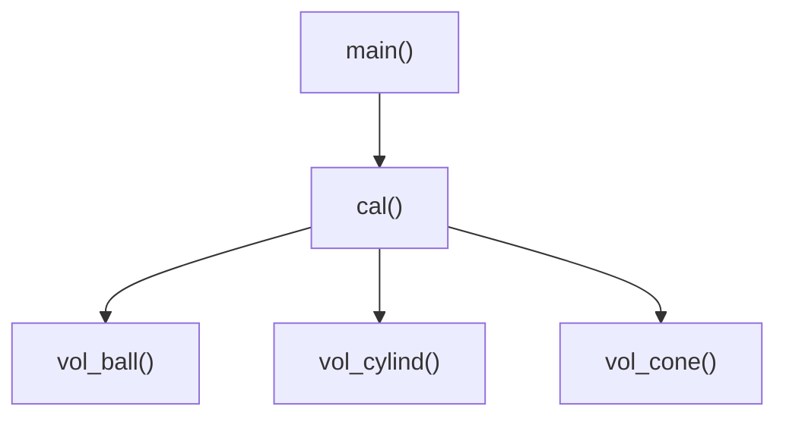
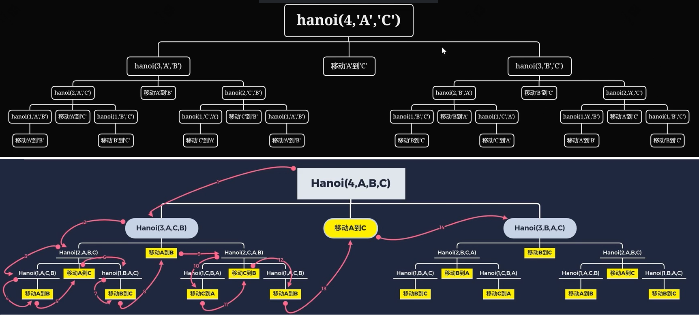
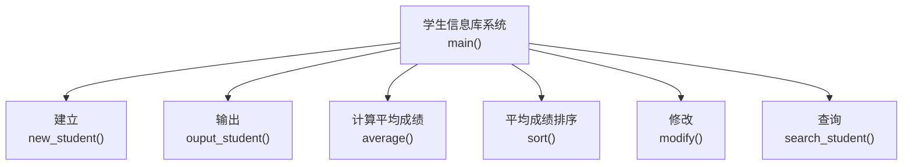
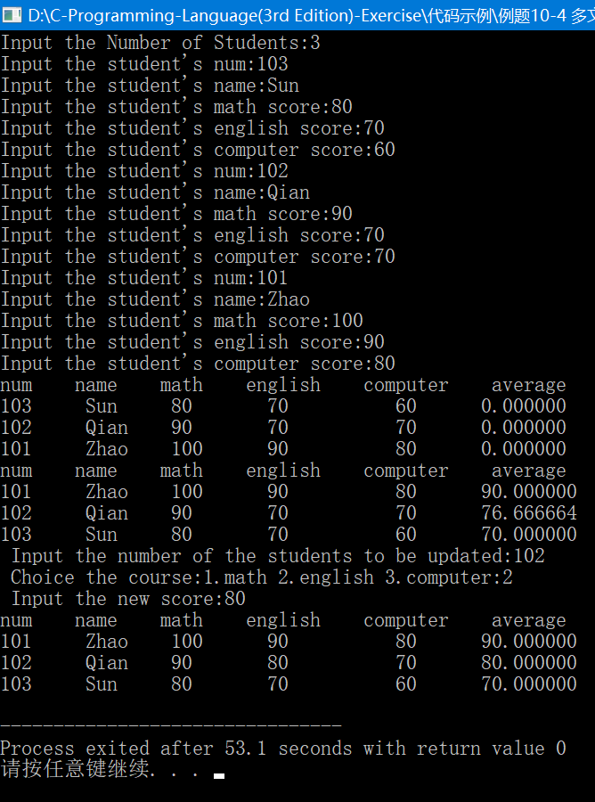
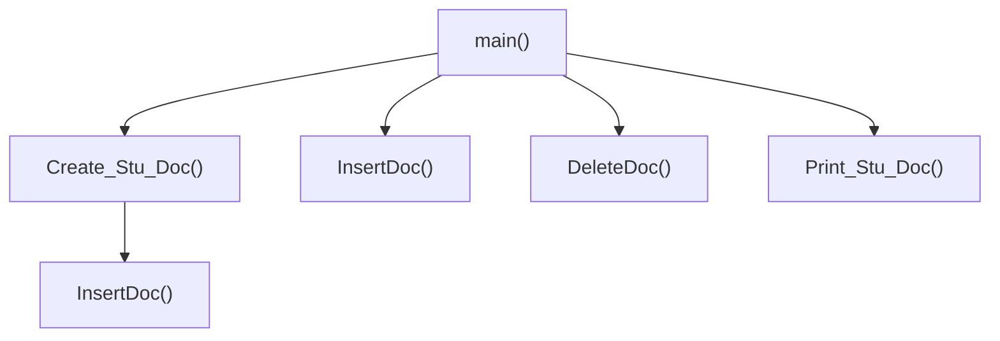

# C语言程序设计(第3版) 何钦铭 颜晖 主编

## 课后习题答案

### 习题1-认识C语言

#### 一、简答题

##### 习题1-1 合法的标识符

对C语言来说，下列标识符中哪些是合法的，哪些是不合法的?

```c
total _debug Counter1 begin_  合法
```

```c
Large&Tall 非法
```

解答：

​	C语言的标识符由字母、数字、下划线组成，其中第一个字符必须是字母或下划线。

​	&是特殊字符，所以Large&Tall非法

​	小知识：main不是C的保留字，可以把main定义为局部变量，如果和在前者在同一翻译单元（经过预处理、包含了头文件的源文件）中，会产生重定义的编译错误。“-”不是标识符的合法组成，不要看错了。

##### 习题1-2 改写本章 1.4 节中的流程图 1.2

求 1～100 中能被 6 整除的所有整数的和。

解答：


<center style="color:#C0C0C0">图1.2 改写流程图</center>

##### 习题1-3 改写本章 1.4 节中的程序

求 1～100 中能被 6 整除的所有整数的和，并在编程环境中验证该程序的运行结果。

解答：

```c
#include<stdio.h>

int main()
{
    int sum = 0;
    int i = 1;
    for(i = 1; i <= 100; i++)
    {
    	if(i % 6 == 0)
    		sum += i;
	}
    printf("%d", sum);
    
    return 0;
}

运行结果：816
```

##### 习题1-4 判断素数

对于给定的整数 n（n＞1），请设计一个流程图判别 n 是否为一个素数（只能被 1 和自己整除的整数），并分析该流程图中哪些是顺序结构、哪些是分支结构与循环结构

解答：

​	循环结构和分支结构如下图，从最上边的两个实线框和下面两个大的阴影框一同构成了顺序结构。


<center style="color:#C0C0C0">图1.4 判定素数流程图</center>


### 练习2-用C语言编写简单程序

#### 一、课堂练习

##### 【练习 2-1】Programming in C is fun!

编写程序，在屏幕上显示一个短句“Programming in C is fun!”。

```c
#include<stdio.h>

int main()
{
	printf("Programming in C is fun!\n");
	
	return 0;
}
```

##### 【练习 2-2】运行结果是什么？

下列语句的运行结果是什么？与例 2-2 的运行结果有何不同？为什么？

```c
printf("Programming is fun. And Programming in C is even more fun!\n");
```

解答：

​	运行结果：Programming is fun. And Programming in C is even more fun!

​	例2-2是分两行输出结果，因为两行都采用了换行符号。

##### 【练习 2-3】输出倒三角图案

编写程序，在屏幕上显示如下图案。

```c
* * * *
 * * *
  * *
   *
```

解答：

```c
#include<stdio.h>

int main()
{
    printf("* * * *\n");
    printf(" * * *\n");
    printf("  * *\n");
    printf("   *\n");
    return 0;
}
```

##### 【练习 2-4】华氏温度转换成摄氏温度

编写程序，求华氏温度 150°F 对应的摄氏温度（计算公式同例 2-3）

解答：

```c
#include<stdio.h>

int main()
{
	int celsius, fahr; 
	fahr = 150;
 	celsius = 5 * (fahr - 32) / 9;
	printf("fahr = 150, celsius = %d", celsius); 
	return 0;	
}
```

##### 【练习 2-5】改写表达式

算术表达式` 5*(fahr-32)/9 `能改写成` 5(fahr-32)/9 `吗？为什么？如果将其改写为` 5/9*(fahr-32)`，会影响运算结果吗？

解答：

​	不能，` 5(fahr-32)/9 `不是合法表达式，因为`*`运算符不能省略，` 5/9*(fahr-32)`的结果为0。

##### 【练习 2-6】自由落体

一个物体从 100 米的高空自由落下，编写程序，求它在前 3 秒内下落的垂直距离。设重力加速度为 10m/s^2。

解答：

```c
#include<stdio.h>

int main()
{
    float h = 0;
    int t = 3;
    const int g = 10;
    h = 1 / 2.0 * g * t * t;

    printf("height = %.2f", h);
    
    return 0;
}
```

##### 【练习 2-7】输入、输出语句的顺序

输入提示和输入语句的顺序应该如何安排？例 2-5 中，scanf("%d%d%lf", &money, &year,  &rate) 能改写为 scanf("%d%lf%d", &money, &year, &rate) 吗？为什么？能改写为 scanf("%d%lf%d", &money, &rate, &year) 吗？如果可以，其对应的输入数据是什么？

解答：

​	前者不能，因为%lf和year的数据类型不匹配，%d和rate的数据类型不匹配。

​	后者能，对应的输入数据是1000 0.025 3。

##### 【练习 2-8】任意华氏温度转换摄氏温度

编写程序，输入华氏温度，输出对应的摄氏温度，计算公式同例 2-3。

解答：

```c
#include<stdio.h>

int main()
{
    int fahr = 0;
    int celsius = 0;
    scanf("%d", &fahr);
    celsius = 5 * (fahr - 32)/9;

    printf("Celsius = %d\n", celsius);

    return 0;
}
```

##### 【练习 2-9】整数四则运算

输入 2 个正整数，计算并输出它们的和、差、积、 商。试编写相应程序。

解答：

```c
#include<stdio.h>

int main()
{
    int a, b;
    scanf("%d %d", &a, &b);

    printf("%d + %d = %d\n", a, b, a + b);
    printf("%d - %d = %d\n", a, b, a - b);
    printf("%d * %d = %d\n", a, b, a * b);
    printf("%d / %d = %d\n", a, b, a / b);
    
    return 0;
}
```

##### 【练习 2-10】计算分段函数

（判断 x 是否不为 0）：输入 x ，计算并输出下列分 段函数 f(x) 的值（保留 1 位小数）。试编写相应程序。
$$
y = f(x) =  \begin{cases}    \frac {1}{x} & x ≠ 0 \\    0 & x = 0 \end{cases}
$$

解答：

```c
#include<stdio.h>
int main()
{
    double x = 0;
    double result = 0;
    scanf("%lf", &x);

    if(x == 0)
        result = x;
    else
        result = 1 / x;

    printf("f(%.1f) = %.1f\n", x, result);

    return 0;
}
```

##### 【练习 2-11】计算分段函数

（判断 x 是否小于 0）：输入 x ，计算并输出下列分段函数 f(x)的值（保留 2 位小数）。可包含头文件 math.h，并调用 sqrt （） 函数求平方根，调用 pow（） 函数求幂。试编写相应程序。
$$
y = f(x) =  \begin{cases}    (x+1)^2+2x+\frac {1}{x} & x < 0 \\    \sqrt{x} & x ≥ 0 \end{cases}
$$

解答：

```c
#include<stdio.h>
#include<math.h>

int main()
{
    double x = 0;
    double result = 0;
    scanf("%lf", &x);

    if(x < 0)
        result = (x + 1) * (x + 1) + 2 * x + 1 / x;
    else
        result = sqrt(x);

    printf("f(%.1f) = %.3f\n", x, result);

    return 0;
}
```

##### 【练习 2-12】输出华氏 - 摄氏温度转换表

输入两个整数 lower 和 upper，输出 一张华氏 - 摄氏温度转换表，华氏温度的取值范围是 [lower, upper] ，每次增加 2°F，计算公式同例 2-6 。试编写相应程序。

解答：

```c
#include<stdio.h>

int main()
{
    int lower, upper;
    int fahr = 0;
    double celsius = 0;
    scanf("%d %d", &lower, &upper);
    if(lower > upper)
        printf("Invalid.\n");
    else
    {
        printf("fahr celsius\n");
        for(fahr = lower; fahr <= upper; fahr = fahr + 2)
        {
            celsius = 5 * (fahr - 32)/9.0;
            printf("%d%6.1f\n", fahr, celsius);
        }
    }

    return 0;
}
```

##### 【练习 2-13】求给定序列前 n 项和

（1+1/2+1/3+ …1/n）：输入一个正整数 n ，计算序列 1+1/2+1/3+ …的前 n 项之和。试编写相应程序。

解答：

```c
#include<stdio.h>

int main()
{
    double sum = 0;
    int n;
    scanf("%d", &n);

    for(int i = 1; i <= n; i++)
        sum += 1.0/i;

    printf("sum = %.6f", sum);
    
    return 0;
}
```

##### 【练习 2-14】求给定序列前 n 项和

（1+1/3+1/5+ …）：输入一个正整数 n ，计算 序列 1+1/3+1/5+ …的前 n 项之和。试编写相应程序。

解答：

```c
#include<stdio.h>

int main()
{
    double sum = 0, denominator = 1;
    int n;
    scanf("%d", &n);
    
    for(int i = 1; i <= n; i++)
    {
        sum += 1/denominator;
        denominator += 2;
    }

    printf("sum = %.6f", sum);
    
    return 0;
}
```

##### 【练习 2-15】求给定序列前 n 项和

（ 1-1/4+1/7-1/10 …）：输入一个正整数 n ， 计算序列 1-1/4+1/7-1/10+1/13-1/16 …的前 n 项之和。试编写相应程序。

解答：

```c
#include<stdio.h>

int main()
{
    double sum = 0, denominator = 1, flag = 1;
    int n;
    scanf("%d", &n);

    for(int i = 1; i <= n; i++)
    {
        sum += flag / denominator;
        flag = flag * (-1);
        denominator += 3;
    }

    printf("sum = %.3f", sum);

    return 0;
}
```

##### 【练习 2-16】执行下列程序段后， sum的值____。

```c
for (i = 1; i <= 10; i++){ 
 sum = 0; 
 sum = sum + i; 
}
```

解答：

​	sum的值是10，注意一下每次循环sum都要先被赋值10；

##### 【练习 2-17】生成 3 的乘方表

输入一个正整数 n，生成一张 3 的乘方表，输 出 $3^0$到 $3^n$的值。可包含头文件 math.h, 并调用幂函数计算 3 的乘方。试编写相应程序。

解答：

```c
#include<stdio.h>
#include<math.h>

int main()
{
    int n;
    scanf("%d", &n);
    int value;
    for(int i = 0; i <= n; i++)
    {
        value = pow(3, i);
        printf("pow(3,%d) = %d\n", i, value);
    }

    return 0;
}
```

##### 【练习 2-18】求组合数

根据下列公式可以算出从 n 个不同元素中取出 m 个 元素（m≤n）的组合数。输入两个正整数 m 和 n （m≤n），计算并输出组合数。 要求定义和调用函数 fact(n) 计算 n! ，函数类型是 double 。
$$
C^m_n = \frac{n!}{m!(n-m)!}
$$

解答：

```c
#include<stdio.h>

double fact(int n)
{
    int i;
    double product = 1;

    for(int i = 1; i <= n; i++)
        product *= i;

    return product;
}

int main()
{
    int n, m;
    scanf("%d %d", &m, &n);
    int result = fact(n)/(fact(m) * fact(n - m));

    printf("result = %d", result);

    return 0;
}
```

### 习题2-用C语言编写简单程序

#### 一、程序设计题

##### 习题2-1 求整数均值

输入 4 个整数，计算并输出这些整数的和与平均值，其中平均值精确到小数点后 1 位。试编写相应程序。

解答：

```c
#include<stdio.h>

int main()
{
    int a, b, c, d, sum;
    double average;
    scanf("%d %d %d %d", &a, &b, &c, &d);

    sum = a + b + c + d;
    average = sum / 4.0;
    printf("Sum = %d; Average = %.1f", sum, average);

    return 0;
}
```

##### 习题2-2 阶梯电价

为了倡导居民节约用电， 某省电力公司执行“阶梯电价”， 安装一 户一表的居民用户电价分两个“阶梯”：月用电量 50 千瓦时（含 50 千瓦时） 以内的，电价为 0.53 元/ 千瓦时；超过 50 千瓦时，超出的用电量电价上调 0.05  元/ 千瓦时。输入用户的月用电量（千瓦时） ，计算并输出该用户应支付的电费 （元）。试编写相应程序。

解答：

```c
#include<stdio.h>

int main()
{
    double x, cost;
    scanf("%lf", &x);

    if(x < 0)
        printf("Invalid Value!\n");
    else if(x <= 50)
        cost = x * 0.53;
    else
        cost = (x - 50) * 0.58 + 50 * 0.53;
    if(x >= 0)
        printf("cost = %.2f", cost);

    return 0;
}
```

##### 习题2-3 序列求和

输入两个正整数*m*和*n*（0<*m*≤*n*），求$\sum_{i=m}^{n}(i^2 + \frac{1}{i})$，结果保留6位小数。试编写相应程序。

解答：

```c
#include<stdio.h>

int main()
{
    int m, n;
    scanf("%d %d", &m, &n);
    double sum = 0;
    for(int i = m; i <= n; i++)
    	sum += 1.0 * i * i + 1.0 / i;
   
    printf("sum = %.6f", sum);

    return 0;
}
```

##### 习题2-4 求交错数列前n项和

输入一个正整数n，计算交错序列 1-2/3+3/5-4/7+5/9-6/11+... 的前n项之和。试编写相应程序。

解答：

```c
#include<stdio.h>

int main()
{
    double sum = 0, denominator = 1, numerator = 1;
    int n;
    scanf("%d", &n);
    double flag = 1;

    for(int i = 1; i <= n; i++)
    {
        sum += flag * numerator / denominator;
        flag = -flag;
        numerator ++;
        denominator += 2;
    }

    printf("%.3f\n", sum);
    
    return 0;
}
```

##### 习题2-5 平方根求和

输入一个正整数n，计算平方根序列$1+\sqrt{2}+\sqrt{3}+⋯+\sqrt{n}$的值（保留2位小数）。可包含头文件`math.h`，并调用`sqrt`函数求平方根。试编写相应程序。

解答：

```c
#include<stdio.h>
#include<math.h>

int main()
{
    double sum = 0;
    int n;
    scanf("%d", &n);

    for(int i = 1; i <= n; i++)
        sum += sqrt(i);

    printf("sum = %.2f", sum);

    return 0;
}
```

##### 习题2-6 求给定序列前 n 项和

（1！+2！+…）：输入一个正整数 n ，求 e=1！+2！3！+… +n！的值。要求定义和调用 fact （n）计算 n！，函数类型是 double 。试编写相应程序。

解答：

```c
#include<stdio.h>

double factorial(int n)
{
    double product = 1;
    for(double i = 1; i <= n; i++)
        product *= i;

    return product;
}

int main()
{
    int n;
    scanf("%d", &n);
    int sum = 0;
    
    for(int i = 1; i <=n; i++)
        sum += factorial(i);

    printf("%d", sum);
    
    return 0;
}
```


### 练习3-分支结构

#### 一、课堂练习

##### 【练习 3-1 】还需要增加测试用例吗

例 3-4 中使用 else-if 语句求解多分段函数， 为了检查 else-if  语句的三个分支是否正确， 已经设计了三组测试用例， 请问还需要增加测试用例吗？为什么？如果要增加，请给出具体的测试用例并运行程序。

解答：

​	最好再增加两组测试用例：x = 0、x = 15，对分段函数的边界情况进行测试。

##### 【练习 3-2 】计算符号函数的值

 输入一个整数 x ，计算并输出下列分段函数 sign(x) 的值。
$$
y = sign(x) =  \begin{cases}    -1 & x < 0 \\ 0 & x = 0 \\  1 & x > 0 \end{cases}
$$

解答：

```c
#include<stdio.h>

int main()
{
    int x;
    scanf("%d", &x);
    int y = 0;

    if(x < 0)
        y = -1;
    else if(x == 0)
        y = 0;
    else
        y = 1;

    printf("sign(%d) = %d", x, y);

    return 0;
}
```

##### 【练习 3-3 】统计学生平均成绩与及格人数

输入一个正整数 n ，再输入 n 个 学生的成绩，计算平均成绩，并统计所有及格学生的人数。试编写相应程序。

解答：

​	注意没有学生要特殊处理一下，否则有可能发生除零错误。

```c
#include<stdio.h>

int main()
{
    int n, count = 0;
    double total = 0, average = 0;

    scanf("%d", &n);
    int stu;
    for(int i = 0; i < n; i ++)
    {
        scanf("%d ", &stu);
        total += stu;
        if(stu >= 60)
            count ++;
    }
    if(n > 0)
    	average = total / n;

    printf("average = %.1f\ncount = %d", average, count);
    
    return 0;
}
```

##### 【练习 3-4 】统计字符

输入 10 个字符，统计其中英文字母、空格或回车、数字字符和其他字符的个数。试编写相应程序。

解答：

```c
#include<stdio.h>

int main()
{
    int letter, blank, digit, other;
    char ch;
    letter = blank = digit = other = 0;

    for(int i = 1; i <= 10; i++)
    {
        ch = getchar();
        if(ch >= 'A' && ch <= 'Z' || ch >= 'a' && ch <= 'z')
            letter ++;
        else if(ch == ' ' || ch == '\n')
            blank ++;
        else if(ch >= '0' && ch <= '9')
            digit ++;
        else
            other ++;
    }

    printf("letter = %d, blank = %d, digit = %d, other = %d", letter, blank, digit, other);
        
    return 0;
}
```

##### 【练习 3-5】输出闰年

输出 21 世纪中截至某个年份之前的所有闰年年份。判断闰年的条件是： 能被 4 整除但不能被 100整除，或者能被 400 整除。试编写相应程序。

解答：

```c
#include<stdio.h>
#define YEAR_BEGIN 2001
#define YEAR_END 2100

int main()
{
    int year;
    int count = 0;
    scanf("%d", &year);

    if(year < YEAR_BEGIN || year > YEAR_END)
        printf("Invalid year!\n");
    else
    {
        for(int i = YEAR_BEGIN; i <= year; i ++)
        {
            if((i % 4 == 0 && i % 100 != 0) || (i % 400 == 0))
            {
                count ++;
                printf("%d\n", i);
            }
        }
        if(count == 0)
        printf("None\n");
    }
    
    return 0;
}
```

##### 【练习 3-6 】去掉break会怎样？

在例 3-8 程序中，如果把 switch 语句中所有的 break 都去掉，运行结果会改变吗？如果有变化，输出什么？为什么？

解答：

​	会改变，会从满足输入的常量表达式那个case开始顺序执行所有语句，直到执行default后面的price = 0.0，所以会输出price = 0。

##### 【练习 3-7 】成绩转换

输入一个百分制成绩，将其转换为五分制成绩。百分制成绩到五分制成绩的转换规则：大于或等于 90 分为 A，小于 90 分且大于或等于 80 分为 B，小于 80分且大于或等于 70分为 C，小于 70 分且大于或等于 60 分为 D，小于 60 分为 E。试编写相应程序。

解答：

```c
#include<stdio.h>

int main()
{
    int grade;
    scanf("%d", &grade);
    grade /= 10;

    switch( grade )
    {
        case 10:
        case 9:
            printf("A\n");
            break;
         case 8:
            printf("B\n");
            break;
         case 7:
            printf("C\n");
            break;
         case 6:
            printf("D\n");
            break;
         default:
            printf("E\n");
            break;
    }

    return 0;
}
```

##### 【练习 3-8 】查询水果的单价

有 4 种水果，苹果（ apples ）、梨（pears）、桔子（oranges）和葡萄（ grapes），单价分别是 3.00 元/ 公斤，2.50 元/ 公斤， 4.10 元/ 公斤和 10.20 元/ 公斤。在屏幕上显示以下菜单（编号和选项） ，用户 可以连续查询水果的单价， 当查询次数超过 5 次时，自动退出查询； 不到 5 次 时，用户可以选择退出。当用户输入编号 1 ～4，显示相应水果的单价（保留两位小数）；输入 0 ，退出查询；输入其他编号，显示价格为 0 。试编写相应程序。 

​		[1] apples

​		[2] pears  

​		[3] oranges  

​		[4] grapes  

​		[0] Exit

解答：

```c
#include<stdio.h>

int main()
{
    double price;
    int choice, i;

    printf("[1] apple\n");
    printf("[2] pear\n");
    printf("[3] orange\n");
    printf("[4] grape\n");
    printf("[0] exit\n");

    for(i = 1; i <= 5; i ++)
    {
    scanf("%d", &choice);

    if(choice == 0)
        break;

    switch(choice)
    {
        case 1:price = 3.00; break;
        case 2:price = 2.50; break;
        case 3:price = 4.10; break;
        case 4:price = 10.20; break;
        default: price = 0.0; break;
    }

    printf("price = %.2f\n", price);
    }
    
    return 0;
}
```

##### 【练习 3-9】使用嵌套if-else语句重新编写3-4

请读者重新编写例 3-4 的程序，要求使用嵌套的 if - else 语句，并上机运行。

解答：

```c
#include<stdio.h>

int main()
{
		double x, y;
		
		printf("Enter x:");
		scanf("%lf", &x);
		if(x < 0)
		{
			y = 0;
		}
		else
		{
			if(x <= 15)
			{
				y = 4 * x / 3;
			}
			else
			{
				y = 2.5 * x - 10.5;
			}
		}
		printf("f(%.2f) = %.2f\n", x, y);
		
		return 0;
}
```

##### 【练习 3-10 】嵌套的if-else语句条件判断

在例 3-12 中，改写 if 语句前， y= x + 1; 和 y= x + 2; 两条语句的执行条件是什么？改写后呢？

解答：

​		改写前，x∈[-∞，1)时执行 y = x + 1，x∈[1，2）时执行y = x + 2；

​		改写后，x∈[-∞，1)时执行 y = x + 1，x∈[2，+∞）时执行y = x + 2

### 习题3-分支结构

#### 一、选择题

(见参考答案)

#### 二、填空题

(见参考答案)

#### 三、程序设计题

##### 习题3-1 比较大小

输入 3 个整数，按从小到大的顺序输出。试编写相应程序。

解答：

```c
#include<stdio.h>

int main()
{
    int a, b, c;
    scanf("%d %d %d", &a, &b, &c);
    int tmp;

    if(a > b)
    {
        tmp = a;
        a = b;
        b = tmp;
    }
    if(a > c)
    {
        tmp = a;
        a = c;
        c = tmp;
    }
    if(b > c)
    {
        tmp = b;
        b = c;
        c = tmp;
    }

    printf("%d->%d->%d\n", a, b, c);

    return 0;
}
```

##### 习题3-2 高速公路超速处罚

按照规定，在高速公路上行驶的机动车，超过本车道限 速的 10%则处 200 元罚款；若超出50%，就要吊销驾驶证。请编写程序根据车速和限速判别对该机动车的处理。

解答：

​	注意一下，`%`在C语言中有其他功能，要用`printf()`输出百分号字符，需要使用双写的`%%`。

```c
#include<stdio.h>

int main()
{
    int speed, limit;
    scanf("%d %d", &speed, &limit);
	double q;
	
    q = 1.0 * (speed - limit) / limit;

    if(q < 0.1)
        printf("OK\n");
    else if(q >= 0.1 && q < 0.5)
        printf("Exceed %.f%%. Ticket 200", 100 * q);
    else
        printf("Exceed %.f%%. License Revoked", 100 * q);

    return 0;
}
```

##### 习题3-3 出租车计价

某城市普通出租车收费标准如下： 起步里程 3 公里，起步费 10 元；超起步里程后 10 公里内，每公里 2 元，超过 10 公里以上的部分加收 50% 的空驶补贴费，即每公里 3 元；营运过程中，因路阻及乘客要求临时停车的，按每 5 分钟 2 元计收（不足 5 分钟则不收费）。运价计费尾数四舍五入， 保留到元。 编写程序，输入行驶里程 ( 公里) 与等待时间 ( 分钟) ，计算并输出乘客应支付的车费( 元) 。

答案：

​	很明显参考答案是错的，超起步里程后 10 公里内，指的是3~10公里是2元/公里。

```c
#include<stdio.h>

int main()
{
    double mile, price;
    int time;

    price = 0;
    
    scanf("%lf %d", &mile, &time);

    if(mile <= 3)
        price += 10;
    else if(mile <= 10)
        price += 10 + 2 * (mile - 3);
    else
        price += 10 + 2 * 7 + 3 * (mile - 10);

    price += (time / 5) * 2;

    printf("%.0f", price);

    return 0;
}
```

##### 习题3-4 统计学生成绩

输入一个正整数 n ，再输入 n 个学生的成绩，统计五分制成绩的分布。百分制成绩到五分制成绩的转换规则：大于或等于 90 分为 A，小于 90 分且大于或等于 80 分为 B，小于 80分且大于或等于 70 分为 C，小于 70 分且 大于或等于 60 分为 D，小于 60分为 E。试编写相应程序。

解答：

```c
#include<stdio.h>

int main()
{
    int grade;
    int n;
    int A, B, C, D, E;
    A = B = C = D = E = 0;
    scanf("%d", &n);

    for(int i = 0; i < n; i ++)
    {
        scanf("%d", &grade);
        grade /= 10;
        switch(grade)
        {
            case 10:
            case 9:
                A ++;
                break;
            case 8:
                B ++;
                break;
            case 7:
                C ++;
                break;
            case 6:
                D ++;
                break;
            case 5:
            case 4:
            case 3:
            case 2:
            case 1:
            case 0:
                E ++;
                break;
        }
    }

    printf("%d %d %d %d %d", A, B, C, D, E);

    return 0;
}
```

##### 习题3-5 三角形判断

输入平面上任意三个点的坐标（ x1，y1）、（x2，y2）、（x3，y3）， 检验他们能否构成三角形。 如果这 3 个点能构成一个三角形， 输出周长和面积（保留 2 位小数）；否则，输出“ Impossible ”。试编写相应程序。

提示：在一个三角形中，任意两边之和大于第三边。三角形面积计算公式如下：
$$
area = \sqrt{s(s-a)(s-b)(s-c)},其中s=(a+b+c)/2
$$
解答：

```c
#include<stdio.h>
#include<math.h>

int main()
{
    double a, b, c, s, area;
    double x1, y1, x2, y2, x3, y3;
    scanf("%lf %lf %lf %lf %lf %lf", &x1, &y1, &x2, &y2, &x3, &y3);

    a = sqrt(pow((x1 - x2),2) + pow((y1 - y2),2));
    b = sqrt(pow((x2 - x3),2) + pow((y2 - y3),2));
    c = sqrt(pow((x1 - x3),2) + pow((y1 - y3),2));

    s = (a + b + c)/2;
    area = sqrt(s * (s - a) * (s - b) * (s - c));

    if(area == 0)
        printf("Impossible");
    else
        printf("L = %.2f, A = %.2f\n", 2 * s, area);
    
    return 0;
}
```


### 练习4-循环结构

#### 一、课堂练习

##### 【练习 4-1 】修改例4-1程序

在例 4-1 程序中，如果对 item 赋初值 0 ，运行结果是什么？为什么？如果将精度改为 $10^{-3}$，运行结果有变化吗？为什么？

解答：

​	运行结果是0，因为fabs(0) = 0，不满足while循环的条件，所以会跳过while循环，pi = 0。

​	把精度改小(值增大)会导致循环次数减少，运行结果会发生改变，改之前的结果是3.1418，改之后的结果是3.1436。

##### 【练习 4-2 】修改例 4-2 程序

运行例 4-2 程序时，如果将最后一个输入数据改为 -2，运行结果有变化吗？如果第一个输入数据是 -1 ，运行结果是什么？为什么？

解答：

​	不会有变化，因为都是负数，都可以满足循环终止条件，负数并不会被统计。

​	如果第一个输入的数据是-1，那就不会执行while循环，直接执行最后的语句，打印“Grade average is 0 \n”。

##### 【练习 4-3 】有精度要求的序列求和

序列求和$（1-1/4+1/7-1/10+1/13-1/16+ …）$：输入一个正实数 eps ， 计算序列 $1-1/4+1/7-1/10+1/13-1/16+ …$的值，精确到最后一项的绝对值小于 eps（保留 6 位小数）。试编写相应程序。

解答：

​	为什么要用do-while，因为有两个特殊的边界点要过，如果eps>=精度，那么应该直接输出首项1，如果用while会导致sum对序列一项都不统计，导致错误。故使用do-while，无论如何先走一遍循环，统计第一项的值。

```c
#include<stdio.h>
#include<math.h>

int main()
{
    double denominator, flag;
    double sum, eps, item;

    scanf("%lf", &eps);
    denominator = flag = item = 1.0;
    sum = 0.0;

    do
    {
        item = flag / denominator;
        sum += item;
        flag = - flag;
        denominator += 3;
    }while(fabs(item) > eps );

    printf("sum = %f", sum);

    return 0;
}
```

##### 【练习 4-4 】修改例 4-3 程序

如果将例 4-3 程序中的 do-while 语句改为下列 while 语句，会影响程序的功能吗？为什么？再增加一条什么语句，就可以实现同样的功能？

```c
while(number != 0){ 
 number = number / 10; 
 count ++; 
} 
```

解答：

​	会影响功能，如果输入0，则不会进入while循环，导致输出0位数，不符合题意。

​	可以添加一句条件判断语句，对number == 0单独处理即可。

```c
if(number == 0) count ++;
```

##### 【练习 4-5 】修改例 4-4 程序

例 4-4 程序中的第 9 ～15 行可以用下列 for 语句替代吗？为什么？

```c
	for(i = 2; i <= m / 2; i ++)
		if(m % i == 0) printf("No!\n");
		else printf("%d is a prime number!\n", m);
```

解答：

​	不可以，替换后的语句等价于下面的语句，某个`i`满足`m%i != 0`不能得出任何结论，而修改后的程序，每遇到一个不能整除`m`的`i`都会输出一次`printf("%d is a prime number!\n", m);`显然是不对的。

```c
#include<stdio.h>

int main(void)
{
	int i, m;
	
	printf("Enter a number:");
	scanf("%d", &m);
	
	for(i = 2; i <= m / 2; i ++)
    {
		if(m % i == 0) printf("No!\n");
		else printf("%d is a prime number!\n", m);
    }
    
	return 0;
}
```

##### 【练习 4-6】猜数字游戏

先输入 2 个不超过 100 的正整数，分别是被猜数 mynumber和允许猜测的最大次数 n，再输入你所猜的数 yournumber，与被猜数 mynumber进行比较，若相等，显示猜中， ；若不等，显示与被猜数的大小关系， 最多允许猜 n 次。如果 1 次就猜出该数，提示“ Bingo! ”；如果 3 次以内猜到该数，则提示“Lucky You! ”; 如果超过 3 次但不超过 n 次猜到该数，则提示“Good  Guess!”; 如果超过 n 次都没有猜到，则提示“ Game Over”; 如果在到达 n 次之前，用户输入了一个负数， 也输出“Game Over”，并结束程序。 试编写相应程序。

解答：

​	本题内层不要用switch语句，否则跳出循环比较麻烦。

```c
#include<stdio.h>

int main()
{
    int num, n;
    int count = 0;
    int guess;
    scanf("%d %d", &num, &n);

    do{
        scanf("%d", &guess);
        count ++;
        if(guess < 0)
        {
            printf("Game Over\n");
            break;
        }
        else if(guess > num)
        {
            printf("Too big\n");
        }
        else if(guess < num)
        {
            printf("Too small\n");
        }
        else
        {
            if(count == 1)
            {
                printf("Bingo!\n");
                break;
            }
            else if(count <= 3)
            {
                printf("Lucky You!");
                break;
            }
            else if(count <= n)
            {
                printf("Good Guess!");
                break;
            }
            else
            {
                printf("Game Over");
                break;
            }
        }
    }while(guess > 0);

    return 0;
}
```

##### 【练习 4-7 】求 e 的值

自然常数 *e* 可以用级数 $1+1/1!+1/2!+⋯+1/n!+⋯ $来近似计算。本题要求对给定的非负整数 *n*，求该级数的前 *n*+1 项和。要求使用嵌套循环。试编写相应程序。

解答：

​	注意一下item的初始化位置、e求和语句的位置即可。

```c
#include<stdio.h>

int main()
{
    double n;
    double e, item;
    e = 0;

    scanf("%lf", &n);
    for(int i = 1; i <= n + 1; i ++)
    {
        item = 1;
        for(int j = 1; j < i; j ++)
        {
            item *= j;
        }
        e += 1 / item;
    }

    printf("%.8f\n", e);

    return 0;
}
```

##### 【练习 4-8 】例4-8-1输入0会怎样

运行例 4-8 的源程序 1 时，如果先输入 0 ，即输入数据个数 n=0 ， 表示不再输入任何成绩，运行结果是什么？如何修改程序以应对这种情况？

解答：

​	程序不会结束运行，而是等待用户输入学生成绩，这与n = 0矛盾。

​	可以在第二个`scanf()`前加一条n > 0才执行后面语句的if条件判断。

##### 【练习 4-9 】例4-8-2输入第一个数为负

运行例 4-8 的源程序 2 时，如果输入的第一个数就是负数， 表示 不再输入任何成绩，运行结果是什么？如何修改程序以应对这种情况？

解答：

​	运行结果最大值是个负数；需要加一条单独的if语句判断为负数时特殊处理。

##### 【练习 4-10 】找出最小的值

输入一个正整数 n, 再输入 n 个整数，输出最小值。试编写相应程序。

解答：

​	方法一：先把min定义为一个最大正整数，可以少写一个`scanf()`。

```c
#include<stdio.h>
#define max 2147483647

int main()
{
    int n, num, min;
    scanf("%d", &n);
    min = max;
    
    for(int i = 1; i <= n ; i ++)
    {
        scanf("%d", &num);
        if(num < min)
            min = num;
    }

    printf("min = %d", min);

    return 0;
}
```

​	方法二：循环前先把min定义为第一个数，后面正常写，和第一个方法相比for的循环条件也要改变。

```c
#include<stdio.h>

int main()
{
    int n, num, min;
    scanf("%d", &n);
    scanf("%d", &num);

    min = num;
    for(int i = 1; i < n ; i ++)
    {
        scanf("%d", &num);
        if(num < min)
            min = num;
    }

    printf("min = %d", min);

    return 0;
}
```

##### 【练习 4-11 】统计素数并求和

输入 2 个正整数 m和 n（1≤m≤n≤500），统计并输出 m和 n 之间素数的个数以及这些素数的和。素数就是只能被 1 和自身整除的正整数， 1 不是素数，2 是素数。试编写相应程序。

解答：

​	使用优化过的素数算法通过OJ测试点运行时间为2ms，比没优化的算法快了2ms :）

```c
#include<stdio.h>
#include<math.h>

int main()
{
    int count, sum;
    int isPrime;
    int m, n, k;

    scanf("%d %d", &m, &n);
    sum = count = 0;

    for(int i = 2; i <= n; i ++)
    {
        isPrime = 1;
        k = sqrt(i);
        for(int j = 2; j <= k; j ++)
        {
            if(i % j == 0)
            {
            	isPrime = 0;
                break;
            }
        }
        if(isPrime == 1)
        {
            if(i >= m && i <= n)
            {
                count ++;
                sum += i;
            }
        }
    }

    printf("%d %d\n", count, sum);
    
    return 0;
}
```

### 习题4-循环结构

#### 一、选择题

(见参考答案)

#### 二、填空题

(见参考答案)

#### 三、程序设计题

##### 习题4-1 求奇数和

输入一批正整数（以零或负数为结束标志），求其中的奇数和。试写相应程序。

解答：

​	do-while里面不要再加多余的条件判断了，因为如果取了负数或者0，取余也不会满足 n % 2 == 1，所以可以放心只保留while后面的条件判断。

```c
#include<stdio.h>

int main()
{
    int num;
    int sum = 0;
    
    do
    {
        scanf("%d", &num);
		if(num % 2 == 1)
        {
            sum += num;
        }
    }while(num > 0);

    printf("%d\n", sum);

    return 0;
}
```

##### 习题4-2 展开式求和

已知函数$e^x$可以展开为下面的幂级数。输入 1 个实数 x，计算并输出下式的值，直到最后一项的绝对值小于 0.00001，计算结果保留 4 位小数。要求定义和调用函数 fact(n) 计算 n 的阶乘，可以调用 pow( ) 函数求幂。试编写相应程序。
$$
e^x=1+x+\frac{x^2}{2!}+\frac{x^3}{3!}+\frac{x^4}{4!}+…+\frac{x^k}{k!}+ …
$$

解答：

```c
#include<stdio.h>
#include<math.h>

double fact(double x)
{
    double product = 1;
    for(int i = 2; i <= x; i ++)
    {
        product *= i;
    }

    return product;
}

int main()
{
    double x, sum, item;
    int i;

    scanf("%lf", &x);
    i = sum = 0;                     //第6行

    do
    {
        item = pow(x, i) / fact(i);
        sum += item;
        i ++;
    }while(fabs(item) >= 0.00001);  //第13行

    printf("%.4f", sum);

    return 0;
}
```

​	本题和4-3有点区别，精度值已经给定了，所以可以不用`do-while`，提前把`item`的值赋1，让`while`循环可以正常进入即可。把上述代码6~13行替换为以下代码，可以实现相同功能。

```c
	i = sum = item = 1;

    while(fabs(item) >= 0.00001)
    {
        item = pow(x, i) / fact(i);
        sum += item;
        i ++;
    }
```

##### 习题4-3 求序列和

输入一个正整数 n ，输出 2/1+3/2+5/3+8/5 + …的前 n 项之和， 保留 2 位小数。该序列从第 2 项起，每一项的分子是前一项分子与分母的和， 分母是前一项的分子。试编写相应程序。

解答：

```c
#include<stdio.h>

int main()
{
    double sum;
    double numerator, denominator, tmp;
    int n;

    scanf("%d", &n);
    numerator = 2;
    denominator = 1;
    sum = 0;

    for(int i = 1; i <= n; i ++)
    {
        sum += numerator / denominator;
        tmp = numerator;
        numerator += denominator;
        denominator = tmp;
    }

    printf("%.2f", sum);

    return 0;
}
```

##### 习题4-4 求序列和

输入 2 个正整数 a 和 n，求 a+aa+aaa+aa…a(n 个 a)之和。例如， 输入 2 和 3，输出 246(2+22+222)。试编写相应程序。

解答：

```c
#include<stdio.h>

int main()
{
    int n, a, t, sum;

    t = sum = 0;
    scanf("%d %d", &a, &n);

    for(int i = 1; i <= n; i ++)
    {
        t = a + 10 * t;
        sum += t;
    }

    printf("s = %d\n", sum);
    
    return 0;
}
```

##### 习题4-5 换硬币

将一笔零钱换成5分、2分和1分的硬币，要求每种硬币至少有一枚，有几种不同的换法？

要求按5分、2分和1分硬币的**数量依次从大到小**的顺序，输出各种换法。每行输出一种换法，格式为：“fen5:5分硬币数量, fen2:2分硬币数量，fen1:1分硬币数量, total:硬币总数量”。最后一行输出“count = 换法个数”。

解答：

​	注意题目要求，要按**优先换大面额零钱**的规则来换硬币，所以要从最外层换5分，最内层换1分，而且从最大值递减考虑所有方案。

```c
#include<stdio.h>

int main()
{
    int five, two, one;
    int count = 0;
    int x;
    
    scanf("%d", &x);
    for(five = x / 5; five > 0; five --)
    {
        for(two = x / 2; two > 0; two --)
        {
            for(one = x; one > 0; one --)
            {
                if(x == 5 * five + 2 * two + 1 * one)
                {
                    count ++;
                    printf("fen5:%d, fen2:%d, fen1:%d, total:%d\n", five, two, one, five + two + one);
                }
            }
        }
    }

    printf("count = %d", count);

    return 0;
}
```

##### 习题4-6 输出水仙花数

水仙花数是指一个*N*位正整数（*N*≥3），它的每个位上的数字的*N*次幂之和等于它本身。例如：$153=1^3+5^3+3^3$。 本题要求编写程序，计算所有*N*位水仙花数。

解答：

​	PTA上OJ的`pow()`执行效率太低了，放到OJ上运行会超时(3600ms/2500ms)。需要自己写一个`mypow()`，顺便学习一下简易的求幂函数怎么写，后来实践发现二者运行速度大约差8倍(400ms/2500ms)。

```c
#include<stdio.h>

int mypow(int a, int n)
{
    int result = 1;
    for(int i = 0; i < n; i ++)
    {
        result *= a;
    }

    return result;
}

int main()
{
    int tmp, n, digit, sum;

    scanf("%d", &n);
    
    for(int i = mypow(10, n - 1); i <= mypow(10, n) - 1; i ++)
    {
        tmp = i;
        sum = 0;
        while(tmp > 0)
        {
            digit = tmp % 10;
            sum += mypow(digit, n);
            tmp = tmp/10;
        }
        if(i == sum)
        {
            printf("%d\n", i);
        }
    }

    return 0;
}
```

##### 习题4-7 求最大公约数和最小公倍数

输入两个正整数 m和 n（m≤1000，n≤1000）， 求其最大公约数和最小公倍数。试编写相应程序。

解答：

​	方法一：要先用lcm记录下m和n的乘积，防止辗转相除法之后m和n的值改变，然后利用gcd和m*n的关系解出lcm

```c
#include<stdio.h>

int main()
{
    int gcd, lcm, m, n, t;

    scanf("%d %d", &m, &n);
    lcm = m * n;
    while(n != 0)
    {
        t = m % n;
        m = n;
        n = t;
    }
    gcd = m;
    lcm /= gcd;

    printf("%d %d\n", gcd, lcm);
    
    return 0;
}
```

​	方法二：如果你忘了gcd和lcm的关系，那这题就惨了（数学好，算法才能好！），要多写很多步骤，不过不用担心，暴力破解也是可以的。先求lcm，因为先求gcd会改变m、n的值，还要设置辅助变量。

```c
#include<stdio.h>

int main()
{
    int gcd, lcm, m, n, t;

    scanf("%d %d", &m, &n);
    
    lcm = m * n;
    for(int i = 1; i <= n; i ++)
    {
        for(int j = 1; j <= m; j ++)
        {
            if(m * i ==  n * j && m * i < lcm)
            {
                lcm = m * i;
            }
        }
    }
    
    while(n != 0)
    {
        t = m % n;
        m = n;
        n = t;
    }
    gcd = m;

    printf("%d %d\n", gcd, lcm);
    
    return 0;
}
```

##### 习题4-8 高空坠球

皮球从 height （米）高度自由落下， 触地后反弹到原高度的一半， 再落下，再反弹……如此反复。 问皮球在第 n 次落地时， 在空中一共经过多少距离？第 n 次反弹的高度是多少？输出保留 1 位小数。试编写相应程序。

解答：

​	本题难点在于n = 0、n = 1都是特殊情况，n = 0自然不用说，n = 1其实是唯一一次小球落地时只走半程的情况，n取其它正整数时，小球每次落地都走了一段上升和一段下降，所以你很难用一段相对统一的表达式表达各变量之间的关系，但分类讨论就使得问题变得容易。

```c
#include<stdio.h>
typedef long long ll;

int main()
{
    ll h, n;
    int count;
    double s, ns, t;

    scanf("%lld %lld", &h, &n);
    
    if(n == 0)
    {
    	s = 0;
    	ns = 0;
	}
	else
	{
		s = h;
		ns = h / 2.0;
		for(int i = 1; i < n; i ++)
    	{
	        s += 2 * ns;
	        ns /= 2;
    	}
	}

    printf("%.1f %.1f\n", s, ns);

    return 0;
}
```

##### 习题4-9 打菱形星号“ *”图案

输入一个正整数 n（n 为奇数），打印一个高度为 n 的 “*”菱形图案。例如，当 n 为 7 时，打印出以下图案。试编写相应程序。

```c
      * 
    * * * 
  * * * * * 
* * * * * * * 
  * * * * * 
    * * * 
      * 
```

解答：

​	方法一：正统教科书解法，详细过程请看专题4.c的绘制菱形。

```c
#include<stdio.h>

int main()
{
    int i, j, m, n; 
    scanf("%d", &n);
    m = n / 2;
	for (i = 1; i <= m + 1; i ++)
    {
    	for (j = 1; j <= 2 * (m - i + 1); j ++) 
    	{
        	printf (" ");
    	}     
    	for (j = 1; j <= 2 * i - 1; j ++)
    	{
        	printf ("* ");
    	}     
    	printf ("\n");
	}
    
    for (i = m; i >= 1; i--)
    {
    	for (j = 1; j <= 2 * (m - i + 1); j ++) 
    	{
        	printf (" ");
    	}     
    	for (j = 1; j <= 2 * i - 1; j ++)
    	{
        	printf ("* ");
    	}     
    	printf ("\n");
	}
    
    return 0;
}
```

​	方法二：不用分上下半讨论的写法(当然，本方法还可以优化为不需要blank和count的形式)

​	两个for循环可以遍历n * n的方阵，关键就是何时打印“空格”、何时打印“*”、何时换行。

​	利用空格变量blank和五角星打印统计变量count，找出变量和行数的对应关系。注意可以利用绝对值函数，从正中间向两端找出关于变量和行数i上下半对称的表达式，以避免对菱形上下半分类讨论。

​	每行打印完把count值和blank值复位，准备进行下一行打印。

```c
#include<stdio.h>
#include<math.h>

int main()
{
    int n;
    int blank, count;

    scanf("%d", &n);
    for(int i = 1; i <= n; i ++)
    {
        blank = 2 * fabs(n / 2 + 1 - i);
        count = 0;
       for(int j = 1; j <= n; j ++)
       {
           if(blank > 0)
           {
               printf(" ");
               blank --;
           }
           else if(blank == 0)
           {
               printf("* ");
               count ++;
           }
           if(count == (n - 2 * fabs(n / 2 + 1 - i)))
           {
               printf("\n");
               break;
           }
       }
    }

    return 0;
}
```


##### 习题4-10 猴子吃桃问题

猴子第一天摘下若干个桃子，当即吃了一半，还不过瘾，又多吃了一个； 第二天早上将剩下的桃子吃掉一半， 又多吃了一个。 以后每天早上都吃了前一天剩下的一半加一个。 到第 n 天早上想再吃时，见只剩下一个桃子了。 问：第一天共摘了多少桃子？试编写相应程序。 （提示：采取逆向思维的方法， 从后往前推断。）

解答：

```c
#include<stdio.h>

int main()
{
    int n;
    int x;

    x = 1;
    scanf("%d", &n);
    while(n > 1)
    {
        x = (1 + x) * 2;
        n --;
    }

    printf("%d", x);
    
    return 0;
}
```

##### 习题4-11 兔子繁衍问题

一对兔子，从出生后第 3 个月起每个月都生一对兔子。小兔子长到第 3 个月后每个月又生一对兔子。 假如兔子都不死， 请问第 1 个月出生的一对兔子，至少需要繁衍到第几个月时兔子总数才可以达到 n 对？输入一个不超过 10000 的正整数 n，输出兔子总数达到 n 最少需要的月数。试编写相应程序。

解答：

​	表面上是兔子繁衍问题，实际上找规律就知道是求斐波那契数列的第month项的问题。

```c
#include<stdio.h>

int main()
{
    int x1, x2, tmp, n, month;

    scanf("%d", &n);
    x1 = x2 = 1;
    if(n == 1)
        month = 1;
    else
    {
        month = 2;
        while(x2 < n)
        {
            tmp = x1 + x2;
            x1 = x2;
            x2 = tmp;
            month ++;
        }
    }
    
    printf("%d", month);
    
    return 0;
}
```


### 练习5-函数

#### 一、课堂练习

##### 【练习5-1】求m到n之和

本题要求实现一个计算*m*~*n*（*m*<*n*）之间所有整数的和的简单函数。

函数接口定义：

```c++
int sum( int m, int n );
```

解答：

```c
int sum( int m, int n )
{
    int result;

    result = 0;
    for(int i = m; i <= n; i ++)
    {
        result += i;
    }

    return result;
}
```

##### 【练习5-2】找两个数中最大者

本题要求对两个整数a和b，输出其中较大的数。

函数接口定义：

```c++
int max( int a, int b );
```

解答：

```c
int max( int a, int b )
{
    return ((a > b) ? a : b);
}
```

##### 【练习5-3】数字金字塔

本题要求实现函数输入一个正整数n，输出n行数字金字塔。

函数接口定义：

```c
void pyramid( int n );
```

输出样例：

```out
    1 
   2 2 
  3 3 3 
 4 4 4 4 
5 5 5 5 5 
```

---

解答：

```c
void pyramid( int n )
{
    for(int i = 1; i <= n; i ++)
    {
        for(int j = 1; j <= n - i; j ++)
        {
            printf(" ");
        }
        for(int j = 1; j <= i; j ++)
        {
            printf("%d ", i);
        }
        printf("\n");
    }
}
```

##### 【练习 5-4】静态局部变量

思考：若把例 5-9 中静态变量 f 定义成普通局部变量，还能实现计算 n ！吗？请上机检验。若把 f 换成全局变量又会如何？

解答：

​	不能。返回后 f 单元被系统回收，不再保存原有数据，每次函数f的值都会被赋值1，会返回n。若把 f 换成全局变量，则能实现计算 n ！，因为 f 的作用范围和生命周期一直存在。

### 习题5-函数

#### 一、选择题

（见参考答案）

##### 6．以下正确的说法是 ___ 。 

A．实参与其对应的形参共同占用一个存储单元 

B．实参与其对应的形参各占用独立的存储单元 

C．只有当实参与其对应的形参同名时才占用一个共同的存储单元 

D．形参是虚拟的，不占用内存单元

---

解答：

​	形参是虚拟的，不占用存储单元 。只有当函数调用，发生实参向形参的数据传递时，系统才分配给形参存储单元，调用完之后就释放，可以概括为“用之建，用完撤”，所以形参不占内存单元。 实参是系统分配开始就分配内存给它的，程序结束之后才释放。答案选D。

#### 二、填空题

（见参考答案）

#### 三、程序设计题

##### 习题5-1 符号函数

本题要求实现符号函数sign(x)。

**函数接口定义：**

```c++
int sign( int x );
```

其中`x`是用户传入的整型参数。符号函数的定义为：若`x`大于0，`sign(x)` = 1；若`x`等于0，`sign(x)` = 0；否则，`sign(x)` = −1。

**裁判测试程序样例：**

```c++
#include <stdio.h>

int sign( int x );

int main()
{
    int x;

    scanf("%d", &x);
    printf("sign(%d) = %d\n", x, sign(x));
    
    return 0;
}

/* 你的代码将被嵌在这里 */
```

---

解答：

```c
int sign( int x )
{
    int ret;
    
    if(x > 0)
        ret = 1;
    else if(x == 0)
        ret = 0;
    else
        ret = -1;

    return ret;
}
```

##### 习题5-2 使用函数求奇数和

本题要求实现一个函数，计算N个整数中所有奇数的和，同时实现一个判断奇偶性的函数。

**函数接口定义：**

```c++
int even( int n );
int OddSum( int List[], int N );
```

其中函数`even`将根据用户传入的参数`n`的奇偶性返回相应值：当`n`为偶数时返回1，否则返回0。函数`OddSum`负责计算并返回传入的`N`个整数`List[]`中所有奇数的和。

**裁判测试程序样例：**

```c++
#include <stdio.h>

#define MAXN 10

int even( int n );
int OddSum( int List[], int N );

int main()
{    
    int List[MAXN], N, i;

    scanf("%d", &N);
    printf("Sum of ( ");
    for ( i=0; i<N; i++ ) {
        scanf("%d", &List[i]);
        if ( even(List[i])==0 )
            printf("%d ", List[i]);
    }
    printf(") = %d\n", OddSum(List, N));
    
    return 0;
}

/* 你的代码将被嵌在这里 */
```

---

解答：

```c
int even( int n )
{
    return !(n % 2);
}

int OddSum( int List[], int N )
{
    int sum = 0;

    for(int i = 0; i < N; i ++)
    {
        if(even(List[i]))
        {
            ;
        }
        else
            sum += List[i];
    }
    
    return sum;
}
```

##### 习题5-3 使用函数计算两点间的距离

本题要求实现一个函数，对给定平面任意两点坐标(*x*1,*y*1)和(*x*2,*y*2)，求这两点之间的距离。

**函数接口定义：**

```c++
double dist( double x1, double y1, double x2, double y2 );
```

其中用户传入的参数为平面上两个点的坐标(`x1`, `y1`)和(`x2`, `y2`)，函数`dist`应返回两点间的距离。

**裁判测试程序样例：**

```c++
#include <stdio.h>
#include <math.h>

double dist( double x1, double y1, double x2, double y2 );

int main()
{    
    double x1, y1, x2, y2;

    scanf("%lf %lf %lf %lf", &x1, &y1, &x2, &y2);
    printf("dist = %.2f\n", dist(x1, y1, x2, y2));
    
    return 0;
}

/* 你的代码将被嵌在这里 */
```

---

解答：

```c
double dist( double x1, double y1, double x2, double y2 )
{
    double d;

    d = sqrt((x1-x2) * (x1-x2) + (y1-y2) * (y1-y2));

    return d;
}
```

##### 习题5-4 使用函数求素数和

本题要求实现一个判断素数的简单函数、以及利用该函数计算给定区间内素数和的函数。

素数就是只能被1和自身整除的正整数。注意：1不是素数，2是素数。

**函数接口定义：**

```c++
int prime( int p );
int PrimeSum( int m, int n );
```

其中函数`prime`当用户传入参数`p`为素数时返回1，否则返回0；函数`PrimeSum`返回区间[`m`, `n`]内所有素数的和。题目保证用户传入的参数`m`≤`n`。

**裁判测试程序样例：**

```c++
#include <stdio.h>
#include <math.h>

int prime( int p );
int PrimeSum( int m, int n );
    
int main()
{
    int m, n, p;

    scanf("%d %d", &m, &n);
    printf("Sum of ( ");
    for( p=m; p<=n; p++ ) {
        if( prime(p) != 0 )
            printf("%d ", p);
    }
    printf(") = %d\n", PrimeSum(m, n));

    return 0;
}

/* 你的代码将被嵌在这里 */
```

---

解答：

```c
int prime( int p )
{
    int isprime = 1;
    if(p <= 1)
    {
        isprime = 0;
    }
    else
    {
        for(int i = 2; i <= sqrt(p); i ++)
        {
            if(p % i == 0)
            {
                isprime = 0;
                break;
            }
        }
    }

    return isprime;
}

int PrimeSum( int m, int n )
{
    int sum = 0;
    
    for(int i = m; i <= n; i ++)
    {
        if(prime(i))
            sum += i;
    }

    return sum;
}
```

##### 习题5-5 使用函数统计指定数字的个数

本题要求实现一个统计整数中指定数字的个数的简单函数。

**函数接口定义：**

```c++
int CountDigit( int number, int digit );
```

其中`number`是不超过长整型的整数，`digit`为[0, 9]区间内的整数。函数`CountDigit`应返回`number`中`digit`出现的次数。

**裁判测试程序样例：**

```c++
#include <stdio.h>

int CountDigit( int number, int digit );
    
int main()
{
    int number, digit;

    scanf("%d %d", &number, &digit);
    printf("Number of digit %d in %d: %d\n", digit, number, CountDigit(number, digit));
    
    return 0;
}

/* 你的代码将被嵌在这里 */
```

---

解答：

```c
int CountDigit( int number, int digit )
{
    int n;

    n = 0;
    if(number == 0)
    {
        n = 1;
    }
    else if(number < 0)
    {
        number = -number;
    }
    while(number != 0)
    {
        if(number % 10 == digit)
        {
            n ++;
        }
        number /= 10;
    }

    return n;
}
```

##### 习题5-6 使用函数输出水仙花数

水仙花数是指一个*N*位正整数（*N*≥3），它的每个位上的数字的***N*次幂**之和等于它本身。例如：$153=1^3+5^3+3^3$。 本题要求编写两个函数，一个判断给定整数是否水仙花数，另一个按从小到大的顺序打印出给定区间(*m*,*n*)内所有的水仙花数。

**函数接口定义：**

```c++
int narcissistic( int number );
void PrintN( int m, int n );
```

函数`narcissistic`判断`number`是否为水仙花数，是则返回1，否则返回0。

函数`PrintN`则打印**开区间**(`m`, `n`)内所有的水仙花数，每个数字占一行。题目保证100≤`m`≤`n`≤10000。

**裁判测试程序样例：**

```c++
#include <stdio.h>

int narcissistic( int number );
void PrintN( int m, int n );
    
int main()
{
    int m, n;
  
    scanf("%d %d", &m, &n);
    if ( narcissistic(m) ) printf("%d is a narcissistic number\n", m);
    PrintN(m, n);
    if ( narcissistic(n) ) printf("%d is a narcissistic number\n", n);

    return 0;
}

/* 你的代码将被嵌在这里 */
```

解答：

```c
int narcissistic( int number )
{
    int ret, sum;
    int n = 1;
    int tmp, digit, digitpow;

    tmp = number;
    while(tmp > 9)
    {
        tmp /= 10;
        n ++;
    }

    sum = ret = 0;
    tmp = number;
    while(tmp != 0)
    {
        digit = tmp % 10;
        digitpow = 1;
        for(int i = 1; i <= n; i ++)
        {
            digitpow *= digit;
        }
        sum += digitpow;
        tmp /= 10;
    }

    if(sum == number)
    {
        ret = 1;
    }

    return ret;
}

void PrintN( int m, int n )
{
    for(int i = m + 1; i < n; i ++)
    {
        if(narcissistic(i))
        {
            printf("%d\n", i);
        }
    }
}
```

##### 习题5-7 使用函数求余弦函数的近似值

本题要求实现一个函数，用下列公式求cos(*x*)的近似值，精确到最后一项的绝对值小于*e*：
$$
cos(x)=x^0/0!−x^2/2!+x^4/4!−x^6/6!+⋯
$$
**函数接口定义：**

```c++
double funcos( double e, double x );
```

其中用户传入的参数为误差上限`e`和自变量`x`；函数`funcos`应返回用给定公式计算出来、并且满足误差要求的cos(*x*)的近似值。输入输出均在双精度范围内。

**裁判测试程序样例：**

```c++
#include <stdio.h>
#include <math.h>

double funcos( double e, double x );

int main()
{    
    double e, x;

    scanf("%lf %lf", &e, &x);
    printf("cos(%.2f) = %.6f\n", x, funcos(e, x));
    
    return 0;
}

/* 你的代码将被嵌在这里 */
```

---

解答：

​	算阶乘时，fact变量要设为`double`型，`int`型不能表示太大的数。

```c
double funcos( double e, double x )
{
    double item, ret, flag;
    double i, fact;
    
    fact = item = flag = 1;
    i = ret = 0;
    while(fabs(item) >= e)
    {
        item = flag * pow(x, i) / fact;
        ret += item;
        flag = -flag;
        i += 2;
        fact *= i * (i - 1);
    }

    return ret;
}
```


### 练习6-回顾数据类型和表达式

#### 一、课堂练习

##### 【练习 6-1 】转换进制输出

输入一个十进制数，输出相应的八进制数和十六进制数。例如：输入 31，输出 37 和 1F。

解答：

​	注意十六进制要以大写形式输出。

```c
#include<stdio.h>

int main()
{
    int a;
    scanf("%d", &a);
    
    printf("八进制 = %o 十六进制 = %X", a, a);
    
    return 0;
}
```

##### 【练习 6-2 】代码段模拟

在程序段： 

```c
printf("input a, b: ");  
scanf("%o%d", &a, &b);  
printf("%d %5d\n", a, b); /* %5d 指定变量 b 的输出宽度为 5 */
```

  中，如果将 `scanf("%o%d", &a, &b) `改为 `scanf("%x%d", &a, &b)` ，仍然输入<u>17 17</u>， 输出是什么？

解答：

​	输出<u>23   17</u>中间三个空格。

##### 【练习 6-3 】大小写字母转换

 如果字符型变量 ch 的值是大写字母， 怎样的运算可以把它转换为小写字母？

解答：

```c
char ch;
ch = ch - 'A' + 'a';
```

##### 【练习 6-4 】证明下列等价关系

（1）a&&(b||c) 等价于 a&&b||a&&c 。 

（2）a||(b&&c) 等价于(a||b)&&(a||c) 。 

（3）!(a&&b)等价于 !a||!b 。 

（4）!(a||b)等价于!a&&!b。

---

解答：

(1)

|  a   |  b   |  c   | a&&(b\|\|c) | a&&b\|\|a&&c |
| :--: | :--: | :--: | :---------: | :----------: |
|  0   |  0   |  0   |      0      |      0       |
|  0   |  0   |  1   |      0      |      0       |
|  0   |  1   |  0   |      0      |      0       |
|  0   |  1   |  1   |      0      |      0       |
|  1   |  0   |  0   |      0      |      0       |
|  1   |  0   |  1   |      1      |      1       |
|  1   |  1   |  0   |      1      |      1       |
|  1   |  1   |  1   |      1      |      1       |

(2)

|  a   |  b   |  c   | a\|\|(b&&c) | (a\|\|b)&&(a\|\|c) |
| :--: | :--: | :--: | :---------: | :----------------: |
|  0   |  0   |  0   |      0      |         0          |
|  0   |  0   |  1   |      0      |         0          |
|  0   |  1   |  0   |      0      |         0          |
|  0   |  1   |  1   |      1      |         1          |
|  1   |  0   |  0   |      1      |         1          |
|  1   |  0   |  1   |      1      |         1          |
|  1   |  1   |  0   |      1      |         1          |
|  1   |  1   |  1   |      1      |         1          |

(3)

|  a   |  b   | !(a&&b) | !a\|\|!b |
| :--: | :--: | :-----: | :------: |
|  0   |  0   |    1    |    1     |
|  0   |  1   |    1    |    1     |
|  1   |  0   |    1    |    1     |
|  1   |  1   |    0    |    0     |

(4)

|  a   |  b   | !(a\|\|b) | !a&&!b |
| :--: | :--: | :-------: | :----: |
|  0   |  0   |     1     |   1    |
|  0   |  1   |     0     |   0    |
|  1   |  0   |     0     |   0    |
|  1   |  1   |     0     |   0    |

### 习题6-回顾数据类型和表达式

#### 一、选择题

##### 1.类型转换

设 float x=2.5, y=4.7; int a=7; ，printf( “%.1f ”, x+a%3*(int)(x+y)%2/4) 的结果为：<u>2.5</u>

解答：

​	`a%3`为1，`1*(int)(x+y)`为7，`7%2/4`为0。

​	所以结果其实就为x，因为x+0，编译器会把结果扩展为float类型。

##### 2.代码释义

```c
int num =1234,s=0; 
while(num!=0){ 
s+=num%10; 
num/=10; 
} 
printf("%d", s);
```

解答：

​	程序表达的意思是各位上的数之和

##### 3.位运算相关

设字符型变量 x 的值是 064 ，表达式“ ~ x ^ x << 2 & x ”的值是：<u>0333</u>

解答：

​	这道题有点意思

​	char x = 064，为**八进制**表示，对应二进制码为00110100

​	注意**位运算的优先级**：~ 大于 << 大于 & 大于 ^

​	~x =  11001011

​	x << 2 =  11010000

​	x << 2 & x = 00010000

​	~x ^ x << 2 & x = 11001011 ^ 00010000 = 11011011 = 0333

​	最终的结果按八进制输出。

##### 4.C语言逻辑表达式

设 a 为整型变量，不能正确表达数学关系：<u>A</u>

A.`10<a<15`

B.`a==11|| a==12 || a==13 || a==14`

C.`a>10 && a<15`

D.`!(a<=10) && !(a>=15) `

---

解答：

​	C语言表达式，10<a是一个0或1的结果，所以`10<a<15`是用C语言表达数学关系10<a<15的经典错误。

##### 5.赋值与逗号表达式

设以下变量均为 int 类型，表达式的值不为 9 的是 <u>C</u> 。 

A． (x=y=8,x+y,x+1)  

B． (x=y=8,x+y,y+1)  

C． (x=8,x+1,y=8,x+y)  

D． (y=8,y+1,x=y,x+1)

---

解答：

​	赋值运算符从右向左结合，而括号表达式是以最后一个表达式作为整个表达式的结果，易得答案。

#### 二、填空题

##### 1.原码反码补码

-127的原码即<u>11111111</u>，负数的反码是对原码除符号位取反，为<u>10000000</u>，补码为反码+1，所以为<u>10000001</u>

##### 2.逻辑表达式与关系表达式

逻辑表达式 x && 1 等价于关系表达式：<u>x != 0</u>

##### 3.条件表达式

设 int a=5, b=6; 则表达式 (++a==b--)? ++a : --b 的值是 <u>7</u> 。

解答：

​	++a的值为6，条件表达式++a == b -- 成立，值为1，之后才会执行b--，所以接下来执行++a，并把表达式的结果作为条件表达式的结果，结果为7。

##### 4.关系表达式

设 c = 'w', a = 1, b = 2, d = -5, 则表达式 'x'+1>c, 'y'!=c+2, -a-5*b<=d+1, b==(a=2) 的值分别为 <u>1 、 0 、 1 、 1</u>

##### 5.代码输出

运行以下程序后，如果从键盘上输入 china#< 回车 >，则输出结果为：<u>c1 = 2， c2 = 5</u>

```c
#include <stdio.h> 

int main(void) 
{ 
int c1 = 0, c2 = 0; char ch; 
while((ch = getchar()) != ’#’)
	switch(ch) 
	{ 
    	case ‘a’:
    	case ‘h’: c1++;
    	default: c2++; 
	} 
	printf( “c1=%d,c2=%dn”, c1, c2);
	return 0; 
}
```

#### 三、程序设计题

##### 习题6-1 分类统计字符个数

本题要求实现一个函数，统计给定字符串中英文字母、空格或回车、数字字符和其他字符的个数。

**函数接口定义：**

```c++
void StringCount( char s[] );
```

其中 `char s[]` 是用户传入的字符串。函数`StringCount`须在一行内按照

```
letter = 英文字母个数, blank = 空格或回车个数, digit = 数字字符个数, other = 其他字符个数
```

的格式输出。

**裁判测试程序样例：**

```c++
#include <stdio.h>
#define MAXS 15

void StringCount( char s[] );
void ReadString( char s[] ); /* 由裁判实现，略去不表 */

int main()
{
    char s[MAXS];

    ReadString(s);
    StringCount(s);

    return 0;
}

/* Your function will be put here */
```

**输入样例：**

```in
aZ &
09 Az
```

**输出样例：**

```out
letter = 4, blank = 3, digit = 2, other = 1
```

---

解答：

```c
void StringCount( char s[] )
{
    int letter, blank, digit, other;

    letter = blank = digit = other = 0;
    
    int i = 0;
    while(s[i] != '\0')
    {
        if(s[i] >= 'a' && s[i] <= 'z' || s[i] >= 'A' && s[i] <= 'Z' )
            letter ++;
        else if(s[i] == ' ' || s[i] == '\n')
            blank ++;
        else if(s[i] >= '0' && s[i] <= '9')
            digit ++;
        else
            other ++;
        i ++;
    }

    printf("letter = %d, blank = %d, digit = %d, other = %d\n", letter, blank, digit, other);

    return 0;
}
```

##### 习题6-2 使用函数求特殊a串数列和

给定两个均不超过9的正整数*a*和*n*，要求编写函数求*a*+*aa*+*aaa*++⋯+*aa*⋯*a*（*n*个*a*）之和。

**函数接口定义：**

```c++
int fn( int a, int n );
int SumA( int a, int n );
```

其中函数`fn`须返回的是`n`个`a`组成的数字；`SumA`返回要求的和。

**裁判测试程序样例：**

```c++
#include <stdio.h>

int fn( int a, int n );
int SumA( int a, int n );
    
int main()
{
    int a, n;

    scanf("%d %d", &a, &n);
    printf("fn(%d, %d) = %d\n", a, n, fn(a,n));        
    printf("s = %d\n", SumA(a,n));    
    
    return 0;
}

/* 你的代码将被嵌在这里 */
```

**输入样例：**

```in
2 3
```

**输出样例：**

```out
fn(2, 3) = 222
s = 246
```

---

解答：

```c
int fn( int a, int n )
{
    int sum = 0;

    for(int i = 1; i <= n; i ++)
    {
        sum *= 10;
        sum += a;
    }

    return sum;
}

int SumA( int a, int n )
{
    int sumA = 0;
    
    for(int i = 1; i <= n; i ++)
    {
        sumA += fn(a, i);
    }

    return sumA;
}
```

##### 习题6-3 使用函数输出指定范围内的完数

本题要求实现一个计算整数因子和的简单函数，并利用其实现另一个函数，输出两正整数*m*和*n*（0<*m*≤*n*≤10000）之间的所有完数。所谓完数就是该数恰好等于除自身外的因子之和。例如：6=1+2+3，其中1、2、3为6的因子。

**函数接口定义：**

```c++
int factorsum( int number );
void PrintPN( int m, int n );
```

其中函数`factorsum`须返回`int number`的因子和；函数`PrintPN`要逐行输出给定范围[`m`, `n`]内每个完数的因子累加形式的分解式，每个完数占一行，格式为“完数 = 因子1 + 因子2 + ... + 因子k”，其中完数和因子均按递增顺序给出。如果给定区间内没有完数，则输出一行“No perfect number”。

**裁判测试程序样例：**

```c++
#include <stdio.h>

int factorsum( int number );
void PrintPN( int m, int n );
    
int main()
{
    int m, n;

    scanf("%d %d", &m, &n);
    if ( factorsum(m) == m ) printf("%d is a perfect number\n", m);
    if ( factorsum(n) == n ) printf("%d is a perfect number\n", n);
    PrintPN(m, n);

    return 0;
}

/* 你的代码将被嵌在这里 */
```

**输入样例1：**

```in
6 30
```

**输出样例1：**

```out
6 is a perfect number
6 = 1 + 2 + 3
28 = 1 + 2 + 4 + 7 + 14
```

**输入样例2：**

```in
7 25
```

**输出样例2：**

```out
No perfect number
```

---

解答：

​	因为数组是后面章节的内容，所以本题暂时不使用数组。

```c
int factorsum( int number )
{
    int sum = 0;
    for(int k = 1; k <= number / 2; k ++)
    {
        if(number % k == 0)
            sum += k;
    }
    
    return sum;
}

void PrintPN( int m, int n )
{
    int flag = 1;
    for(int i = m; i <= n; i ++)
    {
        if(i == factorsum(i))
        {
            flag = 0;
            printf("%d =", i);
            for(int k = 1; k <= i / 2; k ++)
            {
                if(i % k == 0)
                {
                    printf(" %d", k);
                    if(k != i / 2)
                        printf(" +");
                }
            }
            printf("\n");
        }
    }

    if(flag)
        printf("No perfect number\n");
}
```

##### 习题6-4 使用函数输出指定范围内的Fibonacci数

本题要求实现一个计算Fibonacci数的简单函数，并利用其实现另一个函数，输出两正整数*m*和*n*（0<*m*≤*n*≤10000）之间的所有Fibonacci数。所谓Fibonacci数列就是满足任一项数字是前两项的和（最开始两项均定义为1）的数列。

**函数接口定义：**

```c++
int fib( int n );
void PrintFN( int m, int n );
```

其中函数`fib`须返回第`n`项Fibonacci数；函数`PrintFN`要在一行中输出给定范围[`m`, `n`]内的所有Fibonacci数，相邻数字间有一个空格，行末不得有多余空格。如果给定区间内没有Fibonacci数，则输出一行“No Fibonacci number”。

**裁判测试程序样例：**

```c++
#include <stdio.h>

int fib( int n );
void PrintFN( int m, int n );
    
int main()
{
    int m, n, t;

    scanf("%d %d %d", &m, &n, &t);
    printf("fib(%d) = %d\n", t, fib(t));
    PrintFN(m, n);

    return 0;
}

/* 你的代码将被嵌在这里 */
```

**输入样例1：**

```in
20 100 7
```

**输出样例1：**

```out
fib(7) = 13
21 34 55 89
```

**输入样例2：**

```
2000 2500 8
```

**输出样例2：**

```
fib(8) = 21
No Fibonacci number
```

---

解答：

```c
int fib( int n )
{
    int ret;
    int x1, x2, tmp;
    x1 = x2 = 1;
    if(n == 1)
    {
        ret = 1;
    }
    else
    {
        for(int i = 1; i < n; i ++)
        {
            tmp = x1 + x2;
            x1 = x2;
            x2 = tmp;
        }
        ret = x1;
    }
    
    return ret;
}

void PrintFN( int m, int n )
{
    int flag = 1;
    for(int j = 1; fib(j) <= n; j ++)
    {
        if(fib(j) >= m && fib(j) <= n)
        {
            flag = 0;
            printf("%d", fib(j));
            if(fib(j + 1) <= n)
                printf(" ");
        }
    }

    if(flag)
        printf("No Fibonacci number\n");
}
```

##### 习题6-5 使用函数验证哥德巴赫猜想

本题要求实现一个判断素数的简单函数，并利用该函数验证哥德巴赫猜想：任何一个不小于6的偶数均可表示为两个奇素数之和。素数就是只能被1和自身整除的正整数。注意：1不是素数，2是素数。

**函数接口定义：**

```c++
int prime( int p );
void Goldbach( int n );
```

其中函数`prime`当用户传入参数`p`为素数时返回1，否则返回0；函数`Goldbach`按照格式“`n`=*p*+*q*”输出`n`的素数分解，其中*p*≤*q*均为素数。又因为这样的分解不唯一（例如24可以分解为5+19，还可以分解为7+17），要求必须输出所有解中*p*最小的解。

**裁判测试程序样例：**

```c++
#include <stdio.h>
#include <math.h>

int prime( int p );
void Goldbach( int n );
    
int main()
{
    int m, n, i, cnt;

    scanf("%d %d", &m, &n);
    if ( prime(m) != 0 ) printf("%d is a prime number\n", m);
    if ( m < 6 ) m = 6;
    if ( m%2 ) m++;
    cnt = 0;
    for( i=m; i<=n; i+=2 ) {
        Goldbach(i);
        cnt++;
        if ( cnt%5 ) printf(", ");
        else printf("\n");
    }

    return 0;
}

/* 你的代码将被嵌在这里 */
```

**输入样例：**

```in
89 100
```

**输出样例：**

```out
89 is a prime number
90=7+83, 92=3+89, 94=5+89, 96=7+89, 98=19+79
100=3+97, 
```

---

解答：

```c
int prime( int p )
{
    int isprime = 1;
    if(p <= 1)
    {
        isprime = 0;
    }
    else
    {
        for(int i = 2; i <= sqrt(p); i ++)
        {
            if(p % i == 0)
            {
                isprime = 0;
                break;
            }
        }
    }

    return isprime;
}

void Goldbach( int n )
{
    for(int i = 1; i <= n / 2; i ++)
    {
        if(prime(i) && prime(n - i))
        {
            printf("%d=%d+%d", n, i, n - i);
            break;
        }
    }
}
```

##### 习题6-6 使用函数输出一个整数的逆序数

本题要求实现一个求整数的逆序数的简单函数。

**函数接口定义：**

```c++
int reverse( int number );
```

其中函数`reverse`须返回用户传入的整型`number`的逆序数。

**裁判测试程序样例：**

```c++
#include <stdio.h>

int reverse( int number );
    
int main()
{
    int n;

    scanf("%d", &n);
    printf("%d\n", reverse(n));

    return 0;
}

/* 你的代码将被嵌在这里 */
```

**输入样例：**

```in
-12340
```

**输出样例：**

```out
-4321
```

---

解答：

​	正负数统一用一个不等于的条件表达式判断处理。

```c
int reverse( int number )
{
    int ret = 0;
    int digit;
    
    while(number != 0)
    {
        digit = number % 10;
        ret = 10 * ret + digit;
        number /= 10;
    }

    return ret;
}
```

##### 习题6-7 简单计算器

模拟简单运算器的工作。假设计算器只能进行加减乘除运算，运算数和结果都是整数，四种运算符的优先级相同，按从左到右的顺序计算。

**输入格式:**

输入在一行中给出一个四则运算算式，没有空格，且至少有一个操作数。遇等号”=”说明输入结束。

**输出格式:**

在一行中输出算式的运算结果，或者如果除法分母为0或有非法运算符，则输出错误信息“ERROR”。

**输入样例:**

```in
1+2*10-10/2=
```

**输出样例:**

```out
10
```

---

解答：

​	第一感觉是用`getchar()`，然后利用减'0'把字符转化成整数运算，后来发现只能适用于操作数小于10的场合，遂改变思路，利用`scanf()`。

```c
#include<stdio.h>

int main()
{
    int a, b;
    int error = 0;
    char ch;

    scanf("%d", &a);
    while((ch = getchar()) != '=')
    {
        if(ch == '+')
        {
            scanf("%d", &b);
            a += b;
        }
        else if(ch == '-')
        {
            scanf("%d", &b);
            a -= b;
        }
        else if(ch == '*')
        {
            scanf("%d", &b);
            a *= b;
        }
        else if(ch == '/')
        {
            scanf("%d", &b);
            if(b == 0)
            {
                error = 1;
                break;
            }
            a /= b;
        }
        else
        {
            error = 1;
        }
    }

    if(error == 1)
    {
        printf("ERROR\n");
    }
    else
    {
        printf("%d", a);
    }

    return 0;
}
```

##### 习题6-8 统计一行文本的单词个数

本题目要求编写程序统计一行字符中单词的个数。所谓“单词”是指连续不含空格的字符串，各单词之间用空格分隔，空格数可以是多个。

**输入格式**:

输入给出一行字符。

**输出格式**:

在一行中输出单词个数。

**输入样例:**

```in
Let's go to room 209.
```

**输出样例:**

```out
5
```

---

解答：

​	由于有可能有**多个空格**存在，所以要严格判定单词的界线，第一个非空格开始的为单词的头，直到第一个空格为止，这之间的算一个单词。

​	最后一个单词由于读到回车直接出循环了，所以**不会正常结束**，如果满足这个情况应该把最后一个单词补充统计上。

​	比较容易错的边界条件：

​	①开头、**中间有多个空格**，长、短字符串；

​	②**空格结尾**

​	③**1个最短单词**，前有空格

​	④**全空格**

```c
#include<stdio.h>

int main()
{
    int count = 0;
    int begin = 0;
    char ch;
    
    while((ch = getchar()) != '\n')
    {
        if(ch != ' ')
        {
            begin = 1;
        }
        else if(begin == 1)
        {
            count ++;
            begin = 0;
        }
    }

    if(ch == '\n' && begin == 1)
    {
        count ++;
    }
    printf("%d\n", count);

    return 0;
}
```


### 练习7-数组

#### 一、例题

##### 【例题7-1】输出交换最小值

输入个正整数n（1<n≤10），再输入n个正整数，将它们存入数组a中。

①输出最小值和它所对应的下标。

②将最小值与第一个数交换，输出交换后的n个数。

---

解答：

```c
#include<stdio.h>

int main(void)
{
	int i, index, n;
	int a[10];
	
	printf("Enter n:");
	scanf("%d", &n);
	
	printf("Enter %d integers:", n);
	for(i = 0; i < n; i ++)
		scanf("%d", &a[i]);
		
	index = 0;
	for(i = 1; i < n; i ++)
		if(a[i] < a[index])
			index = i;
		printf("min is %d\t sub is %d\n", a[index], index);
	
	int temp;
	temp = a[index];
	a[index] = a[0];
	a[0] = temp;
	for(i = 0; i < n; i ++)
		printf("%d ", a[i]);
	
	return 0;
}
```

##### 【例题7-2】选择排序法

输入一个正整数n（1<n≤10），再输入n个整数，用选择排序法将它们从小到大排序后输出。

```c
#include<stdio.h>

int main(void)
{
	int i, index, k, n, temp;
	int a[10];
	
	printf("Enter n:");
	scanf("%d", &n);
	printf("Enter %d integers:", n);
	for(i = 0; i < n; i ++)
		scanf("%d", &a[i]);
		
	for(k = 0; k < n - 1; k ++)
	{
		index = k;
		for(i = k + 1; i < n; i ++)
			if(a[i] < a[index])
			{
				index = i;
			}
		temp = a[index];
		a[index] = a[k];
		a[k] = temp;
	}
	
	printf("After sorted:");
	for(i = 0; i < n; i ++)
		printf("%d ", a[i]);
	printf("\n");
		
	return 0;
}
```

​	选择排序法可以只记录最值下标，利用最值下标和数组的对应关系输出最值，不一定要再设置一个最值变量max或者min。

##### 【例题7-3】判断字符串回文

输入一个以回车符为结束标志的字符串（少于80个字符），判断该字符串是否为回文。回文就是字符串中心对称，如"abcba"、"abccba"是回文，"abcdba"不是回文。

​	在C语言中，字符串的存储和运算可以用一维字符数组来实现。数组长度取上限80，以回车符'\n'作为输入结束符。

```c
#include<stdio.h>

int main()
{
    int i, k;
    char line[80];
    
    printf("Enter a string:");
    k = 0;
    while((line[k] = getchar()) != '\n')
        k ++;
    line[k] = '\0';
    
    i = 0;
    k = k - 1;
    while(i < k)
    {
        if(line[i] != line[k])
            break;
        i ++;
        k --;
    }
    if(i >= k)
        printf("It is a palindrome.\n");
    else
        printf("It is not a palindrome.\n");
    
    return 0;
}
```

​	本例题中，需要了解利用getchar()输入字符串的方法，以及用双指针判断回文字符串的思想。

​	程序中 line[k] = '\0';不能省略，否则字符串就不能正常结束，影响后面的操作。

##### 【例题7-4】提取字符串中的数字

输入一个以回车符为结束标志的字符串（少于10个字符），提取其中的所有数字字符（'0'、'1'、...、'9')，将其转换为一个**十进制整数**输出。

​	由于字符串少于10个字符，数组长度就取其上限10，以回车符'\n'作为输入结束符。

```c
#include<stdio.h>

int main(void)
{
    int i, number;
    char str[10];
    
    printf("Enter a string:");
    i = 0;
    while((str[i] = getchar()) != '\n')
        i ++;
    str[i] = '\0';
    
    number = 0;
    for(i = 0; str[i] != '\0'; i ++)
        if(str[i] >= '0' && str[i] <= '9')
            number = number * 10 + str[i] - '0';
    
    printf("digit = %d\n", number);
    
    return 0;
}
```

##### 【例题7-5】进制转换

输入一个以'#'为结束标志的字符串（少于10个字符），滤去所有的非十六进制字符（不区分大小写），组成一个新的表示十六进制数字的字符串，输出该字符串并将其转换为十进制数后输出。

表示十六进制数字的字符为数字字符'0'、'1'、'2'、...、'9'，大写英文字母'A'、'B'、'C'、'D'、'E'、'F'以及小写字母'a'、'b'、'c'、'd'、'e'、'f'。将十六进制字符hexad[i]转换成十进制数number的表达式如下：

```c
number = number * 16 + hexad[i] - '0'   //hexad[i]是数字字符
number = number * 16 + hexad[i] - 'A' + 10  //hexad[i]是大写英文字母
number = number * 16 + hexad[i] - 'a' + 10   //hexad[i]是小写英文字母
```

---

```c
/*进制转换*/
#include<stdio.h>

int main(void)
{
    int i, k;
    char hexad[80], str[80];
    long number;
    
    printf("Enter a string:");
    i = 0;
    while((str[i] = getchar()) != '#')
        i ++;
    str[i] = '\0';
    
    k = 0;
    for(i = 0; str[i] != '\0'; i ++)
        if(str[i] >= '0' && str[i] <= '9' || str[i] >= 'a' && str[i] <= 'f' || str[i] >= 'A' && str[i] <= 'F' )
        {
            hexad[k] = str[i];
            k ++;
        }
    hexad[k] = '\0';
    
    printf("New string:");
    for(i = 0; hexad[i] != '\0'; i ++)
        putchar(hexad[i]);
    printf("\n");
    
    number = 0;
    for(i = 0; hexad[i] != '\0'; i ++)
    {
        if(hexad[i] >= '0' && hexad[i] <= '9')
            number = number * 16 + hexad[i] - '0';
        else if(hexad[i] >= 'A' && hexad[i] <= 'F')
		   number = number * 16 + hexad[i] - 'A' + 10; 
        else if(hexad[i] >= 'a' && hexad[i] <= 'f')
		   number = number * 16 + hexad[i] - 'a' + 10; 
    }
    
    printf("Number = %ld\n", number);
    
    return 0;
}
```

解答：

​	字符转十六进制数字的转换思想是关键。

​	两个注意点，一是十六进制转换成十进制要分三段考虑，数字字符、大写字母、小写字母，因为字母表示的十六进制数转换成十进制，减去字符a之后要额外+10。第二点就是number的表达式，注意是`number = number * 16 + hexad[i] - '0';`，没有自增符号，仔细思考就知道每运行一次乘16就相当于高位位权值高了，正好权值等于进制的幂，如果再`number += number * 16 + hexad[i] - '0';`就会导致多加了很多，产生逻辑错误。

#### 二、课堂练习

##### 【练习 7-1 】程序改写

将例 7-3 程序中的 break 语句去掉， 输出结果有变化吗？假设输入数据不变， 输出什么？

解答：

​	会有变化，会输出所有值为x的数的下标。当输入数据仍为 2 9 8 1 9 时，输出将是 index is 1<回车> index is 4

##### 【练习7-2】求最大值及其下标

本题要求编写程序，找出给定的*n*个数中的最大值及其对应的最小下标（下标从0开始）。

**输入格式:**

输入在第一行中给出一个正整数*n*（1<*n*≤10）。第二行输入*n*个整数，用空格分开。

**输出格式:**

在一行中输出最大值及最大值的最小下标，中间用一个空格分开。

**输入样例:**

```in
6
2 8 10 1 9 10
```

**输出样例:**

```out
10 2
```

---

解答：

​	要找出**最大值的最小下标**，关键就是假设第一个数最大，下标也设为0，此后**遇到更大的数才更新**，这样就能保证下标为第一个遇到的最大的数的下标。

​	而且很容易解决**边界问题**，1个数时就是初始化`a[maxid`]和`maxid`的值，10个相同数，也是初始化的`a[maxid`]和`maxid`的值。

```c
#include<stdio.h>

int main()
{
    int n, max, maxid, a[10];
    scanf("%d", &n);

    for(int i = 0; i < n; i ++)
    {
        scanf("%d", &a[i]);
    }

    maxid = 0;
    for(int j = 0; j < n; j ++)
    {
        if(a[j] > a[maxid])
        {
            maxid = j;
            max = a[j];
        }
    }

    printf("%d %d\n", a[maxid], maxid);

    return 0;
}
```

##### 【练习7-3 】将数组中的数逆序存放

本题要求编写程序，将给定的*n*个整数存入数组中，将数组中的这*n*个数逆序存放，再按顺序输出数组中的元素。

**输入格式:**

输入在第一行中给出一个正整数*n*（1≤*n*≤10）。第二行输入*n*个整数，用空格分开。

**输出格式:**

在一行中输出这*n*个整数的处理结果，相邻数字中间用一个空格分开，行末不得有多余空格。

**输入样例:**

```in
4
10 8 1 2
```

**输出样例:**

```out
2 1 8 10
```

---

解答：

```c
#include<stdio.h>

int main()
{
    int n, a[10];
    
    scanf("%d", &n);
    for(int i = 0; i < n; i ++)
    {
        scanf("%d", &a[n - i - 1]);
    }
    for(int j = 0; j < n; j ++)
    {
        printf("%d", a[j]);
        if(j != n - 1)
            printf(" ");
    }

    return 0;
}
```

##### 【练习7-4】找出不是两个数组共有的元素

给定两个整型数组，本题要求找出不是两者共有的元素。

**输入格式:**

输入分别在两行中给出两个整型数组，每行先给出正整数*N*（≤20），随后是*N*个整数，其间以空格分隔。

**输出格式:**

在一行中按照数字给出的顺序输出不是两数组共有的元素，数字间以空格分隔，但行末不得有多余的空格。题目保证至少存在一个这样的数字。同一数字不重复输出。

**输入样例:**

```c
10 3 -5 2 8 0 3 5 -15 9 100
11 6 4 8 2 6 -5 9 0 100 8 1
```

**输出样例:**

```c
3 5 -15 6 4 1
```

---

解答：

​	代码主要分为三部分，第一部分是**读入两组数组**a、b，第二部分是先用两层for循环，**找出a数组中与b数组不共有的数**，存入c数组中，然后再类似用两层for循环，**找出b数组中与a数组不共有的数**，存入c数组中。第三部分是关键，关键是**数组去重**，要**去除掉同样的数字**，而且要保证顺序，样例输入的数据经过一、二部分程序处理可以得到`c[7] = 3 3 5 -15 6 4 6 1`，要去重才能得到`3 5 -15 6 4 1`。

​	下面的代码去重使用的是**移动覆盖法**，当检测到重复的两个数`c[i]`和`c[j]`时，就从**后一个`c[j]`**开始，把`c[j]`后面的数字循环覆盖到前一个数，这样就能保证顺序不出错，即保留第一个重复的数。如果要保留最后一个重复的数也是类似的道理，只不过改成从`c[i]`开始，让后面的数往前覆盖。

```c
#include<stdio.h>

int main()
{
    int an, bn, a[20], b[20], c[20];

    scanf("%d", &an);
    for(int i = 0; i < an; i ++)
    {
        scanf("%d", &a[i]);
    }
    scanf("%d", &bn);
    for(int i = 0; i < bn; i ++)
    {
        scanf("%d", &b[i]);
    }

    int x = 0;
    for(int j = 0; j < an; j ++)
    {
        int flag = 0;
        for(int k = 0; k < bn; k ++)
        {
            if(a[j] == b[k])
            {
                flag = 1;
                break;
            }
        }
        if(flag == 0)
        {
            c[x ++] = a[j];
        }
    }
    
    for(int k = 0; k < bn; k ++)
    {
        int flag = 0;
        for(int j = 0; j < an; j ++)
        {
            if(b[k] == a[j])
            {
                flag = 1;
                break;
            }
        }
        if(flag == 0)
        {
            c[x ++] = b[k];
        }
    }

    for(int i = 0; i < x; i ++)
    {
        for(int j = i + 1; j < x; j ++)
        {
            if(c[i] == c[j])
            {
                for(int k = j; k < x - 1; k ++)
                {
                    c[k] = c[k + 1];
                }
                x --;
            }
        }
    }

    for(int i = 0; i < x; i ++)
    {
        printf("%d", c[i]);
        if(i != x - 1)
        {
            printf(" ");
        }
    }
    
    return 0;
}
```

数组去重，如果要**保留最后一个重复的数**，这里还提供一个**标志法**，核心代码如下。

```c
    int n = 0;
    for(int i = 0; i < x; i ++)
    {
        int flag = 0;
        for(int j = i + 1; j < x; j ++)
        {
            if(c[i] == c[j])
            {
                flag = 1;
                break;
            }
        }
        if(flag == 0)
        {
            c[n ++] = c[i];
        }
    }
```

此外，还有一些更巧妙的方法，比如把数组里重复的数置为一个**不可能取到的数**，最后输出数组里不为这些数的数即可。

​	注意到，原题解的**代码复制**情况过多，可以利用函数封装，让结构更清晰，程序可读性更强。

```c
#include<stdio.h>

int x = 0;
int c[20];

void inputArray(int a[], int size) 
{
    for (int i = 0; i < size; i++)
    {
        scanf("%d", &a[i]);
    }
}

void checkArray(int a[], int an, int b[], int bn)
{
    for(int i = 0; i < an; i ++)
    {
        int flag = 0;
        for(int j = 0; j < bn; j ++)
        {
            if(a[i] == b[j])
            {
                flag = 1;
                break;
            }
        }
        if(flag == 0)
        {
            c[x ++] = a[i];
        }
    }
}

void dedupArray(int c[])
{
    for(int i = 0; i < x; i ++)
    {
        for(int j = i + 1; j < x; j ++)
        {
            if(c[i] == c[j])
            {
                for(int k = j; k < x - 1; k ++)
                {
                    c[k] = c[k + 1];
                }
                x --;
            }
        }
    }
}

void printArray(int c[], int size)
{
    for(int i = 0; i < size; i ++)
    {
        printf("%d", c[i]);
        if(i != size - 1)
        {
            printf(" ");
        }
    }
}

int main()
{
    int an, bn, a[20], b[20];
    
    scanf("%d", &an);
     inputArray(a, an);
    scanf("%d", &bn);
     inputArray(b, bn);

    checkArray(a, an, b, bn);
    checkArray(b, bn, a, an);

    dedupArray(c);

    printArray(c, x);

    return 0;
}
```

##### 【练习 7-5】行优先与列优先

给二维数组赋值时， 如果把列下标作为外循环的循环变量， 行下标作为内循环 的循环变量，输入的数据在二维数组中如何存放？用下列 for 语句替换例 7-7 中的对应语句，将输入的 6 个数存入二维数组中， 假设输入数据不变， 输出什么？与例 7-7 中的输出结果一样吗？为什么？

```c
for( j=0;j<2;j++) 
	for( i=0;i<3;i++) 
		scanf( “%d”,&a[i][j]);	
```

解答：

​	当把列下标作为外循环的循环变量，行下标作为内循环的循环变量时，输入的数据将以**列优先**的方式存放。 当用上述 for 循环方式时， 输出结果为： `max=a[2][0]=10 `，与原例 7-7  不一样，因为当用上述方式输入时，二维数组中存放值如下：

```c
//本例-列优先  max = a[2][0] = 10
3   -9 
2    6 
10  -1 
//原例-行优先  max = a[1][0] = 10
3    2
10  -9
6    1
```

##### 【练习 7-6】遍历上三角/下三角/全矩阵

在例 7-9 的程序中， 如果将遍历上三角矩阵改为遍历下三角矩阵， 需要怎样修改程序？运行结果有变化吗？如果改为遍历整个矩阵， 需要怎样修改程序？输出是什么？ 为什么？

---

解答：

​	遍历上三角矩阵，加条件判断`i<=j`时，将行列互换。

​	遍历下三角矩阵，加条件判断`i>=j`时，将行列互换。

​	遍历全部矩阵，不用条件判断，然后将行列互换。

​	只有遍历上下三角矩阵，并行列互换时，能达到转置矩阵的效果，如果遍历全矩阵，行列各互换一次，最终还是原矩阵。

##### 【练习7-7】矩阵运算

给定一个*n*×*n*的方阵，本题要求计算该矩阵除副对角线、最后一列和最后一行以外的所有元素之和。副对角线为从矩阵的右上角至左下角的连线。

**输入格式:**

输入第一行给出正整数*n*（1<*n*≤10）；随后*n*行，每行给出*n*个整数，其间以空格分隔。

**输出格式:**

在一行中给出该矩阵除副对角线、最后一列和最后一行以外的所有元素之和。

**输入样例:**

```in
4
2 3 4 1
5 6 1 1
7 1 8 1
1 1 1 1
```

**输出样例:**

```out
35
```

---

解答：

```c
#include<stdio.h>

int main()
{
    int n;
    int a[10][10];
    int sum = 0;
    scanf("%d", &n);
    for(int i = 0; i < n; i ++)
    {
        for(int j = 0; j < n; j ++)
        {
            scanf("%d", &a[i][j]);
        }
    }

    for(int i = 0; i < n; i ++)
    {
        for(int j = 0; j < n; j ++)
        {
            if(i + j != n - 1 && i != n - 1 && j != n - 1)
            {
                sum += a[i][j];
            }
        }
    }

    printf("%d", sum);

    return 0;
}
```

##### 【练习7-8】方阵循环右移

本题要求编写程序，将给定*n*×*n*方阵中的每个元素循环向右移*m*个位置，即将第0、1、⋯、*n*−1列变换为第*n*−*m*、*n*−*m*+1、⋯、*n*−1、0、1、⋯、*n*−*m*−1列。

**输入格式：**

输入第一行给出两个正整数*m*和*n*（1≤*n*≤6）。接下来一共*n*行，每行*n*个整数，表示一个*n*阶的方阵。

**输出格式：**

按照输入格式输出移动后的方阵：即输出*n*行，每行*n*个整数，每个整数后输出一个空格。

**输入样例：**

```in
2 3
1 2 3
4 5 6
7 8 9
```

**输出样例：**

```out
2 3 1 
5 6 4 
8 9 7 
```

---

解答：

​	添加辅助矩阵b，代码比较清晰明了，而且数据量不大，可以这么做。

​	引入**偏移量k**简化计算，因为注意到当m>n时，右移位数等价于m % n，而且这样可以保证下标不会为**负数**。

​	然后根据**循环右移前后两矩阵的下标对应关系**，把**原矩阵b**映射到**新矩阵a**即可。

```c
#include<stdio.h>

int main()
{
    int m, n;
    int a[6][6];
    int b[6][6];
    
    scanf("%d %d", &m, &n);
    for(int i = 0; i < n; i ++)
    {
        for(int j = 0; j < n; j ++)
        {
            scanf("%d", &a[i][j]);
            b[i][j] = a[i][j];
        }
    }

    for(int i = 0; i < n; i ++)
    {
        for(int j = 0; j < n; j ++)
        {
            int k = m % n;
            a[i][j] = b[i][(j + n - k) % n];
        }
    }

    for(int i = 0; i < n; i ++)
    {
        for(int j = 0; j < n; j ++)
        {
            printf("%d ", a[i][j]);
        }
        printf("\n");
    }

    return 0;
}
```

##### 【练习7-9】计算天数

本题要求编写程序计算某年某月某日是该年中的第几天。

**输入格式:**

输入在一行中按照格式“yyyy/mm/dd”（即“年/月/日”）给出日期。注意：闰年的判别条件是该年年份能被4整除但不能被100整除、或者能被400整除。闰年的2月有29天。

**输出格式:**

在一行输出日期是该年中的第几天。

**输入样例1:**

```in
2009/03/02
```

**输出样例1:**

```out
61
```

**输入样例2:**

```
2000/03/02
```

**输出样例2:**

```
62
```

---

解答：

​	`leap`变量用来表示是否是闰年，闰年`leap = 1`，平年`leap = 0`。

​	平闰年的每月天数表保存在二维数组a中。

```c
#include<stdio.h>

int main()
{
    int year, month, day;
    scanf("%d/%02d/%02d", &year, &month, &day);
    
    int a[2][13] = 
    {
        {0, 31, 28, 31, 30, 31, 30, 31, 31, 30, 31, 30, 31},
        {0, 31, 29, 31, 30, 31, 30, 31, 31, 30, 31, 30, 31},
    };

    int leap = (year % 4 == 0 && year % 100 != 0 || year % 400 == 0);

    for(int i = 1; i < month; i ++)
    {
        day += a[leap][i];
    }
    
    printf("%d", day);
    
    return 0;
}
```

##### 【练习7-10】查找指定字符

本题要求编写程序，从给定字符串中查找某指定的字符。

**输入格式：**

输入的第一行是一个待查找的字符。第二行是一个以回车结束的非空字符串（不超过80个字符）。

**输出格式：**

如果找到，在一行内按照格式“index = 下标”输出该字符在字符串中所对应的最大下标（下标从0开始）；否则输出"Not Found"。

**输入样例1：**

```in
m
programming
```

**输出样例1：**

```out
index = 7
```

**输入样例2：**

```
a
1234
```

**输出样例2：**

```
Not Found
```

---

解答：

​	当scanf通过%s读取字符串时，当遇到空格之后,就会匹配结束，这样无法将一行带**有空格的字符串**存入一个字符数组当中。

​	使用`%[^\n]`格式化字符串的方式进行读取，这种方法可以读取到**含空格的字符串**，`^`表示“非”，`[^\n]`表示读入换行符就结束读入。

​	注意，下面的`%[^\n]`前面有一个空格，可以避免因为**前面的换行符留在输入缓冲区中导致无法读取字符串**的问题。

​	字符串**非空**，所以读到字符串最后一个界限符`\0`时停止读入。

```c
#include<stdio.h>

int main()
{
    char a, str[100];
    int i, index;

    scanf("%c", &a);
    scanf(" %[^\n]", str);  //前面加空格

    i = 0;
    index = -1;
    while(str[i] != '\0')
    {
        if(a == str[i])
        {
            index = i;
        }
        i ++;
    }

    if(index == -1)
    {
        printf("Not Found");
    }
    else
    {
        printf("index = %d", index);
    }

    return 0;
}
```

##### 【练习7-11】字符串逆序

输入一个字符串，对该字符串进行逆序，输出逆序后的字符串。

**输入格式：**

输入在一行中给出一个不超过80个字符长度的、以回车结束的非空字符串。

**输出格式：**

在一行中输出逆序后的字符串。

**输入样例：**

```in
Hello World!
```

**输出样例：**

```out
!dlroW olleH
```

---

解答：

​	边界条件注意一下，数组下标从0开始，字符串长度不包含`'\0'`，然后字符串数组第一个元素`str[0]`也要逆序输出。

```c
#include<stdio.h>

int main()
{
    char str[100];
    int i = 0;

    scanf(" %[^\n]", str);

    while(str[i] != '\0')
    {
        i ++;
    }

    for(i = i - 1; i >= 0; i --)
    {
        printf("%c", str[i]);
    }

    return 0;
}
```


### 习题7-数组

#### 一、选择题

（见参考答案，第五题选C）

##### 5.字符数组

下述对 C 语言字符数组的描述中错误的是<u>_C_</u>

A．字符数组可以存放字符串 

B．字符数组中的字符串可以整体输入、输出 

C．可以在赋值语句中通过赋值运算符 "=" 对字符数组整体赋值 

D．不可以用关系运算符对字符数组中的字符串进行比较

---

解答：

​	C选项错误。只有在**初始化**的时候，可以在赋值语句中通过赋值运算符 "=" 对字符数组整体赋值，其他情况下只能单个字符赋值或者使用strcpy等库函数赋值。

​	B选项正确。因为字符数组中直接使用数组名称时数组会退化为指针而且字符串结尾会有“\0”，指针遇到“\0”会结束输入或者输出。用到的代码是： char ch[100]; gets(ch); //整体输入puts(ch);整体输出。（同时这里提个醒字符数组可以进行整体的输入输出，但是整型输出是不可以进行的整体输入输出）

​	A选项正确。在 C 语言中可以将字符串作为一个特殊的一位字符数组来处理。例如：char array[]="China"

​	D选项正确。数组名会退化为指针，所以比较的其实就是指针所指向的内存地址的大小，这个跟比较字符串的大小没有关系。

#### 二、填空题

（见参考答案）

##### 4.程序阅读题

```c
#include<stdio.h>

int main(void)
{	float s[6] = {1, 3, 5, 7, 9};
 	float x;
 	int i;
 	scanf("%f", &x);
 	for(i = 4; i >= 0; i --)
        if(s[i] > x)
            s[i + 1] = s[i];
 		else
            break;
 	printf("%d \n", i + 1);
 	return 0;
}
```

（1）如果输入4，则输出___。

（2）如果输入5，则输出___。

解答：

​	这个程序的作用是，在一个初值s[6] = {1、3、5、7、9、0}的数组中，从9开始右向左寻找并移动元素，直到找到第一个小于或等于x的位置，并输出**该位置+1**的下标。

​	s[1]<4，输出2。 运行完毕之后s[6] = {1、3、**5**、5、7、9}

​	s[2]=5，输出3。 运行完毕之后s[6] = {1、3、5、**7**、7、9}

​	形象上看，相当于找到了一个位置，如果该位置插入了输入的数，s就会变为一个新的升序数组，程序输出该位置的下标。为了便于清晰理解，调试代码如下

```c
#include<stdio.h>

int main(void)
{	float s[6] = {1, 3, 5, 7, 9};
 	for(int i = 0; i < 6; i ++)
 	{
 		printf("%.0f ", s[i]);
	}
	printf("\n");
 	float x;
 	int i;
 	scanf("%f", &x);
 	for(i = 4; i >= 0; i --)
        if(s[i] > x)
            s[i + 1] = s[i];
 		else
            break;
 	printf("%d \n", i + 1);
 	
 	for(int i = 0; i < 6; i ++)
 	{
 		printf("%.0f ", s[i]);
	}
 	return 0;
}
```

##### 6.程序填空题

以下程序的功能是用来检查二维数组是否对称（即对所有的 i， j 都有 a[i] [j]=a[j] [i]) 。请填空。

```c
int main(void)
{	int a[4][4] = {1, 2, 3, 4, 2, 2, 5, 6, 3, 5, 3, 7, 8, 6, 7, 4};
 	int i, j, found=0;
 	for(j = 0; j<4 ; j++)
    {	for(i=0; i<4; i++)
        if(/*Code1*/){
            /*Code2*/;
            break;
        }
     	if(/*Code3*/) break;
    }
    if(found != 0) printf("该二维数组不对称 \n");
 	else printf("该二维数组对称 \n");
 	return 0;
}
```

解答：

​	程序其实就是**接力break**的思路，最内层判断两对称位置不等后，令found = 1，终止内层循环。外层for循环也仅需要检查found是否为1即可，不用再判断对称。

```c
#include<stdio.h>

int main(void)
{	int a[4][4] = {1, 2, 3, 4, 2, 2, 5, 6, 3, 5, 3, 7, 8, 6, 7, 4};
 	int i, j, found=0;
 	for(j = 0; j<4 ; j++)
    {	for(i=0; i<4; i++)
        if(a[i][j] != a[j][i]){
            found = 1;
            break;
        }
     	if(found == 1) break;
    }
    if(found != 0) printf("该二维数组不对称 \n");
 	else printf("该二维数组对称 \n");
 	return 0;
}
```

#### 三、程序设计题

##### 习题7-1 选择法排序

本题要求将给定的*n*个整数从大到小排序后输出。

**输入格式：**

输入第一行给出一个不超过10的正整数*n*。第二行给出*n*个整数，其间以空格分隔。

**输出格式：**

在一行中输出从大到小有序的数列，相邻数字间有一个空格，行末不得有多余空格。

**输入样例：**

```in
4
5 1 7 6
```

**输出样例：**

```out
7 6 5 1
```

---

解答：

​	类似例题7-2，每次选择一个最大的元素换到数组最前面即可。

```c
#include<stdio.h>

int main()
{
    int n, max;
    int i, j;
    int a[10];

    scanf("%d", &n);
    for(int i = 0; i < n; i ++)
    {
        scanf("%d", &a[i]);
    }
    
    for(i = 0; i < n - 1; i ++)
    {
        max = i;
        for(j = i + 1; j < n; j ++)
        {
            if(a[max] < a[j])
                max = j;
        }
        if(i != max)
        {
            int temp = a[i];
            a[i] = a[max];
            a[max] = temp;
        }
    }

    for(int i = 0; i < n; i ++)
    {
        printf("%d", a[i]);
        if(i != n - 1)
            printf(" ");
    }

    return 0;
}
```

##### 习题7-2 求一批整数中出现最多的个位数字

给定一批整数，分析每个整数的每一位数字，求出现次数最多的个位数字。例如给定3个整数1234、2345、3456，其中出现最多次数的数字是3和4，均出现了3次。

**输入格式：**

输入在第1行中给出正整数*N*（≤1000），在第二行中给出*N*个不超过整型范围的非负整数，数字间以空格分隔。

**输出格式：**

在一行中按格式“M: n1 n2 ...”输出，其中M是最大次数，n1、n2、……为出现次数最多的个位数字，按从小到大的顺序排列。数字间以空格分隔，但末尾不得有多余空格。

**输入样例：**

```in
3
1234 2345 3456
```

**输出样例：**

```out
3: 3 4
```

---

解答：

```c
#include<stdio.h>

int main()
{
    int N, index, max;
    int a[10], b[1000];

    scanf("%d", &N);
    for(int i = 0; i < N; i ++)
    {
        scanf("%d", &b[i]);
    }

    for(int i = 0; i < N; i ++)
    {
        while(b[i] != 0)
        {
            index = b[i] % 10;
            a[index] ++;
            b[i] /= 10;
        }
    }

    max = a[0];
    for(int i = 0; i < 10; i ++)
    {
        if(max < a[i])
        {
            max = a[i];
        }
    }
    printf("%d:", max);

    for(int i = 0; i < 10; i ++)
    {
        if(a[i] == max)
        {
            printf(" %d", i);
        }
    }
    printf("\n");

    return 0;
}
```

##### 习题7-3 判断上三角矩阵

上三角矩阵指主对角线以下的元素都为0的矩阵；主对角线为从矩阵的左上角至右下角的连线。

本题要求编写程序，判断一个给定的方阵是否上三角矩阵。

**输入格式：**

输入第一行给出一个正整数*T*，为待测矩阵的个数。接下来给出*T*个矩阵的信息：每个矩阵信息的第一行给出一个不超过10的正整数*n*。随后*n*行，每行给出*n*个整数，其间以空格分隔。

**输出格式：**

每个矩阵的判断结果占一行。如果输入的矩阵是上三角矩阵，输出“YES”，否则输出“NO”。

**输入样例：**

```in
3
3
1 2 3
0 4 5
0 0 6
2
1 0
-8 2
3
1 2 3
1 4 5
0 -1 6
```

**输出样例：**

```out
YES
NO
NO
```

---

解答：

```c
#include<stdio.h>

int main()
{
    int T, row, flag, a[10][10], b[10];

    scanf("%d", &T);
    for(int i = 0; i < T; i ++)
    {
        scanf("%d", &row);
        b[i] = 1;
        for(int j = 0; j < row; j ++)
        {
            for(int k = 0; k < row; k ++)
            {
                scanf("%d", &a[j][k]);
            }
        }

        for(int j = 0; j < row; j ++)
        {
            for(int k = 0; k < row; k ++)
            {
                if(k < j && a[j][k] != 0)
                    b[i] = 0;
            }
        }
    }

    for(int i = 0; i < T; i ++)
    {
        if(b[i] == 1)
            printf("YES\n");
        else
            printf("NO\n");
    }


    return 0;
}
```

##### 习题7-4 求矩阵各行元素之和

本题要求编写程序，求一个给定的*m*×*n*矩阵各行元素之和。

**输入格式：**

输入第一行给出两个正整数*m*和*n*（1≤*m*,*n*≤6）。随后*m*行，每行给出*n*个整数，其间

以空格分隔。

**输出格式：**

每行输出对应矩阵行元素之和。

**输入样例：**

```in
3 2
6 3
1 -8
3 12
```

**输出样例：**

```out
9
-7
15
```

---

解答：

```c
#include<stdio.h>

int main()
{
    int m, n, a[6][6], sum[6] = {0, };

    scanf("%d %d", &m, &n);
    for(int i = 0; i < m; i ++)
    {
        for(int j = 0; j < n; j ++)
        {
            scanf("%d", &a[i][j]);
        }
    }

    for(int i = 0; i < m; i ++)
    {
        for(int j = 0; j < n; j ++)
        {
            sum[i] += a[i][j];
        }
    }

    for(int i = 0; i < m; i ++)
    {
        printf("%d\n", sum[i]);
    }
    
    return 0;
}
```

##### 习题7-5 找鞍点

一个矩阵元素的“鞍点”是指该位置上的元素值在该行上最大、在该列上最小。

本题要求编写程序，求一个给定的*n*阶方阵的鞍点。

**输入格式：**

输入第一行给出一个正整数*n*（1≤*n*≤6）。随后*n*行，每行给出*n*个整数，其间以空格分隔。

**输出格式：**

输出在一行中按照“行下标 列下标”（下标从0开始）的格式输出鞍点的位置。如果鞍点不存在，则输出“NONE”。题目保证给出的矩阵至多存在一个鞍点。

**输入样例1：**

```in
4
1 7 4 1
4 8 3 6
1 6 1 2
0 7 8 9
```

**输出样例1：**

```out
2 1
```

**输入样例2：**

```
2
1 7
4 1
```

**输出样例2：**

```
NONE
```

---

解答：

​	有个边界条件要注意，为什么**行最大的条件判断要写`a[i][j] >= a[x][y]`？**即要写等号，因为要确保能遍历到最后一个元素。

​	比如，一行**有两个相等的最大值且鞍点为最后一个元素**，如果不写等号，只会遍历第一个最大值那一列，有可能得出没有鞍点的结论。但如果写等号，一定会扫描后面那个最大值那一列，如果那列存在鞍点，由题目鞍点仅有一个，可以知道前面必没有鞍点，这个鞍点即为唯一的鞍点，所以条件判断要写`>=`。

​	列最小的条件判断显然不能加等号，因为会有逻辑错误，同一列有两相同最小元素，也有可能有鞍点。

```c
#include<stdio.h>

int main()
{
    int n, a[6][6], x, y, flag;

    scanf("%d", &n);
    for(int i = 0; i < n; i ++)
    {
        for(int j = 0; j < n; j ++)
        {
            scanf("%d", &a[i][j]);
        }
    }

    for(int i = 0; i < n; i ++)
    {
        flag = 1;
        x = i;
        y = 0;
        for(int j = 0; j < n; j ++)
        {
            if(a[i][j] >= a[x][y])
            {
                y = j;
            }
        }
        
        for(int k = 0; k < n; k ++)
        {
            if(a[k][y] < a[x][y])
            {
                flag = 0;
                break;
            }
        }
        if(flag == 1)
            break;
    }

    if(flag == 0)
    {
        printf("NONE\n");
    }
    else
    {
        printf("%d %d", x, y);
    }

    return 0;
}
```

##### 习题7-6 统计大写辅音字母

英文辅音字母是除`A`、`E`、`I`、`O`、`U`以外的字母。本题要求编写程序，统计给定字符串中**大写**辅音字母的个数。

**输入格式：**

输入在一行中给出一个不超过80个字符、并以回车结束的字符串。

**输出格式：**

输出在一行中给出字符串中大写辅音字母的个数。

**输入样例：**

```in
HELLO World!
```

**输出样例：**

```out
4
```

---

解答：

```c
#include<stdio.h>

int main()
{
    char str[100];
    int i = 0;
    int count = 0;

    scanf("%[^\n]", str);

    while(str[i] != '\0')
    {
        switch(str[i])
        {
            case 'A':
            case 'E':
            case 'I':
            case 'O':
            case 'U': break;
            default:
                if(str[i] >= 'A' && str[i] <= 'Z')
                {
                    count ++;
                }
        }
        i ++;
    }

    printf("%d", count);

    return 0;
}
```

##### 习题7-7 字符串替换

本题要求编写程序，将给定字符串中的大写英文字母按以下对应规则替换：

| 原字母 | 对应字母 |
| :----: | :------: |
|   A    |    Z     |
|   B    |    Y     |
|   C    |    X     |
|   D    |    W     |
|   …    |    …     |
|   X    |    C     |
|   Y    |    B     |
|   Z    |    A     |

**输入格式：**

输入在一行中给出一个不超过80个字符、并以回车结束的字符串。

**输出格式：**

输出在一行中给出替换完成后的字符串。

**输入样例：**

```in
Only the 11 CAPItaL LeTtERS are replaced.
```

**输出样例：**

```out
Lnly the 11 XZKRtaO OeGtVIH are replaced.
```

---

解答：

> Q：为什么PTA平台，在线代码调试显示段错误，但是提交却AC了
>
> A：咨询了一下C程老师，他说这是因为PTA的在线编译器刚开发出来bug比较多，不建议使用，建议使用devC++。

```c
#include<stdio.h>

int main()
{
    int i = 0;
    char str[100];

    while((str[i] = getchar()) != '\n')
        i ++;
    str[i] = '\0';

    for(i = 0; str[i] != '\0'; i ++)
    {
        if(str[i] >= 'A' && str[i] <= 'Z')
        {
            str[i] = 'Z' - (str[i] - 'A');
        }
    }

    for(i = 0; str[i] != '\0'; i ++)
        putchar(str[i]);
    printf("\n");

    return 0;
}
```

##### 习题7-8 字符串转换成十进制整数

输入一个以#结束的字符串，本题要求滤去所有的非十六进制字符（不分大小写），组成一个新的表示十六进制数字的字符串，然后将其转换为十进制数后输出。如果在第一个十六进制字符之前存在字符“-”，则代表该数是负数。

**输入格式：**

输入在一行中给出一个以#结束的非空字符串。

**输出格式：**

在一行中输出转换后的十进制数。题目保证输出在长整型范围内。

**输入样例：**

```in
+-P-xf4+-1!#
```

**输出样例：**

```out
-3905
```

---

解答：

```c
#include<stdio.h>

int main()
{
    char str[100];
    int i, j, flag = 1;
    long number = 0;

    i = 0;
    while((str[i] = getchar()) != '#')
        i ++;
    str[i] = '\0';

    j = 0;
    for(i = 0; str[i] != '\0'; i ++)
    {
        if(str[i] >= '0' && str[i] <= '9' || str[i] >= 'a' && str[i] <= 'f' || str[i] >= 'A' && str[i] <= 'F')
        {
            str[j] = str[i];
            j ++;
        }
        if(j == 0 && str[i] == '-')
        {
            flag = -1;
        }
    }
    str[j] = '\0';

    for(i = 0; str[i] != '\0'; i ++)
    {
        if(str[i] >= '0' && str[i] <= '9')
            number = number * 16 + str[i] - '0';
        else if(str[i] >= 'A' && str[i] <= 'F')
            number = number * 16 + str[i] - 'A' + 10;
        else if(str[i] >= 'a' && str[i] <= 'f')
            number = number * 16 + str[i] - 'a' + 10;
    }

    printf("%ld", number * flag);

    return 0;
}
```


### 练习8-指针

#### 一、例题

##### 【例题8-1】第几天是几月几

输入年份和天数，输出对应的年、月、日。要求定义和调用函数`month_day(year, yearday, *pmonth, *pday)`，其中`year`是年，`yearday`是天数，`*pmonth`和`*pday`是计算得出的月和日。例如，输入2000和61，输出2000-3-1，即2000年的第61天是3月1日。

```c
#include<stdio.h>

void month_day(int year, int yearday, int *pmonth, int *pday);

int main()
{
	int day, month, year, yearday;
	printf("input year and yearday:");
	scanf("%d%d", &year, &yearday);
	month_day(year, yearday, &month, &day);
	printf("%d-%d-%d\n", year, month, day);
	
	return 0;
}

void month_day(int year, int yearday, int *pmonth, int *pday)
{
	int k, leap;
	int tab[2][13] = 
	{
		{0, 31, 28, 31, 30, 31, 30, 31, 31, 30, 31, 30, 31},
		{0, 31, 29, 31, 30, 31, 30, 31, 31, 30, 31, 30, 31},
	}; 
	
	leap = (year % 4 == 0 && year % 100 != 0) || year % 400 == 0;
	for(k = 1; yearday > tab[leap][k]; k ++)
		yearday -= tab[leap][k];
	*pmonth = k;
	*pday = yearday;
}
```

##### 【例题8-2】电码加密

为了防止信息被别人轻易窃取，需要把电码明文通过加密方式变换成为密文。变换规则如下：小写字母z变换成为a，其他字母变换成为该字母ASCII码顺序后一位的字母，比如o变换成为p。

```c
/*密码变换问题*/
#include<stdio.h>
#include<string.h>
#define MAXLINE 100

void encrypt(char *);
int main(void)
{
	char line[MAXLINE];
	
	printf("Input the string:");
	gets(line);
	encrypt(line);
	printf("%s%s\n","After being encrypted:", line);
	return 0;
}

void encrypt(char *s)
{
	for(; *s != '\0'; s ++)
		if( *s == 'z')
			*s = 'a';
		else
			*s = *s + 1;
}
```

​	字符数组`line`用于存放输入的字符串，调用加密函数encrypt()后，输出加密后的密文。加密函数encrypt()的形参是字符指针s，在调用时接受数组line的值（即数组首元素的地址），通过指针s的移动实现对字符数组中每个元素的遍历和处理。

##### 【例题8-3】任意个整数求和

先输入一个正整数n，再输入任意个整数，计算并输出这n个整数的和。要求使用**动态内存分配**方法为这n个整数分配空间。

---

```c
#include<stdio.h>
#include<stdlib.h>

int main()
{
	int n, sum, i, *p;
	printf("Enter n:");
	scanf("%d", &n);
	
	if((p = (int *) calloc(n, sizeof(int))) == NULL)
	{
		printf("Not able to allocate memory. \n");
		exit(1);
	}
	printf("Enter %d integers:", n);
	for(i = 0; i < n; i ++)
		scanf("%d", p + i);
	sum = 0;
	for(i = 0; i < n; i ++)
		sum = sum + *(p + i);
	printf("The sum is %d \n", sum);
	free(p);
	
	return 0;
}
```

​	程序的功能很明确，先通过输入获得n的值，然后用函数`calloc()`申请能存放n个int型数据的内存单元。如果申请成功，就得到动态内存的首地址，将该地址存放在指针p中，通过移动指针存入n个整数，再通过移动指针取出各个数并计算它们的和。

​	动态内存申请得到的是一个没有名字、只有首地址的**连续**存储空间，相当于一个无名的一维数组。该动态内存的首地址经过**强制类型转换成int型**并存放在指针变量p中，只能通过移动p来存取各个数据。

​	计数动态存储分配函数`calloc()`的函数原型是：

```c
void * calloc( unsigned n, unsigned size);
```

#### 二、课堂练习

##### 【练习 8-1】指针与地址

如果有定义” int m, n = 5, *p = &m; ”，与 m = n 等价的语句是 ___ 。

```c
A．m = *p; 
B. *p = *&n; 
C. m = &n; 
D. m = **p; 
```

解答： 

​	A、p 是指向m的指针变量，所以 `*p `等价于 m。即 m=m。 

​	<u>**B**</u>、&n 是 n 的地址 ，*&n 是 n 的值，即把 n 的值赋给 p 指向的值 m，即 m=n，正确。

​	C、&n 是 n 的地址，即把 n 的地址赋给 m。 

​	D、`**p` 是指 p 指向的指针所指向的值，在此无意义。

##### 【练习8-2】计算两数的和与差

本题要求实现一个计算输入的两数的和与差的简单函数。

**函数接口定义：**

```c++
void sum_diff( float op1, float op2, float *psum, float *pdiff );
```

其中`op1`和`op2`是输入的两个实数，`*psum`和`*pdiff`是计算得出的和与差。

**裁判测试程序样例：**

```c++
#include <stdio.h>

void sum_diff( float op1, float op2, float *psum, float *pdiff );

int main()
{
    float a, b, sum, diff;

    scanf("%f %f", &a, &b);
    sum_diff(a, b, &sum, &diff);
    printf("The sum is %.2f\nThe diff is %.2f\n", sum, diff);
    
    return 0; 
}

/* 你的代码将被嵌在这里 */
```

**输入样例：**

```in
4 6
```

**输出样例：**

```out
The sum is 10.00
The diff is -2.00
```

---

解答：

```c
void sum_diff( float op1, float op2, float *psum, float *pdiff )
{
    *psum = op1 + op2;
    *pdiff = op1 - op2;
}
```

##### 【练习 8-3】指针的算术运算

两个相同类型的指针变量能不能相加？为什么？ 

解答：

​	不能。因为指针变量是一种特殊的变量， 指针变量的值存放的是所指向变量的地址，两个地址相加并不能保证结果为一个有效的地址值，因而在 C 语言中指针变量相加是非法的。

##### 【练习 8-4】改进冒泡排序

冒泡排序有时循环到中间某些步骤时就已经排好序了，说明有时候并不一定需要 n-1 次循环。请思考如何改进冒泡排序算法并编程实现 （提示：当发现一遍循环后没有数据发生交换， 说明已经排好序了）

解答：

```c
void bubble_sort(int a[], int len)
{
    int i, j, temp, flag;
    for(i = 1; i < n; i++ )
    {
        flag = 0;
        for(j = 0; j < n - i; j ++)
        {
            if(a[j] > a[j + 1])
            { 
                temp = a[j];
                a[j] = a[j + 1];
                a[j + 1] = temp;
                flag = 1;
            }
        }
        if(flag == 0)
            break;
    }
}
```

##### 【练习8-5】选择排序

输入n个正整数，将它们从小到大排序后输出，要求使用选择排序法。

解答：

```c
#include<stdio.h>

void select_sort(int a[], int n)
{
    int temp;
    for(int i = 0; i < n - 1; i ++)
    {
        int minid = i;
        for(int j = i + 1; j < n; j ++)
        {
            if(a[j] < a[minid])
            {
                minid = j;
            }
        }
        temp = a[minid];
        a[minid] = a[i];
        a[i] = temp;
    }
}

int main(void)
{
    int n, a[8];
    int i;
    
    printf("Enter n(n <= 8):");
    scanf("%d", &n);
    printf("Enter a[%d]:", n);
    for(i = 0; i < n; i ++)
        scanf("%d", &a[i]);
    select_sort(a, n);
    printf("After sorted, a[%d] = ", n);
    for(i = 0; i < n; i ++)
        printf("%3d", a[i]);
    
    return 0;
}
```

##### 【练习 8-6】数组与取地址符&

在使用 `scanf()` 函数时，输入参数列表需要使用取地址操作符&， 但当参数为字符数组名时并没有使用， 为什么？如果在字符数组名前加上取地址操作符 &，会发生什么？

解答： 

​	因为字符数组名的值是一个特殊的固定地址， 可以看作是常量指针， 因此不需要再使用取地址符来获取该数组的地址。如果在字符数组名 str 前加上取地址操作符&，那么对其取地址 &str 可以看做是这个数组的第一个元素的地址， 由于数组地址和数组第一个元素的地址相同， 所以&str 表示地址值和 str 表示的地址值是相等的。

​	对 scanf() 的变长参数列表的话， 编译器只负责参数传递， 怎么解释后边的几个地址的含义 ， 是由前边的字符串确 定的 。 所以使用` scanf( "%s", str) `和 `scanf( "%s", &str) `都能通过编译且正常执行，但是注意不要按后者这样写，一般认为这样重复写取地址符的语句是错误的。

##### 【练习 8-7】数组的赋值错误范例

C语言不允许用赋值表达式直接对数组赋值，为什么？

解答： 

​	数组名可以看作是常量指针， 因为不可以对一个常量进行赋值， 所以不允许用赋值表达式直接对数组进行赋值。

##### 【练习8-8】移动字母

本题要求编写函数，将输入字符串的前3个字符移到最后。

**函数接口定义：**

```c++
void Shift( char s[] );
```

其中`char s[]`是用户传入的字符串，题目保证其长度不小于3；函数`Shift`须将按照要求变换后的字符串仍然存在`s[]`里。

**裁判测试程序样例：**

```c++
#include <stdio.h>
#include <string.h>

#define MAXS 10

void Shift( char s[] );

void GetString( char s[] ); /* 实现细节在此不表 */

int main()
{
    char s[MAXS];

    GetString(s);
    Shift(s);
    printf("%s\n", s);
    
    return 0; 
}

/* 你的代码将被嵌在这里 */
```

**输入样例：**

```in
abcdef
```

**输出样例：**

```out
defabc
```

---

解答：

解法一：处理字符串的思路

```c
void Shift( char s[] )
{
    int i;
    char tstr1[MAXS] = {s[0], s[1], s[2], 0};
    char tstr2[MAXS] = {0, };
    for(i = 0; s[i + 3] != 0; i ++)
    {
        tstr2[i] = s[i + 3];
    }
    strcpy(s, tstr2);
    strcat(s, tstr1);
}
```

解法二：处理字符的思路

```c
void Shift( char s[] )
{
    int i, j, temp;
    for(i = 2; i >= 0; i --)
    {
        for(j = i; s[j - i + 3] != 0; j ++)
        {
            temp = s[j];
            s[j] = s[j + 1];
            s[j + 1] = temp;
        }
    }
}
```

##### 【练习 8-9】使用<u>动态内存分配</u>的方法实现冒泡排序

```c
#include<stdio.h>
#include<stdlib.h>

void bubble(int *a, int n);

int main(void)
{
	int n, *a;
	int i;
	
	printf("Enter n(n<=8):");
	scanf("%d", &n);
	if((a = (int *)calloc(n, sizeof(int))) == NULL)
	{
		printf("Not able to allocate memory.\n");
		exit(1);
	}
	printf("Enter a[%d]:", n);
	for(i = 0; i < n; i ++)
		scanf("%d", a + i);
	bubble(a, n);
	printf("After sorted, a[%d] =", n);
	for(i = 0; i < n; i ++)
		printf("%3d", *(a + i));
	
	return 0;
}

void bubble(int *a, int n)
{
	int i, j, t;
	for(i = 1; i < n; i ++)
		for(j = 0; j < n - i; j ++)
			if(*(a + j) > *(a + j + 1))
			{
				t = *(a + j);
				*(a + j) = *(a + j + 1);
				*(a + j + 1) = t;
			}
}
```

### 习题8-指针

#### 一、选择题

##### 3.数组元素的引用

若有以下说明，且0<=i<=10，则对数组元素的错误引用是____。

```c++
int a[] = {0, 1, 2, 3, 4, 5, 6, 7, 8, 9}, *p = a, i;
A．*(a+i) 
B．a[p-a+i] 
C．p+i
D．*(&a[i])
```

解答：

​	p + i，显示的是地址，不是数组元素值。应该为*(p + i)

##### 5.程序阅读题

对于下列程序，正确的是___。

```c
void f(int *p)
{
      *p = 5;
}
int main(void)
{
      int a, *p;
 
      a = 10;
      p = &a;
      f(p);
      printf("%d", (*p) ++);
 
      return 0;
}
```

解答：

​	这里考察当是指针作为函数的参数。这里将 p 作为实参，传递给函数的形参 p，就表示 p 也指向变量 a 的地址。在函数中操作指针 p，修改 a 的值为 5。当函数结束后，打印(\*p)++，就是指针 p 对应的变量 x++，5。

#### 二、填空题

##### 1.程序代码补全

下列函数在一维数组 a 中将 x 插入到下标为 i（i>=0）的元素前。如果 i>= 元素的个数，则 x 插入到末尾。原有的元素个数存放在指针 n 所指向的变量中， 插入后元素个数加 1 。请填空。

```c
void insert(double a[], int *n, double x, int i)
{
	int j;
	if/*Code1*/
		for(j = *n - 1; /*Code2*/; j--)
			/*Code3*/ = a[j];
	else
		i = *n;
	a[i] = /*Code4*/;
	(*n) ++;
}
```

---

解答：

​	第一个空，n指向存放元素个数的变量，所以`*n`本身就是指元素个数（而不是`*n - 1`）

​	第二个空，关注最后一次循环，要把插入位置`i`腾出来，所以要拷贝`a[i]`到后一个位置`a[i + 1]`

​	第三个空，不断循环后移一位

​	第四个空，最后要记得把需要插入的位置赋值

```c
/*Code1*/
(i < *n)
/*Code2*/
j >= i
/*Code3*/
a[j + 1]
/*Code4*/
x
```

##### 2.回文判断

下列程序先消除输入字符串的前后空格，再判断是否是“回文”（即字符串正读和倒读都是一样），若是则输出 YES，否则输出 NO。请填空。

```c
#include<stdio.h>
#include<string.h>
int main(void)
{
    char s[80], ch, *p, *q;
    int i, j, n;
    gets(s);
    p = s;
    while(*p == ' ') p ++;
    n = strlen(s);
    q = s + n - 1;
    while(*q == ' ') q --;
    while( p < q && *p == *q)
    {
        p ++;
        q --;
    }
    if(p < q)
        printf("NO\n");
    else
        printf("YES\n");
    return 0;
}
```

​	注意，q也可以写成`&s[strlen(s) - 1]`，如果要封装成一个函数`char* huiwen(char *str)`，也可以使用`return "YES\n";`和`return "NO\n";`返回相应字符串。

##### 3.找下标

下列程序在数组中同时查找最大元素和最小元素的下标， 分别存放在 main( ) 函数的 max 和 min 变量中。请填空。

```c
#include<stdio.h>

void find(int *, int, int *, int *); 
int main(void) 
{ 
    int max, min, a[]={5,3,7,9,2,0,4,1,6,8}; 
    find(a, 10, &max, &min); 
    printf( "%d,%d\n", max, min);
    return 0; 
} 
void find(int *a, int n, int *max, int *min) 
{ 
    int i; 
    *max=*min=0; 
    for (i = 1; i < n; i++) 
    { 
        if (a[i] > a [*max]) *max=i; 
        if (a[i] < a [*min]) *min=i; 
    } 
}
```

##### 4.程序的执行结果

写出下列程序的执行结果：___。

```c
#include<stdio.h>

int main(void)
{
	int a[10], b[10], *pa, *pb, i;
	pa = a;
	pb = b;
	for(i = 0; i < 3; i ++, pa ++, pb ++)
	{
		*pa = i;
		*pb = 2 * i;
		printf("%d\t%d\n", *pa, *pb);
	}
	pa = &a[0];
	pb = &b[0];
	for(i = 0; i < 3; i ++)
	{
		*pa = *pa + i;
		*pb = *pb + i;
		printf("%d\t%d\n", *pa ++, *pb ++);
	}
	return 0;
}
```

---

解答：

```c
0       0
1       2
2       4
0       0
2       3
4       6
```

#### 三、程序设计题

##### 习题8-1 拆分实数的整数与小数部分

本题要求实现一个拆分实数的整数与小数部分的简单函数。

**函数接口定义：**

```c++
void splitfloat( float x, int *intpart, float *fracpart );
```

其中`x`是被拆分的实数（0≤`x`<10000），`*intpart`和`*fracpart`分别是将实数x拆分出来的整数部分与小数部分。

**裁判测试程序样例：**

```c++
#include <stdio.h>

void splitfloat( float x, int *intpart, float *fracpart );

int main()
{
    float x, fracpart;
    int intpart;
    
    scanf("%f", &x);
    splitfloat(x, &intpart, &fracpart);
    printf("The integer part is %d\n", intpart);
    printf("The fractional part is %g\n", fracpart);
    
    return 0;
}

/* 你的代码将被嵌在这里 */
```

**输入样例：**

```in
2.718
```

**输出样例：**

```out
The integer part is 2
The fractional part is 0.718
```

---

解答：

```c
void splitfloat( float x, int *intpart, float *fracpart )
{
    double i = 1;
    *intpart = 0;
    *fracpart = 0;
    while(x - i >= 0)
    {
        (*intpart) ++;
        i ++;
    }
    *fracpart = x - *intpart;
}
```

##### 习题8-2 在数组中查找指定元素

本题要求实现一个在数组中查找指定元素的简单函数。

**函数接口定义：**

```c++
int search( int list[], int n, int x );
```

其中`list[]`是用户传入的数组；`n`（≥0）是`list[]`中元素的个数；`x`是待查找的元素。如果找到

则函数`search`返回相应元素的最小下标（下标从0开始），否则返回−1。

**裁判测试程序样例：**

```c++
#include <stdio.h>
#define MAXN 10

int search( int list[], int n, int x );
    
int main()
{
    int i, index, n, x;
    int a[MAXN];

    scanf("%d", &n);
    for( i = 0; i < n; i++ )
        scanf("%d", &a[i]);
    scanf("%d", &x);
    index = search( a, n, x );
    if( index != -1 )
        printf("index = %d\n", index);
    else
        printf("Not found\n");
            
    return 0;
}

/* 你的代码将被嵌在这里 */
```

**输入样例1：**

```in
5
1 2 2 5 4
2
```

**输出样例1：**

```out
index = 1
```

**输入样例2：**

```
5
1 2 2 5 4
0
```

**输出样例2：**

```
Not found
```

---

解答：

```c
int search( int list[], int n, int x )
{
    int ret = -1;
    for(int i = 0; i < n; i ++)
    {
        if(*(list + i) == x)
        {
            ret = i;
            break;
        }
    }
    return ret;
}
```

##### 习题8-3 数组循环右移

本题要求实现一个对数组进行循环右移的简单函数：一个数组a中存有n（>0）个整数，将每个整数循环向右移m（≥0）个位置，即将a中的数据由（a~0~a~1~⋯a~n−1~）变换为（a~n−m~⋯a~n−1~a~0~a~1~⋯a~n−m−1~）（最后m个数循环移至最前面的m个位置）。

**函数接口定义：**

```c++
void ArrayShift( int a[], int n, int m );
```

其中`a[]`是用户传入的数组；`n`是数组的大小；`m`是右移的位数。函数`ArrayShift`须将循环右移后的数组仍然存在`a[]`中。

**裁判测试程序样例：**

```c++
#include <stdio.h>
#define MAXN 10

void ArrayShift( int a[], int n, int m );

int main()
{
    int a[MAXN], n, m;
    int i;
    
    scanf("%d %d", &n, &m);
    for ( i = 0; i < n; i++ ) scanf("%d", &a[i]);
    
    ArrayShift(a, n, m);
    
    for ( i = 0; i < n; i++ ) {
        if (i != 0) printf(" ");
        printf("%d", a[i]);
    }
    printf("\n");
    
    return 0;
}

/* 你的代码将被嵌在这里 */
```

**输入样例：**

```in
6 2
1 2 3 4 5 6
```

**输出样例：**

```out
5 6 1 2 3 4
```

---

解答：

```c
void ArrayShift( int a[], int n, int m )
{
    int b[n];
    for(int i = 0; i < n; i ++)
    {
        int temp = m % n;
        b[i] = a[(n - temp + i) % n];
    }
    for(int i = 0; i < n; i ++)
    {
        a[i] = b[i];
    }
}
```

另一种写法:

```c
void ArrayShift( int a[], int n, int m )
{
    int temp;
    int b[MAXN];
    for(int i = 0; i < n; i ++)
    {
        b[i] = a[i];
    }
    for(int i = 0; i < n ; i ++)
    {
        a[(i + m) % n] = b[i];
    }
    return 0;
}
```

空间复杂度为常数的解法-构造右移函数

```c
void move(int *str, int n)
{
	char temp; 
	int i;
	temp = str[n - 1];
	for(i = n - 1; i  > 0; i --) str[i] = str[i - 1];
	str[0] = temp;
}

void ArrayShift( int a[], int n, int m )
{
    for(int i = 0; i < m % n; i ++)
        move(a, n);
}
```

​	注意，`ArrayShift`函数中循环次数为m%n，对n取模是因为移动n次结果上和没移动是一样的，所以这样减少循环次数，否则有个测试点会超时。

##### 习题8-4 报数

报数游戏是这样的：有*n*个人围成一圈，按顺序从1到*n*编好号。从第一个人开始报数，报到*m*（<*n*）的人退出圈子；下一个人从1开始报数，报到*m*的人退出圈子。如此下去，直到留下最后一个人。

本题要求编写函数，给出每个人的退出顺序编号。

**函数接口定义：**

```c++
void CountOff( int n, int m, int out[] );
```

其中`n`是初始人数；`m`是游戏规定的退出位次（保证为小于*n*的正整数）。函数`CountOff`将每个人的退出顺序编号存在数组`out[]`中。因为C语言数组下标是从0开始的，所以第`i`个位置上的人是第`out[i-1]`个退出的。

**裁判测试程序样例：**

```c++
#include <stdio.h>
#define MAXN 20

void CountOff( int n, int m, int out[] );

int main()
{
    int out[MAXN], n, m;
    int i;
    
    scanf("%d %d", &n, &m);
    CountOff( n, m, out );   
    for ( i = 0; i < n; i++ )
        printf("%d ", out[i]);
    printf("\n");
    
    return 0;
}

/* 你的代码将被嵌在这里 */
```

**输入样例：**

```in
11 3
```

**输出样例：**

```out
4 10 1 7 5 2 11 9 3 6 8 
```

---

解答：

​	注意，输出的是1~n是他们对应退出的顺序，例如第1个人第4个退出，第3个人第1个退出，第2个退出的是第6个人……

​	算法逻辑就是先遍历out数组，初始化为0，标记为**未出圈**的人。

​	接着遍历n次，将每个人的退出顺序都赋值为止。`index`是目前数到数的人的位次（编号 - 1），`num + 1`是出圈的顺序。注意，遇到**出圈的人就跳过不数数**，但无论是否出圈，**循环一轮位次都要加1**，数完一圈之后要取余让下一圈数数时位次正确。

```c
void CountOff( int n, int m, int out[] )
{
    int count = 1;
    int num = 0;
    int index = 0;
    for(int i = 0; i < n; i ++)
    {
        out[i] = 0;
    }
    while(num < n)
    {
    	index = index % n;
    	if(out[index] == 0)
    	{
    		if(count == m)
    		{
    			out[index] = num + 1;
    			count = 0;
    			num ++;
			}
			count ++;
		}
		index ++;
	}
}
```

##### 习题8-5 使用函数实现字符串部分复制

本题要求编写函数，将输入字符串*t*中从第*m*个字符开始的全部字符复制到字符串*s*中。

**函数接口定义：**

```c++
void strmcpy( char *t, int m, char *s );
```

函数`strmcpy`将输入字符串`char *t`中从第`m`个字符开始的全部字符复制到字符串`char *s`中。若`m`超过输入字符串的长度，则结果字符串应为空串。

**裁判测试程序样例：**

```c++
#include <stdio.h>
#define MAXN 20

void strmcpy( char *t, int m, char *s );
void ReadString( char s[] ); /* 由裁判实现，略去不表 */

int main()
{
    char t[MAXN], s[MAXN];
    int m;
    
    scanf("%d\n", &m);
    ReadString(t);
    strmcpy( t, m, s );
    printf("%s\n", s);

    return 0;
}

/* 你的代码将被嵌在这里 */
```

**输入样例：**

```in
7
happy new year
```

**输出样例：**

```out
new year
```

---

解答：

```c 
void strmcpy( char *t, int m, char *s )
{
    for(int i = m - 1; i < MAXN; i ++)
        s[i - m + 1] = t[i];
}
```

##### 习题8-6 删除字符

本题要求实现一个删除字符串中的指定字符的简单函数。

**函数接口定义：**

```c++
void delchar( char *str, char c );
```

其中`char *str`是传入的字符串，`c`是待删除的字符。函数`delchar`的功能是将字符串`str`中出现的所有`c`字符删除。

**裁判测试程序样例：**

```c++
#include <stdio.h>
#define MAXN 20

void delchar( char *str, char c );
void ReadString( char s[] ); /* 由裁判实现，略去不表 */

int main()
{
    char str[MAXN], c;

    scanf("%c\n", &c);
    ReadString(str);
    delchar(str, c);
    printf("%s\n", str);
    
    return 0;
}

/* 你的代码将被嵌在这里 */
```

**输入样例：**

```in
a
happy new year
```

**输出样例：**

```out
hppy new yer
```

---

解答：

​	遇到指定字符，删除后将后面的字符全部前移一位，指针还是指在删除位置（因为有可能存在连续的指定字符）

​	遇到非指定字符，指针往后挪一位，继续判断下一个字符是否符合条件

```c
void delchar( char *str, char c )
{
    int i = 0;
    int j;
    while(str[i] != '\0')
    {
        if(str[i] == c)
        {
            j = i;
            str[j] = '\0';
            while(str[j + 1] != '\0')
            {
                str[j] = str[j + 1];
                str[j + 1] = '\0';
                j ++;
            }
        }
        else
        {
            i ++;
        }
    }
}
```

##### 习题8-7 字符串排序

本题要求编写程序，读入5个字符串，按由小到大的顺序输出。

**输入格式：**

输入为由空格分隔的5个非空字符串，每个字符串不包括空格、制表符、换行符等空白字符，长度小于80。

**输出格式：**

按照以下格式输出排序后的结果：

```
After sorted:
每行一个字符串
```

**输入样例：**

```in
red yellow blue black white
```

**输出样例：**

```out
After sorted:
black
blue
red
white
yellow
```

---

解答：

​	利用二维数组可以定义多个字符串。

​	利用`strcmp`和`strcpy`将字符串排序问题转换为单纯的冒泡排序问题。

```c
#include<stdio.h>
#include<string.h>

int main()
{
    int i, j, k;
    char s[5][80];
    char temp[80];
    for(i = 0; i < 5; i ++)
    {
        scanf("%s", s[i]);
    }

    for(j = 1; j < 5; j ++)
    {
        for(k = 0; k < 5 - j; k ++)
        {
            if(strcmp(s[k], s[k + 1]) > 0)
            {
                strcpy(temp, s[k]);
                strcpy(s[k], s[k + 1]);
                strcpy(s[k + 1], temp);
            }
        }
    }

    printf("After sorted:\n");
    for(i = 0; i < 5; i ++)
    {
        printf("%s", s[i]);
        if(i != 4)
            printf("\n");
    }

    return 0;
}
```

**变式·测试11-R6-1 字符串排序**

本题将5个字符串从小到大排序后输出（用指针数组实现）。

**函数接口定义：**

```c++
void fsort(char *color[ ], int n);
```

其中 color为指针数组首地址，n是字符串个数。

**裁判测试程序样例：**

```c++
#include <stdio.h>
#include <string.h>
void fsort(char *color[ ], int n);

int main(void )
{
    int i;
    char *pcolor[ ] = {"red", "blue", "yellow", "green", "black"};
    void fsort(char *color[ ], int n);

    fsort(pcolor, 5);   /* 调用函数 */
    for(i = 0; i < 5; i++) 
        printf("%s ", pcolor[i]);
    printf("\n");
    return 0;
}    


/* 请在这里填写答案 */
```

**输入样例：**

```

```

**输出样例：**

```out
black blue green red yellow 
```

---

解答：

```c
void fsort(char *color[ ], int n)
{
    int i, j;
    char* temp;
    for(i = 1; i < n; i ++)
    {
        for(j = 0; j < n - i; j ++)
        {
            if(strcmp(color[j], color[j + 1]) > 0)
            {
                temp = color[j];
                color[j] = color[j + 1];
                color[j + 1] = temp;
            }
        }
    }
}
```

##### 习题8-8 判断回文字符串

本题要求编写函数，判断给定的一串字符是否为“回文”。所谓“回文”是指顺读和倒读都一样的字符串。如“XYZYX”和“xyzzyx”都是回文。

**函数接口定义：**

```c++
bool palindrome( char *s );
```

函数`palindrome`判断输入字符串`char *s`是否为回文。若是则返回`true`，否则返回`false`。

**裁判测试程序样例：**

```c++
#include <stdio.h>
#include <string.h>

#define MAXN 20
typedef enum {false, true} bool;

bool palindrome( char *s );

int main()
{
    char s[MAXN];
    
    scanf("%s", s);
    if ( palindrome(s)==true )
        printf("Yes\n");
    else
        printf("No\n");
    printf("%s\n", s);

    return 0;
}

/* 你的代码将被嵌在这里 */
```

**输入样例1：**

```in
thisistrueurtsisiht
```

**输出样例1：**

```out
Yes
thisistrueurtsisiht
```

**输入样例2：**

```
thisisnottrue
```

**输出样例2：**

```
No
thisisnottrue
```

---

解答：

```c
bool palindrome( char *s )
{
    int i, j, flag = 1;
    for(i = 0; s[i] != '\0'; i ++);
    j = i - 1;
    i = 0;
    while(i < j)
    {
        if(s[i] != s[j])
        {
            flag = 0;
            break;
        }
        i ++;
        j --;
    }

    return flag;
}

```

##### 习题8-9 分类统计各类字符个数

本题要求实现一个函数，统计给定字符串中的大写字母、小写字母、空格、数字以及其它字符各有多少。

**函数接口定义：**

```c++
void StringCount( char *s );
```

其中 `char *s` 是用户传入的字符串。函数`StringCount`须在一行内按照

```
大写字母个数 小写字母个数 空格个数 数字个数 其它字符个数
```

的格式输出。

**裁判测试程序样例：**

```c++
#include <stdio.h>
#define MAXS 15

void StringCount( char *s );
void ReadString( char *s ); /* 由裁判实现，略去不表 */

int main()
{
    char s[MAXS];

    ReadString(s);
    StringCount(s);

    return 0;
}

/* Your function will be put here */
```

**输入样例：**

```in
aZ&*?
093 Az
```

**输出样例：**

```out
2 2 1 3 4
```

---

解答：

```c
void StringCount( char *s )
{
    int i = 0;
    int capital = 0, lowercase = 0, 
        blanks = 0, numbers = 0, others = 0; 
    while(*(s + i) != '\0')
    {
        if(s[i] >= 'A' && s[i] <= 'Z')
            capital ++;
        else if(s[i] >= 'a' && s[i] <= 'z')
            lowercase ++;
        else if(s[i] == ' ')
            blanks ++;
        else if(s[i] >= '0' && s[i] <= '9')
            numbers ++;
        else 
            others ++;
        i ++;
    }
    printf("%d %d %d %d %d", capital, lowercase, blanks, numbers, others);
}
```

##### 习题8-10 输出学生成绩

本题要求编写程序，根据输入学生的成绩，统计并输出学生的平均成绩、最高成绩和最低成绩。建议使用动态内存分配来实现。

**输入格式：**

输入第一行首先给出一个正整数N，表示学生的个数。接下来一行给出N个学生的成绩，数字间以空格分隔。

**输出格式：**

按照以下格式输出：

```
average = 平均成绩
max = 最高成绩
min = 最低成绩
```

结果均保留两位小数。

**输入样例：**

```in
3
85 90 95
```

**输出样例：**

```out
average = 90.00
max = 95.00
min = 85.00
```

---

解答：

​	求最值可以赋值具体值，max = 0， min = 100，也可以直接在循环开始前都置为s[0]，然后再遍历数组和最值比较大小最终确定整个数组的最值。

```c
#include<stdio.h>
#include<stdlib.h>

int main()
{
    int n;
    double min = 100, max = 0, sum, *s;
    int i;
    
    scanf("%d", &n);
    if((s = (double *)malloc(n * sizeof(double))) == NULL)
    {
        printf("Not able to allocate memory.\n");
        exit(1);
    }
    for(i = 0; i < n; i ++)
    {
        scanf("%lf", s + i);
    }
    for(i = 0; i < n; i ++)
    {
        sum += s[i];
        if(s[i] > max)
            max = s[i];
        if(s[i] < min)
            min = s[i];
    }
    printf("average = %.2f\n", sum / n);
    printf("max = %.2f\n", max);
    printf("min = %.2f", min);
    free(s);
    return 0;
}
```


### 练习9-结构

#### 一、例题

##### 【例题9-1】修改学生成绩

输入n（n<50）个学生的成绩信息，再输入一个学生的学号、课程以及成绩，在自定义函数中修改该学生指定课程的成绩。

```c
/*修改学生成绩，结构指针作为函数参数*/
#include<stdio.h>

struct student
{
	int num;
	char name[10];
	int computer, english, math;
	double average;	
};
int update_score(struct student *p, int n, int num, int course, int score); /*函数声明*/
int main(void)
{
	int course, i, n, num, pos, score;
	struct student students[50];  /*定义结构数组*/
	
	/*输入n个学生信息*/
	printf("Input n:");
	scanf("%d", &n);
	for(i = 0; i < n; i ++)
	{
		printf("Input the info of No.%d:\n", i + 1);
		printf("number:");
		scanf("%d", &students[i].num);
		printf("name:");
		scanf("%s", &students[i].name);
		printf("math score:");
		scanf("%d", &students[i].math);
		printf("english score:");
		scanf("%d", &students[i].english);
		printf("computer score:");
		scanf("%d", &students[i].computer);
	}
	
	/*输入待修改学生信息*/
	printf("Input the number of the students to be updated:");
	scanf("%d", &num);
	printf("Choice the course:1.math 2.english 3.computer:");
	scanf("%d", &course);
	printf("Input the new score:");
	scanf("%d", &score);
	
	/*调用函数，修改学生成绩*/
	pos = update_score(students, n, num, course, score);
	
	/*输出修改后的学生成绩*/
	if(pos == -1)
		printf("Not found!\n");
	else
	{
		printf("After update:\n");
		printf("num\tmath\tenglish\tcomputer\n");
		printf("%d\t%d\t%d\t%d\n", students[pos].num, students[pos].math, students[pos].english, students[pos].computer);
	}
	
	return 0;
}

/*自定义函数，修改学生成绩*/
int update_score(struct student *p, int n, int num, int course, int score)
{
	int i, pos;
	for(i = 0; i < n; i ++, p ++)
		if(p->num == num)
			break;
	if(i < n)
	{
		switch(course)
		{
			case 1: p->math = score; break;
			case 2: p->english = score; break;
			case 3: p->computer = score; break;
		}
		pos = i;
	}
	else
		pos = -1;
		
	return pos;
}
```

​	本例中，主函数`main()`中定义了结构数组`students`，先输入n个学生的新型，然后输入待修改的学生信息（其中，根据选项选择待修改的课程名称），再调用函数`update_score()`实现学生成绩的修改，最后输出待修改的学生成绩信息。

​	函数`update_score()`的一个参数是结构指针，函数调用时，实参为结构数组名，将结构数组`students`的首地址传递给形参p。在函数中，通过结构指针p对结构数组今汐操作，从而完成学生成绩信息的修改。

#### 二、课堂练习

##### 【练习 9-1】定义一个表示复数的结构类型

定义一个能够表示复数的结构类型，一个复数包括实数与虚数两个部分。

解答：

```c
struct complex
{
    int real;
    int imag;
};
```

##### 【练习 9-2】嵌套定义结构类型

人的出生日期由年、月、日组成，请在例 9-1 中的通讯录结构中增加一个成员：出生日期，用嵌套定义的方式重新定义该结构类型。

```c
struct date
{ 
    int year; 
    int month; 
    int day; 
}; 
struct student{ 
    int num; 
    char name[10]; 
    struct date birthdate; 
    int computer,english,math; 
    double average; 
};
```

##### 【练习 9-3】计算三门课程的平均成绩

例 9-1 中，如果要计算的是三门课程的课程平均成绩，应该如何改写程序？

```c
/*例9-1*/
#include<stdio.h>
struct student{
	int num;
	char name[10];
	int computer, english, math;
	double average;
};

int main(void)
{
	int i, n;
	struct student s1, max;
	printf("Input n:");
	scanf("%d", &n);
	printf("Input the student's number, name and course scores\n");
	for(i = 1; i <= n; i ++)
	{
		printf("No.%d:", i);
		scanf("%d%s%d%d%d", &s1.num, s1.name, &s1.math, &s1.english, &s1.computer);
		s1.average = (s1.math + s1.english + s1.computer) / 3.0;
		if(i == 1) max = s1;
		if(max.average < s1.average)
			max = s1;
	}
	printf("num:%d, nmae:%s, average:%.2lf\n", max.num, max.name, max.average);
	
	return 0;
}
```

---

改写：

```c
#include<stdio.h>
struct student{
	int num;
	char name[10];
	int computer, english, math;
	double average;
};

int main(void)
{
	int i, n;
	struct student s1;
	double math_sum, english_sum, computer_sum;
	printf("Input n:");
	scanf("%d", &n);
	printf("Input the student's number, name and course scores\n");
	math_sum = english_sum = computer_sum = 0;
	for(i = 1; i <= n; i ++)
	{
		printf("No.%d:", i);
		scanf("%d%s%d%d%d", &s1.num, s1.name, &s1.math, &s1.english, &s1.computer);
		math_sum += s1.math;
		english_sum += s1.english;
		computer_sum += s1.computer;
	}
	printf("math_ave:%.2lf\nenglish_ave:%.2lf\ncomputer_ave:%.2lf\n",
			math_sum / n,english_sum / n,computer_sum / n);
	
	return 0;
}
```

##### 【练习 9-4】定义结构数组

定义一个包含 5 名学生信息的结构数组，并对该结构数组的所有元素进行初始化。

解答：

```c
struct student
{
    int num;
    char name[10];
    int computer, english, math;
}
struct student s[5] = 
{
    {101, "zhang", 76, 85, 78},
    {102, "wang", 83, 92, 86},
    {103, "zhao",61, 72, 91},
    {104, "qian", 58, 79, 91},
    {105, "sun", 71, 66, 99},
}
```

##### 【练习 9-5】输出学生信息

参考例 9-2 ，输入并保存 10 个学生的成绩信息，分别输出平均成绩最高和最低的学生信息。

---

解答：

​	利用选择排序将结构数组排好序，然后输出首尾学生信息即为所求。

```c
#include<stdio.h>

struct student
{
	int num;
	char name[10];
	int computer, english, math;
	double average;
}; 

int main()
{
	int i, index, j, n;
	struct student students[10], temp;
	
	printf("Input n:");
	scanf("%d", &n);
	for(i = 0; i < n; i ++)
	{
		printf("Input the info of No.%d:\n", i + 1);
		printf("number:");
		scanf("%d", &students[i].num);
		printf("name:");
		scanf("%s", students[i].name);
		printf("math scores:");
		scanf("%d", &students[i].math);
		printf("english scores:");
		scanf("%d", &students[i].english);
		printf("computer scores:");
		scanf("%d", &students[i].computer);
		students[i].average = (students[i].math + students[i].english + students[i].computer) / 3.0;
	}
	
	for(i = 0; i < n - 1; i ++)
	{
		index = i;
		for(j = i + 1; j < n; j ++)
			if(students[j].average > students[index].average)
				index = j;
		temp = students[index];
		students[index] = students[i];
		students[i] = temp;
	}
	
	printf("num\tname\taverage\n");
	i = 0;
	printf("%d\t%s\t%.2lf\n", students[i].num, students[i].name, students[i].average);
	i = n - 1;
	printf("%d\t%s\t%.2lf\n", students[i].num, students[i].name, students[i].average);
	
	return 0;
}
```

##### 【练习 9-6】定义结构指针

定义一个 struct student 类型的结构指针，用其实现一个学生信息的输入和输出。

解答：

​	注意`->`优先级高于取地址符`&`。

​	数组名和数组名取地址的值可能是一样的（数组**首地址**），但是含义不同，所以这里写p->name而不是&p->name。

​	`&s+1`所占的地址与`&s`所占的地址相差**整个数组的长度**（‌在C语言中，‌这通常意味着跳过了整个数组的元素数量）‌，而`s+1`表示首地址+`sizeof(元素类型)`。

```c
struct student
{ 
    int num; 						    /* 学号 */ 
    char name[10]; 					    /* 姓名 */ 
    int computer, english, math ; 	     /* 三门课程成绩 */ 
    double average; 				    /* 个人平均成绩 */ 
}s, *p; 
p = &s; 
scanf("%d%s%d%d%d", &p->num, p->name, &p->math, &p->english, &p->computer);
```

##### 【练习 9-7】改写函数

改写例 9-3 中的函数 update_score( ) ，将第一个形参改为结构数组形式。

---

解答：

```c
int update_score(struct student s[], int n, int num, int course, int score) 
{ 
	int i, pos; 
	for(i = 0; i < n; i ++) 
	if(s[i].num == num) 
		break; 
	if(i < n)
    { 
		switch(course)
        { 
 			case 1:s[i].math = score; break; 
 			case 2:s[i].english = score; break; 
 			case 3:s[i].computer = score; break; 
 		} 
 		pos = i; 
 	} 
 	else 
 		pos = -1; 
    
 	return pos; 
} 
```

### 习题9-结构

#### 一、选择题

（其余部分见参考答案）

##### 5.成员运算符`->`的优先级

对于以下结构定义，`p->str++`中的`++`加在

```c
struct {int len; char *str;} *p;
```

```c
A.指针str上         	B.指针p上
C.str指向的内容上       D.语法错误
```

---

解答：

​		`->`的优先级大于`++`的优先级，所以先`p->str`，然后`+1`。相当于`(p->str)++`，所以答案选A。

**变式·填空**

对于以下结构定义，(*p)->str++中的++加在(  )

```c
struct { int len; char *str; } *p;
```

```c
A.指针p上
B.指针str上
C.str指向的内容上
D.语法错误
```

---

解答：

​	C语言中大多数运算符的**结合性**都是从**左往右**，只有三个运算符是从右往左的。一个是单目运算符，另一个是三目运算符`?:`，还有一个就是双目运算符中的赋值运算符`=`。

​	而优先级第一级是`[]().->`，这四者同级。

​	如果是`(*p).str++`，即`((*p).str) + 1`，这个1是**加在指针`str`上**的。若想**自增`str`指针指向的内容**，可以加小括号 `(*(p->str))++`或者`*((*p).str)++`。

​	但本题是`(*p)->str++`，所以是**语法错误**，因为`*p`不是指针，答案选D。

校验代码1：

​	本题编译没法通过。

```c
#include<stdio.h>

struct test{ int len; char *str; } a; 
struct test *p = &a;

int main()
{
	printf("%p\n", p->str);
	(*p)->str++;
	printf("%p", p->str);
	
	return 0;
}
```

```output
[Error] base operand of '->' has non-pointer type 'test'
```

校验代码2：

​	可以看到，如果是指针`str`加1，指针的值会增加对应数据类型的大小（如果是`double`类型则加8）。

```c
#include<stdio.h>

struct test{ int len; char *str; } a; 
struct test *p = &a;

int main()
{
	printf("%p\n", p->str);
	(*p).str++;
	printf("%p", p->str);
	
	return 0;
}
```

```output
0000000000000000
0000000000000001
```

#### 二、填空题

（其余部分见参考答案）

##### 1.与结构体有关的运算符

​	“`.`”称为<u>**结构体成员**</u>运算符，“`->`”称为**<u>指向结构体成员</u>**运算符。

##### 4.阅读嵌套结构程序

​	写出下面程序的运行结果：___。

```c
struct s1{
    char c1, c2;
    int n;
};
struct s2{
    int n;
    struct s1 m;
} m = {1, {'A', 'B', 2}};
int main(void)
{	printf("%d\t%d\t%c\t%c\n", m.n, m.m.n, m.m.c1, m.m.c2);
    return 0;
}
```

---

解答：

​	理清一下嵌套关系，有一个结构类型为`struct s2`的结构`m`，里面有`int n`和一个结构类型为`struct s1`的结构m。

​	结构类型为`struct s1`的结构`m`里面有`char c1, c2`和`int n`，所以最终输出结果如下：

```output
1       2       A       B

```

​	补充：**结构体成员变量名可以和变量名相同。**‌这是因为结构体中的成员变量名与非结构体变量（即程序中的普通变量）之间没有直接的关联或冲突。当在程序中引用结构体成员时，必须通过结构体变量名加上成员变量名的方式进行访问，因此即使结构体成员变量名与程序中的变量名相同，也不会导致混淆或冲突‌

#### 三、程序设计题

##### 习题9-1 时间换算

本题要求编写程序，以`hh:mm:ss`的格式输出某给定时间再过`n`秒后的时间值（超过23:59:59就从0点开始计时）。

**输入格式：**

输入在第一行中以`hh:mm:ss`的格式给出起始时间，第二行给出整秒数`n`（<60）。

**输出格式：**

输出在一行中给出`hh:mm:ss`格式的结果时间。

**输入样例：**

```in
11:59:40
30
```

**输出样例：**

```out
12:00:10
```

---

解答：

​	按进位分类讨论。也可以先全部转化成秒，最后再转换回来，同样注意超过24小时要取余。

```c
#include<stdio.h>

struct time
{
	int hh;
	int mm;
	int ss;
} t;

int main()
{
	int n;
	scanf("%d:%d:%d", &t.hh, &t.mm, &t.ss);
	scanf("%d", &n);
	
	t.ss = (n + t.ss);
	if(t.ss >= 60)
		t.mm += (t.ss - 60) / 60 + 1;
	if(t.mm >= 60)
		t.hh += (t.mm - 60) / 60 + 1;

	printf("%02d:%02d:%02d", t.hh % 24, t.mm % 60, t.ss % 60);
	
	return 0;
}
```

##### 习题9-2 计算两个复数之积

本题要求实现一个计算复数之积的简单函数。

**函数接口定义：**

```c++
struct complex multiply(struct complex x, struct complex y);
```

其中`struct complex`是复数结构体，其定义如下：

```c++
struct complex{
    int real;
    int imag;
};
```

**裁判测试程序样例：**

```c++
#include <stdio.h>

struct complex{
    int real;
    int imag;
};

struct complex multiply(struct complex x, struct complex y);

int main()
{
    struct complex product, x, y;

    scanf("%d%d%d%d", &x.real, &x.imag, &y.real, &y.imag);
    product = multiply(x, y);
    printf("(%d+%di) * (%d+%di) = %d + %di\n", 
            x.real, x.imag, y.real, y.imag, product.real, product.imag);
    
    return 0;
}

/* 你的代码将被嵌在这里 */
```

**输入样例：**

```in
3 4 5 6
```

**输出样例：**

```out
(3+4i) * (5+6i) = -9 + 38i
```

---

解答：

​	要在函数内部创建一个新的结构体，并返回，这样可以把结果带出函数。

```c
struct complex multiply(struct complex x, struct complex y)
{
    struct complex result;
    result.real = x.real * y.real - x.imag * y.imag;
    result.imag = x.real * y.imag + x.imag * y.real;
    
    return result;
}
```

##### 习题9-3 平面向量加法

本题要求编写程序，计算两个二维平面向量的和向量。

**输入格式:**

输入在一行中按照“*x*1 *y*1 *x*2 *y*2”的格式给出两个二维平面向量*v*1=(*x*1,*y*1)和*v*2=(*x*2,*y*2)的分量。

**输出格式:**

在一行中按照`(x, y)`的格式输出和向量，坐标输出小数点后一位（注意不能输出−0.0）。

**输入样例:**

```in
3.5 -2.7 -13.9 8.7
```

**输出样例:**

```out
(-10.4, 6.0)
```

---

解答：

​	注意测试点不能输出`-0.0`。`%.1f`格式输出自动四舍五入，只不过会输出`-0.0`，所以要加条件判断检查**舍入和-0**，而且条件判断的值是大于`-0.05`，而不是大于`-0.1`，因为前者会`printf()`输出`-0.0`，后者会输出`-0.1`。

```c
#include<stdio.h>

struct vec add(struct vec a, struct vec b);

struct vec{
    double x;
    double y;
};

struct vec add(struct vec a, struct vec b)
{
    struct vec result;
    result.x = a.x + b.x;
    result.y = a.y + b.y;
    if(result.x > -0.05 && result.x < 0)
        result.x = 0.0;
    if(result.y > -0.05 && result.y < 0)
        result.y = 0.0;
    return result;
}

int main()
{
    struct vec sum, a, b;

    scanf("%lf %lf %lf %lf", &a.x, &a.y, &b.x, &b.y);
    sum = add(a, b);
    printf("(%.1f, %.1f)\n", sum.x, sum.y);
    
    return 0;
}
```

##### 习题9-4 查找书籍

给定n本书的名称和定价，本题要求编写程序，查找并输出其中定价最高和最低的书的名称和定价。

**输入格式:**

输入第一行给出正整数n（<10），随后给出n本书的信息。每本书在一行中给出书名，即长度不超过30的字符串，随后一行中给出正实数价格。题目保证没有同样价格的书。

**输出格式:**

在一行中按照“价格, 书名”的格式先后输出价格最高和最低的书。价格保留2位小数。

**输入样例:**

```in
3
Programming in C
21.5
Programming in VB
18.5
Programming in Delphi
25.0
```

**输出样例:**

```out
25.00, Programming in Delphi
18.50, Programming in VB
```

---

解答：

​	注意，要防止上一个`scanf()`读入回车对下一个读入字符串的`scanf()`的影响，需要`getchar()`读取并清除换行符。或者可以像练习7-10一样，在`scanf(" %[^\n]", &book[i].name);`的`%[^\n]`前面加上空格。

​	对于语句`int a, b;scanf("%d %d", &a, &b);printf("%d %d", a, b);`输入`1 2<回车>`和`1<回车>2<回车>`的输出结果是一样的。

```c
#include<stdio.h>

struct books 
{
	char name[30];
	double price;
} book;

int main()
{
	int n, i;
	int maxid, minid;
	struct books book[10];
	scanf("%d", &n);
	getchar();
	for(i = 0; i < n; i ++)
	{
		scanf("%[^\n]", &book[i].name);
		scanf("%lf", &book[i].price);
		getchar();
	}
	maxid = 0;
	minid = 0;
	for(i = 0; i < n; i ++)
	{
		if(book[i].price > book[maxid].price)
			maxid = i;
		if(book[i].price < book[minid].price)
			minid = i;
	}
	
	printf("%.2f, %s\n", book[maxid].price, book[maxid].name);
	printf("%.2f, %s", book[minid].price, book[minid].name);
	
	return 0;
}
```

##### 习题9-5 通讯录排序

输入n个朋友的信息，包括姓名、生日、电话号码，本题要求编写程序，按照年龄从大到小的顺序依次输出通讯录。题目保证所有人的生日均不相同。

**输入格式:**

输入第一行给出正整数n（<10）。随后n行，每行按照“姓名 生日 电话号码”的格式给出一位朋友的信息，其中“姓名”是长度不超过10的英文字母组成的字符串，“生日”是`yyyymmdd`格式的日期，“电话号码”是不超过17位的数字及`+`、`-`组成的字符串。

**输出格式:**

按照年龄从大到小输出朋友的信息，格式同输出。

**输入样例:**

```in
3
zhang 19850403 13912345678
wang 19821020 +86-0571-88018448
qian 19840619 13609876543
```

**输出样例:**

```out
wang 19821020 +86-0571-88018448
qian 19840619 13609876543
zhang 19850403 13912345678
```

---

解答：

​	注意一个点，`friend`是友元，是C++的关键字，所以不能作为变量名。

```c
#include<stdio.h>

struct mates
{
	char name[10];
	int birth;
	char tel[17];
} mate;


int main()
{
	int n, i, j;
	struct mates mate[10];
	struct mates temp;
	scanf("%d", &n);
	for(i = 0; i < n; i ++)
	{
		scanf("%s %d %[^\n]", &mate[i].name, &mate[i].birth, &mate[i].tel);
	}
	
	for(i = 1; i < n; i ++)
	{
		for(j = 0; j < n - i; j ++)
		{
			if(mate[j].birth > mate[j + 1].birth)
			{
				temp = mate[j];
				mate[j] = mate[j + 1];
				mate[j + 1] = temp;
			}
		}
	}
	
	for(i = 0; i < n; i ++)
	{
		printf("%s %d %s\n", mate[i].name, mate[i].birth, mate[i].tel);
	}
	
	return 0;
}
```

##### 习题9-6 按等级统计学生成绩

本题要求实现一个根据学生成绩设置其等级，并统计不及格人数的简单函数。

**函数接口定义：**

```c++
int set_grade( struct student *p, int n );
```

其中`p`是指向学生信息的结构体数组的指针，该结构体的定义为：

```
struct student{
    int num;
    char name[20];
    int score;
    char grade;
};
```

`n`是数组元素个数。学号`num`、姓名`name`和成绩`score`均是已经存储好的。`set_grade`函数需要根据学生的成绩`score`设置其等级`grade`。等级设置：85－100为A，70－84为B，60－69为C，0－59为D。同时，`set_grade`还需要返回不及格的人数。

**裁判测试程序样例：**

```c++
#include <stdio.h>
#define MAXN 10

struct student{
    int num;
    char name[20];
    int score;
    char grade;
};

int set_grade( struct student *p, int n );

int main()
{   struct student stu[MAXN], *ptr;
    int n, i, count;
    
    ptr = stu;
    scanf("%d\n", &n);
    for(i = 0; i < n; i++){
       scanf("%d%s%d", &stu[i].num, stu[i].name, &stu[i].score);
    } 
   count = set_grade(ptr, n);
   printf("The count for failed (<60): %d\n", count);
   printf("The grades:\n"); 
   for(i = 0; i < n; i++)
       printf("%d %s %c\n", stu[i].num, stu[i].name, stu[i].grade);
    return 0;
}

/* 你的代码将被嵌在这里 */
```

**输入样例：**

```in
10
31001 annie 85
31002 bonny 75
31003 carol 70
31004 dan 84
31005 susan 90
31006 paul 69
31007 pam 60
31008 apple 50
31009 nancy 100
31010 bob 78
```

**输出样例：**

```out
The count for failed (<60): 1
The grades:
31001 annie A
31002 bonny B
31003 carol B
31004 dan B
31005 susan A
31006 paul C
31007 pam C
31008 apple D
31009 nancy A
31010 bob B
```

---

解答：

​	本章习题第一次出现**结构指针**的用法。`p++`使得结构指针自动指向下一个结构体，这样利用`for`循环就可以遍历主函数的全部结构数组了。

```c
int set_grade( struct student *p, int n )
{
    int cnt = 0;
    for(int i = 0; i < n; i ++, p ++)
    {
        if(p->score >= 85)
            p->grade = 'A';
        else if(p->score >= 70)
            p->grade = 'B';
        else if(p->score >= 60)
            p->grade = 'C';
        else
        {
            p->grade = 'D';
            cnt ++;
        }
    }

    return cnt;
}
```

### 练习10-函数与程序结构

#### 一、例题

##### 【例题10-1】圆形体体积计算器

设计一个常用圆形体体积的计算器，采用命令方式输入1、2、3，分别选择计算球体、圆柱体、圆锥体的体积，并输入函数所需的相应参数。

```c
/*常用圆形体的体积计算器，1：计算球体，2：计算圆柱体，3：计算圆锥体*/
#include<stdio.h>
#include<math.h>
#define PI 3.141592654
void cal(int sel);
double vol_ball(void);
double vol_cylind(void);
double vol_cone(void);

int main(void)
{
	int sel;
	
	while(1)
	{
		printf("  1-计算球体体积");
		printf("  2-计算圆柱体体积");
		printf("  3-计算圆锥体体积");
		printf("  其他-退出程序运行\n");
		printf("请输入计算命令：");
		scanf("%d", &sel);
		if(sel < 1 || sel >3)
			break;
		else
			cal(sel);
	}
	
	return 0;
}

void cal(int sel)
{
	switch(sel)
	{
		case 1:
			printf("球体体积为：%.2f\n", vol_ball());
			break;
		case 2:
			printf("圆柱体体积为：%.2f\n", vol_cylind());
			break;
		case 3:
			printf("圆锥体体积为：%.2f\n", vol_cone());
			break;
	}
}

double vol_ball()
{
	double r;
	printf("请输入球体的半径：");
	scanf("%lf", &r);
	return (4.0 / 3.0 * PI * r * r * r);
}

double vol_cylind()
{
	double h, r;
	printf("请输入圆柱体的底圆半径和高：");
	scanf("%lf%lf", &r, &h);
	return (PI * r * r * h);
}

double vol_cone()
{
	double h, r;
	printf("请输入圆锥体的底圆半径和高：");
	scanf("%lf%lf", &r, &h);
	return (PI * r * r * h / 3.0);
}
```

​	本题采用了**结构化程序设计**的思想。解决大问题时，通常会把它分解成若干个小问题，再继续分解为更小的问题，从而形成函数的嵌套调用。

​	不同体积的计算可设立单独的函数，为简化主函数，把对不同形状的辨别设计成一个**控制函数**`cal()`，经它辨别后在调用计算球体、圆柱体、圆锥体体积的函数。



##### 【例题10-2】递归法将整数逆序输出

编写递归函数`reverse(int n)`实现将整数n逆序输出。

```c
void reverse(int num)
{
    if(num <= 9)
        printf("%d", num);
    else{
        printf("%d", num % 10);
        reverse(num / 10);
    }
}
```

​	由于本例的结果是在屏幕上输出，因此函数的返回类型为`void`。

##### 【例题10-3】汉诺（Hanoi）塔问题

古代某寺庙中有一个梵塔，塔内有3个座A、B和C，座A上放着64个大小不等的盘，其中大盘在下，小盘在上。有一个和尚想把这64个盘子从座A移到座B，但一次只能搬一个盘，搬动的盘只允许放在其他两个座上，且大盘不能压在小盘上。现要求用程序模拟该过程，并输出搬动步骤。

```c
#include<stdio.h>
void hanio(int n, char a, char b, char c);
int main(void)
{
	int n;
	
	printf("input the number of disk:");
	scanf("%d", &n);
	printf("the steps for %d disk are:\n", n);
	hanio(n,'a', 'b', 'c');
	
	return 0;
}

/*搬动n个盘，从a到b，c为中间过渡*/
void hanio(int n, char a, char b, char c)
{
	if(n == 1)
		printf("%c-->%c\n", a, b);
	else{
		hanio(n - 1, a, c, b);
		printf("%c-->%c\n", a, b);
		hanio(n - 1, c, b, a);
	}
}
```

汉诺塔必经三个过程：     ①将n-1个盘子从起始塔A搬到辅助塔C

(对应的就是else三语句)   ②将编号为n的盘子从起始塔A搬到目标塔B

​					    ③将n-1个盘子从辅助塔C搬到目标塔B

​	汉诺塔函数仅需要三个参数，其实也能解决问题，函数带四个参数可以解决各种塔名的情况。

​	注意，辅助塔参数`help`在**递归时会变化**的，294是字符`'a'、'b'、'c'`的ASCII码之和，不要自作聪明改成 `char help = char(a + b +'c' - a - b);`或者`char help = 'c'`会导致help变成**定值**而出错。

```c
void hanio(int n, char a, char b)
{
    char help = char(294 - a - b);
    if(n == 1)
		printf("%c-->%c\n", a, b);
    else
    {
        hanio(n - 1, a, help);
        printf("%c-->%c\n", a, b);
        hanio(n - 1, help, b);
    }
}
```

​	汉诺塔还有一个有用的结论，$n$个盘子需要搬动$2^{n}-1$次

​	写递归首先**不要拘泥于人工模拟递归细节**，很容易绕晕，重点应该放在代码执行逻辑上，经过什么样的递归操作才能达到最终目标，写程序时只给出运算规律，具体细节交给计算机处理。正所谓写递归需要先忘掉递归！



<center style="color:#C0C0C0">图 汉诺塔的递归过程（座C为终点）</center>

**变式·填空**

对于以下递归函数，调用f(2, '1', '2', '3')的输出结果是：

```c
void f(int n, char a, char b, char c)
{  
    if (n == 1){
       printf("%c->%c#", a, b) ;
    }else{
        f(n-1, a, c, b);
        printf("%c->%c#", a, b);
        f(n-1, c, b, a);
    }
}
```

---

解答：

​	注意在调用汉诺塔函数时，**辅助塔是会变化**的。

​	调用f(1,1,3,2)→打印1->3#→打印1->2#→调用f(1,3,2,1)→打印3->2#

```output
1->3#1->2#3->2#
```

##### 【例题10-4】多文件模块的学生信息库系统



---

解答：

​	一共定义了3个`.c`程序文件和1个`.h`头文件，它们各自独立，再通过主函数main()调用。主函数放在`student_system.c`文件中，各文件存放在同一个文件夹下，相互间的连接采用文件包含的形式。

​	各函数间除了使用**全局变量Count**外，主要通过**结构体数组**作为函数的参数进行数据传递，且改变数组内容可以直接在不同函数间产生作用，不需要特定的语句返回结果。

```c
/*主函数程序文件 student_system.c*/
#include "student.h"
#include "input_output.c"
#include "aver_sort.c"
#include "modify.c"

int Count = 0;

int main(void) 
{
	struct student students[MaxSize];
	new_student(students);
	output_student(students);
	average(students);
	sort(students);
	output_student(students);
	modify(students);
    average(students);
    sort(students);
	output_student(students);
	
	return 0;
}
```

```c
/*头文件 student.h*/
#ifndef __LIST_HEAD__
#define __LIST_HEAD__

#include<stdio.h>
#include<string.h>
#define MaxSize 50


struct student{
	int num;
	char name[10];
	int computer, english, math;
	float average;
};

void average(struct student s[]);
void sort(struct student s[]);
void new_student(struct student students[]);
void output_student(struct student students[]);
void modify(struct student *p);
void search_student(struct student students[], int num); 

#endif
```

```c
/*输入输出程序文件 input_output.c*/
#include "student.h"

extern int Count;

void new_student(struct student students[])
{
	int i, n;
	if(Count == MaxSize){
		printf("The array is full!\n");
		return ;
	}
	printf("Input the Number of Students:");
	scanf("%d", &n);
	for(i = 0; i < n; i ++)
	{
		printf("Input the student's num:");
		scanf("%d", &students[i].num);
		printf("Input the student's name:");
		scanf("%s", students[i].name);
		printf("Input the student's math score:");
		scanf("%d", &students[i].math);
		printf("Input the student's english score:");
		scanf("%d", &students[i].english);
		printf("Input the student's computer score:");
		scanf("%d", &students[i].computer);
		Count ++;
	}
}

void output_student(struct student students[])
{
	int i;
	if(Count == 0){
		printf("Count of students is zero!\n");
		return ;
	}
	printf("num    name    math    english    computer    average\n");
	for(i = 0; i < Count; i ++)
	{
		printf("%d\t", students[i].num);
		printf("%s\t", students[i].name);
		printf("%d\t ", students[i].math);
		printf("%d\t     ", students[i].english);
		printf("%d\t     ", students[i].computer);
		printf("%f\t\n", students[i].average);
	}
}
```

```c
/*计算排序文件 aver_sort.c*/
#include "student.h"

extern int Count;

void average(struct student s[]){
	int i;
	for(i = 0; i < Count; i ++)
		s[i].average = (s[i].math + s[i].english + s[i].computer) / 3.0;
}

void sort(struct student s[])
{
	struct student temp;
	int i, index, j;
	for(i = 0; i < Count - 1; ++i)
	{
		index = i;
		for(j = i + 1; j < Count; j ++)
			if(s[j].average > s[index].average)
				index = j;
		temp = s[index];
		s[index] = s[i];
		s[i] = temp;
	}
}
```

```c
/*查询修改程序文件 modify.c*/
#include "student.h"

extern int Count;

void modify(struct student *p)
{
	int num, course, score, i;
	printf(" Input the number of the students to be updated:");
	scanf("%d", &num);
	printf(" Choice the course:1.math 2.english 3.computer:");
	scanf("%d", &course);
	printf(" Input the new score:");
	scanf("%d", &score);
	for(i = 0; i < Count; i ++, p ++)
		if(p->num == num)
			break;
	if(i < Count)
		switch(course)
		{
			case 1: p->math = score; break;
			case 2: p->english = score; break;
			case 3: p->computer = score; break;
		}
}

void search_student(struct student students[], int num)
{
	int i, flag = 0;
	if(Count == 0){
		printf(" Count of students is zero!\n");
		return;
	}
	for(i = 0; i < Count; i ++)
		if(students[i].num == num){
			flag = 1;
			break;
		} 
	if(flag){
		printf(" num:%d,", students[i].num);
		printf(" name:%s,", students[i].name);
		printf(" math:%d,", students[i].math);
		printf(" english:%d,", students[i].english);
		printf(" computer:%d,", students[i].computer);
		printf(" average:%.2f\n", students[i].average);
	} 
	else
		printf(" Not Found!");
}
```

运行结果如下：



<center style="color:#C0C0C0">图 运行结果</center>

​	程序、程序文件模块与函数间的关系：包含`main()`函数的模块叫**主模块**，一个大程序可由几个程序文件模块组成，每一个程序文件模块又可能包含若干个函数。程序文件模块只是函数书写的载体。

#### 二、课堂练习

##### 【练习10-1】使用递归函数计算1到n之和

本题要求实现一个用递归计算1+2+3+…+n的和的简单函数。

**函数接口定义：**

```c++
int sum( int n );
```

该函数对于传入的正整数`n`返回`1+2+3+…+n`的和；若`n`不是正整数则返回0。题目保证输入输出在长整型范围内。建议尝试写成递归函数。

**裁判测试程序样例：**

```c++
#include <stdio.h>

int sum( int n );

int main()
{
    int n;

    scanf("%d", &n);
    printf ("%d\n", sum(n));

    return 0;
}

/* 你的代码将被嵌在这里 */
```

**输入样例1：**

```in
10
```

**输出样例1：**

```out
55
```

**输入样例2：**

```
0
```

**输出样例2：**

```
0
```

---

解答：

​	数据输入在长整型范围内，所以不用考虑小数的情况。

```c
int sum( int n )
{
    int ret;
    if(n <= 0)
        ret = 0;
    else
        ret = n + sum(n - 1);

    return ret;
}
```

##### 【练习10-2】请完成下列宏定义

① MIN(a,b) 求 a,b 的最小值 

② ISLOWER(c) 判断 c 是否为小写字母

③ ISLEAP(y) 判断 y 是否为闰年 

④ CIRFER(r) 计算半径为 r 的圆周长

⑤CTOD(c)将数字字符('0'~'9')转换为相应的十进制整数，-1表示出错

---

解答：

```c
/*1*/
#define MIN(a,b) ((a)<(b)?(a):(b))
/*2*/
#define ISLOWER(c) (((c) >= 'a') && ((c) <= 'z'))
/*3*/
#define ISLEAP(y) (((y) % 4 == 0) && ((y) % 100 != 0) || ((y) % 400 == 0))
/*4*/
#define PI 3.1415926
#define CIRFER(r) (PI * 2 * (r))
/*5*/
#define CTOD(c) (((c) >= '0') && ((c) <= '9') ? c-'0':-1)
```

##### 【练习10-3】函数与带参宏的区别

分别用函数和带参宏实现从3个数中找出最大数，请比较两者在形式上和使用上的区别。

解答：

​	两者在定义形式上完全不同。 

​	使用上函数是在执行时， 从主调函数转到函数 `max()` ，然后再返回到主调函数， 函数体始终存在； 而宏是在编译预处理时， 用条件表达式去替换，等程序执行时，执行的是条件表达式，而不再存 在 MAXF(a,b,c)的式子。

```c
#include<stdio.h>
#define MAXF(a,b,c) (((c) > ((a) > (b) ? (a) : (b))) ? (c) : ((a)> (b) ? (a) : (b)))

int maxf(int a, int b, int c)
{
	int max = a;
	if(max < b)
		max = b;
	if(max < c)
		max = c;
	
	return max;
}


int main()
{
	int a, b, c;
	scanf("%d %d %d", &a, &b, &c);
	printf("maxf = %d, MAXF = %d", maxf(a, b, c), MAXF(a,b,c));
	
	return 0;
}
```


### 习题10-函数与程序结构

#### 一、选择题

（其余见参考答案）

##### 6.局部变量与全局变量

执行下面程序，会输出___。

```c
int x=5,y=7;
void swap()
{	int z;
    z=x;  x=y;  y=z;
} 
int main()
{	int x=3,y=8;
    swap();
    printf("%d,%d\n", x, y);
    return 0;}
```

---

解答：

​	`swap()`函数里进行的数值交换会对全局变量的`x`与`y`进行交换。

​	但是在`main()`中，x、y是定义且被赋值的局部变量，此时全局变量被隐藏，`swap()`结束后仍然输出局部变量`x`和`y`的值，所以输出3,8。

​	如果没有在`main()`中定义局部变量`x`和`y`，那么结果上来说`x`和`y`是会被交换的（可以自行验证）。

#### 二、填空题

（其余见参考答案）

##### 3.斐波那契数列

下列函数`fA`和`fB`功能等价，请补全`fB`中相应的语句。

```c
#include<stdio.h>

int fA(int n)
{	if(n <= 1)
		return n;
	else
		return fA(n - 1) + fA(n - 2);}

int fB(int n)
{
	int t0, t1, t;
	t0 = 0; t1 = 1; t = n;
	while(/*Code1*/)
	{	t =/*Code2*/;
		t0 = t1;
		t1 = t;
		n --;}
	return /*Code3*/;}

int main()
{
	int n;
	scanf("%d", &n);
	for(int i = 1; i < n; i ++)
		printf("fA : %d  fB : %d\n", fA(i), fB(i));
	return 0;
} 
```

---

解答：

​	手工模拟`fA`的结果就知道这个是**斐波那契数列**，第1项到第n项为：1 1 2 3 5 ... ...

​	n == 1和n == 2都为1，n == 3时为2，把while的边界条件解出来。`n>0`是循环n次，`n>1`是循环n-1次，应该是后者对

​	斐波那契数列某一项是前面两项之和，`t = t0 + t1`和最后`return t`是比较容易知道的。

```c
/*Code1*/
n > 1
/*Code2*/
t0 + t1
/*Code3*/
t
```

##### 4.累加与累乘

下面程序用于计算$f(k,n) = 1^k+2^k+...+n^k$，其中$power(m,n)$求$m^n$。请填写程序中相应语句。

```c
#include<stdio.h>

int power(int m, int n)
{	int i;
	long p = 1;                //
	for(i = 1; i <= n; i ++)  
		p *= m;               //
	return p;
} 

int f(int k, int n)
{	int i;             
	long s = 0;               //
	for(i = 1; i <= n; i ++)
		s += power(i, k);    //
	return s;
}

int main(void)
{	int k, n;
	scanf("%d%d", &k, &n);
	printf("f(%d, %d) = %ld", k, n, f(k, n));
	return 0;
}
```

##### 5.递归输出

下列递归程序的输出结果为：___。

```c
#include <stdio.h> 
int fib(int g) 
{ 	switch(g){ 
	 	case 0: return 0; 
	 	case 1: 
	 	case 2: return 2; 
 	} 
	printf("g=%d,", g); 
	return fib(g-1) + fib(g-2); 
} 
int main(void) 
{ 
	 int k; 
	 k = fib(4); 
	 printf("k=%ld\n", k); 
	 return 0; 
}
```

---

解答：

​	注意，`g == 2`或更小的时候会在前面就`return`，所以不会在屏幕打印值，大于2时是先打印，再返回。

​	$fib(4) = fib(3) + fib(2) = fib(2) + fib(1) + fib(2) = 2 + 2 + 2 = 6 $

```c
g=4,g=3,k=6
```

##### 6.带参宏

下列语句的运算结果为___。

```c
#define F(x) x - 2 
#define D(x) x * F(x) 
printf("%d,%d", D(3), D(D(3))) ; 
```

---

解答：

​	经典习题，这题会了，带参宏的运算法则基本无出其右。

​	注意一下，宏替换是直接将整个字符串原封不动的替换进去，不加括号的话，替换进去也不会自动加的。

```c
D(3) : 3 * 3 - 2
D(D(3)) : 3 * 3 - 2 * 3 * 3 - 2 - 2
```

```output
7,-13
```

**变式·填空**

程序运行时，输出___。

```c
#include <stdio.h>
#define S(a, b) (a) > (b) ? (a) : (b)

int main()
{
	printf("%d\n", S(3, 2+2)); 
	return 0;
}
```

---

解答：4。

#### 三、程序设计题

##### 习题10-1 判断满足条件的三位数

本题要求实现一个函数，统计给定区间内的三位数中有两位数字相同的完全平方数（如144、676）的个数。

**函数接口定义：**

```c++
int search( int n );
```

其中传入的参数`int n`是一个三位数的正整数（最高位数字非0）。函数`search`返回[101, `n`]区间内所有满足条件的数的个数。

**裁判测试程序样例：**

```c++
#include <stdio.h>
#include <math.h>

int search( int n );

int main()
{
    int number;

    scanf("%d",&number);
    printf("count=%d\n",search(number));
        
    return 0;
}


/* 你的代码将被嵌在这里 */
```

**输入样例：**

```in
500
```

**输出样例：**

```out
count=6
```

---

解法一：

​	看似略微风骚的解法，关键是知道**平方数的根肯定是整数**。

```c
int search(int n)
{
    int cnt = 0;
    int a, b, c;
    int i;

    for(i = 101; i <= n; i ++)
    {
        if((int)sqrt(i) * (int)sqrt(i) == i)
        {
            a = i / 100;
            b = i / 10 % 10;
            c = i % 10;
            if(a == b || a == c || b == c)
                cnt ++;
        }
    }

    return cnt;
}
```

解法二：

​	看似学院派的解法，直接在区间内的平方数里面找符合条件的。

```c
int search(int n)
{
    int cnt = 0;
    int a, b, c;
    int i;

    for(i = 11; i <= sqrt(n); i ++)
    {
        int num = pow(i, 2);
        a = num / 100;
        b = num / 10 % 10;
        c = num % 10;
        if(a == b || a == c || b == c)
            cnt ++;
    }

    return cnt;
}
```

##### 习题10-2 递归求阶乘和

本题要求实现一个计算非负整数阶乘的简单函数，并利用该函数求 1!+2!+3!+...+n! 的值。

**函数接口定义：**

```c++
double fact( int n );
double factsum( int n );
```

函数`fact`应返回`n`的阶乘，用递归实现。函数`factsum`应返回 1!+2!+...+`n`! 的值。题目保证输入输出在双精度范围内。

**裁判测试程序样例：**

```c++
#include <stdio.h>

double fact( int n );
double factsum( int n );

int main()
{
    int n;

    scanf("%d",&n);
    printf("fact(%d) = %.0f\n", n, fact(n));
    printf("sum = %.0f\n", factsum(n));
        
    return 0;
}

/* 你的代码将被嵌在这里 */
```

**输入样例1：**

```in
10
```

**输出样例1：**

```out
fact(10) = 3628800
sum = 4037913
```

**输入样例2：**

```
0
```

**输出样例2：**

```
fact(0) = 1
sum = 0
```

---

解答：

​	注意一下0和1的阶乘都是1，是递归出口，要特殊处理。

```c
double fact( int n )
{
    double ret;
    if(n == 0 || n == 1)
        ret = 1;
    else
        ret = fact(n - 1) * n;

    return ret;
}

double factsum(int n)
{
    double sum = 0;

    for(int i = 1; i <= n; i ++)
        sum += fact(i);

    return sum;
}
```

##### 习题10-3 递归实现指数函数

本题要求实现一个计算$x^{n}$（*n*≥1）的函数。

**函数接口定义：**

```c++
double calc_pow( double x, int n );
```

函数`calc_pow`应返回`x`的`n`次幂的值。用递归实现。题目保证结果在双精度范围内。

**裁判测试程序样例：**

```c++
#include <stdio.h>

double calc_pow( double x, int n );

int main()
{
    double x;
    int n;

    scanf("%lf %d", &x, &n);
    printf("%.0f\n", calc_pow(x, n));

    return 0;
}

/* 你的代码将被嵌在这里 */
```

**输入样例：**

```in
2 3
```

**输出样例：**

```out
8
```

---

解答：

```c
double calc_pow( double x, int n )
{
    double ret;
    if(n == 1)
        ret = x;
    else
        ret = calc_pow(x, n - 1) * x;

    return ret;
}
```

##### 习题10-4 递归求简单交错幂级数的部分和

本题要求实现一个函数，计算下列简单交错幂级数的部分和：
$$
f(x,n) = x - x^2 + x^3 - x^4 + ... + (-1)^{(n-1)}x^n
$$
**函数接口定义：**

```c++
double fn( double x, int n );
```

其中题目保证传入的`n`是正整数，并且输入输出都在双精度范围内。函数`fn`应返回上述级数的部分和。请用递归实现。

**裁判测试程序样例：**

```c++
#include <stdio.h>

double fn( double x, int n );

int main()
{
    double x;
    int n;
    
    scanf("%lf %d", &x, &n);
    printf("%.2f\n", fn(x,n));
    
    return 0;
}

/* 你的代码将被嵌在这里 */
```

**输入样例：**

```in
0.5 12
```

**输出样例：**

```out
0.33
```

---

解答：

​	注意，一切使用诸如`pow()`函数，或者自定义了另一个求和函数或者类`pow()`函数的解法都是偷懒而且是不正确的。

​	首先，裁判测试程序就没有给`math.h`头文件，不可以使用`pow()`。其次，你的代码是粘贴在主函数后面的，读取主函数时你的新函数未定义，所以声明新的函数也是不对的。

​	最终的递归写法是非常简单（甚至不用专门考虑`n`的奇偶性之类的问题），但是比较难一下想到，因为本题和之前题目不一样，本题是求部分和，如果是求第n项就很简单了。

​	回归本源，直接看递归函数的两个关键点①**递归出口** ②**递归式子（递归的表达式）**

​	递归出口是`n == 1`时返回`x`

​	递归式子是$fn(x,n) = x - x \times fn(x,n-1)$

​	根据这两点写出递归函数即可。

```c
double fn( double x, int n )
{
    double ret;
    if(n == 1)
        ret = x;
    else
        ret = x - x * fn(x, n - 1);
    return ret;
}
```

##### 	习题10-5 递归计算Ackermenn函数

本题要求实现Ackermenn函数的计算，其函数定义如下：
$$
ack(m,n) =  \begin{cases}    n+1 & m = 0 \\    ack(m-1,1) & n=0 \&\& m>0 \\ack(m-1,ack(m,n-1)) &m>0\&\&n>0 \end{cases}
$$
**函数接口定义：**

```c++
int Ack( int m, int n );
```

其中`m`和`n`是用户传入的非负整数。函数`Ack`返回Ackermenn函数的相应值。题目保证输入输出都在长整型

范围内。

**裁判测试程序样例：**

```c++
#include <stdio.h>

int Ack( int m, int n );

int main()
{
    int m, n;
    
    scanf("%d %d", &m, &n);
    printf("%d\n", Ack(m, n));
    
    return 0;
}

/* 你的代码将被嵌在这里 */
```

**输入样例：**

```in
2 3
```

**输出样例：**

```out
9
```

---

解答：

​	看似很复杂的问题反而非常简单，就是考察你把**递归出口**和**递归式子**改成**递归函数**的能力，题目都已经给出了，所以直接照着写就行。

```c
int Ack( int m, int n )
{
    int ret;
    if(m == 0)
        ret = n + 1;
    else if(n == 0 && m > 0)
        ret = Ack(m - 1, 1);
    else
        ret = Ack(m - 1, Ack(m, n - 1));

    return ret;
}
```

##### 习题10-6 递归求Fabonacci数列

本题要求实现求Fabonacci数列项的函数。Fabonacci数列的定义如下：
$$
f(n) = f(n - 2) + f(n - 1)(n≥2), 其中f(0) = 0, f(1) = 1
$$
**函数接口定义：**

```c++
int f( int n );
```

函数`f`应返回第`n`个Fabonacci数。题目保证输入输出在长整型范围内。建议用递归实现。

**裁判测试程序样例：**

```c++
#include <stdio.h>

int f( int n );

int main()
{
    int n;
    
    scanf("%d", &n);
    printf("%d\n", f(n));
    
    return 0;
}

/* 你的代码将被嵌在这里 */
```

**输入样例：**

```in
6
```

**输出样例：**

```out
8
```

---

解答：

​	思路同习题10-5

```c
int f( int n )
{
    int ret;

    if(n == 0)
        ret = 0;
    else if(n == 1)
        ret = 1;
    else
        ret = f(n - 2) + f(n - 1);
    
    return ret;
}
```

##### 习题10-7 十进制转换二进制

本题要求实现一个函数，将非负整数n转换为二进制后输出。

**函数接口定义：**

```c++
void dectobin( int n );
```

函数`dectobin`应在一行中打印出二进制的`n`。建议用递归实现。

**裁判测试程序样例：**

```c++
#include <stdio.h>

void dectobin( int n );

int main()
{
    int n;
    
    scanf("%d", &n);
    dectobin(n);
    
    return 0;
}

/* 你的代码将被嵌在这里 */
```

**输入样例：**

```in
10
```

**输出样例：**

```out
1010
```

---

解答：

​	因为除基取余最终要**逆序**，所以**先压栈**，再打印。

​	注意一下边界条件，`n = 0`时应该输出0，但是不能直接简单的`if(n == 0) printf("0");`或者`if(n == 0) return;`而应该把**n=1或n=0**两种情况（即**最高位**）一起特殊处理，否则递归调用之后有可能会位数错误，比如1的二进制数就是1，按上面第一种边界处理就会额外打印一个0。

```c
void dectobin( int n )
{
    if(n < 2)
        printf("%d", n % 2);
    else{
        dectobin(n / 2);
        printf("%d", n % 2);
    }
}
```

##### 习题10-8 递归实现顺序输出整数

本题要求实现一个函数，对一个整数进行按位顺序输出。

**函数接口定义：**

```c++
void printdigits( int n );
```

函数`printdigits`应将`n`的每一位数字从高位到低位顺序打印出来，每位数字占一行。

**裁判测试程序样例：**

```c++
#include <stdio.h>

void printdigits( int n );

int main()
{
    int n;
    
    scanf("%d", &n);
    printdigits(n);

    return 0;
}

/* 你的代码将被嵌在这里 */
```

**输入样例：**

```in
12345
```

**输出样例：**

```out
1
2
3
4
5
```

---

解答：

```c
void printdigits( int n )
{
    if(n < 10)
        printf("%d\n", n);
    else
    {
        printdigits(n / 10);
        printf("%d\n", n % 10);
    }
}
```

##### 习题10-9 多模块统计素数个数

输入$n（n<10）$个整数，统计其中素数的个数。要求程序有两个文件组成，一个文件中编写 main 函数，另一个文件中编写素数判断的函数。使用文件包含的方式实现。试编写相应程序。

---

解答：

```c
/*main.c*/
#include<stdio.h>
#include "find.c"

int main()
{
	int a, n, cnt;
	
	cnt = 0;
	scanf("%d", &n);
	for(int i = 0; i < n; i ++)
	{
		scanf("%d", &a);
		if(prime(a) == 1)
			 cnt ++;
	}
	printf("%d\n", cnt);
	
	return 0;
}
/*find.c*/
int prime(int a)
{
	int isprime = 1;
	if(a <= 1)
	{
		isprime = 0;
	}
	else
	{
		for(int i = 2; i <= a / 2; i ++)
		{
			if(a % i == 0)
			{
				isprime = 0;
				break;
			}
		}
	}

	return isprime;
}
```

##### 习题10-10 三角形面积

三角形面积为：
$$
area=\sqrt{s\times(s-a)\times(s-b)\times(s-c)} \qquad s=(a + b + c) / 2
$$
其中$a、b、c$分别是三角形的3条边。请分别定义计算$s$和$area$的宏，再使用函数实现。比较两者在形式上和使用上的区别。

---

解答：

​	注意，宏定义之后，**标识符**就会被宏替换，所以在函数内部不建议使用与标识符一样的变量名称。

​	为了避免命名冲突，下面将宏标识符记为全大写字母。

​	可以看到，二者的形式上和使用上都有很大区别。

```c
#include<stdio.h>
#include<math.h>
#define S (((a) + (b) + (c)) / 2.0)
#define AREA (sqrt((S) * ((S) - (a)) * ((S) - (b)) * ((S) - (c))))

double f(double a, double b, double c);

int main()
{
	double a, b, c;
	scanf("%lf %lf %lf", &a, &b, &c);
	
	printf("F = %f, f = %f", AREA, f(a, b, c));
	return 0;
}

double f(double a, double b, double c)
{
	double area, s;
	s = (a + b + c) / 2.0;
	area = sqrt(s * (s - a) * (s - b) * (s - c));
	
	return area;
}
```

### 练习11-指针进阶

#### 一、例题

##### 【例题11-1】字符定位

输入一个字符串和一个字符，如果该字符在字符串中，就从该字符首次出现的位置开始输出字符串中的字符。要求定义函数`char * match(char *s, char ch)`，在字符串`s`中查找字符`ch`，如果找到返回第一次找到的该字符在字符串中的位置（地址）；否则，返回空指针NULL。

```c
#include<stdio.h>
char *match(char *s, char ch);
int main(void)
{
	char ch, str[80], *p = NULL;
	
	printf("Please Input the string:\n");
	scanf("%s", str);
	getchar();
	
	ch = getchar();
	if((p = match(str,ch)) != NULL)
		printf("%s\n", p);
	else
		printf("Not Found\n");
	return 0;
}

char *match(char *s, char ch)
{
	while( *s != '\0')
		if( *s == ch)
			return (s);
		else
			s ++;
	
	return (NULL);
}
```

解析：

​	在C语言中，`return`语句后面的内容加括号和不加括号在功能上是等价的，不会影响程序的运行结果，但加括号可以增加代码的可读性。

​	函数`match()`中通过指针`s`操作的数据实际上是`main()`中定义的字符数组`str`，返回的地址值也是该数组中的存储单元地址，在函数`match()`运行结束时，该存储单元仍然有效，因此不会出现错误。

​	反之，如果将`str`的定义及相应数据输入都放在函数`match()`中，程序就会得到错误的输出结果。

##### 【例题11-2】函数指针作为函数的参数

编写一个函数`calc(f, a, b)`，用梯形公式求函数$f(x)$在$[a,b]$上的数值积分。
$$
\large \int_{b}^{a} f(x)dx=(b-a)/2\times [f(a)+f(b)]
$$
然后调用该函数计算下列数值积分（函数指针作为函数参数示例）
$$
\large ①\int_{0}^{1} x^2dx；\qquad  ②\int_{1}^{2} \sin x/xdx
$$

---

解答：

​	函数`calc()`的通用性较好，可以用梯形公式求解不同函数的数字积分。

​	函数指针是一个比较高深的概念，这里之介绍一些基本用法。

```c
#include<stdio.h>
#include<math.h>

double calc(double(*funp)(double), double a, double b);
double f1(double x), f2(double x);
int main(void)
{
	double result;
	double (*funp) (double);
	
	result = calc(f1, 0.0, 1.0);
	printf("1:result=%.4f\n", result);
	funp = f2;
	result = calc(funp, 1.0, 2.0);
	printf("2:result=%.4f\n", result);
	
	return 0;
}

double calc(double(*funp)(double), double a, double b)
{
	double z;
	z = (b - a) / 2 *((*funp)(a) + (*funp)(b));
	return (z);
}
double f1(double x)
{
	return (x * x);
}
double f2(double x)
{
	return (sin(x) / x);
}
```

##### 【例题11-3】用链表构建学生信息库

建立一个学生成绩信息（包括学号、姓名、成绩）的单向链表，学生记录按学号由小到大顺序排列，要求实现对成绩信息的插入、修改、删除和遍历操作。

```c
#include<stdio.h>
#include<stdlib.h>
#include<string.h>
typedef struct stud_node{
	int num;
	char name[20];
	int score;
	struct stud_node *next;
} Node;

Node *Create_Stu_Doc();
Node *InsertDoc(Node *head, Node *stud);
Node *DeleteDoc(Node *head, int num);
void Print_Stu_Doc(Node *head);

int main(void)
{
	Node *head, *p;
	int choice, num, score;
	char name[20];
	int size = sizeof(Node);
	
	head = NULL;
	do{
		printf("1:Create 2:Insert 3:Delete 4:Print 0:Exit\n");
		scanf("%d", &choice);
		switch(choice){
			case 1:
				head = Create_Stu_Doc();
				break;
			case 2:
				printf("Input num, name and score:\n");
				scanf("%d%s%d", &num, name, &score);
				p = (Node *) malloc(size);
				p->num = num;
				strcpy(p->name, name);
				p->score = score;
				head = InsertDoc(head, p);
				break;
			case 3:
				printf("Input num:\n");
				scanf("%d", &num);
				head = DeleteDoc(head, num);
				break;
			case 4:
				Print_Stu_Doc(head);
				break;
			case 0:
				break;
		}
	}while( choice != 0);
	
	return 0;
}

Node *Create_Stu_Doc()
{
	Node *head, *p;
	int num, score;
	char name[20];
	int size = sizeof(Node);
	
	head = NULL;
	printf("Input num, name and score:\n");
	scanf("%d%s%d", &num, name, &score);
	while(num != 0){
		p = (Node *) malloc(size);
		p->num = num;
		strcpy(p->name, name);
		p->score = score;
		head = InsertDoc(head, p);
		scanf("%d%s%d", &num, name, &score);
	}
	return head;
}

Node *InsertDoc(Node *head, Node *stud)
{
	Node *ptr, *ptr1, *ptr2;
	
	ptr2 = head;
	ptr = stud;
	
	if(head == NULL){
		head = ptr;
		head->next = NULL;
	}
	else{
		while((ptr->num > ptr2->num) && (ptr2->next != NULL)){
			ptr1 = ptr2;
			ptr2 = ptr2->next;
		}
		if(ptr->num <= ptr2->num){
			if(head == ptr2) head = ptr;
			else
				ptr1->next = ptr;
			ptr->next = ptr2;
		}
		else{
			ptr2->next = ptr;
			ptr->next = NULL;
		}
	}
	return head;
}

Node *DeleteDoc(Node *head, int num)
{
	Node *ptr1, *ptr2;
	
	while(head != NULL && head->num == num)
	{
		ptr2 = head;
		head = head->next;
		free(ptr2);
	}
	if(head == NULL)
		return NULL;
	
	ptr1 = head;
	ptr2 = head->next;
	
	while(ptr2 != NULL){
		if(ptr2->num == num){
			ptr1->next = ptr2->next;
			free(ptr2);
		}
		else
			ptr1 = ptr2;
		ptr2 = ptr1->next;
	}
	return head;
}

void Print_Stu_Doc(Node *head)
{
	Node *ptr;
	if(head == NULL){
		printf("\nNo Records\n");
		return ;
	}
	printf("\nThe Students' Records Are:\n");
	printf("Num\tName\tScore\n");
	for(ptr = head; ptr != NULL; ptr = ptr->next)
		printf("%d\t%s\t%d\n", ptr->num, ptr->name, ptr->score);
}
```

​	插入函数`InsertDoc()`的边界情况，①链表为空时，新插入节点为头结点。 ②头结点为满足插入条件的点时 ③尾节点为满足插入条件的点时。

​	本例是一个有关链表的综合操作程序，链表是一种常见而重要的动态存储分配的数据结构。

​	由于程序较长，也采用了模块化的程序结构，程序每一个功能的实现都是通过函数来完成的，而这些函数则是在函数`main()`中被统一调用，如图所示。



#### 二、课堂练习

##### 【练习 11-1】指针数组、指针、数组

如何理解指针数组，它与指针、数组有何关系？为何可以用二级指针对指针数组进行操作？

解答：

​	指针数组——是数组元素都是指针的数组。 

​	二级指针可以提供对指针本身的操作，而指针数组本身就是由指针构成的数组，所以用二级指针对指针数组进行操作是方便的。而且指针数组的数组名指向数组元素的首地址，而数组元素本身就是个指针，所以**指针数组的数组名本质上也是个二级指针**。

##### 【练习 11-2】指针数组处理多个字符串

用指针数组处理多个字符串有何优势？可以直接输入多个字符串给未初始化的指针数组吗？为什么？

解答：

​	指针数组在处理多个字符串时更具灵活性和效率优势，避免了二维字符数组存储造成的内存浪费。

​	不可以直接输入多个字符串给未初始化的指针数组。未初始化的指针数组中的指针可能指向无效的内存地址，直接赋值可能会导致程序崩溃或未定义的行为。

##### 【练习11-3】用二级指针改写下面的程序

```c
#include<stdio.h>
#include<string.h>
void fsort(char *color[], int n);
int main(void)
{
	int i;
	char * pcolor[] = {"red", "blue", "yellow", "green", "black"};
	fsort(pcolor, 5);
	for(i = 0; i < 5; i ++)
		printf("%s ", pcolor[i]);
	return 0;
}
void fsort(char *color[], int n)
{
	int k, j;
	char * temp;
	for(k = 1; k < n; k ++)
		for(j = 0; j < n - k; j ++)
			if(strcmp(color[j],color[j+1]) > 0){
				temp = color[j];
				color[j] = color[j + 1];
				color[j + 1] = temp;
			}
}
```

---

解答：

​	`fsort()`和`main()`都要进行相应的修改。

```c
#include<stdio.h>
#include<string.h>
void fsort(char *color[], int n);
int main(void)
{
	int i;
	char * pcolor[] = {"red", "blue", "yellow", "green", "black"};
	char **pc;
	pc = pcolor;
	fsort(pc, 5);
	for(i = 0; i < 5; i ++)
		printf("%s ", *(pc + i));
	return 0;
}
void fsort(char **pc, int n)
{
	int k, j;
	char * temp;
	
	for(k = 1; k < n; k ++)
		for(j = 0; j < n - k; j ++)
			if(strcmp(*(pc + j), *(pc + j + 1)) > 0){
				temp = *(pc + j);
				*(pc + j) = *(pc + j + 1);
				*(pc + j + 1) = temp;
			}
}
```

##### 【练习11-4】改写函数

改写例题11-1中的函数`match()`，要求返回字符串s中最后一个字符`ch`的位置（地址）

---

解答：

​	方法一：加一点小改动即可，每次在位置`s`检测到符合条件的`ch`，**再调用一次**`match(s + 1, ch)`函数，如果后面还有符合的，就不返回位置`s`，否则返回位置`s`。

```c
char *match(char *s, char ch)
{
	while( *s != '\0')
		if( *s == ch && match(s + 1, ch) == NULL)
			return s;
		else
			s ++;
	
	return NULL;
}
```

​	方法二：检测到符合条件的地址，**只记录而不返回**地址，直到字符串读取结束。这样记录下的地址由于赋值不断覆盖，只留下符合条件的最后一个地址了。

```c
char *match(char *s, char ch)
{ 
	char *k = NULL; 
	while(*s! = '\0')
	{ 
		if(*s == ch) 
			k = s; 
		s++; 
	} 
	return k; 
}
```

##### 【练习 11-5】函数指针可以算术运算吗？

前面章节中介绍的指针变量都可以进行算数运算，请思考：指向函数的指针变量可以进行算术运算吗？

解答：

​	函数指针变量**不能进行算术运算**， 这是与数组指针变量不同的。 数组指针变量加减一个整数可使指针移动指向后面或前面的数组元素， 而‌函数指针是用于指向函数的指针变量，并通过这个指针来调用该函数，它的移动是毫无意义的。

##### 【练习11-6】链表构建学生信息库

运行例题11-3程序，试执行程序中各函数的功能，观察结果。

##### 【练习11-7】改写程序

改写例题11-3的程序，要求删除链表中成绩小于60分的学生结点。

---

解答：

```c
Node *DeleteDoc(Node *head)
{
	Node *ptr1, *ptr2;
	
	while(head != NULL && head -> score < 60)
	{
		ptr2 = head;
		head = head -> next;
		free(ptr2);
	}
	if(head == NULL)
		return NULL;
	
	ptr1 = head;
	ptr2 = head -> next;
	
	while(ptr2 != NULL){
		if(ptr2 -> score < 60){
			ptr1 -> next = ptr2 -> next;
			free(ptr2);
		}
		else
			ptr1 = ptr2;
		ptr2 = ptr1 -> next;
	}
	return head;
}
```

##### 【练习11-8】成绩修改函数

在例题11-3的基础上，再编写一个函数`UpdateDoc()`，实现对链表中某节点信息（成绩）的修改。

函数原型为：`void UpdateDoc(Node *head, int num, int score)`，其中，`num`为需要修改信息的学生学号，`score`为需要修改的成绩值。

---

解答：

```c
void UpdateDoc(Node *head, int num, int score)
{
	Node *ptr;
	if(head == NULL)
 		printf("\nNo Records\n"); 
	for(ptr = head; ptr; ptr = ptr -> next)
	{
		if(ptr -> num == num)
		{
			ptr -> score = score;
			break;
		}
	}
	if(ptr == NULL && head != NULL)
 		printf("\nNo Found the student of the num.\n"); 
}
```


### 习题11-指针进阶

#### 一、选择题

（其余部分见参考答案）

##### 1.指针与二级指针

下面程序的运行结果是___。

```c
#include<stdio.h>
int main(void)
{
	int x[5] = {2, 4, 6, 8 ,10}, *p, **pp;
	p = x;
	pp = &p;
	printf("%d ", *(p ++));
	printf("%d\n", **pp);
	return 0;
}
```

---

解答：

​	执行`p = x`后，`p`获得了`x[0]`的地址，俗称`p`指向`x[0]`。

​	执行`pp = &p`后，`pp`获得了`p`的地址，俗称`pp`指向`p`。

​	第一个`printf()`解引用`p`，先打印`p`指向的值，然后`p`自增1，指向`x[1]`。

​	（`p = p + 1`，改变的是`p`的值，`p`的内存地址不变，可见下图，只是`p`的值本身就是个地址，所以很容易混淆）

​	第二个`printf()`解引用`*pp`，打印`*pp`指向的值，由于`*pp == p`，所以还是打印`p`指向的值，`p`此时是`x[1]`的地址，所以自然最终打印`x[1]`。

​	这就是指针与普通变量的不同，即使`pp = &p`这句赋值语句在`p++`之前，`p`的改动也能反应到`pp`上。

​	最终输出结果：2 4


<center style="color:#C0C0C0">图 指针、二级指针与地址的关系示意图</center>

**变式·测试11-R4-6·填空**

```c
#include <stdio.h>
int main()
{
    int x[5] = {2, 4, 6, 8, 10}, *p, **pp;
    p = x;
    pp = &p;
    printf("%d," , *(++p));
    printf("%d\n" , (**pp)+1);
    
    return 0;
}
```

---

解答：

​	`p`指向`x[0]`，`pp`指向`p`。

​	第一个打印函数，`p`先自增到指向`x[1]`，再打印`p`指向的值，故打印4。

​	第二个打印函数，打印`p`指向的值+1，故打印5。

​	综上，最终输出结果为：4,5

##### 2.指针与指针数组

对于以下变量定义，正确的赋值是___。

```c
int *p[3], a[3];
```

A. `p = a`      B. `*p = a[0]`     C. `p = &a[0]  `       D. `p[0] = &a[0]`

---

解答：

​	`p`是指针数组的**数组名**，是**地址常量**，不能被赋值，AC错误。

​	`*p`等价于`p[0]`，而`p[0]`是`int *`型，和`a[0]`类型不符，所以B错误，D正确。

**变式·实验一2·选择**

若有如下定义，则下列语句中正确的是：（   ）。

```c
int k[2][3], *pk[3];
```

A. `pk = k`      B. `pk[0] = &k[1][2]`     C. `pk = k[0]  `       D. `pk[1] = k`

---

解答：

​	其实就是问这四条赋值语句哪一条是合法的。

​	`pk`是指针数组的数组名，是地址常量，不能被赋值，所以AC错误。

​	`pk[1]`是指针，但是`k`作为二维数组的数组名，**二维数组名不等于二重指针**，但是很多操作基本上都是一样的，这里可以这么理解，`k`其实和`k[0]`的地址是一样的，即`&k[0]`，但是`&k[0]`是`int **`类型（或者说因为`k[0]`不是`int`型），所以不能被赋值给`pk[1]`。

##### 3.二维数组与指针

下列程序段的输出是___。

```c
int i, a[12] = {1, 2, 3, 4, 5, 6, 7, 8, 9, 10, 11, 12}, *p[4];
for (i = 0; i < 4; i++)
{
    p[i] = &a[i * 3];
}
printf("%d\n", p[3][2]);
```

---

解答：

​	`p[3][2]`等价于`*(p[3] + 2)`，等价于*(&a[9] +2)等于`a[11]`，所以输出12。

##### 5.链表

（选择所有符合条件的选项）有如下定义的链表，则值为 7 的表达式是（）。

```c
struct st
{
  int n;
  struct st *next;} a[3] = {5, &a[1], 7, &a[2], 9, NULL}, *p = &a;
```

A. `p->n`               B. `(p->n)++`              C. `(++p)->n`             D. `p->next->n`

---

解答：

​	代码定义了含3个结点的链表。

​	A选项，表达式的值为第一个结点的数据，即值为5。

​	B选项，表达式的值还是5，因为自增运算是后置的。

​	C选项，由于数组连续存放，`(++p)`执行后，`p == &a[1]`，`p`指向第二个结点，然后再指向`n`，所以值为7。

​	D选项，`p->next`执行后，`p`指向第二个结点，然后再指向`n`，所以值也为7。

#### 二、填空题

（其余部分见参考答案）

##### 1.指针与字符串

下面程序可以逐行输出由language数组元素所指向的5个字符串。请填写程序中相应语句。

```c
#include<stdio.h>
int main(void)
{
	char *language[] = {"BASIC", "FORTRAN", "PROLOG", "JAVA", "C++"};
	char /*Code1*/;
	int k;
	for(k = 0; k < 5; k ++)
	{
		q = /*Code2*/;
		printf("%s\n", *q);	
	} 
	
	return 0;
}
```

---

解答：

​	第一空：注意，`printf("%s\n", *q);`结果是一个字符串，说明`*q`是个地址（`*q`只有一个`char`大小不可能是字符串），那么`q`就是指针的指针了。

​	第二空：`q`应该**指向**`language`数组的第`k`个元素，也就是取`language[k]`的地址，`printf`解引用时才能输出正确的字符串。

```c
/*Code1*/
**q
/*Code2*/
&language[k]
   	或
language + k
```

##### 2.函数与返回指针的函数

输入10个成绩，查找最高分并输出。请填写程序中相应语句。

```c
#include <stdio.h>
int *GetMax(int score[ ], int n);

int main(void)
{
    int i, score[10], *p;
        
    for(i = 0; i < 10; i++){
        scanf("%d", &score[i]);
    }
    p = /*Code1*/;
    printf("%d\n", *p);
        
    return 0;
}

int *GetMax(int score[ ], int n)
{
    int i, max, pos = 0;
        
    max = score[0] ;
    for(i = 0 ; i < 10 ; i++){
        if(score[i] > max){
            max = score[i];
            pos = i ; 
        }
    }
        
    return /*Code2*/;
```

解答：

​	第一个空：函数调用注意一下，形参为`int score[]`说明调用的是指针，传入`score[]`或者`score`皆可。

​	第二个空：注意不能返回本地创建的变量的指针，比如`&temp`之类的，函数调用结束之后有关的本地变量都会销毁。传出`&score[pos]`或者`score + pos`皆可，最好就是用原来传进函数的参数指针。

```c
/*Code1*/
GetMax(score[], 10);
/*Code2*/
score + pos
```

##### 5.链表输出

输出链表中不及格学生的学号和成绩。已建立学生"英语"课程的成绩链表（成绩存于 score 域中，学号存于 num 域中），下列函数的功能是输出不及格学生的学号和成绩。请填空。 

```c
void require(struct student *head)
{
    struct student *p;
    if (head != NULL)
    {
        /*Code1*/;
        while (p != NULL)
        {
            if (/*Code2*/)
                printf("%d%.1f\n", p->num, p->score);
            p = p->next;
        }
    }
}
```

---

解答：

​	第三版这里题目有问题，不需要输出不及格人数`x`，而且人数没初始化为0，会导致结果出错。

```c
/*Code1*/
p = head;
/*Code2*/
p->score < 60
```

#### 三、程序设计题

##### 习题11-1 输出月份英文名

本题要求实现函数，可以返回一个给定月份的英文名称。

**函数接口定义：**

```c++
char *getmonth( int n );
```

函数`getmonth`应返回存储了`n`对应的月份英文名称的字符串头指针。如果传入的参数`n`不是一个代表月份的数字，则返回空指针NULL。

**裁判测试程序样例：**

```c++
#include <stdio.h>

char *getmonth( int n );

int main()
{
    int n;
    char *s;
    
    scanf("%d", &n);
    s = getmonth(n);
    if ( s==NULL ) printf("wrong input!\n");
    else printf("%s\n", s);

    return 0;
}

/* 你的代码将被嵌在这里 */
```

**输入样例1：**

```in
5
```

**输出样例1：**

```out
May
```

**输入样例2：**

```
15
```

**输出样例2：**

```
wrong input!
```

---

解答：

```c
char *getmonth( int n )
{
    if(n > 12 || n <= 0)
        n = 0;
    char *month[] = {
        NULL , "January", "February", "March", "April", "May", "June",
        "July", "August", "September", "October", "November", "December"
    };

    return month[n];
}
```

##### 习题11-2 查找星期

本题要求实现函数，可以根据下表查找到星期，返回对应的序号。

| 序号 |   星期    |
| :--: | :-------: |
|  0   |  Sunday   |
|  1   |  Monday   |
|  2   |  Tuesday  |
|  3   | Wednesday |
|  4   | Thursday  |
|  5   |  Friday   |
|  6   | Saturday  |

**函数接口定义：**

```c++
int getindex( char *s );
```

函数`getindex`应返回字符串`s`序号。如果传入的参数`s`不是一个代表星期的字符串，则返回-1。

**裁判测试程序样例：**

```c++
#include <stdio.h>
#include <string.h>

#define MAXS 80

int getindex( char *s );

int main()
{
    int n;
    char s[MAXS];
    
    scanf("%s", s);
    n = getindex(s);
    if ( n==-1 ) printf("wrong input!\n");
    else printf("%d\n", n);

    return 0;
}

/* 你的代码将被嵌在这里 */
```

**输入样例1：**

```in
Tuesday
```

**输出样例1：**

```out
2
```

**输入样例2：**

```
today
```

**输出样例2：**

```
wrong input!
```

---

解答：

```c
int getindex( char *s )
{
    int ret = -1;
    char *week[] = {
        "Sunday", "Monday", "Tuesday", "Wednesday",
        "Thursday", "Friday", "Saturday"
    };
    for(int i = 0; i <= 6; i ++)
    {
        if(strcmp(s, week[i]) == 0)
            ret = i;
    }

    return ret;
}
```

##### 习题11-3 计算最长的字符串长度

本题要求实现一个函数，用于计算有n个元素的指针数组s中最长的字符串的长度。

**函数接口定义：**

```c++
int max_len( char *s[], int n );
```

其中`n`个字符串存储在`s[]`中，函数`max_len`应返回其中最长字符串的长度。

**裁判测试程序样例：**

```c++
#include <stdio.h>
#include <string.h>
#include <stdlib.h>

#define MAXN 10
#define MAXS 20

int max_len( char *s[], int n );

int main()
{
    int i, n;
    char *string[MAXN] = {NULL};
    
    scanf("%d", &n);
    for(i = 0; i < n; i++) {
        string[i] = (char *)malloc(sizeof(char)*MAXS);
        scanf("%s", string[i]);
    }
    printf("%d\n", max_len(string, n));

    return 0;
}

/* 你的代码将被嵌在这里 */
```

**输入样例：**

```in
4
blue
yellow
red
green
```

**输出样例：**

```out
6
```

---

解答：

​	本题已知有`n`个字符串，所以直接用`for`循环依次遍历各串，找最大长度。

```c
int max_len( char *s[], int n)
{
    int len = 0;
    for(int i = 0; i < n; i ++)
    {
        if(strlen(s[i]) > len)
            len = strlen(s[i]);
    }

    return len;
}
```

​	当时有个想法，这个参数`n`是否是多余的，因为可以采用如下判断指针数组不为空即可。但是有一个测试点无法通过，提示**段错误**，“测试点2：重新定义MAXN和MAXS, 取最大边界, 答案超过20”

​	这是因为此时出循环时`i == n`，此时`s[n]`这个指针是指向未知位置的，拿来做运算（条件判断）有隐患，可能指向不能指向的位置，所以这样写是不对的。

```c
int max_len( char *s[], int n)
{
    int len = 0;
    int i = 0;
    while(s[i] != '\0')
    {
        if(strlen(s[i]) > len)
            len = strlen(s[i]);
        i ++;
    }

    return len;
}
```

##### 习题11-4 字符串的连接

本题要求实现一个函数，将两个字符串连接起来。

**函数接口定义：**

```c++
char *str_cat( char *s, char *t );
```

函数`str_cat`应将字符串`t`复制到字符串`s`的末端，并且返回字符串`s`的首地址。

**裁判测试程序样例：**

```c++
#include <stdio.h>
#include <string.h>

#define MAXS 10

char *str_cat( char *s, char *t );

int main()
{
    char *p;
    char str1[MAXS+MAXS] = {'\0'}, str2[MAXS] = {'\0'};
    
    scanf("%s%s", str1, str2);
    p = str_cat(str1, str2);
    printf("%s\n%s\n", p, str1);
    
    return 0;
}

/* 你的代码将被嵌在这里 */
```

**输入样例：**

```in
abc
def
```

**输出样例：**

```out
abcdef
abcdef
```

---

解答：

​	注意两点，一是不要返回子函数的本地变量，因为函数调用结束就被销毁了，直接用传入的`s`字符串，从裁判测试程序` char str1[MAXS+MAXS] = {'\0'}`也可以看出来，它暗示你就用`str1`字符串来保存结果。

​	第二点，注意使用双指针从不同的位置复制函数，从而实现连接函数。

```c
char *str_cat( char *s, char *t )
{
    int i, j;
    for(i = 0, j = strlen(s); t[i] != '\0'; i ++, j ++)
        s[j] = t[i];
    s[j] = '\0';

    return s;
}
```

##### 习题11-5 指定位置输出字符串

本题要求实现一个函数，对给定的一个字符串和两个字符，打印出给定字符串中从与第一个字符匹配的位置开始到与第二个字符匹配的位置之间的所有字符。

**函数接口定义：**

```c++
char *match( char *s, char ch1, char ch2 );
```

函数`match`应打印`s`中从`ch1`到`ch2`之间的所有字符，并且返回`ch1`的地址。

**裁判测试程序样例：**

```c++
#include <stdio.h>

#define MAXS 10

char *match( char *s, char ch1, char ch2 );

int main()
{
    char str[MAXS], ch_start, ch_end, *p;
    
    scanf("%s\n", str);
    scanf("%c %c", &ch_start, &ch_end);
    p = match(str, ch_start, ch_end);
    printf("%s\n", p);

    return 0;
}

/* 你的代码将被嵌在这里 */
```

**输入样例1：**

```in
program
r g
```

**输出样例1：**

```out
rog
rogram
```

**输入样例2：**

```
program
z o
```

**输出样例2：**

```
(空行)
(空行)
```

**输入样例3：**

```
program
g z
```

**输出样例3：**

```
gram
gram
```

---

解答：

​	根据 例题11-1 字符定位 的代码稍作修改，有个测试点卡了好久，后来发现`ch1`找不到时，不能直接返回NULL，而**要返回`s`的界限符所在地址**。

​	所以要在末尾加个`if`条件判断。

```c
char *match( char *s, char ch1, char ch2 )
{
    char *p = NULL;
    while(*s != '\0')
    {
        if(*s == ch1)
        {
            p = s;
            while(*s != ch2 && *s != '\0')
            {
                printf("%c", *s);
                s ++;
            }
            if(*s == ch2)
                printf("%c", *s);
            break;
        }
        else
            s++;
    }
    if(p == NULL)
        p = s;
    printf("\n");
    
    return p;
}
```

​	如果是上面这样不如直接分开找`ch1`和`ch2`位置。优化后的代码之后如下：

```c
char *match( char *s, char ch1, char ch2 )
{
    char *p = NULL;
    while(*s != '\0' && *s != ch1)
        s ++;
    p = s;
    while(*s != '\0' && *s != ch2)
    {
        printf("%c", *s);
        s ++;
    }
    if(*s == ch2)
        printf("%c", *s);
    printf("\n");
    
    return p;
}
```

##### 习题11-6 查找子串

本题要求实现一个字符串查找的简单函数。

**函数接口定义：**

```c++
char *search( char *s, char *t );
```

函数`search`在字符串`s`中查找子串`t`，返回子串t在`s`中的首地址。若未找到，则返回NULL。

**裁判测试程序样例：**

```c++
#include <stdio.h>
#define MAXS 30

char *search(char *s, char *t);
void ReadString( char s[] ); /* 裁判提供，细节不表 */

int main()
{
    char s[MAXS], t[MAXS], *pos;
    
    ReadString(s);
    ReadString(t);
    pos = search(s, t);
    if ( pos != NULL )
        printf("%d\n", pos - s);
    else
        printf("-1\n");

    return 0;
}

/* 你的代码将被嵌在这里 */
```

**输入样例1：**

```in
The C Programming Language
ram
```

**输出样例1：**

```out
10
```

**输入样例2：**

```in
The C Programming Language
bored
```

**输出样例2：**

```out
-1
```

---

解答：

​	算法思想是基于**双指针回溯的字符串朴素模式匹配**（只需要一层循环即可，循环次数不明显，循环终止条件很明显，所以用`while`循环）。两串匹配，则指针同时后移，不匹配，则子串归零，母串变成本次查找初始位置的下一位，当子串全部匹配时，输出当前往前偏移子串长度的位置。

```c
char *search( char *s, char *t )
{
    char *p = NULL;
    int i, j;

    i = j = 0;
    while(s[i] != '\0')
    {
        if(s[i] == t[j])
        {
            i ++;
            j ++;
        }
        else
        {
            i = i - j + 1;
            j = 0;
        }
        if(j == strlen(t))
        {
            p = s + i - strlen(t);
            break;
        }
    }

    return p;
}
```

##### 习题11-7 奇数值结点链表

本题要求实现两个函数，分别将读入的数据存储为单链表、将链表中奇数值的结点重新组成一个新的链表。链表结点定义如下：

```
struct ListNode {
    int data;
    ListNode *next;
};
```

**函数接口定义：**

```c++
struct ListNode *readlist();
struct ListNode *getodd( struct ListNode **L );
```

函数`readlist`从标准输入读入一系列正整数，按照读入顺序建立单链表。当读到−1时表示输入结束，函数应返回指向单链表头结点的指针。

函数`getodd`将单链表`L`中奇数值的结点分离出来，重新组成一个新的链表。返回指向新链表头结点的指针，同时将`L`中存储的地址改为删除了奇数值结点后的链表的头结点地址（所以要传入`L`的指针）。

**裁判测试程序样例：**

```c++
#include <stdio.h>
#include <stdlib.h>

struct ListNode {
    int data;
    struct ListNode *next;
};

struct ListNode *readlist();
struct ListNode *getodd( struct ListNode **L );
void printlist( struct ListNode *L )
{
     struct ListNode *p = L;
     while (p) {
           printf("%d ", p->data);
           p = p->next;
     }
     printf("\n");
}

int main()
{
    struct ListNode *L, *Odd;
    L = readlist();
    Odd = getodd(&L);
    printlist(Odd);
    printlist(L);

    return 0;
}

/* 你的代码将被嵌在这里 */
```

**输入样例：**

```in
1 2 2 3 4 5 6 7 -1
```

**输出样例：**

```out
1 3 5 7 
2 2 4 6 
```

---

解答：

​	`readlist()`函数是按顺序建立单链表的，而且打印函数是从头指针开始，所以选用不带头结点的尾插法来建立单链表，注意第一个结点插入时要特殊处理。

​	`getodd()`函数其实就是`readlist()`和`deletem()`函数混合起来写，第二个函数可以看习题11-8 单链表结点删除。一边在读到奇数结点时逐步建立**奇数链表**，最终该函数就是要返回这个头结点的指针。原来的链表，则通过**二级指针L**来访问原来链表里的元素，把奇数节点全部删除后自然而然原来链表就改造成了**偶数链表**了。

​	简而言之，`getodd()`**返回的地址**是我们**逐步建立的新的奇数链表的头指针**，而旧链表的删除奇结点，以及**L地址的改变**，**通过传入二级指针来实现**（如果不传入二级指针，在`getodd()`函数内删除头结点，并**改变头指针**(`*L = p->next`)的操作就没法影响到主函数了）。

​	从这两题可以发现，链表很多题目的解法都是由基本的模板，比如头插法、尾插法、删除结点算法等等组成，所以要对基本的链表操作算法熟稔于心，这样做题才能得心应手。

```c
struct ListNode *readlist()
{
    int x;
    struct ListNode *head, *s, *r;
    head = r = NULL;
	scanf("%d", &x);
	while(x != -1){
		s = (struct ListNode *)malloc(sizeof(struct ListNode));
		s->data = x;
		if(head == NULL)
			head = s;
		else
			r->next = s;
		r = s;
		scanf("%d", &x);
	}
    r->next = NULL;

    return head;
}

struct ListNode *getodd( struct ListNode **L )
{
    struct ListNode *h, *s, *r;
    h = r = NULL;
    struct ListNode *p, *q;
    p = *L;
    q = NULL;
    while(p)
    {
        if(p->data % 2 != 0)
        {
            s = (struct ListNode *)malloc(sizeof(struct ListNode));
            s->data = p->data;
            s->next = NULL;        //指针域初始化，不加这条也能AC
            if(h == NULL)
                h = s;
            else
                r->next = s;
            r = s;
            if(q)
            {
                q->next = p->next;
                free(p);
                p = q->next;
            }
            else
            {
                *L = p->next;
                free(p);
                p = *L;
            }
        }
        else
        {
            q = p;
            p = p->next;
        }
    }
    
    return h;
}
```

​	但是，上面的方法空间复杂度是$O(n)$，其实可以直接利用摘下来的p结点，而不用再申请新结点，空间复杂度可以降到$O(1)$。

​	注意，除了把申请结点相关操作和`free`操作都删除之外，最终出循环还要把尾指针置为空。因为自从令`r = p`之后，`r->next`就一直没有置为空，如果最后一个节点是偶数结点，指针域就会保留指向这个节点的指针，结果就会出错。

​	也不能在`r = p`之后马上置空，因为马上置空就相当于`p->next = NULL`，链表就断了。同理可知，在`p`指针移动完毕后置空也是可行的。所以在循环体内部和循环体外部置空尾指针都有它的条件和最佳适用情况。

```c
if(q)
{
    q->next = p->next;
    p = q->next;
    r->next = NULL;
}
```

最终代码如下：

```c
struct ListNode *getodd( struct ListNode **L )
{
    struct ListNode *h, *r;
    h = r = NULL;
    struct ListNode *p, *q;
    p = *L;
    q = NULL;
    while(p)
    {
        if(p->data % 2 != 0)
        {
            if(h == NULL)
                h = p;
            else
                r->next = p;
            r = p;
            if(q)
            {
                q->next = p->next;
                p = q->next;
            }
            else
            {
                *L = p->next;
                p = *L;
            }
        }
        else
        {
            q = p;
            p = p->next;
        }
    }
    if(r)
        r->next = NULL;
    
    return h;
}
```

##### 习题11-8 单链表结点删除

本题要求实现两个函数，分别将读入的数据存储为单链表、将链表中所有存储了某给定值的结点删除。链表结点定义如下：

```
struct ListNode {
    int data;
    ListNode *next;
};
```

**函数接口定义：**

```c++
struct ListNode *readlist();
struct ListNode *deletem( struct ListNode *L, int m );
```

函数`readlist`从标准输入读入一系列正整数，按照读入顺序建立单链表。当读到−1时表示输入结束，函数应返回指向单链表头结点的指针。

函数`deletem`将单链表`L`中所有存储了`m`的结点删除。返回指向结果链表头结点的指针。

**裁判测试程序样例：**

```c++
#include <stdio.h>
#include <stdlib.h>

struct ListNode {
    int data;
    struct ListNode *next;
};

struct ListNode *readlist();
struct ListNode *deletem( struct ListNode *L, int m );
void printlist( struct ListNode *L )
{
     struct ListNode *p = L;
     while (p) {
           printf("%d ", p->data);
           p = p->next;
     }
     printf("\n");
}

int main()
{
    int m;
    struct ListNode *L = readlist();
    scanf("%d", &m);
    L = deletem(L, m);
    printlist(L);

    return 0;
}

/* 你的代码将被嵌在这里 */
```

**输入样例：**

```in
10 11 10 12 10 -1
10
```

**输出样例：**

```out
11 12 
```

---

解答：

​	函数`readlist`解析见习题11-7

​	删除函数使用双指针法遍历链表，`p`先走。不符合值为`m`的结点，两指针就同时后移。符合删除条件的结点要分类讨论，删除结点是表头结点(`q == 0`)或删除结点是表中结点有细微差别。注意删除时要注意利用前驱指针p保存链表前后关系，以防释放节点p之后**链表断裂找不到后继结点**。

```c
struct ListNode *readlist()
{
    int x;
    struct ListNode *head, *s, *r;
    head = r = NULL;
	scanf("%d", &x);
	while(x != -1){
		s = (struct ListNode *)malloc(sizeof(struct ListNode));
		s->data = x;
		if(head == NULL)
			head = s;
		else
			r->next = s;
		r = s;
		scanf("%d", &x);
	}
    r->next = NULL;

    return head;
}

struct ListNode *deletem( struct ListNode *L, int m )
{
    struct ListNode *p, *q;
    p = L;
    q = NULL;
    while(p)
    {
        if(p->data == m)
        {
            if(q)
            {
                q->next = p->next;
                free(p);
                p = q->next;
            }
            else
            {
                L = p->next;
                free(p);
                p = L;
            }
        }
        else
        {
             q = p;
             p = p->next;
        }
    }
    
    return L;
}
```


## 课外拓展习题答案

### 专题1-认识C语言

#### 一、选择填空

#### 二、程序设计

##### 实验1-1 Hello World!

本题要求编写程序，输出一个短句“Hello World!”。

解答：

```c
#include<stdio.h>

int main()
{
    printf("Hello World!");
    
    return 0;
}
```

##### 实验1-2 Welcome to You!

本题要求编写程序，输出一个短句“Welcome to You!”。

解答：

```c
#include<stdio.h>

int main()
{
    printf("Welcome to You!");
    
    return 0;
}
```

##### 实验1-3 Programming in C is fun!

见【练习2-1】

##### 实验1-4 输出三角形

本题要求编写程序，输出指定的由“*”组成的三角图案：第一行4个，后面一行比上一行少一个。字符间没有空格。

解答：

```c
#include<stdio.h>

int main()
{
    printf("****\n***\n**\n*");
    
    return 0;
}
```

##### 实验1-5 输出菱形图案

本题要求编写程序，输出指定的由“A”组成的菱形图案。

解答：

```c
#include<stdio.h>

int main()
{
    printf("  A\n");
    printf("A   A\n");
    printf("  A");
    
    return 0;
}
```

##### 实验1-6 输出带框文字

本题要求编写程序，输出指定的带框文字。

解答：

```c
#include<stdio.h>

int main()
{
    printf("************\n");
    printf("  Welcome\n");
    printf("************\n");

    return 0;
}
```

##### 实验1-7 What is a computer?

本题要求编写程序，输出一个短句“What is a computer?”。

解答：

```c
#include<stdio.h>

int main()
{
    printf("What is a computer?");
    
    return 0;
}
```

##### 实验1-8 输出倒三角图案

（见【练习2-3】）

##### 测试1-1 日期格式化

世界上不同国家有不同的写日期的习惯。比如美国人习惯写成“月-日-年”，而中国人习惯写成“年-月-日”。下面请你写个程序，自动把读入的美国格式的日期改写成中国习惯的日期。

输入格式：

输入在一行中按照“mm-dd-yyyy”的格式给出月、日、年。题目保证给出的日期是1900年元旦至今合法的日期。

输出格式：

在一行中按照“yyyy-mm-dd”的格式给出年、月、日。

输入样例：

```in
03-15-2017
```

输出样例：

```out
2017-03-15
```

---

解答：

```c
#include<stdio.h>

int main()
{
    int day, month, year;
    scanf("%d-%d-%d", &month, &day, &year);

    printf("%d-%02d-%02d", year, month, day);

    return 0;
}
```


### 专题2-用C语言编写简单程序

#### 一、选择填空

#### 二、程序设计

##### 实验2-1-1 计算摄氏温度

本题要求编写程序，计算华氏温度100°F对应的摄氏温度。计算公式：*C*=5×(*F*−32)/9，式中：*C*表示摄氏温度，*F*表示华氏温度，输出数据要求为整型。

解答：

```c
#include<stdio.h>

int main()
{
	int celsius, fahr; 
	fahr = 100;
 	celsius = 5 * (fahr - 32) / 9;
    printf("fahr = 100, celsius = %d", celsius); 
    
	return 0;	
}
```

##### 实验2-1-2 温度转换

见【练习2-4】

##### 实验2-1-3 计算物体自由下落的距离

见【练习2-6】

##### 实验2-1-4 计算平均分

已知某位学生的数学、英语和计算机课程的成绩分别是87分、72分和93分，求该生3门课程的平均成绩（结果按整型输出）。

解答：

```c
#include<stdio.h>

int main()
{
    int math = 87;
    int eng = 72;
    int comp = 93;

    printf("math = 87, eng = 72, comp = 93, average = %d", (math + eng + comp)/3);

    return 0;
}
```

##### 实验2-1-5 将x的平方赋值给y

假设*x*的值为3，计算*x*的平方并赋值给*y*，分别以“*y* = *x* ∗ *x*”和“*x* ∗ *x* = *y*”的形式输出*x*和*y*的值。

解答：

```c
#include<stdio.h>

int main()
{
    int x = 3;
    int y = 0;
    y = x * x;

    printf("%d = %d * %d\n", y, x, x);
    printf("%d * %d = %d\n", x, x, y);
    
    return 0;
}
```

##### 实验2-1-6 计算华氏温度

本题要求编写程序，计算摄氏温度26°C 对应的华氏温度。计算公式：*F*=9×*C*/5+32，式中：*C*表示摄氏温度，*F*表示华氏温度，输出数据要求为整型。

解答：

```c
#include<stdio.h>

int main()
{
    int fahr = 0;
    int celsius = 26;
    fahr = 9 * celsius / 5 + 32;

    printf("celsius = 26, fahr = %d", fahr);
    return 0;
}
```

##### 实验2-1-7 整数152的各位数字

本题要求编写程序，输出整数152的个位数字、十位数字和百位数字的值。

解答：

```c
#include<stdio.h>

int main()
{
    const int num = 152;
    int a = num % 10;
    int b = num / 10 % 10;
    int c = num / 100;

    printf("152 = %d + %d*10 + %d*100", a, b, c);
    
    return 0;
}
```

##### 实验2-2-1 计算分段函数[1]

见【练习2-10】

##### 实验2-2-2 计算摄氏温度

见【练习2-8】

##### 实验2-2-3 计算存款利息

本题目要求计算存款利息，计算公式为$interest=money×(1+rate)^{year}−money$，其中interest为存款到期时的利息（税前），money是存款金额，year是存期，rate是年利率。

解答：

```c
#include<stdio.h>
#include<math.h>

int main()
{
    double money, year, rate;
    double interest;
    scanf("%lf %lf %lf", &money, &year, &rate);

    interest = money * pow((1 + rate), year) - money;
    printf("interest = %.2f\n", interest);
    
    return 0;
}
```

##### 实验2-2-4 计算分段函数[2]

见【练习2-11】

##### 实验2-2-5 求整数均值

见【习题2-1】

##### 实验2-2-6 计算分段函数[3]

本题目要求计算下列分段函数*f*(*x*)的值：
$$
y = f(x) = \begin{cases}x & x≠10 \\ \displaystyle{\frac{1}{x}} & x = 10\end{cases}
$$
解答：

```c
#include<stdio.h>

int main()
{
    double x, result;
    scanf("%lf", &x);

    if(x != 10)
        result = x;
    else
        result = 1 / x;

    printf("f(%.1f) = %.1f", x, result);

    return 0;
}
```

##### 实验2-2-7 整数四则运算

见【练习2-9】

##### 实验2-2-8 阶梯电价

见【习题2-2】

##### 实验2-2-9 计算火车运行时间

本题要求根据火车的出发时间和达到时间，编写程序计算整个旅途所用的时间。

输入在一行中给出2个4位正整数，其间以空格分隔，分别表示火车的出发时间和到达时间。每个时间的格式为2位小时数（00-23）和2位分钟数（00-59），假设出发和到达在同一天内。

在一行输出该旅途所用的时间，格式为“hh:mm”，其中hh为2位小时数、mm为2位分钟数。

解答：

```c
#include<stdio.h>

int main()
{
    int a, b;
    scanf("%d %d", &a, &b);

    int hour1, minute1, t1;
    int hour2, minute2, t2;

    hour1 = a / 100;
    minute1 = a % 100;
    t1 = 60 * hour1 + minute1;
    hour2 = b / 100;
    minute2 = b % 100;
    t2 = 60 * hour2 + minute2;

    int hour, minute, t;
    t = t2 - t1;
    hour = t / 60;
    minute = t % 60;

    printf("%02d:%02d", hour, minute);
    
    return 0;
}
```

##### 实验2-3-1 求1到100的和

本题要求编写程序，计算表达式 1 + 2 + 3 + ... + 100 的值。

解答：

```c
#include<stdio.h>

int main()
{
    int sum = 0;
    for(int i = 1; i <= 100; i++ )
        sum += i;
    
    printf("sum = %d", sum);
    
    return 0;
}
```

##### 实验2-3-2 求N分之一序列前N项和

见【练习2-13】

##### 实验2-3-3 求奇数分之一序列前N项和

见【练习2-14】

##### 实验2-3-4 求简单交错序列前N项和

见【练习2-15】

##### 实验2-3-5 输出华氏-摄氏温度转换表

见【练习2-12】

##### 实验2-3-6 求交错序列前N项和

见【习题2-4】

##### 实验2-3-7 求平方与倒数序列的部分和

见【习题2-3】

##### 实验2-4-1 统计各位数字之和是5的数

本题要求实现两个函数：一个函数判断给定正整数的各位数字之和是否等于5；另一个函数统计给定区间内有多少个满足上述要求的整数，并计算这些整数的和。

**函数接口定义：**

```c++
int is( int number );
void count_sum( int a, int b );
```

函数`is`判断`number`的各位数字之和是否等于5，是则返回1，否则返回0。

函数`count_sum`利用函数`is`统计给定区间[`a`, `b`]内有多少个满足上述要求（即令`is`返回1）的整数，并计算这些整数的和。最后按照格式

```
count = 满足条件的整数个数, sum = 这些整数的和
```

进行输出。题目保证0<`a`≤`b`≤10000。

**裁判测试程序样例：**

```c++
#include <stdio.h>

int is( int number );
void count_sum( int a, int b );

int main()
{
    int a, b;

    scanf("%d %d", &a, &b);
    if (is(a)) printf("%d is counted.\n", a);
    if (is(b)) printf("%d is counted.\n", b);
    count_sum(a, b);

    return 0;
}

/* 你的代码将被嵌在这里 */
```

---

解答：

```c
#include<stdio.h>

int is( int number )
{
    int flag = 0;
    int sum = 0;
    
    while(number != 0)
    {
        sum += number % 10;
        number /= 10;
    }
    if(sum == 5)
        flag = 1;

    return flag;
}

void count_sum( int a, int b )
{
    int count = 0;
    int sum = 0;

    for(int i = a; i <= b; i ++)
    {
        if(is(i))
        {
            count ++;
            sum += i;
        }
    }

    printf("count = %d, sum = %d", count, sum);

    return count;
}
```

##### 实验2-4-2 生成3的乘方表

见【练习2-17】

##### 实验2-4-3 求平方根序列前N项和

见【习题2-5】

##### 实验2-4-4 求阶乘序列前N项和

见【习题2-6】

##### 实验2-4-5 简单实现x的n次方

本题要求实现一个计算x^n（*n*≥0）的函数。

**函数接口定义：**

```c++
double mypow( double x, int n );
```

函数`mypow`应返回`x`的`n`次幂的值。题目保证结果在双精度范围内。

**裁判测试程序样例：**

```c++
#include <stdio.h>

double mypow( double x, int n );

int main()
{
    double x;
    int n;

    scanf("%lf %d", &x, &n);
    printf("%f\n", mypow(x, n));

    return 0;
}

/* 你的代码将被嵌在这里 */
```

---

解答：

```c
double mypow( double x, int n )
{
    double result = 1;
    for(int i = 0; i < n; i ++)
    {
        result *= x;
    }

    return result;
}
```

##### 实验2-4-6 求幂之和

本题要求编写程序，计算$sum=2^1+2^2+2^3+⋯+2^n$。可以调用pow函数求幂。

解答：

```c
#include<stdio.h>
#include<math.h>

int main()
{
    int n;
    int result = 0;
    scanf("%d", &n);
    for(int i = 1; i <= n; i++)
        result += pow(2, i);
    
    printf("result = %d", result);

    return 0;
}
```

##### 实验2-4-7 求组合数

见【练习2-18】


### 专题3-分支结构

#### 一、选择填空

##### 测试3-1边界测试

为了检查以下else-if语句的三个分支是否正确，至少需要设计63组测试用例，即`ch`的取值至少有63组（52个大小写英文字母、10个数字字符、其他字符）。

```
if((ch >= 'a' && ch <= 'z' ) || ( ch >= 'A' && ch <= 'Z'))
    letter ++;
else if(ch >= '0' && ch <= '9')
    digit ++; 
else                    
    other ++;
```

解答：

​	正确；每个字符是离散的，所以要每个分支都测试，但是分段函数可以只测边界点和区间内的点。

##### 测试3-2 sizeof()运算符

以下代码段的结果是：

```c
int i=10;
long long t = sizeof(i++);
printf("%d", i);
```

解答：

​		sizeof()是静态运算符。其结果在编译时就决定了，sizeof()括号里的运算不会被执行，所以答案为11。

##### 测试3-3 char型变量

对于以下代码的输出结果是？

```c
char ch = -1;
	printf("%d\n", ch);
```

A.运行错误，因为%d和ch的类型不匹配

B.255

C.编译错误，因为赋值的时候不能把负数赋给char

D.-1

---

解答：

​		选D。 A、char是一种整数 B、char是有符号的 C、char是一种整数，而且是有符号的 D、这是以整数形式输出

##### 测试3-4 无符号数

对于以下代码：执行后，sht的值是？

```c
unsigned short sht = 0;
	sht --;
```

---

解答：

​	short类型在各种平台都是16位，2的16次方为65536，所以unsigned&nbsp;short能表达的最大的数是65535

#### 二、程序设计

##### 实验3-1 求一元二次方程的根

本题目要求一元二次方程$ax^2＋bx＋c＝0$的根，结果保留2位小数。（注意：0.00会在gcc下被输出为-0.00，需要做特殊处理，输出正确的0.00。）

输入格式: 输入在一行中给出3个浮点系数a、b、c，中间用空格分开。 

输出格式: 根据系数情况，输出不同结果：

1)如果方程有两个不相等的实数根，则每行输出一个根，先大后小； 

2)如果方程有两个不相等复数根，则每行按照格式“实部+虚部i”输出一个根，先输出虚部为正的，后输出虚部为负的； 

3)如果方程只有一个根，则直接输出此根； 

4)如果系数都为0，则输出"Zero Equation"； 

5)如果a和b为0，c不为0，则输出"Not An Equation"。

解答：

```c
#include<stdio.h>
#include<math.h>

int main()
{
    double a, b, c;
    scanf("%lf %lf %lf", &a, &b, &c);
    double x1, x2, tmp, z1, z2;

    if(a == 0 && b == 0 && c == 0)
        printf("Zero Equation\n");
    else if(a == 0 && b == 0 && c!= 0)
        printf("Not An Equation\n");
    else if(a == 0 && b != 0 && c != 0)
    {
        x1 = -c / b;
        printf("%.2f\n", x1);
    }
    else
    {
        double delt = b * b - 4 * a * c;
    if(delt == 0)
    {
        x1 = -b / (2 * a);
        printf("%.2f\n", x1);
    }
    else if(delt > 0)
    {
        x1 = (-b + sqrt(delt)) / (2 * a);
        x2 = (-b - sqrt(delt)) / (2 * a);
        if(x1 < x2)
        {
            tmp = x1;
            x1 = x2;
            x2 = tmp;
        }
        printf("%.2f\n", x1);
        printf("%.2f\n", x2);
    }
    else
    {
        x1 = -b / (2 * a);
        x2 = -b / (2 * a);
        z1 = sqrt(-delt)/ (2 * a);
        z2 = z1;
        if(x1 != 0)
        {
            printf("%.2f+%.2fi\n", x1, z1);
            printf("%.2f-%.2fi\n", x2, z2);
        }
        else
        {
            printf("%.2f+%.2fi\n", 0.0, z1);
            printf("%.2f-%.2fi\n", 0.0, z2);
        }
    }
    }

    return 0;
}
```

##### 实验3-2 计算符号函数的值

见【练习3-2】

##### 实验3-3 比较大小

见【习题3-1】

##### 实验3-4 统计字符

见【练习3-4】

##### 实验3-5 查询水果价格

见【练习3-8】

##### 实验3-6 计算个人所得税

假设个人所得税为：税率×(工资−1600)。请编写程序计算应缴的所得税，其中税率定义为：

​		当工资不超过1600时，税率为0；

​		当工资在区间(1600, 2500]时，税率为5%；

​		当工资在区间(2500, 3500]时，税率为10%；

​		当工资在区间(3500, 4500]时，税率为15%；

​		当工资超过4500时，税率为20%。

---

解答：

```c
#include<stdio.h>

int main()
{
    double wages, tax;
    scanf("%lf", &wages);

    tax = 0;

    if(wages > 1600 && wages <= 2500)
        tax = 0.05 * (wages - 1600);
    else if(wages > 2500 && wages <= 3500)
        tax = 0.1 * (wages - 1600);
    else if(wages > 3500 && wages <= 4500)
        tax = 0.15 * (wages - 1600);
    else if(wages > 4500)
        tax = 0.2 * (wages - 1600);

    printf("%.2f\n", tax);
    
    return 0;
}
```

##### 实验3-7 统计学生成绩

见【习题3-4】

##### 实验3-8 输出三角形面积和周长

本题要求编写程序，根据输入的三角形的三条边*a*、*b*、*c*，计算并输出面积和周长。注意：在一个三角形中， 任意两边之和大于第三边。三角形面积计算公式：*area*=*s*(*s*−*a*)(*s*−*b*)(*s*−*c*)，其中*s*=(*a*+*b*+*c*)/2。

**输入格式：** 输入为3个正整数，分别代表三角形的3条边a、b、c。 

**输出格式：** 如果输入的边能构成一个三角形，则在一行内，按照 area = 面积; perimeter = 周长 的格式输出，保留两位小数。否则，输出 These sides do not correspond to a valid triangle

解答：

```c
#include<stdio.h>
#include<math.h>

int main()
{
    double a, b, c;
    double area, s;

    scanf("%lf %lf %lf", &a, &b, &c);
    s = (a + b + c) / 2;

    if(a + b > c && a + c > b && b + c > a)
    {
        area = sqrt(s * (s - a) * (s - b) * (s - c));
        printf("area = %.2f; perimeter = %.2f", area, 2 * s);
    }
    else
    {
        printf("These sides do not correspond to a valid triangle\n");
    }

    return 0;
}
```

##### 实验3-9 三天打鱼两天晒网

中国有句俗语叫“三天打鱼两天晒网”。假设某人从某天起，开始“三天打鱼两天晒网”，问这个人在以后的第N天中是“打鱼”还是“晒网”？

**输入格式：** 输入在一行中给出一个不超过1000的正整数N。 

**输出格式：** 在一行中输出此人在第N天中是“Fishing”（即“打鱼”）还是“Drying”（即“晒网”），并且输出“in day N”。

解答：

```c
#include<stdio.h>

int main()
{
    int n;
    scanf("%d", &n);
    
    switch(n % 5)
    {
        case 0:
        case 4:
            printf("Drying in day %d\n", n); break;
        case 3:
        case 2:
        case 1:
            printf("Fishing in day %d\n", n); break;
    }

    return 0;
}
```

##### 实验3-10 高速公路超速处罚

见【习题3-2】

##### 实验3-11 计算油费

现在90号汽油6.95元/升、93号汽油7.44元/升、97号汽油7.93元/升。为吸引顾客，某自动加油站推出了“自助服务”和“协助服务”两个服务等级，分别可得到5%和3%的折扣。 本题要求编写程序，根据输入顾客的加油量a，汽油品种b（90、93或97）和服务类型c（m - 自助，e - 协助），计算并输出应付款。 

**输入格式：** 输入在一行中给出两个整数和一个字符，分别表示顾客的加油量a，汽油品种b（90、93或97）和服务类型c（m - 自助，e - 协助）。

**输出格式：** 在一行中输出应付款额，保留小数点后2位。

解答：

```c
#include<stdio.h>

int main()
{
    char ch;
    int a, b;
    double price = 0;
    
    scanf("%d %d %c", &a, &b, &ch);

    switch(b)
    {
        case 90:
            if(ch == 'm')
            {
                price = 0.95 * a * 6.95;
            }
            else
            {
                price = 0.97 * a * 6.95;
            }
            break;
        case 93:
            if(ch == 'm')
            {
                price = 0.95 * a * 7.44;
            }
            else
            {
                price = 0.97 * a * 7.44;
            }
            break;
        case 97:
            if(ch == 'm')
            {
                price = 0.95 * a * 7.93;
            }
            else
            {
                price = 0.97 * a * 7.93;
            }
            break;
    }
    
    printf("%.2f\n", price);

    return 0;
}
```


### 专题4-循环结构

#### 一、选择填空

##### 测试4-1 求和函数

判断程序功能：以下程序段的功能是输出1～100之间每个整数的各位数字之和( )。

```c
for(num = 1; num <= 100; num++){ 
    s = 0;
    do{
       s = s + num % 10;
       num = num / 10;
    }while(num != 0);
    printf("%d\n", s); 
}
```

---

解答：

​	错误，num的值会变化最终到0，应该要提前用tmp变量存放num的值，以防改变。

##### 测试4-2 int型数

下面程序段的输出结果是？

```c
int k;
while(k!=0) k=k-1;
printf(“%d”, k);
```

A.因为没有给k赋初值，因此程序不能通过编译

B.因为k没有初值，所以结果不确定

C.1

D.无论k的初值如何，最终都会减到0的。

---

解答：

​	选D，无论k的初值如何，最终都会减到0的

原因如下：

​	由于k没有赋值，所以其值是不确定的。这个值可能为两个情况：小于0，或者大于等于0

​	第二种情况好理解，最终输出结果当然是0；

​	而k小于0，情况是这样的：

​	int的取值范围为： -2^31——2^31-1，即-2147483648——2147483647；

​	k会经过循环不停地减1，直到变为-2147483648，这时候再减1就溢值了，k会变成2147483647，最终经过循环变为0

##### 测试4-3 逗号表达式

以下代码的输出是 ：

```c
int i,x,y;	
i=x=y=0;
do {
	++i;
	if ( i%2 ) 
		x+=i, 
	i++;
	y +=i++;
} while ( i<=7 );
printf("%d %d %d", i, x, y);
```

---

解答：

​	注意，x+=i后面是逗号，相当于和后面i++组成了逗号表达式，都属于if语句下的内容！

​	do循环至少会执行一次，因此，第一次初始值i=0的时候先执行了++i，这时候i=1，i%2=1，满足true=1进入if循环，执行x=x+i=0+1=1，i自增得到2，还需要注意，y=y+i++，这时候y=0+2=2，i继续自增得到3。

​	逗号不是语法错误，是从左到右计算表达式，并且表达式的值为最后一个语句的值。
​	第二次，i自增i=4，不满足if语句，执行y=2+4=6，i自增i=5。满足while循环的。
​	第三次，i自增i=6，不满足if语句，执行y=6+6=12，i自增i=7。还是满足i<=7。
​	第四次，i自增i=8，不满足if语句，执行y=12+8=20，i自增i=9，不满足循环条件，结束循环，最后输出得到i=1，y=20.

##### 测试4-4 特殊功能程序

下面程序段的功能是：输出100以内能被3整除且个位数为6的所有整数。请填空。

```c
int i, j;
for(i = 0;______; i ++)
{   j = i * 10 + 6;
    if(_____) continue;
 	printf("%d", j);}
```

解答：

​	第一处i的上限还是有坑的，因为要等到第三行代码才能确定，第三行读完回来就知道应该填`i < 10`。

​	第二处就是正常做，`j%3 ！= 0`时执行 if后面的continue跳过。

##### 测试4-5 特殊a串求和

下列程序求Sn = a + aa + aaa + ... + aa···aa(n个a)的值，其中a是一个数字。例如若a = 2，n = 5时，Sn = 2 + 22 + 222 + 2222 + 22222，其值应为24690。请填空。

```c
int main(void)
{int a, n, count = 1, sn = 0, tn = 0;
 printf("请输入a和n：\n");
 scanf("%d %d", &a, &n);
 while(count <= n){
     _________;
     sn = sn + tn;
     __________;
     count ++;}
 printf("结果 = %d\n", sn);
 return 0;}
```

解答：

​	特别特别喜欢考的一道题，都是这种特殊的数字串，之前还考过1 + 12 + 123 + 1234 + 12345之类的。

​	这种题肯定有一步是确定低位，一步是扩位。关键就是低位怎么确定，扩位步骤是在哪一步。

​	直接研究这个串的产生过程，2 + (2 * 10 + 2) + (2 * 10 * 10 +2 * 10 +2)

​	所以确定低位就是`tn = tn + a`，扩位就是`tn = tn * 10`，所以第一个空和第二个空都分别确定下来了。

​	这题我给出的答案为第一个空填`tn = a + 10 * tn`，第二个空不填。现在来研究一下是否可行，就以a = 2， n = 5为例。

​	第一次，tn = a + 0； sn = 0 + a；没问题。

​	第二次，tn = a + 10a； sn = a + aa；没问题。

​	第三次，tn = a + 110a = aaa； sn = a + aa + aaa；也没问题。

​	上机验证可以知道这样填程序逻辑上也是没问题的，不过要把这两步拆开，但确定低位和扩位两步不可颠倒顺序。

**变式·填空10-3（需要用到递归函数知识）**

---

##### 测试4-6 特殊求奇偶数程序

下面程序的功能是计算1至10之间奇数之和及偶数之和。请填空。

```c
int main(void)
{	int a, b, c, i;
 	a = c = 0;
    for(i = 0; i <= 10; i += 2)
    {	a += i;
        _______;
     	c += b}
 	printf("偶数之和=%d\n", a);
 	printf("奇数之和=%d\n", ____);
    return 0;}
}
```

解答：

​	第一个空比较简单，就是填`b = i + 1`，第二个空有陷阱，直接填`c`是正确的吗？

​	这种明显有规律的程序，可以先手工模拟几组数据，找到规律后，再单独考虑边界条件，比如何时退出循环。

​	前面1 + 3 + 5 + 7 + 9都没问题，关键是退出前，i = 10，b = 11， c =  c +11，所以最后`printf()`里面奇数之和表达式应该为`c - 11`。

#### 二、程序设计

##### 实验4-1-1 最大公约数和最小公倍数

见【习题4-7】

##### 实验4-1-2 求奇数和

见【习题4-1】

##### 实验4-1-3 找出最小值

见【练习4-10】

##### 实验4-1-4 求整数的位数及各位数字之和

对于给定的正整数N，求它的位数及其各位数字之和。

解答：

```c
#include<stdio.h>

int main()
{
    int sum, digit, n, count;

    sum = count = 0;
    scanf("%d", &n);
    while(n != 0)
    {
        count ++;
        digit = n % 10;
        sum += digit;
        n /= 10;
    }

    printf("%d %d", count, sum);

    return 0;
}
```

#####  实验4-1-5 韩信点兵

在中国数学史上，广泛流传着一个“韩信点兵”的故事：韩信是汉高祖刘邦手下的大将，他英勇善战，智谋超群，为汉朝建立了卓越的功劳。据说韩信的数学水平也非常高超，他在点兵的时候，为了知道有多少兵，同时又能保住军事机密，便让士兵排队报数：

按从1至5报数，记下最末一个士兵报的数为1；

再按从1至6报数，记下最末一个士兵报的数为5；

再按从1至7报数，记下最末一个士兵报的数为4；

最后按从1至11报数，最末一个士兵报的数为10；

请编写程序计算韩信至少有多少兵。

解答：

```c
#include<stdio.h>

int main()
{
    int i = 1;
    
    while(i ++)
    {
        if(i % 5 == 1 && i % 6 == 5 && i % 7 == 4 && i % 11 == 10)
        {
            printf("%d", i);
            break;
        }
    }

    return 0;
}
```

#####  实验4-1-6 求分数序列前N项和

见【习题4-3】

#####  实验4-1-7 特殊a串数列求和

见【习题4-4】

#####  实验4-1-8 求给定精度的简单交错序列部分和

见【练习4-3】

#####  实验4-1-9 猜数字游戏

见【练习4-6】

#####  实验4-1-10 兔子繁衍问题

见【习题4-11】

#####  实验4-1-11 高空坠球

见【习题4-8】

#####  实验4-1-12 黑洞数

黑洞数也称为陷阱数，又称“Kaprekar问题”，是一类具有奇特转换特性的数。

任何一个各位数字不全相同的三位数，经有限次“重排求差”操作，总会得到495。最后所得的495即为三位黑洞数。所谓“重排求差”操作即组成该数的数字重排后的最大数减去重排后的最小数。（6174为四位黑洞数。）

例如，对三位数207：

- 第1次重排求差得：720 - 27 ＝ 693；
- 第2次重排求差得：963 - 369 ＝ 594；
- 第3次重排求差得：954 - 459 ＝ 495；

以后会停留在495这一黑洞数。如果三位数的3个数字全相同，一次转换后即为0。

任意输入一个三位数，编程给出重排求差的过程。

**输入格式：**

输入在一行中给出一个三位数。

**输出格式：**

按照以下格式输出重排求差的过程：

```
序号: 数字重排后的最大数 - 重排后的最小数 = 差值
```

序号从1开始，直到495出现在等号右边为止。

**输入样例：**

```in
123
```

**输出样例：**

```out
1: 321 - 123 = 198
2: 981 - 189 = 792
3: 972 - 279 = 693
4: 963 - 369 = 594
5: 954 - 459 = 495
```

---

解答：

```c
#include<stdio.h>

int main()
{
    int a, b, c, count, n;
    int max, mid, min, tmp;

    count = 0;
    scanf("%d", &n);
    c = n;
    if(c == 495)
    {
        printf("1: 954 - 459 = 495\n");
    }
    else
    {
        while(c != 495)
        {
            count ++;
            min = c % 10;
            mid = c % 100 / 10;
            max = c / 100;
            if(min > mid)
            {
                tmp = min;
                min = mid;
                mid = tmp;
            }
            if(min > max)
            {
                tmp = min;
                min = max;
                max = tmp;
            }
            if(mid > max)
            {
                tmp = mid;
                mid = max;
                max = tmp;
            }
            a = 100 * max + 10 * mid + min;
            b = max + 10 * mid + 100 * min;
            c = a - b;
            if(min == mid && mid == max)
            {
                printf("1:%d - %d = 0", a, b);
                break;
            }
            printf("%d: %d - %d = %d\n", count, a, b, c);
        }
    }

    return 0;
}
```

#####  实验4-2-2 求e的近似值

见【习题4-7】

#####  实验4-2-3 验证“哥德巴赫猜想”

数学领域著名的“哥德巴赫猜想”的大致意思是：任何一个大于2的偶数总能表示为两个素数之和。比如：24=5+19，其中5和19都是素数。本实验的任务是设计一个程序，验证20亿以内的偶数都可以分解成两个素数之和。

**输入格式：**

输入在一行中给出一个(2, 2 000 000 000]范围内的偶数N。

**输出格式：**

在一行中按照格式“N = p + q”输出N的素数分解，其中p ≤ q均为素数。又因为这样的分解不唯一（例如24还可以分解为7+17），要求必须输出所有解中p最小的解。

**输入样例：**

```in
24
```

**输出样例：**

```out
24 = 5 + 19
```

---

解答：

​	不要傻乎乎的两层for嵌套循环，然后判断i + j == n且i、j为质数，会超时！

​	其实只要判断i和n-i是不是都为质数就行，二者相加为n的条件隐藏在其中了。

```c
#include<stdio.h>
#include<math.h>
typedef long long ll;

int isprime(ll x)
{
    int ret = 1;
    for(int i = 2; i <= sqrt(x); i ++)
    {
        if(x % i == 0)
        {
            ret = 0;
            break;
        }
    }

    return ret;
}

int main()
{
    ll n;
    
	scanf("%lld", &n);
    for(ll i = 2; i <= n / 2; i ++)
    {
        if(isprime(i) && isprime(n - i))
        {
            printf("%lld = %lld + %lld", n, i, n - i);
            break;
        }
    }

    return 0;
}
```

#####  实验4-2-4 换硬币

见【习题4-5】

##### 实验4-2-5 水仙花数

见【习题4-6】

#####  实验4-2-6 输出三角形字符阵列

本题要求编写程序，输出*n*行由大写字母A开始构成的三角形字符阵列。

**输入格式：**

输入在一行中给出一个正整数*n*（1≤*n*<7）。

**输出格式**：

输出*n*行由大写字母A开始构成的三角形字符阵列。格式见输出样例，其中每个字母后面都有一个空格。

**输入样例**：

```in
4
```

**输出样例**：

```out
A B C D 
E F G 
H I 
J 
```

---

解答：

​	注意一下超过26要重新从A开始，然后利用计数器和字符型的ASCII码实现打印不同的字母。

```c
#include<stdio.h>

int main()
{
    int n;
    char ch;
    int count = 0;

    scanf("%d", &n);
    for(int i = 1; i <= n; i ++)
    {
        for(int j = 1; j <= n - i + 1; j ++)
        {
            count %= 26;
            count ++;
            ch = 'A' + count - 1;
            printf("%c ", ch);
        }
        printf("\n");
    }

    return 0;
}
```

#####  实验4-2-7 找完数

所谓完数就是该数恰好等于除自身外的因子之和。例如：6=1+2+3，其中1、2、3为6的因子。本题要求编写程序，找出任意两正整数*m*和*n*之间的所有完数。

**输入格式**：

输入在一行中给出2个正整数*m*和*n*（1<*m*≤*n*≤10000），中间以空格分隔。

**输出格式**：

逐行输出给定范围内每个完数的因子累加形式的分解式，每个完数占一行，格式为“完数 = 因子1 + 因子2 + ... + 因子k”，其中完数和因子均按递增顺序给出。若区间内没有完数，则输出“None”。

**输入样例**：

```in
2 30
```

**输出样例**：

```out
6 = 1 + 2 + 3
28 = 1 + 2 + 4 + 7 + 14
```

---

解答：

```c
#include<stdio.h>

int main()
{
    int m, n;
    int sum, flag, fac_count, count;
    
    scanf("%d %d", &m, &n);
    count = 0;
    for(int i = m; i <= n; i ++)
    {
        sum = 0;
        flag = 0;
        fac_count = 0;
        for(int j = 1; j <= i / 2; j ++)
        {
            if(i % j == 0)
            {
                sum += j;
                fac_count ++;
            }
        }
        if(sum == i)
        {
            flag = 1;
            count ++;
        }
        if(flag == 1)
        {
            printf("%d =", i);
            for(int k = 1; k <= i / 2; k ++)
            {
                if(i % k == 0)
                {
                    printf(" %d", k);
                    fac_count --;
                    if(fac_count >= 1)
                	{
                		printf(" +", k);
				   }
				   else
				   {
					   printf("\n");
					   break;
				   }
                }
            }
        }
    }
    
    if(count == 0)
    {
    	printf("None\n");
	}

    return 0;
}
```

#####  实验4-2-8 输出整数各位数字

本题要求编写程序，对输入的一个整数，从高位开始逐位分割并输出它的各位数字。

**输入格式**：

输入在一行中给出一个长整型范围内的非负整数。

**输出格式**：

从高位开始逐位输出该整数的各位数字，每个数字后面有一个空格。

**输入样例**：

```in
123456
```

**输出样例**：

```out
1 2 3 4 5 6 
```

---

解答：

```c
#include<stdio.h>
typedef long long ll;

int main()
{
    ll n, mask, tmp;
    int digit;

    scanf("%lld", &n);
    mask = 1;
    tmp = n;
    while(tmp > 9)
    {
        mask *= 10;
        tmp /= 10;
    }
    while(mask > 0)
    {
        digit = n / mask;
        printf("%lld ", digit);
        n %= mask;
        mask /= 10;
    }

    return 0;
}
```

#####  实验4-2-9 梅森数

形如$2^n−1$的素数称为梅森数（Mersenne Number）。例如$2^2−1=3$、$2^3−1=7$都是梅森数。1722年，双目失明的瑞士数学大师欧拉证明了$2^{31}−1=2147483647$是一个素数，堪称当时世界上“已知最大素数”的一个记录。

本题要求编写程序，对任一正整数n（n<20），输出所有不超过$2^n−1$的梅森数。

**输入格式**：

输入在一行中给出正整数n（n<20）。

**输出格式**：

按从小到大的顺序输出所有不超过$2^n−1$的梅森数，每行一个。如果完全没有，则输出“None”。

**输入样例**：

```in
6
```

**输出样例**：

```out
3
7
31
```

---

解答：

```c
#include<stdio.h>
#include<math.h>

int main()
{
    int n, isprime, count, t;

    scanf("%d", &n);
    count = 0;
    for(int i = 2; i <= pow(2, n); i = i * 2)
    {
        isprime = 1;
        t = i - 1;
        for(int j = 2; j <= sqrt(t); j ++)
        {
            if(t % j == 0)
            {
                isprime = 0;
                break;
            }
        }
        if(isprime == 1 && t != 1)
        {
            printf("%d", t);
            count ++;
            printf("\n");
        }
    }

    if(count == 0)
    {
        printf("None\n");
    }

    return 0;
}
```

#### 三、绘制简单图案

##### 4.o绘制图案基本思路

基本思路分析：

​	每条语句打印一个字符，利用两个嵌套循环可以实现用字符绘制一个简单矩形。

​	其实可以发现，字符的行数是由外循环决定的，而每一行的字符数量是由内层循环决定的，所以要想绘制出不同的图形，就需要让各行字符数同行号变化。所以我们只需要让内循环的循环次数跟随外循环变量的值变化即可。

​	通常的做法就是将内循环变量的初值或终值，设置为和外循环变量有关的表达式。有时可以利用，诸如需要打印的符号相加为常数之类的关系更方便地获得循环变量的关系。

​	还需要熟悉for语句，常见的初值下，循环体到底执行多少次，下面的四种for循环，循环体都是执行n次。

```c
for(int i = 0; i < n; i ++)
{
    /*情况A.执行n次*/
}
for(int i = 1; i <= n; i ++)
{
    /*情况B.执行n次*/
}
for(int i = n; i > 0; i --)
{
    /*情况C.执行n次*/
}
for(int i = n; i >= 1; i --)
{
    /*情况D.执行n次*/
}
```

​	能用形如以上这四种初值的for语句最好，以免弄错循环次数。而且尽量保证条件判断用“>”就保证内外层都用不带等号的“>”，如果用“>=”，就保证内外层都用带等号的“>=”，这样也有利于防止出错。

基本思路：

​	①**分解为一个或多个有规律的图案；**

​	②**每个图案有几行，每行输出几个空格，几个星号；**

​	③**把循环次数和循环条件联系起来；**

##### 4.a绘制沙漏型

输入一个正的奇数n，打印一个高度为n的、由“`*`”组成的沙漏图案。当n=5时，输出如下沙漏图案

```c
*****
 ***
  *
 ***
*****
```

解答：

​	大体思路很明确，分三步

​	①**图形由哪些有规律的图形组成**：

​	上下两个有规律的三角形，可以分别处理，正中间那个星号可以放到上面，也可以放到下面处理，一般是放到上面。

​	②**有几行，每行输出几个空格，几个星号**：

​	上半有(n/2 + 1)行，下半n/2行。

​	上半第一行，n个星号，0个空格；第二行(n-2)个星号，1个空格，以此类推。外层循环次数就等于行数，内层循环次数就等于每行对应符号输出的个数，所以第i行输出(n - 2i + 2)个星号，(i-1)个空格。

​	③**把循环次数和循环条件联系起来**：

​	把循环条件改写成关于i和j的表达式，本题都按开篇for语句的**情况B**的条件写，这样第i行就对应i的值，比较清晰。

​	外层i的循环条件很好写，有(n/2 + 1)行，i的终值就设为(n/2 + 1)即可，for(i = 1; i <= n / 2 + 1; i ++)；正好循环(n/2 + 1)次。

​	内层j的打印空格循环，循环(i-1)次，设终值为x，所以x - 1 + 1 = i - 1，终值x为(i-1)

​	内层j的打印星号循环，循环(n - 2i + 2)次，设终值为y，所以y - 1 + 1 =(n - 2i + 2)，终值y为(n - 2i + 2)

​	此时，上半所有嵌套循环条件全部确定。

​	下半当成上半来打即可，下半第一层是3个星号，(n - 3)/2个空格，可以利用“**2倍空格数+星号数等于n**”的关系计算。第i层是(2i + 1)个星号，(n - 1 - 2i)/2个空格(这里要注意一下**int的运算特性会不会导致产生误差**，n - 1 - 2i为偶数所以没事)

```c
#include<stdio.h>

int main()
{
    int i, j, m, n; 
    scanf("%d", &n);
	m = n / 2;
    for(i = 1; i <= (n / 2 + 1); i ++)
    {
        for(j = 1; j <= (i - 1); j ++)
        {
            printf(" ");
        }
        for(j = 1; j <= (n - 2 * i + 2); j ++)
        {
            printf("*");
        }
            printf("\n");
    }
    
    for(i = 1; i <= n / 2; i ++)
    {
        for(j = 1; j <= (n - 1 - 2 * i) / 2; j ++)
        {
            printf(" ");
        }
        for(j = 1; j <= (2 * i + 1); j ++)
        {
            printf ("*");
        }
        printf("\n");
    }

    return 0;
}
```

​	上面的程序，任何一个for里面的自变量改成递减，或者把条件判断改成<，只需要变动对应的初值和终值，也可以得出正确的代码，所以其实根据排列组合可以得出无数组正确的代码，请选择最不容易出错和最容易理解的方式书写吧！

​	举个例子，本题给出下列程序，部分循环条件已经给出，试补全程序。

```c
#include<stdio.h>

int main()
{
    int i, j, m, n; 
    scanf("%d", &n);
	m = n / 2;
    for(/*待补全部分1*/)
    {
        for(/*待补全部分2*/)
        {
            printf(" ");
        }
        for(j = 1; j <= 2 * i - 1; j ++)
        {
            printf("*");
        }
            printf("\n");
    }
    
    for(/*待补全部分3*/)
    {
        for(/*待补全部分4*/)
        {
            printf(" ");
        }
        for(j = 1; j <= 2 * i - 1; j ++)
        {
            printf ("*");
        }
        printf("\n");
    }

    return 0;
}
```

​	这种程序填空题的难点在于整体框架已经定了，需要理解作者思路，自由度没有自己写程序那么高。优点在于大部分框架和内容都给你了，只需要你补充细节和关键点。

​	上半打印星号循环，循环次数 = (2 * i - 1) - 1 + 1 = 2i - 1次，

​	所以，上半打印空格循环，循环次数 = (n - 2i + 1)/2，终值为(n - 2i + 1)/2

​	但是，本次外层循环有点区别，试想还能从i=1开始吗，显然不行，因为第一项就不满足，但外层循环次数是定的，为(n/2 + 1)，所以，可以让初值等于(n/2 + 1)，终值为1，自变量设为递减的即可。至此，上半循环条件已确定。

```c
//待补全部分1：
for(i = (n / 2 + 1); i >= 1; i --)
//待补全部分2：
    for(j = 1; j <= (n - 2 * i + 1)/2; j ++)
```

​	下半打印空格循环，和上半推导完全一样，由于循环次数一样，所以结果也一样。

​	最难的是下半的外层循环，下半规律变了，所以i现在要从低往高自增了。循环次数是已知的为(n/2)，且i取初值的时候，j要等于3，故2i-1=3，i = 2。设终值为x

​	x - 2 + 1= (n/2)   → x = (n/2) +1

​	至此，全部的循环条件都已确定。

```c
//待补全部分3：
for(i = 2; i <= (n / 2) + 1; i ++)
//待补全部分4：
    for(j = 1; j <= (n - 2 * i + 1)/2; j ++)
```

##### 4.b绘制直角三角形

①输入一个正整数n，打印一个高度为n的、由`*`组成的直角三角形图案。当n=4时，输出如下直角三角形图案

```c
   *
  **
 ***
****
```

解答：

​	经过4.a的分析，本题应该不难。每行先输出n-i个空格，再输出n - (n - i) = i个星号。

```c
#include<stdio.h>

int main()
{
    int i, j, n; 
	scanf("%d", &n);
	for (i = 1; i <= n; i++)
    {
    	for (j = 1; j <= n - i; j ++) 
    	{
        	printf (" ");
    	}     
    	for (j = 1; j <= i; j ++ )
    	{
        	printf ("*");
    	}     
    	printf("\n");
	}
    
    return 0;
}
```

②输入一个正整数n，打印一个高度为n的、由`*`组成的直角三角形图案。当n=4时，输出如下直角三角形图案

```c
****
***
**
*
```

试补全下述代码：

```c
#include<stdio.h>

int main()
{
    int i, j, n; 
	scanf("%d", &n);
	for (/*待补全部分1*/)
    {
    	for (j = i; j > 0; j -- )
    	{
			/*待补全部分2*/
    	}     
    	/*待补全部分3*/
	}
    
    return 0;
}
```

解答：

​	本题是条件判断不带等于号的for循环，循环次数也要熟悉。

​	循环次数 = Abs(初值 - 终值)

​	带等于号的for循环

​	循环次数 = Abs(初值 - 终值) + 1

```c
//待补全部分1
for (i = n; i > 0; i -- )
//待补全部分2
printf ("*");
//待补全部分3
printf ("\n");
```

③输入一个正整数n，打印一个高度为n的、由`*`组成的直角三角形图案。当n=4时，输出如下直角三角形图案

```c
*
**
***
****
```

解答：

```c
#include<stdio.h>

int main()
{
    int i, j, n; 
	scanf("%d", &n);
	for (i = 1; i <= n; i ++ )
    {
    	for (j = 1; j <= i; j ++ )
    	{
			printf ("*");
    	}     
		printf ("\n");
	}
    
    return 0;
}
```

④输入一个正整数n，打印一个高度为n的、由`*`组成的直角三角形图案。当n=4时，输出如下直角三角形图案

```c
****
 ***
  **
   *
```

试补全下述代码：

```c
#include<stdio.h>

int main()
{
    int i, j, n; 
	scanf("%d", &n);
	for (i = n; i > 0; i --)
    {
    	for (/*待补全代码1*/) 
    	{
        	printf (" ");
    	}     
    	for (/*待补全代码2*/)
    	{
        	printf ("*");
    	}     
    	/*待补全代码3*/
	}
    
    return 0;
}
```

解答：

​	类似4.b.1，每行输出n - i个空格，i个星号。

```c
/*待补全代码1*/
for (j = 0; j < n - i; j ++)
/*待补全代码2*/
for (j = 0; j < i; j ++)
/*待补全代码3*/
printf ("\n");
```

##### 4.c绘制等腰三角形

①输入一个正整数n，打印一个高度为n的、由`*`组成的等腰三角形图案。当n=3时，输出如下等腰三角形图案：

```c
  *
 ***
*****
```

试补全下述代码：

```c
#include<stdio.h>

int main()
{
    int i, j, n; 
	scanf("%d", &n);
	for (i = 1; i <= n; i ++)
    {
    	for (/*待补全代码1*/) 
    	{
        	printf (" ");
    	}     
    	for (/*待补全代码2*/)
    	{
        	printf ("*");
    	}     
    	/*待补全代码3*/
	}
    
    return 0;
}
```

解答：

​	这次空格和星号的关系不满足二者相加等于常数，不过我们可以观察规律，星号和行数的递增关系是2倍关系，空格每行少一，递减关系是线性关系，所以i前面的系数一个为2一个为-1，根据初值，外层i从1开始递增，我们可以知道每行输出2i - 1个星号，输出(n - i)个空格。

```c
//待补全代码1
for (j = 1; j <= n - i; j++) 
//待补全代码2
for (j = 1; j <= 2 * i - 1; j++)
//待补全代码3
printf ("\n");
```

②输入一个正整数n，打印一个高度为n的、由`*`组成的等腰三角形图案。当n=3时，输出如下等腰三角形图案：

```c
*****
 ***
  *
```

试补全下述代码：

```c
#include<stdio.h>

int main()
{
    int i, j, n; 
	scanf("%d", &n);
	for (i = n; i > 0; i --)
    {
    	for (/*待补全代码1*/) 
    	{
        	printf (" ");
    	}     
    	for (/*待补全代码2*/)
    	{
        	printf ("*");
    	}     
    	printf ("\n");
	}
    
    return 0;
}
```

解答：

​	保持形式统一，暂时两段代码写成如下；(写成j自增完全可以，而且递增似乎符合更多人的习惯，下面只作演示)

```c
for (/* */; j > 0; j --)
```

​		同样通过观察可以知道，每行输出(2i - 1)个星号，(n - i)个空格。此时i的值不是对应行数，而是(n - i + 1)行，和上一题有区别。验算一下，外层初值i逐渐减少，星号逐渐减少，空格逐渐增多，可以知道正负关系正确，比例关系仍然是符合2倍与1倍的规律的。把初值填到空缺位置即可。

```c
//待补全代码1
for (j = n - i; j > 0; j --) 
//待补全代码2   
for (j = 2 * i - n; j > 0; j --)
```

③输入一个正奇数n，打印一个高度为n的、由`*`组成的菱形图案。当n=5时，输出如下菱形图案：

```c
  *
 ***
*****
 ***
  *
```

试补全下述代码，并利用m = n / 2化简表达式：

```c
#include<stdio.h>

int main()
{
    int i, j, m, n; 
    scanf("%d", &n);
    m = n / 2;
	for (i = 1; i <= m + 1; i ++)
    {
    	for (/*待补全代码1*/) 
    	{
        	printf (" ");
    	}     
    	for (/*待补全代码2*/)
    	{
        	printf ("*");
    	}     
    	printf ("\n");
	}
    
    for (i = m; i >= 1; i--)
    {
    	for (/*待补全代码3*/) 
    	{
        	printf (" ");
    	}     
    	for (/*待补全代码4*/)
    	{
        	printf ("*");
    	}     
    	printf ("\n");
	}
    
    return 0;
}
```

解答：

​	先把图案分解为上半、下半两个等腰三角形，外层循环m+1次，说明中间那行放到上半的多重循环中处理了。

​	上半：星号每层多2，空格每层少1，比例系数先弄清。再和i联系起来：先输出(m - i + 1)个空格，再输出(2i - 1)个星号。

​	下半：星号每层少2，空格每层多1。注意此时外层i递减，先输出(m - i + 1)个空格，再输出(2i - 1)个星号。这里发现巧妙调换变量的自增、自减，竟然让循环次数对应相等了，因为上下半的规律也是相反的，这个技巧可以留意一下。

​	总体完善后的代码如下：代码1-2和3-4恰巧是完全对应相等的，当然把3-4换成和外层递减形式一样也可以。

```c
#include<stdio.h>

int main()
{
    int i, j, m, n; 
    scanf("%d", &n);
    m = n / 2;
	for (i = 1; i <= m + 1; i ++)
    {
    	for (j = 1; j <= m - i + 1; j ++) //
    	{
        	printf (" ");
    	}     
    	for (j = 1; j <= 2 * i - 1; j ++) //
    	{
        	printf ("*");
    	}     
    	printf ("\n");
	}
    
    for (i = m; i >= 1; i--)
    {
    	for (j = 1; j <= m - i + 1; j ++) //
    	{
        	printf (" ");
    	}     
    	for (j = 1; j <= 2 * i - 1; j ++) //
    	{
        	printf ("*");
    	}     
    	printf ("\n");
	}
    
    return 0;
}
```

​	题外话，可以回到4.a看，我发现，本题中如果仅仅是外层循环固定写法，内层循环只需要考虑打印空格和星号的两个循环，循环次数正确即可。可以放心把j的初值或者终值设为1，直接考虑对应的终值或初值，保证循环次数正确即可。但题目4.a内层固定时，外层还需要保证取初值时要符合内层，不能随手写上i = 1，需要额外计算i的初值，**书写自由度更低**。

##### 4.d输出方阵

输入一个正整数n，打印一个n行n列的方阵。当n=4时，打印如下方阵：

```c
  13  14  15  16
   9  10  11  12
   5   6   7   8
   1   2   3   4
```

试补全下述代码：

```c
#include<stdio.h>

int main()
{
    int i, j, n;
	scanf("%d", &n);
    for(/*待补全代码1*/; i >= 0; /*待补全代码2*/)
    {
        for ( j = 1; j <= n; j ++)
        {
            printf("%4d", /*待补全代码3*/);
        }
        printf("\n");
    }
    
    return 0;
}
```

解答：

​	循环次数为n，所以i =  n - 1; 为递减，故i -- ；

​	打印的乘积是n倍的i ，行内的数每次递增1，正好和内层的自变量j相同。所以打印(n * i + j)的值，完整代码如下。

​	注意特例代入时，不要随手填上打印(4 * i + j)，其实要把n设为一个随输入变化的值，这样从下往上从左往右数才能构成一串连续的整数。

```c
#include<stdio.h>

int main()
{
    int i, j, n;
	scanf("%d", &n);
    for(i = n - 1; i >= 0; i --)
    {
        for ( j = 1; j <= n; j ++ )
        {
            printf("%4d", (n * i + j));
        }
        printf("\n");
    }
    
    return 0;
}
```


### 专题5-函数

#### 一、选择填空

##### 测试5-1 形参、实参与函数调用

以下关于函数叙述中，错误的是（ ）。

A.当形参是变量时，实参可以是变量、常量或表达式

B.函数未被调用时，系统将不为形参分配内存单元

C.如函数调用时，实参与形参都为变量，则这两个变量不可能占用同一内存空间

D.实参与形参的个数必须相等，且实参与形参的类型必须对应一致

---

解答：（选择10-2 变式）

​	形参只能是变量，实参可以是变量、常量或表达式，A正确，虽然表述有点怪怪的。

​	B也正确，没调用时不能在当前上下文找到这个变量。

​	调用函数时，实参和形参各占一个独立的存储单元，形参在栈区，实参有可能在栈区不同位置，也有可能在其他区，C正确

​	C语言调用函数时，实参和形参的个数与对应类型**应该**保持一致，但并不是必须保持一致。举个简单的例子：定义的形参为int类型，在调用函数传入实参时传入一个float类型的值，则形参把该float自动转为int类型进行操作。例如实参传入2.1，形参对应的值应为2。D错误。

##### 测试5-2 全局变量的性质

下列程序运行结果是____。

```c
#include<stdio.h>
int x;
int f(int n)
{
   int x = 1;
   return x;
}
int main(void)
{
   printf("%d %d", f(3),x);
   
   return 0;
}
```

解答：

​	运行结果：1 0

​	函数内部的局部变量会把外层全局变量覆盖掉，所以f(3)的返回值为1。又因为外层全局变量没有赋初值，所以系统会自动给全局变量赋初值0，x的值为0。

##### 测试5-3 输出逆序数

输入一个整数，将它逆序输出。要求定义并调用函数reverse(long number)，它的功能是返回number的逆序数。例如reverse(12345)的返回值是54321。请将函数补充完整。运行示例如下：

-123 （输入整数-123)

-321 (逆序后输出-321)

```c
long reverse(long number)
{ 
    int flag;
    long res = 0;
    flag = number < 0 ? -1 : 1;
    if( number < 0)  number = - number;
    while(number != 0)
    {
	    res = /* 待补全 */;
 	    number /= 10;
    }
    return flag * res;
}
```

解答：

​	这段代码应该完成两个功能，取最后一位数，然后再扩大一位数。

​	所以应该填`res = 10 * res + number % 10;`

#### 二、程序设计

##### 实验5-1 使用函数计算两个复数之积

若两个复数分别为：$c_1  =x_1  +y_1i$和$c_2 =x_2  +y_2i$，则它们的乘积为$ c_1  ×c_2  =(x_1 x_2  −y_1y_2  )+(x_1 y_2  +x_2 y_1 )i$。

本题要求实现一个函数计算两个复数之积。

**函数接口定义**：

```c++
double result_real, result_imag;
void complex_prod( double x1, double y1, double x2, double y2 );
```

其中用户传入的参数为两个复数`x1`+`y1`i和`x2`+`y2`i；函数`complex_prod`应将计算结果的实部存放在全局变量`result_real`中、虚部存放在全局变量`result_imag`中。

**裁判测试程序样例**：

```c++
#include<stdio.h> 

double result_real, result_imag;
void complex_prod( double x1, double y1, double x2, double y2 );

int main(void) 
{ 
    double imag1, imag2, real1, real2;    

    scanf("%lf %lf", &real1, &imag1);             
    scanf("%lf %lf", &real2, &imag2);             
    complex_prod(real1, imag1, real2, imag2);     
    printf("product of complex is (%f)+(%f)i\n", result_real, result_imag);
    
    return 0;
}

/* 你的代码将被嵌在这里 */
```

---

解答：

```c
double result_real, result_imag;
void complex_prod( double x1, double y1, double x2, double y2 )
{
    result_real = x1 * x2 - y1 * y2;
    result_imag = x1 * y2 + x2 * y1;
}
```

##### 实验5-2 符号函数

见【习题5-1】

##### 实验5-3 使用函数求奇数和

见【习题5-2】

##### 实验5-4 使用函数计算两点间的距离

见【习题5-3】

##### 实验5-5 使用函数求素数和

见【习题5-4】

##### 实验5-6 使用函数判断完全平方数

完全平方数是指可以写成某个整数的平方的数，即其平方根为整数的数。本题要求实现一个判断整数是否为完全平方数的简单函数。

**函数接口定义**：

```c++
int IsSquare( int n );
```

其中`n`是用户传入的参数，在长整型范围内。如果`n`是完全平方数，则函数`IsSquare`必须返回1，否则返回0。

**裁判测试程序样例**：

```c++
#include <stdio.h>
#include <math.h>

int IsSquare( int n );

int main()
{
    int n;
    
    scanf("%d", &n);
    if ( IsSquare(n) ) printf("YES\n");
    else printf("NO\n");
    
    return 0;
}

/* 你的代码将被嵌在这里 */
```

---

解答：

```c
int IsSquare( int n )
{
    int is = 0;
    
    for(int i = 0; i <= sqrt(n); i ++)
    {
        if(i * i == n)
        {
            is = 1;
            break;
        }
    }

    return is;
}
```

##### 实验5-7 使用函数求1到10的阶乘和

本题要求实现一个计算非负整数阶乘的简单函数，使得可以利用该函数，计算1!+2!+⋯+10!的值。

**函数接口定义**：

```c++
double fact( int n );
```

其中`n`是用户传入的参数，其值不超过10。如果`n`是非负整数，则该函数必须返回`n`的阶乘。

**裁判测试程序样例**：

```c++
#include <stdio.h>

double fact( int n );

int main(void)
{    
    int i;
    double sum; 

    sum = 0; 
    for(i = 1; i <= 10; i++) 
        sum = sum + fact(i); 
        
    printf("1!+2!+...+10! = %f\n", sum); 
    return 0;
}

/* 你的代码将被嵌在这里 */
```

---

解答：

```c
double fact( int n )
{
    double product = 1;

    for(int i = 1; i <= n; i ++)
    {
        product *= i;
    }

    return product;
}
```

##### 实验5-8 使用函数统计指定数字的个数

见【习题5-5】

##### 实验5-9 使用函数输出水仙花数

见【习题5-6】

##### 实验5-10 使用函数求余弦函数的近似值

见【习题5-7】

##### 实验5-11 使用函数求最大公约数

本题要求实现一个计算两个数的最大公约数的简单函数。

**函数接口定义：**

```c++
int gcd( int x, int y );
```

其中`x`和`y`是两个正整数，函数`gcd`应返回这两个数的最大公约数。

**裁判测试程序样例：**

```c++
#include <stdio.h>

int gcd( int x, int y );

int main()
{
    int x, y;
    
    scanf("%d %d", &x, &y);
    printf("%d\n", gcd(x, y));
    
    return 0;
}

/* 你的代码将被嵌在这里 */
```

---

解答：

```c
int gcd( int x, int y )
{
    int t;
    while(y != 0)
    {
        t = x % y;
        x = y;
        y = t;
    }

    return x;
}
```


### 专题6-回顾数据类型和表达式

#### 一、选择填空

##### 测试6-1 下面的程序段输出是？

```c
int k=11;
printf("k=%d,k=%o,k=%x\n",k,k,k);
```

解答：

​	在C语言格式字符的输出中,“%d”是以带符号的十进制形式输出整数:“%o”是以8进制无符号形式输出整数(不输出前导符0):“%x”是以16进制无符号形式输出整数(不输出前导符0x)。

​	所以输出结果为： k=11,k=13,k=b

##### 测试6-2 下面的程序段输出是？

```c
short int a;
int b = 65536;

a = b;
printf("%d\n", a);
```

解答：

​	输出为0，因为65536的二进制为1 00000000 00000000，short int 为两个字节，取值范围为-32678~32767，所以赋值之后溢出了，剩下的在short int 表达范围内的为二进制数位全0（16个0），所以最终输出0。

##### 测试6-3 阅读以下程序段

如果从键盘上输入1234567<回车>，则程序的运行结果是

```c
int i,j;
scanf("%3d%2d",&i,&j);
printf("i = %d, j = %d\n",i,j);
```

解答：

​	i = 123, j = 45

​	scanf("%3d", &i);表示只接收输入整数的前三位（即最大宽度为3）

​	如果是下面的程序，输入abc<回车>，则仅仅会输出a，因为ch仅仅只给了一个字符空间，要输入字符串需要使用`scanf("%s",ch);`的格式控制。

```c
char ch;
scanf("%3c",&ch);
printf("%c",ch);
```

##### 测试6-4 类型转换

设整型变量a=2，则执行下列语句后，浮点型变量b的值不为0.5的是

```c
A.b=(float) (1/a);

B.b=1.0/a;

C.b=1/(a*1.0);

D.b=1/(float)a;
```

---

解答：

​	A、`(float)(1/a)`，其中1是int类型，a是int类型，因此1/a就是int类型，直接除法，结果为0，然后将0转换成float类型赋值给b，因此b的值还是0.00，A是错误的。注意强制类型转换优先级大于四则运算，所以要在合适位置添加括号。

​	B、`1.0/a`，其中1.0是float类型，a是int类型，那么先将a变成float类型，然后两个float类型做除法，结果是0.5，赋值给b，因此B是正确的。

​	C、`1/(a*1.0)`，先计算`a*1.0`，其中a是int类型，1.0是float类型，结果也是float类型，后面同B的计算方式一样，正确。

​	D、`1/(float)a`，其中1是int类型，a强制转换成了float类型，后面就同C了，正确。

##### 测试6-5 位运算

表达式` ~(~2<<1)`的值是5

解答：

​	正确，

​	第一步，计算`~2`，值为-3。

​	2的二进制数为0000 0010，含符号位，正数的**补码**和**原码**是一样的

​	按位取反可得补码1111 1101，这个是个负数，原码即为符号位不变，剩下位取反加1，可得原码1000 0011，所以真值为-3。

​	第二步，计算左移一位，也是**将补码拿来操作**，为1111 1010，同理，原码为1000 0110，真值为-6

​	第三步，最后计算整体再按位取反，补码为0000 0101，显然，原码和补码一样，真值为5。

```c
#include<stdio.h>

int main()
{
	int a;         
	a = ~2;	       //-3
	a = ~2<<1;     //-6
	a = ~(~2<<1);  //5
	
	printf("%d", a); // 输出5
	return 0;
}
```

##### 测试6-6 程序运行

执行下面程序中的输出语句后，输出结果是（ ）。

```
int a;
printf("%d\n",(a=3*5,a*4,a+5));
```

解答：

​	注意到，首先逗号表达式的最终结果是逗号表达式最后一个表达式的值，

​	其次，如果仅仅是计算表达式a*4，而没有赋值，则不会改变a的值，

​	可以知道最终输出20。

##### 测试6-7 逻辑表达式

表达式 !(x>0||y>0) 等价于!(x>0)&&!(y>0)？

解答：

​	正确，解答题当然可以直接用真值表来证明，不过判断题这样做就太慢了。

​	可以画出韦恩图，就能比较直观看出二者是否等价。

​	(x>0||y>0)为白色部分，取非！即集合取补，为蓝色部分。

​	!(x>0)为橙色斜线阴影区域，!(y>0)为黄色斜线阴影区域，它们的交集正好也为蓝色部分，所以这两个逻辑表达式等价。


##### 测试6-8 逻辑表达式

（ 判断题）!x 等价于x != 1

解答：

​	错误，!x表达式，只要x=0，结果为1，若x≠0，结果为0。

​	所以!x应该等价于x==0。

##### 测试6-9 程序填空——求完数

输出 1 到 100 之间的所有完数。要求定义和调用函数is(n)判断n是否为完数，若n为完数则返回1，否则返回0。完数就是因子和与它本身相等的数，6是完数（6=1+2+3），1不是完数。

```c
#include <stdio.h>

int is(int n); 

int main(void)
{   int i;    
   
    for (i = 1; i <= 100; i++){
        if ( is(i) ){
            printf("%d ", i);
        }
    }
        
    return 0;
}

int is (int n)
{   
     int i, sum;

    /*   */
    sum = 0;
    for (i = 1; i <= n/2; i++){
        if(/*   */){
            sum = sum + i;
        }
    }
    if(/*   */) {
         return 1;
    }else{ 
         return 0;
    }
}
```

---

解答：

​	第一空是特殊处理一下1不是完数：`i = 1;`或者直接`if(n == 1) return 0;`

​	第二空是判断是否是该数的因子：` n%i == 0;`

​	第三空是判断该数是否是完数： ` sum == n/2;`	

##### 测试6-10 条件运算符优先级

执行下列程序段后，变量c的值是（）。

```c
int a, b, c;

a = 10, b = 20;
c = (a%2 == 0) ? a : b;
```

解答：

​	条件运算符优先级**高于**赋值运算符，所以执行c = a；答案为10。

##### 测试6-11 C语言四舍五入的实现

设变量x为float型且已经赋值，则以下语句中能够将x中的数值保留到小数点后面两位，并将第三位四舍五入的是：（ ）

```c
A. x=x*100+0.5/100.0

B. x=(x*100+0.5)/100.0

C. x=(int)(x*100+0.5)/100.0

D. x=(x/100+0.5)*100.0
```

---

解答：

​	排除法，AD选项有逻辑错误直接排除，B选项运算过程中都是float型数据，最后没法保证一定保留小数点后两位，因为0.5/100.0结果保留到小数点后三位，float型数据也不会自动舍入。

​	C选项，x*100之后，小数点后第三位变成小数点后第一位，加0.5并强制转换成int，可以实现舍入，再除以100.0这个浮点数，结果就转换成数值保留到小数点后面两位的浮点数。

​	(注意，以上讨论基础都是在小数点后x位**有效数字**上，float默认是小数点后六位输出的，只是本题结果有效数位后面的数字都是0而已，比如下面例子输出的是123.460000)

```c
#include<stdio.h>

int main()
{
    float x = 123.4567;
    printf("%f\n", (int)(x * 100 +0.5) / 100.0);
    return 0;
}
```

#### 二、程序设计

##### 实验6-1 近似求PI

本题要求编写程序，根据下式求*π*的近似值，直到最后一项小于给定精度eps。
$$
\frac{\pi}{2}=1+\frac{1!}{3}+\frac{2!}{3\times5}+\frac{3!}{3\times5\times7}+...+\frac{i!}{3\times5\times...\times(2\times i+1)}+...
$$
**输入格式：**

输入在一行中给出精度eps，可以使用以下语句来读输入：

```c++
scanf("%le", &eps);
```

**输出格式：**

在一行内，按照以下格式输出*π*的近似值（保留小数点后5位）：

```
PI = 近似值
```

**输入样例：**

```in
1E-5
```

**输出样例：**

```out
PI = 3.14158
```

---

解答：

​	注意，最后一项不符合循环表达式的`item`也要加入表达式，否则**精度**会不满足要求。

​	考虑**边界情况**，如果**第一项就不满足**，也是直接加item，即sum 最终结果为1。

​	所以这两种情况统一写成出循环后加上最后一项`sum += item;`，也就可以不使用do while了。

```c
#include<stdio.h>
#include<math.h>

int main()
{
    double eps;
    double numerator, denominator, item, i;
    double sum = 0;
    
    scanf("%le", &eps);
    i = item = numerator = denominator = 1;
    while(item >= fabs(eps))
    {
        sum += item;
        numerator *= i;
        denominator *= 2 * i + 1;
        item = numerator / denominator;
        i ++;
    }

    sum += item;
    printf("PI = %.5f", 2 * sum);

    return 0;
}
```

##### 实验6-2 分类统计字符个数

见习题6-1

##### 实验6-3 使用函数求特殊a串数列和

见习题6-2

##### 实验6-4 使用函数输出指定范围内的完数

见习题6-3

##### 实验6-5 使用函数输出指定范围内的Fibonacci数

见习题6-4

##### 实验6-6 使用函数验证哥德巴赫猜想

见习题6-5

##### 实验6-7 使用函数输出一个整数的逆序数

见习题6-6

##### 实验6-8 简单计算器

见习题6-7

##### 实验6-9 统计一行文本的单词个数

见习题6-8

##### 实验6-10 单词加密解析

输入一个英文单词（由六个小写英文字母组成），按照下列过程将该单词加密：先将英文单词中的小写字母转换为对应的大写字母，再将该大写字母的ASCII码对10整除后取其余数，从而得到一个六位整数密码。

**输入格式:**

输入在一行中给出1个由六个小写英文字母组成的英文单词。

**输出格式:**

按照规则转换成一个六位整数密码，并输出转换的过程。

**输入样例:**

```in
friday
```

**输出样例:**

```out
f->F->0
r->R->2
i->I->3
d->D->8
a->A->5
y->Y->9
```

---

解答：

```c
#include<stdio.h>

int main()
{
    char ch;
    char a[6];
    for(int i = 0; i <= 5; i ++)
    {
        scanf("%c", &a[i]);
    }
    for(int i = 0; i <= 5; i ++)
    {
        printf("%c->%c->%d\n", a[i], a[i] - 'a' + 'A', (a[i] - 'a' + 'A') % 10);
    }

    return 0;
}
```

##### 实验6-11 大小写字母转换

输入一行字符，以回车符 '\n' 结束，将其中的大写字母转换为相应的小写字母后输出，小写字母转换为相应的大写字母后输出，其他字符按原样输出。

**输入格式**:

输入一行字符，以回车符 '\n' 结束。

**输出格式:**

将输入字符串中的大写字母转换为相应的小写字母后输出，小写字母转换为相应的大写字母后输出，其他字符按原样输出。

**输入样例:**

```in
Reold 123?
```

**输出样例:**

```out
rEOLD 123?
```

---

解答：

```c
#include<stdio.h>

int main()
{
    char ch;
    char a[1000];
    for(int i = 0; i < 1000; i ++)
    {
        a[i] = '\n';
    }
    int j = 0;
    while((ch = getchar()) != '\n')
    {
        a[j] = ch;
        j ++;
    }
    int k = 0;
    while(a[k] != '\n')
    {
        if(a[k] >= 'A' && a[k] <= 'Z')
            a[k] = a[k] - 'A' + 'a';
        else if(a[k] >= 'a' && a[k] <= 'z')
            a[k] = a[k] - 'a' + 'A';
        printf("%c", a[k]);
        k ++;
    }
    printf("\n");
    
    return 0;
}
```

##### 实验6-12 求10个点到原点的距离和

求10个点到原点的距离和。输入10个点的坐标，计算并输出这些点到原点的距离和。定义函数dist(x, y)，计算平面上任意一点(x, y)到原点(0, 0)的距离，函数返回值类型是double。

**输入格式:**

输入在一行中给出10对实数，每对实数对应一个点的横坐标和纵坐标。

**输出格式:**

在一行中按照“distance = S”的格式输出部分和的值S，精确到小数点后六位，请注意等号的左右各有一个空格。题目保证计算结果不超过双精度范围。

**输入样例:**

```in
0 0 1 1 2 2 3 3 4 4 5 5 6 6 7 7 8 8 9 9
```

**输出样例:**

```out
distance = 63.639610
```

---

解答：

```c
#include<stdio.h>
#include<math.h>

int main()
{
    double x, y;
    double distance;

    distance = 0;
    for(int i = 0; i < 10; i ++)
    {
        scanf("%lf", &x);
        scanf("%lf", &y);
        distance += sqrt(x * x + y * y);
    }

    printf("distance = %.6f\n", distance);
    
    return 0;
}
```


### 专题7-数组

#### 一、选择填空

##### 选择7-1 以下能正确定义数组并正确赋初值的语句是（） 

```c
A. int N=5,b[N][N];
B. int a[1][2]={{1},{3}};
C. int c[2][]={{1,2},{3,4}};
D. int d[3][2]={{1,2},{34}};
```

---

解答：

​	A、二维数组定义时不能**使用变量定义维数**（一维数组定义时也不能使用变量定义维数）；故错误  

​	B、定义为一行两列的数组，后面数据是两行一列（或者为两行两列）；故错误 

​	C、二维数组定义时，可以省略第一维的定义，但不能省略第二维的定义。故错误

​	D、正确

##### 选择7-2 以下能正确定义字符串的语句是？

```c
A) char str[]={'\064'};
B) char str="\x43" ;
C) char str=''; 　
D) char str[]="\0";
```

---

解答：

​	A、没有以'\0'结尾。
​	B、类型写成了char，应该是char*或者char[]
​	C、这是字符，而且字符不能为空。
​	D、这里定义了一个空字符串，正确

##### 选择7-3 以下程序的输出结果是

```c
int main(void)
{ 
  int k; 
  char w[][10]={"ABCD","EFGH","IJLK","MNOP"};
  for(k = 1; k < 3 ; k ++)
      printf("%s\n", w[k]);
  return 0;
}
```

---

解答：

​	`w[][10]`其实是四行十列的二维数组，`w[0][0] ~ w[0][9]`存储的元素为A、B、...、0、0

​	而`printf("%s\n", w[k]);`相当于取出第k行那一个字符串，所以输出结果是

```c
EFGH
IJKL
```

##### 选择7-4 下列程序的输出结果是

```c
int main(void)
{
    int p[8] = {11, 12, 13, 14, 15, 16, 17, 18}, i = 0, j = 0;
    while(i++<7)
    	if(p[i] % 2) j += p[i];
    printf("%d\n"，j);
    return 0;
}

```

---

解答：

​	自增运算符在while条件判断内，所以进入while的i最小为1，根据if条件判断语句知道，功能是将p[1]~p[6]中，值为奇数的数累加，所以为13+15+17 = 45。

##### 选择7-5 有以下程序

```c
int main(void)
{
    char p[]={'a','b','c'};           
    char q[10]={'a','b','c'};    
    printf("%d%d\n",strlen(p),strlen(q));
    return 0;
}

```

A、在给p和q数组置初值时，系统会自动添加字符串结束符，故输出的长度都为3
​B、由于p数组中没有字符串结束符，长度不能确定，但q数组中字符串长度为3
​C、由于q数组中没有字符串结束符，长度不能确定，但p数组中字符串长度为3
​D、由于p和q的数组中都没有字符串结束符，故长度不能确定

---

解答：

​	A、字符数组不会自动加0，自动加0的，是字符串，不是字符数组。比如char p[]="abc";，会在末尾自动加0，因为"abc"是字符串。而char p[]={'a','b','c'};是字符数组，其性质与int n[]={1,2,3,4};无异。
​	B、对于任何一个数组，如何只是初始化的部分元素，那么其他部分的元素都会默认的初始化为0，这也就是为什么int q[10]={'a','b','c'};会返回3的原因，因为它的第4－10个元素都默认地被初始化为0。定义的数组的同时对其进行部分初始化,没有初始化的元素系统会自动初始化为0，**0等价于字符串结束符'\0',**所以q数组中字符串长度为3。B正确

​	对于B的补充说明，字符数组如果有元素被赋值为0，则相当于字符串的结束符'\0'，因为'\0'的ASCII码正好是整数0，下面这段代码输出的结果是：Hello

​	C、至于char p[]={'a','b','c'};，因为你没有指定数组p的长度，所以编译器会为这个元素开辟了三个元素的空间，即三个字节，但实际上会因为内存对齐的原因，编译器实际上是分配了四个字节的空间，其中用于对齐的那个多余的字节的值是不确定的。当strlen(p)的时候，strlen会越p的界，一直读取q的第四个元素，也就是q的0才会返回，所以是7。

​	D、前面说了，q的长度是确定的，错误。

```c
#include<stdio.h>
int main()
{
    char b[] = "Hello, you";
    b[5] = 0;
    printf("%s\n", b);
    return 0;
}
```

##### 填空7-6 进制转换

以下程序把从键盘上输入的十进制数（long型）以二到十六进制形式输出。请填空

```c
#include<stdio.h>

int main()
{
    char b[16] = {'0', '1', '2', '3', '4', '5', '6', '7', '8', '9', 'A', 'B', 'C', 'D', 'E', 'F'};
    int c[64], d, i = 0, base;
    long n;
    printf("enter a number:\n"); scanf("%ld", &n);
    printf("enter new base:\n"); scanf("%d", &base);
    do{
        c[i] = /*code1*/;
       i ++; n = n/base;
    }while(n != 0);
    printf("transmite new base:\n");
    for(--i; i >= 0; --i)
    {	d = c[i];
     	printf("%c", /*code2*/);
    }
    return 0;
```

---

解答：

​	进制转换的核心思想，除基取余法，倒序输出。第二个空很巧妙，没写`d + '0'`，而是用`b[d]`替代。

```c
//code1 : n % base
//code2 : b[d]
```

##### 填空7-7 偶数下标元素排序

```c
#include<stdio.h>
#include<string.h>

int main(void)
{	char a[] = "clanguage", t;
 	int i, j, k;
 	k = strlen(a);
 	for(i = 0; i < k - 2; i += 2)
        for(j = i + 2; j <= k; /*code1*/)
            if(/*code2*/)
            {	t = a[i]; a[i] = a[j]; a[j] = t;  }
    puts(a);
 	return 0;
}
```

---

解答：

​	首先库函数strlen()要知道，算长度不算最后的结束符`'\0'`

​	其次要注意只需要排序偶数下标元素，所以j自增2

```c
//code1 : j += 2
//code2 : a[i] > a[j]
```

##### 填空7-8 以下程序的输出结果是

```c
#include<stdio.h>

int main(void)
{
    int  p[7] = {11, 13, 14, 15, 16, 17, 18};
    int i = 0, j = 0;
    while(i < 7 && p[i] % 2 == 1) j += p[i ++];
    printf("%d\n", j);
    return 0;
}
```

---

解答：

​	直接看程序功能，统计数组下标小于7的所有奇数之和？但要注意，如果这样解读的话，容易误解，其实程序在遇到第一个偶数时就会不满足while循环条件而终止循环，所以这个程序其实是统计p数组第一个偶数出现之前，奇数元素的总和，正确答案是24，而奇数总和是56。

##### 填空7-9 以下程序的输出结果是

```c
#include<stdio.h>

int main(void)
{
    int a[4][4] = {{1, 2, 3, 4}, {5, 6, 7, 8}, {11, 12, 13, 14}, {15, 16, 17, 18}};
    int i = 0, j = 0, s = 0;
    while(i ++< 4)
    {
        if(i == 2 || i == 4) continue;
        j = 0;
        do{
            s += a[i][j];
            j ++;
        }while(j < 4);}
    printf("%d\n", s);
    return 0;
}
```

---

解答：

​	因为while条件判断完，i要自增1，而且**自增完之后**为2或4要跳过本轮循环，所以程序功能是统计1、3行（行数从0开始）二维数组的总和。答案为92。

##### 填空7-10 折半查找元素

​		有15个已经排序好的数组存放在一个数组中，输入一个数，要求用**折半查找法**找出该元素是数组第几个元素的值。如果该元素不在数组中，则输出无此数。请填空。

变量说明：top，bott为查找区间两端点的下标；loca为查找成功与否的开关变量。

```c
#include<stdio.h>

int main(void)
{
    int N, number, top, bott, min, loca;
    int a[15] = {-3, -1, 0, 1, 2, 4, 6, 7, 8, 9, 12, 19, 21, 23, 50}; N = 15;
    printf("Input the number to be found:");
    scanf("%d", &number);
    loca = 0; top = 0; bott = N - 1;
    if((number < a[0]) || (number > a[N-1]) ) loca = -1;
    while((loca == 0) && (top <= bott))
    {
        min = /*code1*/;
        if(number == a[min])
        {
            loca = min;
            printf("The serial number is %d. \n", loca + 1);  }
        else if(number < a[min]) bott = min - 1;
        else /*code2*/;
    }
    
    if(/*code3*/)
        printf("%d isn't in label\n", number);
    return 0;
}
```

---

解答：

​	第一个空就是折半查找的中间元素的下标，第二个空是在右半折半查找的条件。	

​	最后一个空是填查找失败的条件，除了loca = -1外情况，只要查找失败，最后top > bott都会成立，成功查找时，loca 不等于0，折半查找的核心程序会终止，此时肯定是满足top <= bott的，也就是查找成功时top <= bott成立，所以查找失败的条件填相反的即可。

```c
//code1 : (top + bott) / 2
//code2 : min + 1
//code3 : top > bott
```

##### 多选7-11 如果变量定义如下，则正确的语句是

```c
int  k, a[10];
```

```c
A.	for(k = 0; k < 10; k++){
        scanf("%d ", &a[k]);
    }
B.	for(k = 1; k <= 10; k++){
        printf("%d ", a[k]);
    }
C.	a[-1] = -1;
D.	a[0] = 23;
E.	k = 3;
    a[k - 2] = a[9] + 1;
```

---

解答：

​	<u>**ADE**</u>

​	B选项，a[10]下标越界，C选项下标小于0非法。

​	E选项，数组a[9]没有初始化，但是可以直接用，这个是C语言允许的，但是最好先初始化，以免引起未知的后果。

##### 多选7-12 选项（ ）与以下字符数组定义等价。

```c
static char s[6] = {'H', 'a', 'p', 'p', 'y', '\0'};

A.static char s[6] = {'H', 'a', 'p', 'p', 'y', 0};
B.static char s[6] = {'H', 'a', 'p', 'p', 'y'};
C.static char s[6] ="Happy";
D.static char s[6] ={"Happy"};
```

---

解答：

​	注意C、D选项是等价的，一般都是使用C选项的用法，所以很容易忽视D是正确的用法。

​	A选项的最后一个整数0其实就是字符'\0'，正确。B选项类似的，因为static数组没赋值的部分会自动赋值0，赋值完之后就是A选项，所以也正确。

##### 填空7-13 写出以下程序段的运行结果。

请注意，直接填数字，前后不要加空格等任何其他字符。

```c
#include<stdio.h>

int main()
{
	double s[6] = {1, 3, 5, 7, 9};
	double x;
	int i;
	scanf("%lf", &x);
	for (i = 4 ; i >= 0; i--){
	   if(s[i] > x){  
	      s[i+1] = s[i];
	   }else{ 
	      break;
	   }
	}
	printf("%d\n", i+1);
	
	return 0;
}
```

输入4，输出___。

输入5，输出___。

---

解答：

​	这是一个寻找x插入位置下标的程序，注意，break之后就不会再执行步进了，所以输入4终止条件是i = 1，输出i+1的值为2，输入5的终止条件是i = 2，输出i + 1的值为3。

##### 程序填空7-14 将数组中的数逆序存放

以下程序段A和B的功能都是：将给定的*n*个整数存入数组中，将数组中的这*n*个数逆序存放，再按顺序输出数组中的这*n*个数。

```c
/*程序段A*/
#define MAXN 10
#include<stdio.h>

int main()
{
	int i, high, low, n, temp;
	int num[MAXN];
	
	scanf("%d", &n);
	for(i = 0; i < n; i++)
	{
	    scanf("%d", &num[i]);
	}
	/*code1*/
	
	while/*code2*/
	{
	    temp = num[high];
	    num[high] = num[low];
	    num[low] = temp;
	    
	/*code3*/
	
	}
	for(i = 0; i < n; i++) 
	{
	    printf("%d ", num[i]);
	}
	printf("\n");
	
	return 0;
} 
```

```c
/*程序段B*/
#define MAXN 10
#include<stdio.h>

int main()
{
	int i, n, temp;
	int num[MAXN];
	scanf("%d", &n);
	for(i = 0; i < n; i++)
	    scanf("%d", &num[i]);
	for/*code4*/
	{
     	/*code5*/
	}
	for(i = 0; i < n; i++) {
	    printf("%d ", num[i]);
	}
	printf("\n");
	
	return 0;
} 
```

---

解答：

​	注意第四个空交换首位元素，所以只需要交换到n/2位置即可（因为C语言整数除法向下取整特性，还能顺便解决数组元素是奇数或者偶数的两种情况），交换到n等于没交换。

```c
//code1:
low = 0, high = n - 1;
//code2:
(low < high)
//code3:
low ++, high --;
//code4:
(i = 0; i < n / 2; i ++)
//code5:
temp = num[i]; num[i] = num[n - 1 - i]; num[n - 1 - i] = temp; 
```

##### 程序填空7-15 简化的插入法排序

简化的插入法排序。以下程序段A和B的功能都是：将一个给定的整数*x*插到原本按升序排列的整数序列中，使结果序列仍然按升序排列。

```c
/*主程序, 程序段A和B将分别嵌入指定位置*/
#define MAXN 10
#include<stdio.h>

int main()
{
	int i, j, n, x;
	int a[MAXN];
	scanf("%d", &n);
	for(i = 0; i < n; i++)
	    scanf("%d", &a[i]);
	
	scanf("%d", &x);
	
/*
		程序段A或者程序段B嵌入位置
*/
	
	n ++;
	for(i = 0; i < n; i++)
	    printf("%d ", a[i]);

	return 0;
} 
```

```c
/*程序段A*/
	for (i = 0; i < n; i++) 
	{
    	if /*code1*/
		{
	    	break;
		}
	}
	for/*code2*/
	{
	    a[j + 1] = a[j];
	}
	/*code3*/
```

```c
/*程序段B*/
	for (i = n - 1; i >= 0; i--)
	{
	    if(x < a[i])
		{
	    	/*code4*/
		}else{
	        break;
	    }
	}
	/*code5*/
```

---

解答：

​	程序段A的边界条件到底如何确定呢？首先，x插入一个升序序列里，找到插入位置时，肯定是x小于该数组元素。这个时候，i指针停留的位置其实就是插入位置，但是这个位置目前是大于等于x的一个数，需要整体往后挪动一位。所以从最后一个数j = n - 1，到j = i这么多数都要往后挪动一位，j的上下界也确定了，由于循环结束还要自减1，所以，要使用`a[j + 1] = x;`将x应该插入的位置正确表示出来。

​	程序段B是一样的原理，不过是直接开始往后挪动，直到目标位置腾出一个空位，循环结束那个位置是插入位置前的那个位置（执行了break就不会执行i--了），于是利用`a[i + 1] = x;`将x应该插入的位置正确表示出来

```c
//code1:
(x < a[i])
//code2:
(j = n - 1; j >= i; j --)
//code3:
a[j + 1] = x;
//code4:
a[i + 1] = a[i]; 
//code5:
a[i + 1] = x;
```

##### 程序填空7-16 是负数吗？

输入一个以#结束的字符串，滤去所有的非十二进制字符（不分大小写），组成一个新的表示十二进制数字的字符串，并输出新的字符串。过滤时，如果在第一个十二进制数字字符前出现“-”，代表该字符串对应的数是负数，则先输出“-”，再输出字符串。题目假设过滤后的字符串不为空。

```c
#include <stdio.h>
int main()
{
    int flag, i, j;
    char str[81], newstr[81];

    i = 0;
    while/*code1*/
	{
        i++;
    }	
    str[i] = '\0';

    i = j = 0;
    flag = 0;
    while (str[i] != '\0'){
        if/*code2*/
	{
            newstr[j] = str[i];
            j++;
        }else if/*code3*/{
            flag = 1;
        }
        i++;
    }
    newstr[j] = '\0';

    if (flag == 1){
        putchar('-');
    }
    for(i = 0; newstr[i] != '\0'; i++){
        putchar(newstr[i]);
    }
    putchar('\n');
    
    return 0;
}
```

---

解答：

​	第一个空是输入带空格字符串的经典方法，需要熟知。

​	第二个空注意，本题是比较少见的十二进制，十二进制只有数字和字母a、b，不能出现其他字母。

​	第三个空要注意，只有**第一个十二进制字符前**出现负号代表负数，其他地方出现的负号要过滤掉，但是不影响最终的正负，第一个十二进制字符出现前，`j == 0`，所以可以得知需要两个条件`str[i] == '-' && j == 0`共同判断。

```c
//code1:
((str[i] = getchar()) != '#')
//code2:
(str[i] >= '0' && str[i] <= '9' || str[i] >= 'a' && str[i] <= 'b' || str[i] >= 'A' && str[i] <= 'B')
//code3:
(str[i] == '-' && j == 0)
```

##### 程序填空7-17 大小写字母转换（使用2个数组）

大小写字母转换（使用2个数组）。

以下程序段的功能是：将字符串*str1*成大写字母，大写字母全部转换成小写字母，其他字符不变，生成一个新的字符串*str2*。

```c
#include<stdio.h>

int main()
{
	int i;
	char str1[81], str2[81];
	
	scanf("%s", str1);
	
	i = 0;
	while (str1[i] != '\0') {
	    if (str1[i] >= 'a' && str1[i] <= 'z'){
	        str2[i] = str1[i]-'a'+'A';
	    }else if (str1[i] >= 'A' && str1[i] <= 'Z'){
	/*code1*/
	    }else{
	/*code2*/
	    }
	    i++;
	}
	/*code3*/

	printf("%s", str2);
	
	return 0;
}
```

---

解答：

```c
/*code1*/
str2[i] = str1[i] - 'A' + 'a';
/*code2*/
str2[i] = str1[i];
/*code3*/
str2[i] = '\0';
```

##### 程序填空7-18 （例题）交换排序

交换排序：本题要求将给定的*n*个整数从小到大排序后输出。输出时相邻数字中间用一个空格分开，行末不得有多余空格。（可以对照下一题的冒泡排序，交换排序不用比较相邻记录，这是两者的区别。交换排序虽然简单，但是排序过程中是低效的，每一轮排序对剩余关键字的排序没有什么帮助，也就是效率比较低）

```c
#include <stdio.h>
#define MAXN 10

int main()
{
    int i, index, j, n, temp;
    int a[MAXN];

    scanf("%d", &n);
    for(i = 0; i < n; i++){
        scanf("%d", &a[i]);
    }

    for( i = 0; i < n; i++ ){
        for(j = i + 1; j < n; j ++)
        {
            if(a[j] < a[i])  /*注意和冒泡排序的区别*/
            { 
                temp = a[i];
                a[i] = a[j];
                a[j] = temp;
            }
        }
    }

    for(i = 0; i < n; i++) {
        if(i == 0)
        {
            printf("%d", a[i]);
        }else{

            printf(" %d", a[i]);

        }
    }
    printf("\n");

    return 0;
}
```

##### 程序填空7-19 冒泡法排序

冒泡法排序：本题要求将给定的*n*个整数从小到大排序后输出。输出时相邻数字中间用一个空格分开，行末不得有多余空格。（基本思想是**两两比较相邻记录**的关键字）

```c
#include <stdio.h>
#define MAXN 10

int main()
{
    int i, index, j, n, temp;
    int a[MAXN];

    scanf("%d", &n);
    for(i = 0; i < n; i++){
        scanf("%d", &a[i]);
    }

    for(i = 1; i < n; i++ ){
        for/*code1*/
        {
            if/*code2*/
            { 
                /*code3*/
            }
        }
    }

    for(i = 0; i < n; i++) {
        if(i == 0)
        {
            printf("%d", a[i]);
        }else{
            printf(" %d", a[i]);
        }
    }
    printf("\n");

    return 0;
}
```

解答：

​	第一空是有点难的，出题人故意不写i从0开始，就是为了考察你是否理解冒泡排序的核心思想，以及和前面的交换排序有何异同。冒泡排序是**两两比较相邻**元素，将**小的数从后往前顶到最左端**，外层循环的i起到**限制每一轮排序范围**的作用，所以，结合第二空的`a[j] > a[j + 1]`，知道j最大应该是n -2 ，此时循环里出现的最大数组下标正好是n-1，也就是n个元素，第一轮要排序到a[0]，所以应该是j >= i - 1。

​	第二空就是将小的数顶到前端。

​	第三空就是在符合条件的情况下简单交换相邻元素。

```c
/*code1*/
(j = n - 2; j >= i - 1; j --)
/*code2*/
(a[j] > a[j + 1])
/*code3*/
temp = a[j];
a[j] = a[j + 1];
a[j + 1] = temp;
```

另一种冒泡排序初值的写法(将**大的数从前往后顶到最右端**)

对本题来说，下面这种写法应该是更简练的写法。

```c
for(i = 1; i < n; i++ )
{
    for(j = 0; j < n - i; j ++)
    {
        if(a[j] > a[j + 1])
        { 
            temp = a[j];
            a[j] = a[j + 1];
            a[j + 1] = temp;
        }
    }
}
```

##### 程序填空7-20 计算字符串的有效长度

计算字符串的有效长度。字符串的有效长度就是有效字符的个数，即数组中第1个 '\0' 前面的字符个数。例如，字符串"Happy"的有效长度是5。

```c
#include<stdio.h>

int main()
{
    int k, len;
    char str[81];

    k = 0;
    while/*code1*/
	{
        k++;
    }

	/*code2*/
    len = /*code3*/;

    printf("%d\n", len);

    return 0;
}

```

---

解答：

​	第一空，如果是这种完整给出库函数、主函数，而不是给一段核心代码的时候，字符串也是需要自己输入的。

​	第二空，循环结束后给字符串结尾加上字符串结束符`'\0'`

​	第三空，注意和`strlen()`一样，因为出循环k就不计数了，所以不会计算结尾的结束符，直接输出k即可。

```c
/*code1*/
((str[k] = getchar())!= '\n')
/*code2*/
str[k] = '\0';
/*code3*/
k
```

##### 程序填空7-21 删除字符串中的空格

（例题）删除字符串中的空格（使用1个数组）

以下程序段的功能是：将字符串*str*中的所有空格都删除。

```c
int i, j
char str[81];

i = j = 0;
while (str[i] != '\0') {
    if((str[i] != ' ')){
        str[j] = str[i];
        j ++;
    }
i++;
}
str[j] = '\0';
```

删除字符串中的空格（使用2个数组）。

以下程序段的功能是：滤去字符串*str1*中的所有空格，生成一个新的字符串*str2*。

```c
#include<stdio.h>

int main()
{
	int i, j;
	char str1[81], str2[81];
	
	scanf("%[^\n]", str1);

	i = j = 0;
	while (str1[i] != '\0') {
	
	if/*code1*/
	{        
		/*code2*/
		j ++;
	}
	    i++;
	}
	/*code3*/
	
	printf("%s", str2);

	return 0;
}
```

---

解答：

```c
/*code1*/
(str1[i] != ' ')
/*code2*/
str2[j] = str1[i];
/*code3*/
str2[j] = '\0';
```

删除字符串中的数字

```c
void dele(char *s)
{	int n = 0, i;
    for(i = 0; s[i]; i ++)
        if(s[i] < 0 || s[i] > '9') s[n++] = s[i];
 	s[n] = '\0';}
```

解答：

​	其实也就是遇到非数字，就将其填入数组中。

##### 程序填空7-22 二分查找

二分查找法。按照从小到大的顺序，输入*n*个整数并存入数组*a*中，然后在数组*a*中查找给定的*x*。如果数组*a*中的元素与*x*的值相同，输出相应的下标（下标从0开始）；如果没有找到，输出“Not Found”。如果输入的*n*个整数没有按照从小到大的顺序排列，或者出现了相同的数，则输出“Invalid Value”。

```c
#include <stdio.h>
#define MAXN 10
int main()
{
    int found, i, left, mid, n, right, sorted, x;
    int a[MAXN];

    scanf("%d %d", &n, &x);
    for(i = 0; i < n; i++){
        scanf("%d", &a[i]);
    }
    
    sorted = 1;
    for(i = 1; i < n; i++){
        if/*code1*/
		{
        	/*code2*/
            break;
        }
    }
    if(sorted == 0){
        printf("Invalid Value\n");
    }else{
        found = 0;
        
		/*code3*/
 
        while(left <= right){ 
            
		/*code4*/
 
            if (x == a[mid]){
				/*code5*/
                break; 
            }else if (x < a[mid]){ 
			/*code6*/
            }else{
			/*code7*/
            }
        } 
        if(found != 0){
            printf("%d\n",mid);
        }
        else{
            printf( "Not Found\n");
        }
    }   
       
    return 0;
}
```

---

解答：

​	前两个空是为了特殊处理未排序或者出现相同数时，输出Invalid Value。

​	后面五个空是二分排序的核心思想。

```c
/*code1*/
(a[i - 1] >= a[i])
/*code2*/
sorted = 0;
/*code3*/
left = 0, right = n - 1;
/*code4*/
mid = (left + right) / 2;
/*code5*/
found = 1;
/*code6*/
right = mid - 1;
/*code7*/
left = mid + 1;
```

#### 二、程序设计

##### 实验7-1-1 简化的插入排序

本题要求编写程序，将一个给定的整数插到原本有序的整数序列中，使结果序列仍然有序。

**输入格式：**

输入在第一行先给出非负整数N（<10）；第二行给出N个从小到大排好顺序的整数；第三行给出一个整数X。

**输出格式：**

在一行内输出将X插入后仍然从小到大有序的整数序列，每个数字后面有一个空格。

**输入样例：**

```in
5
1 2 4 5 7
3
```

**输出样例：**

```out
1 2 3 4 5 7 
```

---

解答：

```c
#include<stdio.h>

int main()
{
    int N, a[10], X;
    int i, j;

    scanf("%d", &N);
    for(int i = 0; i < N; i ++)
    {
        scanf("%d", &a[i]);
    }
    scanf("%d", &X);

    for(i = 0; i <= N; i ++)
    {
        if(X < a[i])
        {
            for(j = N; j > i; j --)
            {
                a[j] = a[j - 1];
            }
            a[i] = X;
            break;
        }
    }

    for(int i = 0; i <= N; i ++)
    {
        printf("%d ", a[i]);
    }

    return 0;
}
```

##### 实验7-1-2 求最大值及其下标

(见练习7-2)

##### 实验7-1-3 将数组中的数逆序存放

(见练习7-3)

##### 实验7-1-4 找出不是两个数组共有的元素

(见练习7-4)

##### 实验7-1-5 选择法排序

(见习题7-1)

##### 实验7-1-6 求一批整数中出现最多的个位数字

(见习题7-2)

##### 实验7-1-7 查找整数

本题要求从输入的N个整数中查找给定的X。如果找到，输出X的位置（从0开始数）；如果没有找到，输出“Not Found”。

**输入格式：**

输入在第一行中给出两个正整数N（≤20）和X，第二行给出N个整数。数字均不超过长整型，其间以空格分隔。

**输出格式：**

在一行中输出X的位置，或者“Not Found”。

**输入样例1：**

```in
5 7
3 5 7 1 9
```

**输出样例1：**

```out
2
```

**输入样例2：**

```
5 7
3 5 8 1 9
```

**输出样例2：**

```
Not Found
```

---

解答：

```c
#include<stdio.h>

int main()
{
    int N, X, a[20], flag = 0;
    int i;

    scanf("%d %d", &N, &X);
    for(i = 0; i < N; i ++)
    {
        scanf("%d", &a[i]);
    }

    for(i = 0; i < N; i ++)
    {
        if(a[i] == X)
        {
            flag = 1;
            break;
        }
    }

    if(flag == 0)
    {
        printf("Not Found");
    }
    else
    {
        printf("%d", i);
    }

    return 0;
}
```

##### 实验7-1-8 输出数组元素

本题要求编写程序，对顺序读入的*n*个整数，顺次计算后项减前项之差，并按每行三个元素的格式输出结果。

**输入格式：**

输入的第一行给出正整数*n*（1<*n*≤10）。随后一行给出*n*个整数，其间以空格分隔。

**输出格式：**

顺次计算后项减前项之差，并按每行三个元素的格式输出结果。数字间空一格，行末不得有多余空格。

**输入样例：**

```in
10
5 1 7 14 6 36 4 28 50 100
```

**输出样例：**

```out
-4 6 7
-8 30 -32
24 22 50
```

---

解答：

​	两个地方不加空格：每行最后一个数字不加空格，数组最后一个数字不加空格。

```c
#include<stdio.h>

int main()
{
    int n, a[10];

    scanf("%d", &n);
    for(int i = 0; i < n; i ++)
    {
        scanf("%d", &a[i]);
    }

    for(int i = 0; i < n - 1; i ++)
    {
        printf("%d", a[i + 1] - a[i]);
        if((i + 1) % 3 == 0)
            printf("\n");
        else if(i != n - 2)
            printf(" ");
    }

    return 0;
}
```

---

##### 实验7-1-9 数字加密

输入一个四位数，将其加密后输出。方法是将该数每一位上的数字加9，然后除以10取余，做为该位上的新数字，最后将千位和十位上的数字互换，百位和个位上的数字互换，组成加密后的新四位数。例如输入1257，经过加9取余后得到新数字0146，再经过两次换位后得到4601。

**输入格式：**

输入在一行中给出一个四位的整数x，即要求被加密的数。

**输出格式：**

在一行中按照格式“The encrypted number is V”输出加密后得到的新数V。

**输入样例：**

```in
1257
```

**输出样例：**

```out
The encrypted number is 4601
```

---

解答：

```c
#include<stdio.h>

int main()
{
    char a[5];
    int i;
    
    scanf("%s", a);
    
    for(i = 0; i < 4; i ++)
    {
        a[i] = (a[i] - '0' + 9) % 10 + '0';
    }
    
    printf("The encrypted number is %c%c%c%c", a[2], a[3], a[0], a[1]);

    return 0;
}
```

##### 实验7-1-10 交换最小值和最大值

本题要求编写程序，先将输入的一系列整数中的最小值与第一个数交换，然后将最大值与最后一个数交换，最后输出交换后的序列。

注意：题目保证最大和最小值都是唯一的。

本题要求编写程序，先将输入的一系列整数中的最小值与第一个数交换，然后将最大值与最后一个数交换，最后输出交换后的序列。

注意：题目保证最大和最小值都是唯一的。

**输入格式：**

输入在第一行中给出一个正整数N（≤10），第二行给出N个整数，数字间以空格分隔。

**输出格式：**

在一行中顺序输出交换后的序列，每个整数后跟一个空格。

**输入样例：**

```in
5
8 2 5 1 4
```

**输出样例：**

```out
1 2 5 4 8 
```

输入在第一行中给出一个正整数N（≤10），第二行给出N个整数，数字间以空格分隔。

**输出格式：**

在一行中顺序输出交换后的序列，每个整数后跟一个空格。

**输入样例：**

```in
5
8 2 5 1 4
```

**输出样例：**

```out
1 2 5 4 8 
```

---

解答：

```c
#include<stdio.h>

int main()
{
    int n, a[10];
    int i, max, min, tmp;

    scanf("%d", &n);
    for(i = 0; i < n; i ++)
    {
        scanf("%d", &a[i]);
        a[i];
    }

    max = 0;
    min = 0;
    for(i = 0; i < n; i ++)
    {
        if(a[min] > a[i])
        {
            min = i;
        }
    }
    tmp = a[min];
    a[min] = a[0];
    a[0] = tmp;
    
    for(i = 0; i < n; i ++)
    {
        if(a[max] < a[i])
        {
            max = i;
        }
    }
    tmp = a[max];
    a[max] = a[n - 1];
    a[n - 1] = tmp;
    
    for(i = 0; i < n; i ++)
    {
        printf("%d ", a[i]);
    }

    return 0;
}
```

##### 实验7-1-11 求整数序列中出现次数最多的数

本题要求统计一个整型序列中出现次数最多的整数及其出现次数。

**输入格式：**

输入在一行中给出序列中整数个数N（0<N≤1000），以及N个整数。数字间以空格分隔。

**输出格式：**

在一行中输出出现次数最多的整数及其出现次数，数字间以空格分隔。题目保证这样的数字是唯一的。

**输入样例：**

```in
10 3 2 -1 5 3 4 3 0 3 2
```

**输出样例：**

```out
3 4
```

---

解答：

​	每次将一个元素和所有元素对比，如果有次数更多的则更新最大出现次数以及出现的元素。

```c
#include<stdio.h>
int main(){
    int n, a[1000];
    scanf("%d", &n);
    
    for(int i = 0; i < n; i ++)
    {
        scanf("%d", &a[i]);
    }
    
    int max = 0, mass = a[0];
    for(int i = 0; i < n; i ++)
    {
        int count = 0;
        for(int j = 0; j < n; j ++)
        {
            if(a[i] == a[j])
            {
                count ++;
            }
        }
        if(count > max)
        {
            max = count;
            mass = a[i];
        }
    }
    printf("%d %d", mass, max);
    
    return 0;
}
```

##### 实验7-1-12 组个最小数

给定数字0-9各若干个。你可以以任意顺序排列这些数字，但必须全部使用。目标是使得最后得到的数尽可能小（注意0不能做首位）。例如：给定两个0，两个1，三个5，一个8，我们得到的最小的数就是10015558。

现给定数字，请编写程序输出能够组成的最小的数。

**输入格式：**

输入在一行中给出10个非负整数，顺序表示我们拥有数字0、数字1、……数字9的个数。整数间用一个空格分隔。10个数字的总个数不超过50，且至少拥有1个非0的数字。

**输出格式：**

在一行中输出能够组成的最小的数。

**输入样例：**

```in
2 2 0 0 0 3 0 0 1 0
```

**输出样例：**

```out
10015558
```

---

解答：

​		先输入0-9数字各有多少个，然后从高位开始填，填充顺序为**高位先填小的元素**，填完一个数，剩余数字个数减一，第一位单独判断（不可为0）。

```c
#include<stdio.h>

int main()
{
    int a[10];

    for(int i = 0; i < 10; i ++)
    {
        scanf("%d", &a[i]);
    }

    for(int i = 1; i < 10; i ++)
    {
        if(a[i] != 0)
        {
            printf("%d", i);
            a[i] --;
            break;
        }
    }

    for(int i = 0; i < 10; i ++)
    {
        while(a[i] != 0)
        {
            printf("%d", i);
            a[i] --;
        }
    }
    printf("\n");

    return 0;
}
```

##### 实验7-1-13 装箱问题

假设有*N*项物品，大小分别为s1、s2、…、si、…、sN，其中si为满足1≤si≤100的整数。要把这些物品装入到容量为100的一批箱子（序号1-*N*）中。装箱方法是：对每项物品, 顺序扫描箱子，把该物品放入足以能够容下它的第一个箱子中。请写一个程序模拟这种装箱过程，并输出每个物品所在的箱子序号，以及放置全部物品所需的箱子数目。

**输入格式：**

输入第一行给出物品个数*N*（≤1000）；第二行给出*N*个正整数*s**i*（1≤*s**i*≤100，表示第*i*项物品的大小）。

**输出格式：**

按照输入顺序输出每个物品的大小及其所在的箱子序号，每个物品占1行，最后一行输出所需的箱子数目。

**输入样例：**

```in
8
60 70 80 90 30 40 10 20
```

**输出样例：**

```out
60 1
70 2
80 3
90 4
30 1
40 5
10 1
20 2
5
```

---

解答：

```c
#include<stdio.h>

int main()
{
    int n, s[1000], b[1000];
    int i, j, count;

    for(i = 0; i < 1000; i ++)
    {
        b[i] = 100;
    }

    scanf("%d", &n);
    for(i = 0; i < n; i ++)
    {
        scanf("%d", &s[i]);
    }

    count = 1;
    for(i = 0; i < n; i ++)
    {
        for(j = 1; j <= n; j ++)
        {
            if(s[i] <= b[j])
            {
                printf("%d %d\n", s[i], j);
                b[j] = b[j] - s[i];
                if(j >= count)
                    count = j;
                break;
            }
        }
    }
    printf("%d", count);

    return 0;
}
```

##### 实验7-2-1 求矩阵各行元素之和

（见习题7-4）

##### 实验7-2-2 矩阵运算

（见习题7-7）

##### 实验7-2-3 求矩阵的局部极大值

给定*M*行*N*列的整数矩阵*A*，如果*A*的非边界元素`A[i][j]`大于相邻的上下左右4个元素，那么就称元素`A[i][j]`是矩阵的局部极大值。本题要求给定矩阵的全部局部极大值及其所在的位置。

**输入格式：**

输入在第一行中给出矩阵*A*的行数*M*和列数*N*（3≤*M*,*N*≤20）；最后*M*行，每行给出*A*在该行的*N*个元素的值。数字间以空格分隔。

**输出格式：**

每行按照“元素值 行号 列号”的格式输出一个局部极大值，其中行、列编号从1开始。要求按照行号递增输出；若同行有超过1个局部极大值，则该行按列号递增输出。若没有局部极大值，则输出“None 总行数 总列数”。

**输入样例1：**

```in
4 5
1 1 1 1 1
1 3 9 3 1
1 5 3 5 1
1 1 1 1 1
```

**输出样例1：**

```out
9 2 3
5 3 2
5 3 4
```

**输入样例2：**

```
3 5
1 1 1 1 1
9 3 9 9 1
1 5 3 5 1
```

**输出样例2：**

```
None 3 5
```

---

解答：

```c
#include<stdio.h>

int main()
{
    int m, n, a[20][20];
    int i, j, flag = 0;

    scanf("%d %d", &m, &n);
    for(i = 0; i < m; i ++)
    {
        for(j = 0; j < n; j ++)
        {
            scanf("%d", &a[i][j]);
        }
    }

    for(i = 1; i < m - 1; i ++)
    {
        for(j = 1; j < n - 1; j ++)
        {
            if(a[i][j] > a[i - 1][j] && a[i][j] > a[i][j - 1] && a[i][j] > a[i][j + 1] && a[i][j] > a[i + 1][j])
            {
                printf("%d %d %d\n", a[i][j], i + 1, j + 1);
                flag = 1;
            }
        }
    }

    if(flag == 0)
        printf("None %d %d", m, n);

    return 0;
}
```

##### 实验7-2-4 计算天数

（见习题7-9）

##### 实验7-2-5 判断上三角矩阵

（见习题7-3）

##### 实验7-2-6 打印杨辉三角

本题要求按照规定格式打印前*N*行杨辉三角。

**输入格式：**

输入在一行中给出*N*（1≤*N*≤10）。

**输出格式：**

以正三角形的格式输出前*N*行杨辉三角。每个数字占固定4位。

**输入样例：**

```in
6
```

**输出样例：**

```out
        1
       1   1
      1   2   1
     1   3   3   1
    1   4   6   4   1
   1   5  10  10   5   1
```

---

解答：

​	数组稍微开大一点，因为下标从1开始更方便，而且题目写的行数是从第1行开始，和题意对应一下。

​	这种有行列概念的题都可以考虑二维数组来做，因为正好行列上的元素都满足一些特别的性质，二重循环条件也比较简单。

```c
#include<stdio.h>

int main()
{
    int a[11][11];
    int n, i, j;
    scanf("%d", &n);
    
    for(i = 1; i <= n; i ++)
    {
        for(j = 1; j <= i; j ++)
        {
            if(j == 1 || j == i)
            {
                a[i][j] = 1;
            }
            else
            {
                a[i][j] = a[i - 1][j - 1] + a[i - 1][j];
            }
        }
    }

    for(i = 1; i <= n; i ++)
    {
        for(j = 1; j <= n - i; j ++)
        {
            printf(" ");
        }
        for(j = 1; j <= i; j ++)
        {
            printf("%4d", a[i][j]);
        }
        printf("\n");
    }

    return 0;
}
```

##### 实验7-2-7 方阵循环右移

（见练习7-8）

##### 实验7-2-8 找鞍点

（见习题7-5）

##### 实验7-2-9 螺旋方阵

所谓“螺旋方阵”，是指对任意给定的*N*，将1到*N*×*N*的数字从左上角第1个格子开始，按顺时针螺旋方向顺序填入*N*×*N*的方阵里。本题要求构造这样的螺旋方阵。

**输入格式：**

输入在一行中给出一个正整数*N*（<10）。

**输出格式：**

输出*N*×*N*的螺旋方阵。每行*N*个数字，每个数字占3位。

**输入样例：**

```in
5
```

**输出样例：**

```out
  1  2  3  4  5
 16 17 18 19  6
 15 24 25 20  7
 14 23 22 21  8
 13 12 11 10  9
```

---

解答：

​	类似画菱形图案的思路，外圈分成四部分画，每次画完一部分，下标会越界，要将其还原，然后每画完完整的一圈，第二圈矩阵边界要向内缩小1个单位，这个利用变量cycle解决。2 * 2螺旋矩阵，一次外循环内部四次for循环就能画完，所以cycle设置成小于等于n - 2即可，如果设置循环次数更大，比如`cycle <= n - 1`也不会出错，但是后面几次循环没有意义。

```c
#include<stdio.h>

int main()
{
    int n, i, j;
    int a[10][10] = {1, };
    scanf("%d", &n);
    int cycle = 0;

    for(i = 0, j = 0; cycle <= n - 2; i ++)
    {
        for(j ++; j < n - cycle; j ++)
        {
            a[i][j] = a[i][j - 1] + 1;
        }
        j --;
        for(i ++; i < n - cycle; i ++)
        {
            a[i][j] = a[i - 1][j] + 1;
        }
        i --;
        for(j --; j >= 0 + cycle; j --)
        {
            a[i][j] = a[i][j + 1] + 1;
        }
        j ++;
        for(i --; i >= 1 + cycle; i --)
        {
            a[i][j] = a[i + 1][j] + 1;
        }
        cycle ++;
    }

    for(i = 0; i < n; i ++)
    {
        for(j = 0; j < n; j ++)
        {
            printf("%3d", a[i][j]);
        }
        printf("\n");
    }

    return 0;
}
```

##### 实验7-2-10 简易连连看

本题要求实现一个简易连连看游戏模拟程序。

给定一个2*N*×2*N*的方阵网格游戏盘面，每个格子中放置一些符号。这些符号一定是成对出现的，同一个符号可能不止一对。程序读入玩家给出的一对位置(*x*1,*y*1)、(*x*2,*y*2)，判断这两个位置上的符号是否匹配。如果匹配成功，则将两个符号消为“*”并输出消去后的盘面；否则输出“Uh-oh”。若匹配错误达到3次，则输出“Game Over”并结束游戏。或者当全部符号匹配成功，则输出“Congratulations!”，然后结束游戏。

**输入格式：**

输入在一行中给一个正整数*N*（<5）。随后2*N*行，每行2*N*个大写英文字母（其间以1个空格分隔），表示游戏盘面。盘面之后给出一个正整数*K*，随后*K*行，每行按照格式“*x*1 *y*1 *x*2 *y*2”给出一个玩家的输入。注意格子的行、列编号是从1到2*N*。

**输出格式：**

根据玩家的每一步输入，输出相应的结果。输出盘面时注意，每行字符间以1个空格分隔，行末不得有多余空格。

**输入样例1：**

```in
2
I T I T
Y T I A
T A T Y
I K K T
11
1 1 1 3
4 2 4 3
3 1 4 2
2 2 1 2
3 1 2 4
4 4 3 1
2 1 3 4
3 3 1 4
4 1 2 3
2 4 3 2
1 1 2 2
```

**输出样例1：**

```out
* T * T
Y T I A
T A T Y
I K K T
* T * T
Y T I A
T A T Y
I * * T
Uh-oh
* * * T
Y * I A
T A T Y
I * * T
Uh-oh
* * * T
Y * I A
* A T Y
I * * *
* * * T
* * I A
* A T *
I * * *
* * * *
* * I A
* A * *
I * * *
* * * *
* * * A
* A * *
* * * *
Congratulations!
```

**输入样例2：**

```
2
I T I T
Y T I A
T A T Y
I K K T
5
1 1 4 4
1 1 2 3
1 1 2 3
2 2 4 1
2 2 3 3
```

**输出样例2：**

```
Uh-oh
* T I T
Y T * A
T A T Y
I K K T
Uh-oh
Uh-oh
Game Over
```

---

解答：

​	两个`scanf`后面的两个`getchar()`不可省略。当使用`scanf`读取**字符%c**，它会读取回车键，而读取整数%d或者字符串%s时它会忽略回车键。前面的`scanf()`在读取输入时会在缓冲区中留下一个字符’\n’（输入完按回车键所致），所以如果不在此加一个`getchar()`把这个回车符取走的话，接下来的`scanf()`就不会等待从键盘键入字符，而是会**直接取走**这个“无用的”回车符，从而导致读取有误。（不注意这个细节的话有可能因为这个问题调试很久ww）

​	玩家的一系列匹配操作最外层for循环，由于匹配成功要在内层循环打印匹配后的矩阵，所以外层循环变量不要用i和j（**一专多能是不好的代码**），而是用m和k，终止条件除了k的限制之外，玩家匹配错误多次也需要直接终止，即life > 0才会继续循环。

​	还需要注意，最后一次匹配成功是直接输出congratulation，不用再输出匹配后的全`*`矩阵，同时，如果玩家匹配到了已经消去的字母对，也算一次匹配失败。

```c
#include<stdio.h>

int main()
{
    int n;
    char a[10][10];
    int i, j, life = 3, score = 0;
    int x1, y1, x2, y2;
    
    scanf("%d", &n);
    getchar();
    for(i = 1; i <= 2 * n; i ++)
    {
        for(j = 1; j <= 2 * n; j ++)
        {
            scanf("%c", &a[i][j]);
            getchar();
        }
    }

    int k, m;
    scanf("%d", &k);
    for(m = 1; m <= k && life > 0; m ++)
    {
        scanf("%d %d %d %d", &x1, &y1, &x2, &y2);
        if(a[x1][y1] == a[x2][y2] && a[x1][y1] != '*')
        {
            score ++;
            if(score == 2 * n * n)
            {
                printf("Congratulations!\n");
                break;
            }
            a[x1][y1] = '*';
            a[x2][y2] = '*';
            for(i = 1; i <= 2 * n; i ++)
            {
                for(j = 1; j <= 2 * n; j ++)
                {
                    printf("%c", a[i][j]);
                    if(j != 2 * n)
                        printf(" ");
                }
                printf("\n");
            }
        }
        else
        {
            life --;
            printf("Uh-oh\n");
            if(life == 0)
            {
                printf("Game Over\n");
            }
        }
    }

    return 0;
}
```

##### 实验7-3-1 字符串逆序

（见练习7-11）

##### 实验7-3-2 查找指定字符

（见练习7-10）

##### 实验7-3-3 统计大写辅音字母

（见习题7-6）

##### 实验7-3-4 字符串替换

（见习题7-7）

##### 实验7-3-5 输出大写英文字母

本题要求编写程序，顺序输出给定字符串中所出现过的大写英文字母，每个字母只输出一遍；若无大写英文字母则输出“Not Found”。

**输入格式：**

输入为一个以回车结束的字符串（少于80个字符）。

**输出格式：**

按照输入的顺序在一行中输出所出现过的大写英文字母，每个字母只输出一遍。若无大写英文字母则输出“Not Found”。

**输入样例1：**

```in
FONTNAME and FILENAME
```

**输出样例1：**

```out
FONTAMEIL
```

**输入样例2：**

```
fontname and filrname
```

**输出样例2：**

```
Not Found
```

---

解答：

​	设置一个数组标记出现过的大写字母，用空间换时间。

```c
#include<stdio.h>

int main()
{
    char str[100];
    int a[26] = {0, };
    int flag = 0;
    int i, j;

    scanf("%[^\n]", str);

    for(i = 0, j = 0; str[i] != '\0'; i ++)
    {
        if(str[i] >= 'A' && str[i] <= 'Z' && a[str[i] - 'A'] == 0)
        {
            a[str[i] - 'A'] = 1;
            flag = 1;
            str[j] = str[i];
            j ++;
        }
    }
    str[j] = '\0';

    if(flag == 0)
    {
        printf("Not Found\n");
    }
    else
    {
        for(i = 0; str[i] != '\0'; i ++)
        {
            printf("%c", str[i]);
        }
    }

    return 0;
}
```

##### 实验7-3-6 字符串转换成十进制整数

（见习题7-8）

**实验7-3-7 字符转换**

本题要求提取一个字符串中的所有数字字符（'0'……'9'），将其转换为一个整数输出。

**输入格式：**

输入在一行中给出一个不超过80个字符且以回车结束的字符串。

**输出格式：**

在一行中输出转换后的整数。题目保证输出不超过长整型范围。

**输入样例：**

```in
free82jeep5
```

**输出样例：**

```out
825
```

---

解答：

```c
#include<stdio.h>

int main()
{
    char str[100];
    long number = 0;
    int i = 0;

    scanf("%[^\n]", str);

    while(str[i] != '\0')
    {
        if(str[i] >= '0' && str[i] <= '9')
        {
            number = number * 10 + str[i] - '0';
        }
        i ++;
    }

    printf("%ld", number);

    return 0;
}
```

##### 实验7-3-8 统计字符出现次数

本题要求编写程序，统计并输出某给定字符在给定字符串中出现的次数。

**输入格式：**

输入第一行给出一个以回车结束的字符串（少于80个字符）；第二行输入一个字符。

**输出格式：**

在一行中输出给定字符在给定字符串中出现的次数。

**输入样例：**

```in
programming is More fun!
m
```

**输出样例：**

```out
2
```

---

解答：

```c
#include<stdio.h>

int main()
{
    char str[100], ch;
    int i = 0;
    int count = 0;

    scanf("%[^\n]", str);
    getchar();
    scanf("%c", &ch);

    while(str[i] != '\0')
    {
        if(str[i] == ch)
        {
            count ++;
        }
        i ++;
    }

    printf("%d", count);

    return 0;
}
```

##### 实验7-3-9 字符串字母大小写转换

本题要求编写程序，对一个以“#”结束的字符串，将其小写字母全部转换成大写字母，把大写字母全部转换成小写字母，其他字符不变输出。

**输入格式：**

输入为一个以“#”结束的字符串（不超过30个字符）。

**输出格式：**

在一行中输出大小写转换后的结果字符串。

**输入样例：**

```in
Hello World! 123#
```

**输出样例：**

```out
hELLO wORLD! 123
```

---

解答：

```c
#include<stdio.h>

int main()
{
    char str[50];
    int i = 0;

    scanf("%[^#]", str);

    while(str[i] != '\0')
    {
        if(str[i] >= 'a' && str[i] <= 'z')
        {
            str[i] = str[i] - 'a' + 'A';
        }
        else if(str[i] >= 'A' && str[i] <= 'Z')
        {
            str[i] = str[i] - 'A' + 'a';
        }
        i ++;
    }

    printf("%s", str);

    return 0;
}
```

##### 实验7-3-10 删除重复字符

本题要求编写程序，将给定字符串去掉重复的字符后，按照字符ASCII码顺序从小到大排序后输出。

**输入格式：**

输入是一个以回车结束的非空字符串（少于80个字符）。

**输出格式：**

输出去重排序后的结果字符串。

**输入样例：**

```in
ad2f3adjfeainzzzv
```

**输出样例：**

```out
23adefijnvz
```

---

解答：

```c
#include<stdio.h>

int main()
{
    char str[100], ch;
    int a[128] = {0, };
    int i = 0;
    int assic;
    
    scanf("%[^\n]", str);

    while(str[i] != '\0')
    {
        assic = (int)str[i];
        if(a[assic] == 0)
        {
            a[assic] = 1;
        }
        i ++;
    }
    
    i = 0;
    while(i != 127)
    {
        if(a[i] == 1)
        {
            ch = i;
            printf("%c", ch);
        }
        i ++;
    }

    return 0;
}
```

##### 测试7-1 如何通过牌谱屋查找好友

​		雀魂仅仅知道游戏内昵称并不可以直接添加好友，但是牌谱屋可以根据昵称查到账号，而且牌谱屋网页的ID和游戏内的ID存在一定对应关系。对应关系如下：牌谱屋的ID是一个十进制数，十进制转换成二进制数，如果不足28位则在左边用0补全。前两位不变，第3-9位数作为新的二进制串最后的数位，第10-28位作为新的二进制串的3-21位。新的二进制串的3、5、6、8、10、11、13、15、16、18、19、20、25、27、28位取反，其他位数不变，得到另一个新的二进制串，将该二进制串转换成十进制数之后，加上10000000得到雀魂游戏内ID。

​		试编写程序，给出一个牌谱屋ID将其转换成游戏内ID。

**输入格式：**

输入在一行中给牌谱屋ID，数据保证在整型范围内。

**输出格式：**

在一行中输出雀魂游戏内的ID。

**输入样例：**

```c
68039553
```

**输入样例：**

```c
107482634
```

---

解答：

​	利用辗转相除法将十进制转换成二进制时，注意**逆序输出**，因为最早除得的余数其实是二进制**最高**的位数。

​	不足28位左补零的方法，本题采用先用字符`'0'`将数组初始化为全字符0，然后从数组后面依次向内填入二进制数。

​	剩下的部分就按照题意将对应部分按照对应关系转换即可。

```c
#include<stdio.h>

int main()
{
	char b[32], tmp1[32], tmp2[32];
	int playerid, gameid;
	int i;
	for(i = 0; i < 32; i ++)
	{
		b[i] = '0';
	}
	
	scanf("%d", &playerid);
	i = 27;
	while(playerid > 0)
	{
		b[i] = playerid % 2 + '0';
		playerid /= 2;
		i --;
	}
	b[28] = '\0';
	
	tmp1[0] = b[0];
	tmp1[1] = b[1]; 
	for(i = 2; i <= 8; i ++)
	{
		tmp1[21 - 2 + i] = b[i];
	}
	for(i = 2; i <= 20; i ++)
	{
		tmp1[i] = b[9 - 2 + i];
	}
	tmp1[28] = '\0';
	
	for(i = 0; i < 28; i ++)
	{
		tmp2[i] = tmp1[i];
		switch(i)
		{
			case 2:
			case 4:
			case 5:
			case 7:
			case 9:
			case 10:
			case 12:
			case 14:
			case 15:
			case 17:
			case 18:
			case 19:
			case 24:
			case 26:
			case 27:tmp2[i] = !(tmp2[i] - '0') + '0';
			default: break;
		}
	}
	
	gameid = 0;
	for(int i = 0; i < 28; i ++)
	{
		gameid = gameid * 2 + tmp2[i] - '0';
	}

    printf("%d", gameid + 10000000);
	
	return 0;
}
```

##### 测试7-2 利用数组计算斐波那契数列

本题要求编写程序，利用数组计算菲波那契（Fibonacci）数列的前*N*项，每行输出5个，题目保证计算结果在长整型范围内。Fibonacci数列就是满足任一项数字是前两项的和（最开始两项均定义为1）的数列，例如：：1，1，2，3，5，8，13，...。

**输入格式:**

输入在一行中给出一个整数*N*（1≤*N*≤46）。

**输出格式:**

输出前*N*个Fibonacci数，每个数占11位，每行输出5个。如果最后一行输出的个数不到5个，也需要换行。

如果输入的*N*不在有效范围内，则输出"Invalid."。

**输入样例1:**

```in
7
```

**输出样例1:**

```out
          1          1          2          3          5
          8         13
```

**输入样例2:**

```in
0
```

**输出样例2:**

```out
Invalid.
```

---

解答：

```c
#include<stdio.h>

int main()
{
    int a[46];
    a[0] = 1;
    a[1] = 1;
    for(int i = 2; i < 46; i ++)
    {
        a[i] = a[i - 1] + a[i - 2];
    }

    int n;
    scanf("%d", &n);
    if(n >= 1 && n <= 46)
    {
        for(int i = 0; i < n; i ++)
        {
            printf("%11d", a[i]);
            if((i + 1) % 5 == 0)
            {
                printf("\n");
            }
        }
    }
    else
    {
        printf("Invalid.");
    }
    
    return 0;
}
```

##### 测试7-3 调查电视节目受欢迎程度

某电视台要调查观众对该台8个栏目（设相应栏目编号为1~8）的受欢迎情况，共调查了*n*位观众（1≤*n*≤1000），现要求编写程序，输入每一位观众的投票情况（每位观众只能选择一个最喜欢的栏目投票），统计输出各栏目的得票情况。

**输入格式:**

输入在第1行中给出一个正整数*n*（1≤*n*≤1000），第2行输入*n*个整数，其间以空格分隔。

**输出格式:**

按顺序输出所有8个栏目的编号和得票数，每个数占4位，每行输出一个栏目的编号和得票数。

**输入样例:**

```in
10
3 4 7 6 3 9 2 3 1 8
```

**输出样例:**

```out
   1   1
   2   1
   3   3
   4   1
   5   0
   6   1
   7   1
   8   1
```

---

解答：

​	注意要限制观众投票的有效票为频道1-8，否则PTA的OJ会提示“运行时错误”，因为输入出现了非法值。

```c
#include<stdio.h>

int main()
{
    int n, a[9] = {0, };
    int vote, i;

    scanf("%d", &n);
    for(i = 1; i <= n; i ++)
    {
        scanf("%d", &vote);
        if(vote >= 1 && vote <= 8)
            a[vote] ++;
    }

    for(i = 1; i <= 8; i ++)
    {
        printf("%4d%4d\n", i, a[i]);
    }
    
    return 0;
}
```

##### 测试7-4 字符排队

本题要求编写程序，将给定字符串中的字符，按照ASCII码顺序从小到大排序后输出。

**输入格式：**

输入是一个以回车结束的非空字符串（少于80个字符）。

**输出格式：**

输出排序后的结果字符串。

**输入样例：**

```in
ebE?9
```

**输出样例：**

```
9?Ebe
```

---

解答：

```c
#include<stdio.h>

int main()
{
    char str[100];
    int i = 0, temp, k, length, index;

    while((str[i] = getchar()) != '\n')
        i ++;
    str[i] = '\0';
    length = i;
    
 	for(k = 0; k < length; k++){
    	index = k;  
    for(i = k; i < length; i ++)
    {
        if(str[index] > str[i])
        {
            index = i;  
        }    
    }  
	    temp = str[index]; 
	    str[index] = str[k]; 
	    str[k] = temp;
    }

    printf("%s\n", str);

    return 0;
}
```


### 专题8-指针

#### 一、选择填空

##### 选择8-1 指针变量

对于：

```c
int a[] = {5, 15, 34, 54, 14, 2, 52, 72};
int *p = &a[5];
```

则：p[1]的值是？p[-2]的值是？

---

解答：

​	值应该是54
​	p 是指向a[5]的，也就是说p[0]的内容就是a[5]

​	p[1]的内容是a[6]，即52

​	p[-2]内容就是a[5]往前两个int长度，也就是a[3]了，答案是54。

##### 选择8-2 指针变量与取地址符

如果：

```c
int a[] = {0};
int *p = a;
```

则以下哪些表达式的结果为真？

```c
A.p == a[0]
B.p == &a[0]
C.*p == a[0]
D.p[0] == a[0]
```

---

解答：

​	p实际上与a是一样的，所以D正确。这个题除了A不正确以外，都是正确的。
​	第二个，a[0]取地址就是a，所以正确。
​	第三个，`*p`就是取a的值，就是a[0]。

##### 选择8-3 形参与实参

下面程序的输出结果是(  )

```c
#include <stdio.h>

void fun (int *x,  int y)
{
    printf("%d%d", *x, y);
    *x=3;  
    y=4;
}
int main(void)
{
    int x = 1, y = 2;
        
    fun(&y, x);
    printf("%d%d", x, y);
        
    return 0;
}
```

```c
A.1221		B.2113
C.2131		D.1234
```

---

解答：

​	选**<u>B</u>**。注意主函数是变量y的地址被传入fun函数内部了，所以最后是y的值被修改，x仍然保持1。

##### 判断8-4 指针与数组

对于定义`int a[10],*p=a; `语句`p=a+1;`和`a=a+1;`都是合法的。

解答：

​	**<u>F</u>**。语句二非法，数组名是地址常量，不可以赋值。

##### 判断8-5 指针的运算

两个任意类型的指针可以使用关系运算符比较大小。

​	**<u>F</u>**。在C语言中，指针的比较通常限于**相同类型**的指针，因为比较两个指针实际上是在比较它们所指向的地址。然而，尝试比较两个不同类型的指针可能会导致未定义的行为，因为这样的比较没有明确的意义或标准。

##### 判断8-6 冒泡排序算法分析

冒泡排序效率较高，因为它只需要约$n^{2}/2$次比较。

解答：

​	**<u>F</u>**。题目只考虑了比较次数，实际还需要交换元素。冒泡排序要做$n(n-1)/2$次比较 ，$3n(n-1)/4$次交换。

​	每次比较后，如果发现逆序则进行交换，因此交换次数会少于比较次数。实际上，平均每次比较后，如果需要交换，那么这次交换会将两个相邻的元素位置互换，从而减少了两个逆序对。因此，平均每个元素最多只需要移动3/2次即可到达最终位置。

​	需要注意的是，这个平均交换次数是在假设所有元素都随机分布的情况下得出的。在实际应用中，如果待排序序列已经部分有序或具有特定的模式，那么实际的交换次数可能会少于这个平均值。

##### 判断8-7 字符串常量

​	字符串常量实质上是一个指向该字符串首字符的指针常量。

解答：

​	**<u>T</u>**。符串常量的值实际上是该字符串首字符的地址，这个地址在程序运行期间是不可变的，由于这个特性，我们可以将字符串常量赋值给一个指针变量，但需要注意的是，由于字符串常量是只读的，因此不能通过这个指针修改它所指向的内存内容。

##### 判断8-8 字符串常量的内存模型

字符串常量在内存中的存放位置由系统自动安排。

解答：

​	**<u>T</u>**。在C程序中，内存被划分为几个区域，包括代码区、全局区、栈区和堆区（四区模型，五区模型是将全局区细分为静态区和常量区）。全局区包含了常量区，字符串常量和其他常量也存放在此。这意味着，当程序编译后生成可执行文件，字符串常量作为全局常量的一部分，其存储位置和方式是由编译器和操作系统在程序运行时自动管理和安排的。

##### 选择8-9 代码阅读

以下程序的输出结果是___。

```c
#include<stdio.h>

int fun(char s[ ])
{    
    int n = 0;
    while ( *s <= '9' && *s >= '0'){
         n = 10 * n + *s - '0';  
         s++;
    }
    return(n);    
}
int main( )
{
    char s[10]={'6', '1', '*' , '4', '*', '9', '*', '0', '*'};
    printf("%d\n", fun(s));
    return 0;
}
```

---

解答：

​	答案是61，因为while循环在遇到`*`后就结束。如何实现输出61490呢？可以把条件判断移到循环体内部。

```c
int fun(char s[ ])
{    
    int n = 0;
    while ( *s != '\0'){
    	if(*s <= '9' && *s >= '0')
         	n = 10 * n + *s - '0';  
         s++;
    }
    return(n);    
}
```

##### 选择8-10 符号`*`

下列语句定义 x 为指向 int 类型变量 a 的指针，正确的是（）

```c
A.int *x = &a, a;
B.int a, *x = a;
C.int a, *x = &a;
D.int a, x = a;
```

---

解答：

​	答案选C。定义的时候`*`是**指针声明符**，使用的时候`*`是**间接访问运算符**，这个点是C语言的灵活之处，也是容易出错的地方。

##### 填空8-11 指针与数组

写出下列程序的执行结果___。

```c
#include <stdio.h>
int main(void)
{
    int a[10], b[10], *pa, *pb, i;
    
    pa = a;
    pb = b;
    for( i = 0; i < 3; i++, pa++, pb++){ 
        *pa = i;
        *pb = 2*i;
     }
    pa = &a[0];
    pb = &b[0];
    for ( i = 0; i < 3; i++, pa++, pb++){
        *pa = *pa + i;
        *pb = *pb + i;
     }
     printf("%d %d", *--pa, *--pb);  /* Êä³öµÄÊý×ÖÖ®¼äÓÐÒ»¸ö¿Õ¸ñ */
     
     return 0;
}
```

---

解答：

​	模拟运行过程如下，最终打印的是pa[2]和pb[2]，所以填：4 6

```c
pa[0] = 0 pb[0] = 0
pa[1] = 1 pb[1] = 2
pa[2] = 2 pb[2] = 4
    
pa[0] = 0 pb[0] = 0
pa[1] = 2 pb[1] = 3
pa[2] = 4 pb[2] = 6
```

##### 填空8-12 指针的引用与自增运算

下面程序段的运行结果是___。

```c
#include<stdio.h>

int main()
{
	int i, j, k = 5, *p;
    
	p = &k;
	i = ++(*p);
	j = (*p)++;
	printf("%d %d %d", i, j, k) ;   /* 输出的数字之间有一个空格 */
	
	return 0;
}
```

---

解答：

​	答案是：6 6 7。注意一下`i = ++(*p);`实际执行了两步，`(*p) = (*p) + 1`和`i = (*p)`，下面一行也是同理，所以这个过程中`k`和`(*p)`的值是会改变的。

##### 填空8-13 字符串拼接

下面程序段的运行结果是___。

```c
char s[20]= "abcd" ;
char *sp = s ;

puts(strcat(sp+1, "ABCD"+1)) ;
```

---

解答：

​	`sp+1`代表从`b`开始的字符串`bcd`，`"ABCD"+1`代表从B开始的字符串`BCD`，所以答案是bcdBCD。

​	简而言之，`strcat(sp + x, "ABCD" + y)`，意味着分别从两个字符串的第x、y个字符开始拼接操作。

**变式-字符串拼接**

下面程序段的运行结果是___。

```c
char str[]= "abc\0def\0ghi", *p = str;
printf("%s", p+5) ;
```

---

解答：

​	注意，`\0`算一个字符，所以p[5]是e，输出到0结束，输出的串是ef。

**变式-字符串双重拷贝**

下列程序中的函数strcpy2()实现字符串两次复制，即将t所指字符串复制两次到s所指内存空间中，合并形成一个新字符串。例如：若t所指字符串为"efgh"，调用strcpy2后，s所指字符串为"efghefgh"。请填空。

```c
#include<stdio.h>

void strcpy2(char *s, char *t)
{	char *p = t;
	while(*s ++ = *t ++);
	/*Code1*/
	while(*s ++ = *p ++);}

int main(void)
{	char str1[100] = "abcd", str2[] = "efgh";
	strcpy2(str1, str2); printf("%s\n", str1); return 0;}
```

解答：

​	为什么这里在一重拷贝后s指针要回退一格？因为最终s、t指针同时停在界限符`'\0'`上时，自增运算仍然会执行一次，也就是最后停在界限符后面那个0的位置，所以应该回退一格，下次就从界限符开始第二次拷贝。

```c
/*Code1*/
s = s - 1;
```

##### 填空8-14 字符传送

本程序的功能是将字符串a的所有字符传送到字符串b中，要求每传送三个字符后再存放一个空格。

```c
#include <stdio.h>
int main()
{
   int i,k=0;
   char a[80], b[80], *p;
   p=a;
   gets(p);
   while(*p)
   {  for(i=1; /*Code1*/; p++, k++, i++)  b[k]=*p;
      if( /*Code2*/ )   { b[k]=' ' ;  k++; }
   }
   b[k]='\0';
   puts(b);
   return 0;
}
```

---

解答：

​	i从1开始，而且每次循环都会初始化，比从0开始的且不初始化的k要更适合做循环变量；

​	由于内层循环也有可能遇到空字符（0）所以每次for循环也都要判断是否`*p`为0。

```c
/*Code1*/
i <= 3 && *p
/*Code2*/
i == 4
```

##### 填空8-15 最大字符左移

在字符串 str 中找出最大的字符，将在该字符前的所有字符往后顺序移动一位，再把最大字符放在字符串的第一个位置上。如`"knowledge"`变成`"wknoledge"`。

```c
#include <stdio.h>

int main()
{
    char max, str[80], *p, *q;
        
    p = str; 
    gets(p); 
    max = *p;
    p++;
    while ( *p != '\0' ){
        if ( max < *p ){ 
            max = *p; 
			q = p; 
        }
        p++;
    }
    p = q;
    while (/*Code1*/)
	{
        *p = *(p-1);       
		/*Code2*/; 
    }
    *p = max;
    puts(p);
    
    return 0;
}
```

---

解答：

​	注意这题和一般的题是反过来的，右移是判断所指位置不为空则循环，而且是指针自增，左移则相反。

```c
/*Code1*/
*p != str
/*Code2*/
 p --
```

##### 填空8-16 查找最值元素下标

查找一维数组 a 的最大元素和最小元素的下标，分别存放在函数`main()`的`maxsub`和`minsub`变量中。

```c
#include <stdio.h>
void find(int *, int, int *, int *);

int main(void)
{
    int maxsub, minsub, a[]={5, 3, 7, 9, 2, 0, 4, 1, 6, 8};
    find(/*Code1*/);
    printf("%d,%d\n", maxsub, minsub);  
    return 0;
}

void find(int *a, int n, int *maxsub, int *minsub)
{
    int i;
    *maxsub = *minsub = 0;
    for (i = 1; i < n; i++){
        if (a[i] > a [*maxsub]){ 
		/*Code2*/;
        }
        if (a[i] < a [*minsub]){
		/*Code3*/;
        }
    }  
    return;
}
```

---

解答：

​	第一空是根据有省略变量名的函数原型来补全调用函数的参量，第二个int参考find函数可知需要数出元素个数。

​	后面两空就是利用`maxsub`和`minsub`这两个指针变量返回最值。

```c
/*Code1*/
a, 10, maxsub, minsub
/*Code2*/
*maxsub = i
/*Code3*/
*minsub = i
```

##### 填空8-17 参数为指针的函数

以下程序的输出结果是：____。

```c
#include<stdio.h>

void f(int *q)
{	int i = 0;
	for(; i < 5; i ++) (*q) ++;}

int main()
{	int a[5] = {1, 2, 3, 4, 5}, i;
	f(a);
	for(i = 0; i < 5; i ++) printf("%d", a[i]);
	return 0;}
```

解答：

​	不要想当然填23456，实际上，调用函数时，子函数循环只把`a[0]`自增了五次，所以答案为62345。

**变式-参数为指针的函数**

下列程序的运行结果是____。

```c
#include<stdio.h>

int x, y, z;

void p(int *x, int y)
{	--*x;
	y ++;
	z = *x + y;}

int main(void)
{	x = 5; y = 2; z = 0;
	p(&x, y); printf("%d,%d,%d#", x, y, z);
	p(&y, x); printf("%d,%d,%d", x, y, z);
	return 0;}
```

解答：

​	答案：4,2,7#4,1,6。

​	第一次调用函数p，x的值被修改为4，y**在主函数中不变**，z的值为4+3 = 7。

​	第二次调用函数p，x的值**在主函数中不变**，y被修改为1，z的值为1+5 = 6。

##### 填空8-18 进制转换

一下程序的功能是将无符号八进制数字构成的字符串转换为十进制整数。例如输入的字符串为556，则输出十进制整数366。请填空。

```c
#include<stdio.h>

int main(void)
{	char *p, s[6];
	int n;
	p = s; gets(p);
	n = *p - '0';
	while(/*Code1*/) n = n * 8 + *p - '0';
	printf("%d\n", n); return 0;}
```

解答：

​	注意，其实while前面那一步给n初始化就是解决边界问题，如果输入为0程序也可以正确输出。这样，条件判断就要先自增，再解引用运算，类似的解决方案还有使用do-while循环先执行一步再循环等等，这些操作的思想是类似的。

```c
/*Code1*/
*++p != '\0'
```

##### 填空8-19 字符右移

以下程序运行后输入“3，abcde<回车>”，则输出结果是____。

```c
#include<stdio.h>
#include<string.h>

void move(char *str, int n)
{
	char temp; int i;
	temp = str[n - 1];
	for(i = n-1; i>0; i--) str[i] = str[i-1];
	str[0] = temp;}
	
int main(void)
{	char s[50]; int n, i, z;
	scanf("%d,%s", &n, s);
	z=strlen(s);
	for(i=1; i<=n; i++) move(s, z);
	printf("%s\n", s);
	return 0;}
```

解答：

​	函数作用是将字符数组整体右移一位，循环三次就是右移三位，结果为cdeab。

##### 选择8-20 malloc函数

对于以下代码段，正确的说法是：

```c
char *p;
while (1) {
    p = malloc(1);
    *p = 0;
}
```

A. 最终程序会因为没有没有空间了而退出 

B. 最终程序会因为向0地址写入而退出 

C. 程序会一直运行下去 

D. 程序不能被编译 		

E.使用malloc就可以做出运行时可以随时改变大小的数组

---

解答：

​	A、这段代码试图在无限循环中不断分配内存，‌虽然这会导致内存耗尽，‌但malloc函数在内存分配失败时不是直接导致程序退出，而是返回的是NULL指针。‌ 		

​	B、 关键在于代码中的这一行：‌`*p = 0;`。‌由于在循环中，‌`p`的值不断变化，‌且在最后一次循环中，‌`malloc(1)`可能返回NULL（‌因为内存已经耗尽）‌，‌此时`p`指向一个空指针。‌尝试向这个空指针写入数据（‌即`*p = 0;`）‌会导致程序崩溃，‌通常操作系统会因为“段错误”而终止程序。‌因此，‌虽然内存耗尽是间接原因，‌但向空指针写入数据是导致程序退出的直接原因。‌ 

​	C、肯定无法永远运行下去。 		

​	D、这段代码是合法的，所以可以编译。 		

​	E、并不是随时改变大小，也是需要用户一开始输入数组规模的，运行过程中保持这一规模直到free释放。

​	正确答案：B

##### 选择8-21 指针运算

对于以下代码段：

```c
int a[] = {1,2,3,4,5,};
int *p = a;
int *q = &a[5];
printf("%d", q-p);
```

当sizeof(int)为4时，以下说法正确的是：

A.因为第三行的错误不能编译

B.因为第三行的错误运行时崩溃

C.输出5

D.输出20

---

解答：

​	a[5]确实越界了，因为只定义了5个数组元素，但是不会不能编译或运行时崩溃，因为C语言不会检查越界。

​	`q-p`指的是两指针中间有多少个int空间，很显然是5个，和数组下标越不越界没有直接关系。

​	所以答案选C。

#### 二、程序设计

##### 实验8-1-1 利用指针找最大值

本题要求实现一个简单函数，找出两个数中的最大值。

**函数接口定义：**

```c++
void findmax( int *px, int *py, int *pmax );
```

其中`px`和`py`是用户传入的两个整数的指针。函数`findmax`应找出两个指针所指向的整数中的最大值，存放在`pmax`指向的位置。

**裁判测试程序样例：**

```c++
#include <stdio.h>

void findmax( int *px, int *py, int *pmax );

int main()
{    
    int max, x, y; 

    scanf("%d %d", &x, &y);
    findmax( &x, &y, &max );
    printf("%d\n", max);

    return 0;
} 

/* 你的代码将被嵌在这里 */
```

**输入样例：**

```in
3 5
```

**输出样例：**

```out
5
```

---

解答：

​	注意，不能直接`pmax = px`、`pamx = py`，因为被调函数内部作为形参的pmax赋值完（指向px或者py地址）就销毁了，主函数的max的值还是0，要想把最值返回主函数，应该直接在被调函数内就将pmax所指向的单元赋值具体数值。

```c
void findmax( int *px, int *py, int *pmax )
{
    if(*px > *py)
        *pmax = *px;
    else
        *pmax = *py;
}
```

##### 实验8-1-2 计算两数的和与差

（见【练习8-2】）

##### 实验8-1-3 拆分实数的整数与小数部分

（见习题8-1）

##### 实验8-1-4 使用函数的选择法排序

本题要求实现一个用选择法对整数数组进行简单排序的函数。

**函数接口定义：**

```c++
void sort( int a[], int n );
```

其中`a`是待排序的数组，`n`是数组`a`中元素的个数。该函数用选择法将数组`a`中的元素按升序排列，结果仍然在数组`a`中。

**裁判测试程序样例：**

```c++
#include <stdio.h>
#define MAXN 10

void sort( int a[], int n );

int main()
{
    int i, n;
    int a[MAXN];
    
    scanf("%d", &n);
    for( i=0; i<n; i++ )
        scanf("%d", &a[i]);

    sort(a, n);

    printf("After sorted the array is:");
    for( i = 0; i < n; i++ )
        printf(" %d", a[i]);
    printf("\n");
        
    return 0;
}

/* 你的代码将被嵌在这里 */
```

**输入样例：**

```in
4
5 1 7 6
```

**输出样例：**

```out
After sorted the array is: 1 5 6 7
```

---

解答：

```c
void sort( int a[], int n )
{
   int i, j, t;
   for(i = 0; i < n; i++)
   {
       for(j = i; j < n; j++)
       {
           if(a[i] > a[j])
           {
               t = a[i];
               a[i] = a[j];
               a[j] = t;
           }
       }
   }
}
```

##### 实验8-1-5 在数组中查找指定元素

见习题8-2

##### 实验8-1-6 函数实现字符串逆序

本题要求实现一个字符串逆序的简单函数。

**函数接口定义：**

```c++
void f( char *p );
```

函数`f`对`p`指向的字符串进行逆序操作。要求函数`f`中不能定义任何数组，不能调用任何字符串处理函数。

**裁判测试程序样例：**

```c++
#include <stdio.h>
#define MAXS 20

void f( char *p );
void ReadString( char *s ); /* 由裁判实现，略去不表 */

int main()
{
    char s[MAXS];
    
    ReadString(s);
    f(s);
    printf("%s\n", s);
    
    return 0;
}

/* 你的代码将被嵌在这里 */
```

**输入样例：**

```in
Hello World!
```

**输出样例：**

```out
!dlroW olleH
```

---

解答：

```c
void f( char *p )
{
    int i, j, t;
    for(i = 0; p[i] != '\0'; i ++);
    for(j = i - 1, i = 0; i <= j; i ++, j --)
    {
        t = p[i];
        p[i] = p[j];
        p[j] = t;
    }
}
```

##### 实验8-1-7 数组循环右移

见习题8-3

##### 实验8-1-8 报数

见习题8-4

##### 实验8-1-9 输出学生成绩

见习题8-10

##### 实验8-2-1 找最小的字符串

本题要求编写程序，针对输入的N个字符串，输出其中最小的字符串。

**输入格式：**

输入第一行给出正整数N；随后N行，每行给出一个长度小于80的非空字符串，其中不会出现换行符，空格，制表符。

**输出格式：**

在一行中用以下格式输出最小的字符串：

```
Min is: 最小字符串
```

**输入样例：**

```in
5
Li
Wang
Zha
Jin
Xian
```

**输出样例：**

```out
Min is: Jin
```

---

解答：

​	注意，一次性开n个字符串的空间测试点3会不通过，本题只需要两个字符串的空间比大小即可。

```c
#include<stdio.h>
#include<string.h>

int main()
{
    int n, i;
    scanf("%d", &n);
    char str1[80], str2[80];
    scanf("%s", str1);
    for(i = 0; i < n - 1; i ++)
    {
    	scanf("%s", str2);
        if(strcmp(str1, str2) > 0)
            strcpy(str1, str2);
    }
    printf("Min is: %s", str1);

    return 0;
}
```

##### 实验8-2-2 找最长的字符串

本题要求编写程序，针对输入的N个字符串，输出其中最长的字符串。

**输入格式：**

输入第一行给出正整数N；随后N行，每行给出一个长度小于80的非空字符串，其中不会出现换行符，空格，制表符。

**输出格式：**

在一行中用以下格式输出最长的字符串：

```
The longest is: 最长的字符串
```

如果字符串的长度相同，则输出先输入的字符串。

**输入样例：**

```in
5
li
wang
zhang
jin
xiang
```

**输出样例：**

```out
The longest is: zhang
```

---

解答：

​	和上一题的代码逻辑基本类似。

```c
#include<stdio.h>
#include<string.h>

int main()
{
    int n, i;
    scanf("%d", &n);
    char str1[80], str2[80];
    scanf("%s", str1);
    for(i = 0; i < n - 1; i ++)
    {
    	scanf("%s", str2);
        if(strlen(str1) < strlen(str2))
            strcpy(str1, str2);
    }
    printf("The longest is: %s", str1);

    return 0;
}
```

##### 实验8-2-3 删除字符

见习题8-6

##### 实验8-2-4 使用函数实现字符串部分复制

见习题8-5

##### 实验8-2-5 判断回文字符串

见习题8-8

##### 实验8-2-6 分类统计各类字符个数

见习题8-9

##### 实验8-2-7 字符串的连接

本题要求实现一个函数，将两个字符串连接起来。

**函数接口定义：**

```c++
char *str_cat( char *s, char *t );
```

函数`str_cat`应将字符串`t`复制到字符串`s`的末端，并且返回字符串`s`的首地址。

**裁判测试程序样例：**

```c++
#include <stdio.h>
#include <string.h>

#define MAXS 10

char *str_cat( char *s, char *t );

int main()
{
    char *p;
    char str1[MAXS+MAXS] = {'\0'}, str2[MAXS] = {'\0'};
    
    scanf("%s%s", str1, str2);
    p = str_cat(str1, str2);
    printf("%s\n%s\n", p, str1);
    
    return 0;
}

/* 你的代码将被嵌在这里 */
```

**输入样例：**

```in
abc
def
```

**输出样例：**

```out
abcdef
abcdef
```

---

解答：

```c
char *str_cat( char *s, char *t )
{
    int i = 0;
    int j = 0;
    while(s[i] != '\0')
        i ++;
    while(t[j] != '\0')
    {
        s[i] = t[j];
        i ++;
        j ++;
    }
    s[i] = '\0';

    return s;
}
```

##### 实验8-2-8 字符串排序

见习题8-7

##### 实验8-2-9 长整数转化成16进制字符串

本题要求实现一个将长整数转化成16进制字符串的简单函数。

**函数接口定义：**

```c++
void f( long int x, char *p );
```

其中`x`是待转化的十进制长整数，`p`指向某个字符数组的首元素。函数`f`的功能是把转换所得的16进制字符串写入`p`所指向的数组。16进制的A~F为大写字母。

**裁判测试程序样例：**

```c++
#include <stdio.h>
#define MAXN 10

void f( long int x, char *p );

int main()
{
    long int x;
    char s[MAXN] = "";
    
    scanf("%ld", &x);
    f(x, s);
    printf("%s\n", s);
    
    return 0;
}

/* 你的代码将被嵌在这里 */
```

**输入样例1：**

```in
123456789
```

**输出样例1：**

```out
75BCD15
```

**输入样例2：**

```
-125
```

**输出样例2：**

```
-7D
```

---

解答：

​	核心思想是**除基取余**，然后逆序赋值给数组p，这个过程之前要先**确定位数**（第一个while的作用），而且要注意负数的情况要**预留第0位**作为符号位，正数则不用。

​	注意，当`x == 0`时不进循环，所以要初始化`p[0] = '0'`，特殊处理边界。

​	编写代码时注意字符0和数值0的区分。

```c
void f( long int x, char *p )
{
    int i = 0, flag = 1;
    long int t = x;
    p[0] = '0';
    if(x < 0)
    {
        p[0] = '-';
        x = -x;
        flag = 0;
    }
    while(t != 0)
    {
        t /= 16;
        i ++;
    }
    if(flag == 1)
    	i --;
    while(x != 0)
    {
        if(x % 16 < 10)
            p[i] = x % 16 + '0';
        else
        {
            switch(x % 16)
            {
                case 10: p[i] = 'A'; break;
                case 11: p[i] = 'B'; break;
                case 12: p[i] = 'C'; break;
                case 13: p[i] = 'D'; break;
                case 14: p[i] = 'E'; break;
                case 15: p[i] = 'F'; break;
            }
        }
        x /= 16;
        i --;
    }
}
```

##### 实验8-2-10 IP地址转换

一个IP地址是用四个字节（每个字节8个位）的二进制码组成。请将32位二进制码表示的IP地址转换为十进制格式表示的IP地址输出。

**输入格式：**

输入在一行中给出32位二进制字符串。

**输出格式：**

在一行中输出十进制格式的IP地址，其由4个十进制数组成（分别对应4个8位的二进制数），中间用“.”分隔开。

**输入样例：**

```in
11001100100101000001010101110010
```

**输出样例：**

```out
204.148.21.114
```

---

解答：

​	核心思想——**乘基取整**转换成十进制。

​	编写代码时注意字符串哪一端是**高权重**的位，哪一端是**低权重**的位。

```c
#include<stdio.h>

int f(char *s)
{
    int sum = 0;
    for(int i = 0; i < 8; i ++)
    {
        sum = sum * 2 + *(s + i) - '0';
    }
    return sum;
}

int main()
{
    char str[32];
    scanf("%s", str);
    printf("%d.%d.%d.%d", f(&str[0]),  f(&str[8]),  f(&str[16]), f(&str[24]));
    return 0;
}
```


### 专题9-结构

#### 一、选择填空

##### 选择9-1 结构体的成员运算符

有如下变量定义，则对`data`中的`a`的正确引用是：

```c
struct sk {
    int a;
    float b;
} data, *p=&data;
```

```c++
A.(*p).data.a
B.(*p).a
C.p->data.a
D.p.data.a
```

---

解答：

​	这里 `*p` 指向 `data`，想引用对应的 `a`，直接 `(*p).a` 或者`p->a`即可，所以此处答案选**B**。

##### 判断9-2 结构体

以下两行代码能否出现在一起？

```c
struct { int x; int y; } x;
struct { int x; int y; } y;
```

---

解答：

​	这‌两行代码定义了两个不同的结构体`x` 和 `y` ，‌每个结构体都包含两个整数成员 `x` 和 `y`，并不会产生冲突。

##### 选择9-3 结构成员

设有如下定义：

```c
#include<stdio.h>

struct ss
{
	char name[10];
	int age;
	char sex;
} stdd[3], *p = stdd;

int main()
{
	/*选项填入部分*/
	return 0;
}
```

下面语句中错误的是：___。

```c
A.scanf("%d", &(*p).age);         B.scanf("%s", &stdd.name);
C.scanf("%c", &stdd[0].sex);      D.scanf("%c", &(p->sex));
```

---

解答：

​	只有选择B选项，c编译器会报错。

​	在`stdd`中请求成员`name`，该成员属于非类类型`ss [3]`，简单来说，就是`stdd`后面要加上0、1、2这几个数组下标，否则这个`name`就不属于它的成员。有趣的是，这里`&`加不加是不影响结果的，因为数组名其实就代表地址。`scanf("%s", stdd[0].name);`和`scanf("%s", &stdd[0].name);`都可以通过编译。

```c
[Error] request for member 'name' in 'stdd', which is of non-class type 'ss [3]'
```

​	用Dev c++验证程序，如果不存为`.c`文件时，会提示如下一个Warning。

```c
[Warning] command line option '-std=c11' is valid for C/ObjC but not for C++
```

​	额外注意，题设不能用`std`命名结构变量，因为`std`是C ++里的一个命名空间，最好不要随意使用，有些编译器会报错，比如dev c++。

**变式·填空**

下列程序的功能是输入5个联系人信息，统计年龄分布情况。请填空。

```c
#include<stdio.h>

struct address{
    char street[20];
    int code;
    int zip;
};
struct nest_friendslist{
    char name[10];
    int age;
    char telephone[13];
    struct address addr;
} f;
int main(void){
    int i, count1, count2, count3;
    count1 = count2 = count3 = 0;
    for(i = 1; i <= 5; i ++){
        scanf( "%s%d%s", f.name, &f.age, f.telephone);
        /*输入地址信息*/
        if(f.age>=55) count1++;
        else if(f.age>=40) count2++;
        else count3++;     }
    printf( "老年人：%d，中年人数：%d，青年人数：%d\n", count1, count2, count3);
    return 0;
}
```

---

解答：

​	`f.addr.street`前面不需要取地址符，因为`street`是`addr`的成员，而`street`是数组名，所以本身就代表数组首地址。

```c
scanf("%s%d%d", f.addr.street, &f.addr.code, &f.addr.zip);
```

##### 填空9-4 最值问题

下列程序的功能是输入某班学生的姓名及数学、英语成绩，计算每位同学的平均分，然后输出平均分最高的学生之姓名及数学、英语成绩。请填空。

```c
#include<stdio.h>

struct student{
    char name[10]; int math, eng; float aver;
};
int fun(struct student s[], int n)
{
    int k, maxsub = 0;
    for(k = 0; k < n; k ++){
        s[k].aver = (s[k].math + s[k].eng) / 2.0;
        if(/*Code1*/) maxsub = k;
    }
    return maxsub;
}
int main(void){
    int i, n, maxn;
    struct student s[50];
    scanf("%d", &n);
    for(i = 0; i<n; i++) scanf("%s%d%d", s[i].name, &s[i].math, &s[i].eng);
    maxn = fun(s, n);
    printf("%10s%3d%3d\n", s[maxn].name, s[maxn].math, s[maxn].eng);
    return 0;}
```

---

解答：

​	此类问题注意一下`maxsub`**指代的是什么**，根据程序代码段得知指代的是最大值的**下标**，所以比较大小时，应该比较`s[k].aver`和`s[maxsub].aver`的大小。

```c
/*Code1*/
s[k].aver > s[maxsub].aver
```

**变式·填空**

设有三个人的姓名和年龄存在结构数组中，以下程序输出三人中年龄居中者的姓名和年龄。请填空。

```c
static struct man{
    char name[20];
    int age;
} person[] = {"li-ming", 18,
              "wang-hua", 19,
    		 "zhang-ping", 20
};
int main(void){
    int i, j, max, min;
    max = min = person[0].age;
    for(i = 1; i<3; i++)
        if(person[i].age > max) /*Code1*/;
        else if(person[i].age < min) /*Code2*/;
    for(i = 0; i<3; i++)
        if(person[i].age != max && person[i].age != min){
            printf("%s %d\n", person[i].name, person[i].age);
            break;}
    return 0;}
```

---

解答：

​	和上一题不一样，这里`max`不是指代下标，而是指代最值本身。所以前面比较时，以及赋值时，注意`max`和结构`person`的成员`age`是同一层次的数据。

​	类比填空9-4来说，如果本题定义的是变量`maxsub`。就要改成`if(person[i].age > person[maxsub].age) maxsub = i;`，这就是两者的区别。

```c
/*Code1*/
max = person[i].age
/*Code2*/
min = person[i].age
```

##### 填空9-5 传结构体与传结构指针

以下程序的运行结果是：___

```c
#include<stdio.h>
struct STU{
    char name[9]; char sex; int score[2];};
void f(struct STU a[])
{	struct STU b = {"zhao", 'm', 85, 90};
    a[1] = b;
}
int main(void)
{	struct STU c[2] = {{"Qian", 'f', 95, 92}, {"Sun", 'm', 98, 99}};
    f(c);
 	printf("%s,%c,%d,%d,", c[0].name, c[0].sex, c[0].score[0], c[0].score[1]);
 	printf("%s,%c,%d,%d\n", c[1].name, c[1].sex, c[1].score[0], c[1].score[1]);
 	return 0;
}
```

---

解答：

​	传入函数`f`的参数是**结构指针**，所以在执行过程中修改了结构数组第二个元素的值。

​	最终输出结果如下。

```c
Qian,f,95,92,zhao,m,85,90

```

##### 判断9-6 结构与成员变量

结构是变量的集合，可以按照对基本数据类型的操作方法单独使用其成员变量。  

结构是变量的集合，可以按照对同类型变量的操作方法单独使用其成员变量。

---

解答：

​	这两个都是**正确**的说法。

​	**基本数据类型**就是整型、浮点型、字符型等等这些，简而言之就是对于结构成员变量的整型、浮点型等等，使用起来和单独的整型、浮点型变量的操作方法完全一致，没有特殊的地方。仅仅是使用时，使用规范上可能要使用成员运算符、指向运算符之类的操作符而已。

##### 填空9-7 结构成员

以下程序的输出结果是___。

```c
struct stu{
  int x; 
  int *y;
} *p;
int dt[4] = {10, 20, 30, 40};
struct stu a[4] = {50, &dt[0], 60, &dt[1], 70, &dt[2], 80, &dt[3]};

int main( )
{ 
   p=a;
   printf("%d,", ++p->x);
   printf("%d,", (++p)->x);
   printf("%d", ++(*p->y));
     
   return 0;
}
```

---

解答：

​	先把a[4]的值补全，struct stu a[4] = {50, 10, 60, 20, 70, 30, 80, 40};

​	第一次，打印`(p->x) + 1`，值为51。

​	第二次，`p`移动到`a[1]`，值为60。

​	第三次，打印`(*p->y) + 1`，值为21

##### 判断 9-8 结构变量在内存中

①C语言中结构类型变量在程序执行期间**所有成员一直驻留在内存中**。

②当定义一个结构变量时，系统分配给它的内存空间大小是**各成员所需内存量的总和**。

---

解答：

​	两者都正确，直接当知识点记忆即可。

##### 填空9-9 函数与结构程序

以下程序的运行结果是___。

```c
#include <stdio.h>
struct st{
  char c; 
  char s[80];
};
struct  st a[4] = {{'1',"123"}, {'2',"321"}, {'3',"123"}, {'4',"321"}};
char * f(struct st *t);

int main( )
{  int k;

  for(k = 0; k < 4; k++){
    printf("%s", f(a+k));
  }

  return 0;
}

char * f(struct st *t)
{   
   int k = 0;
    
   while(t->s[k] != '\0'){
        if( t->s[k] == t->c){
          return t->s+k;
        }
        k++;
    }
        
   return t->s;
}
```

---

解答：

​	主函数做的事情比较简单，就是依次打印`f(0)`到`f(3)`。

​	而函数`char * f(struct st *t);`做了什么事呢：

​	依次扫描字符串直到出现界限符0，如果字符串有字符和它们的成员变量`c`相同时，循环终止并`return`目前指向的该指针的位置。如果循环结束仍没有返回值，就把**最初的指针位置（字符串首地址）**返回。

​	所以f(0)实际上返回了a[0].s[0]，即从该位置打印到字符串的界限符，即打印字符串123

​	f(1)实际上返回了a[1].s[1]，即打印字符串21

​	f(2)实际上返回了a[2].s[2]，即打印字符串3

​	f(3)循环内都不会有字符和成员变量c相匹配，所以最终返回整个字符串首地址，即返回a[3].s[0]，打印321

​	最终结果为123213321。

##### 填空9-10 函数调用传递参数的方向

以下程序段的运行结果是___。

```c
#include<stdio.h>

struct ks{
  int a;
  int *b;
}s[4], *p;

int main()
{
	int n=1, i;    
	for(i = 0; i<4; i++){
	  s[i].a = n;
	  s[i].b = &s[i].a;
	  n = n+2;
	}
	p = &s[0];
	p++;
	printf("%d,%d\n", (++p)->a, (p++)->a);  /* 输出数据之间没有空格分隔 */
	
	return 0;
}
```

---

解答：

​	本题的关键是知道**函数调用传递参数的方向是自右向左**的，如果不知道这一点，这题必错无疑。

​	本身程序结构是比较清晰的，看最终打印值只需用到`s[i].a`的值(`i∈[0,3]`，`i∈N*`)

​	于是：`s[0].a = 1  s[1].a = 3  s[2].a = 5  s[3].a = 7`

​	执行完`p = &s[0]; p++;`后，p指向的是s[1]。对于：

```c
printf("%d,%d\n", (++p)->a, (p++)->a);
```

​	重点来了，函数调用传递参数是**从右向左传递**的，所以先传递的参数是`(p++)->a`，这时`p`是指向`s[1]`的，`++`在后面所以先取值，再自增，第一个传递`3`，`p`自增后指向`s[2]`；第二个参数传递，`(++p)->a`，`++`在前，所以先自增，`p`就指向了`s[3]`，第二个传递的是`7`。

​	整理后变成`printf("%d,%d\n",7,3);`，结果就是`7,3`了。

#### 二、程序设计

##### 实验9-1 计算职工工资

给定N个职员的信息，包括姓名、基本工资、浮动工资和支出，要求编写程序顺序输出每位职员的姓名和实发工资（实发工资=基本工资+浮动工资-支出）。

**输入格式：**

输入在一行中给出正整数N。随后N行，每行给出一位职员的信息，格式为“姓名 基本工资 浮动工资 支出”，中间以空格分隔。其中“姓名”为长度小于10的不包含空白字符的非空字符串，其他输入、输出保证在单精度范围内。

**输出格式：**

按照输入顺序，每行输出一位职员的姓名和实发工资，间隔一个空格，工资保留2位小数。

**输入样例：**

```in
3
zhao 240 400 75
qian 360 120 50
zhou 560 150 80
```

**输出样例：**

```out
zhao 565.00
qian 430.00
zhou 630.00
```

---

解答：

```c
#include<stdio.h>

struct wage
{
    char name[10];
    double base;
    double vm;
    double dcl;
    double ret;
};

int main()
{
    int n, i;
    scanf("%d", &n);
    struct wage mate[n];
    for(i = 0; i < n; i ++)
    {
        scanf("%s %lf %lf %lf", mate[i].name, &mate[i].base, &mate[i].vm, &mate[i].dcl);
        mate[i].ret = mate[i].base + mate[i].vm - mate[i].dcl;
    }
    for(i = 0; i < n; i ++)
    {
        printf("%s %.2f\n", mate[i].name, mate[i].ret);
    }
    
    return 0;
}
```

##### 实验9-2 时间换算

(见习题9-1)

##### 实验9-3 计算平均成绩

给定N个学生的基本信息，包括学号（由5个数字组成的字符串）、姓名（长度小于10的不包含空白字符的非空字符串）和成绩（[0,100]区间内的整数），要求计算他们的平均成绩，并顺序输出平均线以下的学生名单。

**输入格式：**

输入在一行中给出正整数N（≤10）。随后N行，每行给出一位学生的信息，格式为“学号 姓名 成绩”，中间以空格分隔。

**输出格式：**

首先在一行中输出平均成绩，保留2位小数。然后按照输入顺序，每行输出一位平均线以下的学生的姓名和学号，间隔一个空格。

**输入样例：**

```in
5
00001 zhang 70
00002 wang 80
00003 qian 90
10001 li 100
21987 chen 60
```

**输出样例：**

```out
80.00
zhang 00001
chen 21987
```

---

解答：

​	这里有个有意思的细节，`num`的数组元素要设置为6，如果设置为5会产生很奇特的错误（当时调试了好一会，其实就是因为界限符被吞，导致两个字符串合并了，输出结果就是"`stu[i].numstu[i].name`"）。

​	这个是可以理解的，因为由5个数组组成的字符串，因为界限符存在，字符数组至少要有六个单元。

```c
#include<stdio.h>

struct ifo
{
    char num[6];
    char name[10];
    int score;
};

int main()
{
    int n, i;
    double aver = 0;
    scanf("%d", &n);
    struct ifo stu[n];
    for(i = 0; i < n; i ++)
    {
        scanf("%s %s %d", stu[i].num, stu[i].name, &stu[i].score);
        aver += stu[i].score;
    }
    aver /= n;
    printf("%.2f\n", aver);
    for(i = 0; i < n; i ++)
    {
        if(stu[i].score < aver)
            printf("%s %s\n", stu[i].name, stu[i].num);
    }

    return 0;
}
```

##### 实验9-4 计算两个复数之积

(见习题9-2)

##### 实验9-5 查找书籍

(见习题9-4)

##### 实验9-6 按等级统计学生成绩

(见习题9-6)

##### 实验9-7 找出总分最高的学生

给定N个学生的基本信息，包括学号（由5个数字组成的字符串）、姓名（长度小于10的不包含空白字符的非空字符串）和3门课程的成绩（[0,100]区间内的整数），要求输出总分最高学生的姓名、学号和总分。

**输入格式：**

输入在一行中给出正整数N（≤10）。随后N行，每行给出一位学生的信息，格式为“学号 姓名 成绩1 成绩2 成绩3”，中间以空格分隔。

**输出格式：**

在一行中输出总分最高学生的姓名、学号和总分，间隔一个空格。题目保证这样的学生是唯一的。

**输入样例：**

```in
5
00001 huanglan 78 83 75
00002 wanghai 76 80 77
00003 shenqiang 87 83 76
10001 zhangfeng 92 88 78
21987 zhangmeng 80 82 75
```

**输出样例：**

```out
zhangfeng 10001 258
```

---

解答：

```c
#include<stdio.h>

typedef struct ifo
{
    char num[6];
    char name[10];
    int score[3];
    int sum;
} ifo;

int main()
{
    int n, i;
    scanf("%d", &n);
    ifo stu[n];
    int maxsub = 0;
    for(i = 0; i < n; i ++)
    {
        scanf("%s %s %d %d %d", stu[i].num, stu[i].name, &stu[i].score[1], &stu[i].score[2], &stu[i].score[3]);
        stu[i].sum = (stu[i].score[1] + stu[i].score[2] + stu[i].score[3]);
        if(stu[maxsub].sum <= stu[i].sum)
            maxsub = i;
    }
    printf("%s %s %d\n", stu[maxsub].name, stu[maxsub].num, stu[maxsub].sum);
    
    return 0;
}
```

##### 实验9-8 通讯录排序

(见习题9-5)

##### 实验9-9 有理数比较

本题要求编写程序，比较两个有理数的大小。

**输入格式：**

输入在一行中按照“a1/b1 a2/b2”的格式给出两个分数形式的有理数，其中分子和分母全是整形范围内的正整数。

**输出格式：**

在一行中按照“a1/b1 关系符 a2/b2”的格式输出两个有理数的关系。其中“>”表示“大于”，“<”表示“小于”，“=”表示“等于”。

**输入样例1：**

```in
1/2 3/4
```

**输出样例1：**

```out
1/2 < 3/4
```

**输入样例2：**

```
6/8 3/4
```

**输出样例2：**

```
6/8 = 3/4
```

---

解答：

​	留意一下两个整数相乘除，结果是整数，精度可能会丢失这个问题即可。

```c
#include<stdio.h>

typedef struct num
{
    int numerator;
    int denominator;
    double ret;
} num;

int main()
{
    num a, b;
    char flag;
    scanf("%d/%d %d/%d", &a.numerator, &a.denominator, &b.numerator, &b.denominator);
    a.ret = a.numerator * 1.0 / a.denominator;
    b.ret = b.numerator * 1.0 / b.denominator;
    if(a.ret < b.ret)
        flag = '<';
    else if(a.ret == b.ret)
        flag = '=';
    else
        flag = '>';
    printf("%d/%d %c %d/%d", a.numerator, a.denominator, flag, b.numerator, b.denominator);
    
    return 0;
}
```

##### 实验9-10 平面向量加法

(见习题9-3)

##### 实验测试9-11 输出平均分最高的学生信息

假设学生的基本信息包括学号、姓名、三门课程成绩以及个人平均成绩，定义一个能够表示学生信息的结构类型。输入n（1<=n<=10）个学生的成绩信息，计算并输出平均分最高的学生信息，平均分保留两位小数。如果平均分最高的学生有多个，按输入顺序输出第一个学生的信息。

**输入格式:**

输入整数$n$（$1<=n<=10$），在下面n行输入n个学生的信息，包括学号、姓名、三门课程成绩（整数）。

**输出格式:**

在一行中输出平均分最高的学生信息：学号、姓名、平均分（保留两位小数）。

**输入样例:**

```in
3
101 Zhang 78 87 85
102 Wang 91 88 90
103 Li 75 90 84
```

**输出样例:**

```out
num:102,name:Wang,average:89.67
```

---

解答：

​	注意，**多个平均分相同**的情况下，按输入顺序输出第一个符合条件的学生。

```c
#include<stdio.h>

struct stus
{
    int num;
    char name[20];
    int score[3];
    double aver;
};

int main()
{
    int n, i;
    int maxsub = 0;
    struct stus stu[10];
    scanf("%d", &n);
    for(i = 0; i < n; i ++)
    {
        scanf("%d %s %d %d %d", &stu[i].num, stu[i].name, &stu[i].score[1], &stu[i].score[2], &stu[i].score[3]);
        stu[i].aver = (stu[i].score[1] + stu[i].score[2] + stu[i].score[3]) / 3.0;
        if(stu[maxsub].aver <= stu[i].aver)
            maxsub = i;
    }

    for(i = 0; i < n; i ++)
    {
        if(stu[i].aver == stu[maxsub].aver)
        {
            printf("num:%d,name:%s,average:%.2f", stu[i].num, stu[i].name, stu[i].aver);
            break;
        }
    }
    printf("\n");

    return 0;
}
```

##### 实验测试9-12 学生成绩排序

假设学生的基本信息包括学号、姓名、三门课程成绩以及个人平均成绩，定义一个能够表示学生信息的结构类型。输入n（n<50）个学生的成绩信息，按照学生的个人平均分从高到低输出他们的信息。如果平均分相同，按输入的先后顺序排列。

**输入格式:**

输入一个正整数n(n<50)，下面n行输入n个学生的信息，包括：学号、姓名、三门课程成绩（整数）。

**输出格式:**

输出从高到低排序后的学生信息，包括：学号、姓名、平均分（保留两位小数）。

**输入样例:**

```in
3
101 Zhang 78 87 85
102 Wang 91 88 90
103 Li 75 90 84
```

**输出样例:**

```out
102,Wang,89.67
101,Zhang,83.33
103,Li,83.00
```

---

解答：

```c
#include<stdio.h>

typedef struct ifo
{
    int num;
    char name[10];
    int score[3];
    double aver;
} ifo;

int main()
{
    int i, j, n;
    scanf("%d", &n);
    ifo stu[n], temp;
    int maxsub;
    for(i = 0; i < n; i ++)
    {
        scanf("%d %s %d %d %d", &stu[i].num, stu[i].name, &stu[i].score[1], &stu[i].score[2], &stu[i].score[3]);
        stu[i].aver = (stu[i].score[1] + stu[i].score[2] + stu[i].score[3]) / 3.0;
    }
    for(i = 0; i < n - 1; i ++)
    {
        maxsub = i;
        for(j = i + 1; j < n; j ++)
        {
            if(stu[j].aver > stu[maxsub].aver)
                maxsub = j;
        }
        temp = stu[maxsub];
        stu[maxsub] = stu[i];
        stu[i] = temp;
    }
    for(i = 0; i < n; i ++)
    {
        printf("%d,%s,%.2f\n", stu[i].num, stu[i].name, stu[i].aver);
    }

    return 0;
}
```

##### 实验测试9-13 修改学生成绩

输入n(n<50)个学生的成绩信息，再输入一个学生的学号、课程以及成绩，在自定义函数update_score()中修改该学生指定课程的成绩。

**函数接口定义：**

```c++
int update_score(struct student *p, int n, int num, int course, int score);
```

其中p是结构指针，n是学生个数，course是课程序号，score是修改后的课程成绩。函数须返回指定学生的顺序位置，如果查无此人，返回-1。

**裁判测试程序样例：**

```c++
#include <stdio.h>
struct student{       /*学生信息结构定义*/
  int num;            /* 学号 */
  char name[10];      /* 姓名 */
  int math, english, computer;   /* 三门课程成绩 */
}; 
int update_score(struct student *p, int n, int num, int course, int score); /*函数声明*/

int main(void)
{    
  int i, pos, n, num, course, score;
  struct student students[50];   /* 定义结构数组 */
  scanf("%d", &n);
  for(i = 0; i < n; i++){
    scanf("%d", &students[i].num);
    scanf("%s", students[i].name); 
    scanf("%d", &students[i].math); 
    scanf("%d", &students[i].english); 
    scanf("%d", &students[i].computer);
  }

  /* 输入待修改学生信息 */
  scanf("%d", &num);
  scanf("%d", &course);
  scanf("%d", &score);

  /*调用函数，修改学生成绩*/
  pos = update_score(students, n, num, course, score);

  /*输出修改后的学生信息*/
  if(pos == -1)
    printf("Not found!\n");
  else
  {  printf("%d,%d,%d,%d\n", students[pos].num, students[pos].math, students[pos].english, students[pos].computer);
  }

  return 0;
}

/* 请在这里填写答案 */
```

**输入样例：**

```in
3
101 Zhang 78 87 85
102 Wang 91 88 90
103 Li 75 90 84
102 2 89
```

**输出样例：**

在这里给出相应的输出。例如：

```out
102,91,89,90
```

---

解答：

```c
int update_score(struct student *p, int n, int num, int course, int score)
{
    int i;
    int ret = -1;
    for(i = 0; i < n; i ++, p ++)
    {
        if(num == p->num)
        {
            ret = i;
            break;
        }
    }
    if(ret != -1)
    {
        switch(course)
        {
            case 1: p->math = score; break;
            case 2: p->english = score; break;
            case 3: p->computer = score; break;
        }
    }

    return ret;
}
```


### 专题10-函数与程序结构

#### 一、选择填空

##### 选择10-1 宏定义

若程序中有宏定义"#define N 100"，则下列叙述中正确的是(  )

A、宏定义中定义了标识符N的值为整数100
B、在编译程序对C源程序进行预处理时用100替换标识符N
C、对C源程序进行编译时用100 替换标识符N
D、在运行时用100替换标识符N

---

解答：

​	A错误，不是定义了N的值为100，而是用100去替换标识符N，这个N可以是其他东西，比如一个式子。

​	C、D错误，因为宏替换发生在编译的预处理阶段，而不是**编译阶段**或**运行时**。

##### 选择10-2 函数形参与实参

若函数调用时的实参为变量，下列关于函数形参和实参的叙述中，正确的是（）

A. 函数的实参和其对应的形参共占同一存储单元

B. 形参只是形式上的存在,不占用具体存储单元

C. 同名的实参和形参占同一存储单元

D. 函数的形参和实参分别占用不同的存储单元

---

解答：

​	正确叙述为D。

​	在函数调用过程中，实参和形参虽然可能具有相同的名称，但它们在内存中占据**不同的存储单元**。这是因为函数调用时，实参的值被复制到形参所在的存储单元中，形成了一个局部变量。这种复制过程确保了实参和形参在内存中的独立性，即它们虽然同名，但指向不同的数据区域。因此，实参的改变不会影响形参的值，反之亦然。这种机制保证了函数参数传递的安全性，避免了意外的数据修改或破坏‌。

​	此外，值得注意的是，虽然形参在**函数定义**时存在，但**不占用具体的存储单元**，直到**函数被调用时**，形参**才会获得对应的内存空间**。这意味着形参只在函数内部有效，当函数调用完成后，形参的内存会被系统自动释放‌。

**变式·填空 **

以下函数调用中，实参的个数为（  ）。

```c
func((exp1,exp2),(exp3,exp4,exp5));
```

---

解答：

​	两个 。`(exp1,exp2)`是逗号表达式：算出`exp1`和`exp2`的值，然后取`exp2`的值；
​	后面的`exp3、exp4、exp5`也是一样。所以说调用的实参只有两个。

​	函数的形参个数可以通过查看函数定义时的参数列表来确定。形参是在函数定义中声明的参数，用于接收函数调用时传递的实际参数的值。形参的个数取决于函数定义时括号内声明的参数数量。所以本题形参也是两个。

##### 填空10-3 特殊a串的递归法求和

下列程序的功能是输入两个正整数$n$和$a(0≤a≤9)$，求下面表达式的值。请填空。

$$
\large s=a+aa+aaa+···+\underset{n个a}{\underbrace{a···a}}
$$

```c
#include<stdio.h>
long Func(int a, int n);
int main()
{	long sn = 0;
	int i, n, a;
	scanf("%d %d", &n, &a);
	for(i = 1; i <= n; i ++)
		sn = sn + Func(a, i);
	printf("sn = %d\n", sn);
	
	return 0;
}

long Func(int a, int n)
{	if(n == 0) return 0;
	else return (/*Code*/);
}
```

---

解答：（变式见测试4-5）

​	还是按照递归函数书写技巧，递归出口已给出，现在写递归式子。

​	注意，这里要填的递归式子是$s$串中第$n$项$Func(a,n)$和第$n-1$项$Func(a,n-1)$的关系，而不是$s(a,n)$和$s(a,n-1)$的关系，这一点一定要搞清楚。

​	由于`Func(a,n) = 10 * Func(a,n - 1) + a`，所以最终填写部分如下。

```c
10 * Func(a, n - 1) + a
```

​	如果利用$s(a,n)$和$s(a,n-1)$的关系，可以不借助变量`sn`循环累加，直接利用递归求出结果。

​	此时，递归式子部分也会有相应变化，`a`的系数还要额外乘`n`。

​	简而言之，前面是利用**项之间的递归关系**，这里是利用**部分和之间的递归关系**，要灵活运用。代码如下：

```c
#include<stdio.h>

long s(int a, int n);

int main()
{	
	int i, n, a;
	scanf("%d %d", &n, &a);
	s(a, i);
	printf("sn = %d\n", s(a, n));
	
	return 0;
}

long s(int a, int n)
{	if(n == 0) return 0;
	else return (10 * s(a, n - 1) + n * a);
}
```

##### 填空10-4 分解因数

执行以下程序，写出运行结果。请注意，不要出现中文的符号。

```c
#include <math.h>
#include <stdio.h>
void fun(int n);

int main(void)
{
    int n;
    
    scanf("%d", &n);
    printf("%d=", n);
    if(n<0){
        printf("-");
    }
    n = fabs(n);
    fun(n);
    
    return 0;    
}

void fun(int n)
{
    int k, limit, r;

    limit = sqrt(n);
    for (k = 2; k <= limit; k++){
        r = n%k;
        while (r == 0){
            printf("%d", k);
            n = n/k;
            if (n > 1){
                printf("*");
             }
             r = n % k;
        }
    }
    if ( n != 1 ){
        printf("%d\n", n);
    }
}
```

---

解答：

​	本代码段的功能是把输入的整数分解为多个因数相乘的形式。

```output
-125=-5*5*5
```

##### 填空10-5 静态变量

写出以下程序的运行结果：

第一行输出：___。

第二行输出：___。

```c
#include<stdio.h>
int f(int n)
{    
     static int k = 1;
         
     k++;
     return 2*n + k;
}
int main(void)
{    
     printf("%d\n", f(4));
     printf("%d\n", f(f(4)));
         
     return 0;
}
```

---

解答：

​	静态变量的生存期与整个程序相同，而且定义时，只有第一次定义会被初始化。

​	所以**每次调用`f`时，k的值都会发生变化**，不能简单认为f(f(4)) = f(10)。

​	第一行输出10。

​	第二行输出26。

##### 选择10-6 宏定义、编译预处理、宏替换

以下正确的叙述是___。

A.宏定义不能出现在函数内部

B.使用带参数宏定义时，参数的类型应与宏定义时一致

C.在程序的一行中可以出现多个有效的预处理命令行

D.宏替换不占用运行时间，只占用编译时间

---

解答：

​	A选项，并不是不能，而是**不推荐定义在函数内部**。宏定义在C/C++中通常被视为在函数外部进行，这是因为宏定义在预处理阶段就已经被处理，而不是在运行时。如果在函数内部进行宏定义，可能会导致混淆和误解。

```c
/*编译通过，且正常运行*/
#include<stdio.h>
int main()
{	
	#define N 10
	printf("%d", N);
	return 0;
}
```

​	B选项，不必一致。**宏替换不涉及任何数据类型的信息**，它仅仅是简单地将宏的参数替换为定义时指定的文本。

​	C选项，C语言中**一行只能有一个预处理命令**，预处理命令行一定要以#开头。。

​	D选项正确，在C语言的编译器开始**编译之前**，编译预处理程序（cpp）会把程序中的名字替换为值，编译过程分为：**预处理、编译、汇编、链接**，这四个阶段总用时称为**编译时间**，所以预处理发生在编译之前，但是仍然占用编译时间。

##### 填空10-7 带参宏替换、宏嵌套定义

下列程序段的输出结果是：___。

```c
#include<stdio.h>
#define N 2
#define M N+1
#define NUM (M+1)*M/2
int main(){
	int i;
	for(i = 1; i <= NUM; i++){
    printf("%d",i);  /* 没有空格 */
	}
	return 0;}

```

---

解答：

​	`NUM`被替换为`(M+1)*M/2`，进而被替换为`(N+1+1)*N+1/2`，最终结果是8。

```c
12345678
```

#### 二、程序设计

##### 实验10-1 圆形体体积计算器

本题要求实现一个常用圆形体体积的计算器。计算公式如下：

​	①球体体积 $\displaystyle V=\frac43πr^3$，其中*r*是球体半径。

​	②圆柱体体积  $\displaystyle V=πr^2h$，其中*r*是底圆半径，*h*是高。

​	③圆锥体体积 $\displaystyle V=\frac13πr^2h$，其中*r*是底圆半径，*h*是高。

**输入格式：**

在每次计算之前，要求输出如下界面：

```
1-Ball
2-Cylinder
3-Cone
other-Exit
Please enter your command:
```

然后从标准输入读进一个整数指令。

**输出格式：**

如果读入的指令是1或2或3，则执行相应的体积计算；如果是其他整数，则程序结束运行。

- 当输入为1时，在计算球体体积之前，打印`Please enter the radius:`，然后读入球体半径，完成计算；
- 当输入为2时，在计算圆柱体体积之前，打印`Please enter the radius and the height:`，然后读入底圆半径和高，完成计算；
- 当输入为3时，在计算圆锥体体积之前，打印`Please enter the radius and the height:`，然后读入底圆半径和高，完成计算。

计算结果在一行内输出，保留小数点后两位。

**输入样例：**

```in
1
2
3
2.4 3
0
```

**输出样例：**

```out
1-Ball
2-Cylinder
3-Cone
other-Exit
Please enter your command:
Please enter the radius:
33.51
1-Ball
2-Cylinder
3-Cone
other-Exit
Please enter your command:
Please enter the radius and the height:
18.10
1-Ball
2-Cylinder
3-Cone
other-Exit
Please enter your command:
```

---

解答：

​	PI的精度不够会导致OJ的第三个测试点过不了。

​	本题和例题10-1做法是完全一样的。

```c
#include<stdio.h>
#define PI 3.1415926535

void vol_Ball();
void vol_Cylinder();
void vol_Cone();
void Cal(); 

int main()
{
    int sel;
    while(1)
    {
        printf("1-Ball\n");
        printf("2-Cylinder\n");
        printf("3-Cone\n");
        printf("other-Exit\n");
        printf("Please enter your command:\n");
        scanf("%d", &sel);
        if(sel < 1 || sel > 3)
            break;
        else
            Cal(sel);
    }

    return 0;
}

void vol_Ball()
{
    double vol, r;
    printf("Please enter the radius:\n");
    scanf("%lf", &r);
    vol = 4.0 / 3 * PI * r * r * r;
    printf("%.2f\n", vol);
}

void vol_Cylinder()
{
    double vol, r, h;
    printf("Please enter the radius and the height:\n");
    scanf("%lf %lf", &r, &h);
    vol =PI * r * r * h;
    printf("%.2f\n", vol);
}

void vol_Cone()
{
    double vol, r, h;
    printf("Please enter the radius and the height:\n");
    scanf("%lf %lf", &r, &h);
    vol = 1.0 / 3 * PI * r * r * h;
    printf("%.2f\n", vol);
}

void Cal(int sel)
{
    switch(sel)
    {
        case 1:vol_Ball(); break;
        case 2:vol_Cylinder(); break;
        case 3:vol_Cone(); break;
    }
}
```

##### 实验10-2 判断满足条件的三位数

（见习题10-1）

##### 实验10-3 递归求阶乘和

（见习题10-2）

##### 实验10-4 递归实现指数函数

（见习题10-3）

##### 实验10-5 递归求简单交错幂级数的部分和

（见习题10-4）

##### 实验10-6 递归计算Ackermenn函数

（见习题10-5）

##### 实验10-7 递归求Fabonacci数列

（见习题10-6）

##### 实验10-8 递归计算P函数

本题要求实现下列函数$P(n,x)$的计算，其函数定义如下：
$$
\large  P(n,x) =  \begin{cases}    1 & (n = 0) \\    x & (n = 1) \\ \frac{(2n-1)P(n-1,x)-(n-1)P(n-2,x)}{n} &(n>1) \end{cases}
$$
**函数接口定义：**

```c++
double P( int n, double x );
```

其中`n`是用户传入的非负整数，`x`是双精度浮点数。函数`P`返回*P*(*n*,*x*)函数的相应值。题目保证输入输出都在双精度范围内。

**裁判测试程序样例：**

```c++
#include <stdio.h>

double P( int n, double x );

int main()
{
    int n;
    double x;
    
    scanf("%d %lf", &n, &x);
    printf("%.2f\n", P(n,x));
    
    return 0;
}

/* 你的代码将被嵌在这里 */
```

**输入样例：**

```in
10 1.7
```

**输出样例：**

```out
3.05
```

---

解答：

```c
double P( int n, double x )
{
    double ret;
    if(n == 0)
        ret = 1;
    else if(n == 1)
        ret = x;
    else
        ret = ((2*n-1)*P(n-1,x)-(n-1)*P(n-2,x)) / n;

    return ret;
}
```

##### 实验10-9 十进制转换二进制

（见习题10-7）

##### 实验10-10 递归实现顺序输出整数

（见习题10-8）


### 专题11-指针进阶

#### 一、选择填空

##### 填空11-1 指针数组与字符串

下面程序的输出结果是___。

```c
#include<stdio.h>
int main(void)
{	char *p[] = {"BOOK", "OPK", "H", "SP"};
 	int i;
    for(i = 3; i >= 0; i--, i--) printf("%c", *p[i]);
    printf("\n");
    for(i = 3; i >= 0; i--, i--) printf("%s", *(p + i));
    printf("\n");
    for(i = 3; i >= 0; i--, i--) printf("%s", p[i]);
 	return 0;
}
```

---

解答：

​	本题原本只有一个`for`的，后面两个`for`是我加上去的，旨在看清这几个表达式的关系。

​	`*(p+i)`和`p[i]`是等价的，代表指针数组第`i`个元素，即指向字符串的指针。所以后两个`for`输出的是`SPORK`。

​	关键在于本题第一个`for`输出什么，很多网络上的答案认为是`*p[i]`是代表字符串，而`%c`导致只能输出第一个字符，所以答案是`SO`。这里虽然答案对了，但是过程是错的，`*p[i]`其实等价于`*(*(p+1)+0)`，很明显就是**代表一个字符**（而且指针数组**解引用**之后，数组变量只占一个`char`的空间本来就不可能指代字符串），也可以将第一行的`%c`改成`%s`，发现程序运行出错了，证明了`*p[i]`确实不是字符串，所以最终输出`SO`。

**变式·测试R2-5 选择**

有说明：`char *language[] = {"FORTRAN", "BASIC", "PASCAL", "JAVA", "C"}; `

则表达式 `*language[1] > *language[3] ` 比较的是 (  ）。

A.字符串 `"FORTRAN"` 和字符串 `"PASCAL"`

B.字符串 `"BASIC"` 和字符串 `"JAVA"`

C.字符 `'B'` 和字符 `'J'`

D.字符 `'F'` 和字符 `'P'`

---

解答：选项C。

#### 二、程序设计

##### 实验11-1-1 英文单词排序

本题要求编写程序，输入若干英文单词，对这些单词按长度从小到大排序后输出。如果长度相同，按照输入的顺序不变。

**输入格式：**

输入为若干英文单词，每行一个，以`#`作为输入结束标志。其中英文单词总数不超过20个，英文单词为长度小于10的仅由小写英文字母组成的字符串。

**输出格式：**

输出为排序后的结果，每个单词后面都额外输出一个空格。

**输入样例：**

```in
blue
red
yellow
green
purple
#
```

**输出样例：**

```out
red blue green yellow purple 
```

---

解答：

```c
#include<stdio.h>
#include<string.h>

int main()
{
    int n, i, j;
    char s[20][10], str[10], t[10];
    scanf("%s", str);
    n = i = 0;
    while(strcmp("#", str) != 0)
    {
        strcpy(s + i, str);
        n ++;
        i ++;
        scanf("%s", str);
    }

    for(i = 1; i < n; i ++)
    {
        for(j = 0; j < n - i; j ++)
        {
            if(strlen(s[j]) > strlen(s[j + 1]))
            {
                strcpy(t, s[j]);
                strcpy(s[j], s[j + 1]);
                strcpy(s[j + 1], t);
            }
        }
    }

    for(i = 0; i < n; i ++)
    {
        printf("%s ", s[i]);
    }
    
    return 0;
}
```

##### 实验11-1-2 输出月份英文名

（见习题11-1）

##### 实验11-1-3 查找星期

（见习题11-2）

##### 实验11-1-4 计算最长的字符串长度

（见习题11-3）

##### 实验11-1-5 字符串的连接

（见习题11-4）

##### 实验11-1-6 指定位置输出字符串

（见习题11-5）

##### 实验11-1-7 藏头诗

本题要求编写一个解密藏头诗的程序。

*注：在 2022 年 7 月 14 日 16 点 50 分以后，该题数据修改为 UTF-8 编码。*

**输入格式：**

输入为一首中文藏头诗，一共四句，每句一行。注意：一个汉字占三个字节。

**输出格式：**

取出每句的第一个汉字并连接在一起形成一个字符串并输出。同时在末尾输入一个换行符。

**输入样例：**

```in
一叶轻舟向东流
帆稍轻握杨柳手
风纤碧波微起舞
顺水任从雅客流
```

**输出样例：**

```out
一帆风顺
```

---

解答：

​	一个汉字由3个字节组成，所以实际操作是取出每个字符串的**前三个**字符。

```c
#include<stdio.h>

int main(void)
{
    int i;
    char mean[20];
    char str[4][100];
    for(i = 0; i < 4; i ++)
        scanf("%s", str + i);
    for(i = 0; i < 4; i ++)
    {
        mean[3 * i] = str[i][0];
        mean[3 * i + 1] = str[i][1];
        mean[3 * i + 2] = str[i][2];
    }
    mean[3 * i] = '\0';
    printf("%s", mean);
    return 0;
}
```

##### 实验11-1-8 查找子串

（见习题11-6）

##### 实验11-1-9 藏尾诗

本题要求编写一个解密藏尾诗的程序。

*注：在 2023 年 1 月 17 日 15 点 14 分以后，该题数据修改为 UTF-8 编码。*

**输入格式：**

输入为一首中文藏尾诗，一共四句。每句一行，但句子不一定是等长的，最短一个汉字，最长九个汉字。注意：一个汉字占三个字节。

**输出格式：**

取出每句的最后一个汉字并连接在一起形成一个字符串并输出。同时在末尾输入一个换行符。

**输入样例：**

```in
悠悠田园风
然而心难平
兰花轻涌浪
兰香愈幽静
```

**输出样例：**

```out
风平浪静
```

---

解答：

​	句子不等长时，最后一个字符的位置要结合`strlen()`函数判断一下。

```c
#include<stdio.h>
#include<string.h>

int main()
{
    int i;
    char mean[20];
    char s[4][100];
    for(i = 0; i < 4; i ++)
        scanf("%s", s + i);
    for(i = 0; i < 4; i ++)
    {
        mean[3 * i] = s[i][strlen(s + i) - 3];
        mean[3 * i + 1] = s[i][strlen(s + i) - 2];
        mean[3 * i + 2] = s[i][strlen(s + i) - 1];
    }
    mean[3 * i] = '\0';

    printf("%s\n", mean);
    return 0;
}
```

##### 实验11-2-1 建立学生信息链表

本题要求实现一个将输入的学生成绩组织成单向链表的简单函数。

**函数接口定义：**

```c++
void input();
```

该函数利用`scanf`从输入中获取学生的信息，并将其组织成单向链表。链表节点结构定义如下：

```c++
struct stud_node {
    int              num;      /*学号*/
    char             name[20]; /*姓名*/
    int              score;    /*成绩*/
    struct stud_node *next;    /*指向下个结点的指针*/
};
```

单向链表的头尾指针保存在全局变量`head`和`tail`中。

输入为若干个学生的信息（学号、姓名、成绩），当输入学号为0时结束。

**裁判测试程序样例：**

```c++
#include <stdio.h>
#include <stdlib.h>
#include <string.h>

struct stud_node {
     int    num;
     char   name[20];
     int    score;
     struct stud_node *next;
};
struct stud_node *head, *tail;

void input();

int main()
{
    struct stud_node *p;
    
    head = tail = NULL;
    input();
    for ( p = head; p != NULL; p = p->next )
        printf("%d %s %d\n", p->num, p->name, p->score);

    return 0;
}

/* 你的代码将被嵌在这里 */
```

**输入样例：**

```in
1 zhang 78
2 wang 80
3 li 75
4 zhao 85
0
```

**输出样例：**

```out
1 zhang 78
2 wang 80
3 li 75
4 zhao 85
```

---

解答：

​	不带头结点的尾插法，注意初始化时要放在循环内，放在循环外要判断`tai->next = NULL`;中的尾指针不能为空，比较繁琐，不如在插入结点时直接初始化。

```c
void input()
{
    int num, score;
    char name[20];
    struct stud_node *p;
    scanf("%d", &num);
    while(num != 0)
    {
        scanf("%s%d", name, &score);
        p = (struct stud_node*)malloc(sizeof(struct stud_node));
        p->num = num;
        strcpy(p->name, name);
        p->score = score;
        p->next = NULL;
        if(head == NULL)
            head = p;
        else
            tail->next = p;
        tail = p;
        scanf("%d", &num);
    }
}
```

##### 实验11-2-2 学生成绩链表处理

本题要求实现两个函数，一个将输入的学生成绩组织成单向链表；另一个将成绩低于某分数线的学生结点从链表中删除。

**函数接口定义：**

```c++
struct stud_node *createlist();
struct stud_node *deletelist( struct stud_node *head, int min_score );
```

函数`createlist`利用`scanf`从输入中获取学生的信息，将其组织成单向链表，并返回链表头指针。链表节点结构定义如下：

```c++
struct stud_node {
    int              num;      /*学号*/
    char             name[20]; /*姓名*/
    int              score;    /*成绩*/
    struct stud_node *next;    /*指向下个结点的指针*/
};
```

输入为若干个学生的信息（学号、姓名、成绩），当输入学号为0时结束。

函数`deletelist`从以`head`为头指针的链表中删除成绩低于`min_score`的学生，并返回结果链表的头指针。

**裁判测试程序样例：**

```c++
#include <stdio.h>
#include <stdlib.h>

struct stud_node {
     int    num;
     char   name[20];
     int    score;
     struct stud_node *next;
};

struct stud_node *createlist();
struct stud_node *deletelist( struct stud_node *head, int min_score );

int main()
{
    int min_score;
    struct stud_node *p, *head = NULL;

    head = createlist();
    scanf("%d", &min_score);
    head = deletelist(head, min_score);
    for ( p = head; p != NULL; p = p->next )
        printf("%d %s %d\n", p->num, p->name, p->score);

    return 0;
}

/* 你的代码将被嵌在这里 */
```

**输入样例：**

```in
1 zhang 78
2 wang 80
3 li 75
4 zhao 85
0
80
```

**输出样例：**

```out
2 wang 80
4 zhao 85
```

---

解答：

​	`strlen()`函数要自己实现。

```c
struct stud_node *createlist()
{
    int num, score, j;
    char name[20];
    struct stud_node *p, *head, *tail;
    head = tail = NULL;
    scanf("%d", &num);
    while(num != 0)
    {
        scanf("%s%d",name, &score);
        p = (struct stud_node *)malloc(sizeof(struct stud_node));
        p->num = num;
        for(j = 0; name[j] != '\0'; j++)
            (*p).name[j] = name[j];
        (*p).name[j] = '\0';
        p->score = score;
        p->next = NULL;
        if(head == NULL)
            head = p;
        else
            tail->next = p;
        tail = p;
        scanf("%d", &num);
    }

    return head;
}

struct stud_node *deletelist( struct stud_node *head, int min_score )
{
    struct stud_node *p, *q;
    p = head;
    q = NULL;
    while(p)
    {
        if(p->score < min_score)
        {
            if(q)
            {
                q->next = p->next;
                free(p);
                p = q->next;
            }
            else
            {
                head = p->next;
                free(p);
                p = head;
            }
        }
        else
        {
            q = p;
            p = p->next;
        }
    }

    return head;
}
```

##### 实验11-2-3 逆序数据建立链表

本题要求实现一个函数，按输入数据的逆序建立一个链表。

**函数接口定义：**

```c++
struct ListNode *createlist();
```

函数`createlist`利用`scanf`从输入中获取一系列正整数，当读到−1时表示输入结束。按输入数据的逆序建立一个链表，并返回链表头指针。链表节点结构定义如下：

```c++
struct ListNode {
    int data;
    struct ListNode *next;
};
```

**裁判测试程序样例：**

```c++
#include <stdio.h>
#include <stdlib.h>

struct ListNode {
    int data;
    struct ListNode *next;
};

struct ListNode *createlist();

int main()
{
    struct ListNode *p, *head = NULL;

    head = createlist();
    for ( p = head; p != NULL; p = p->next )
        printf("%d ", p->data);
    printf("\n");

    return 0;
}

/* 你的代码将被嵌在这里 */
```

**输入样例：**

```in
1 2 3 4 5 6 7 -1
```

**输出样例：**

```out
7 6 5 4 3 2 1 
```

---

解答：

​	**不带头结点的头插法**，标准写法模板。

```c
struct ListNode *createlist()
{
    int x;
    struct ListNode *p, *head;
    scanf("%d", &x);
    head = NULL;
    while(x != -1)
    {
        p = (struct ListNode *)malloc(sizeof(struct ListNode));
        p->data = x;
        p->next = head;
        head = p;
        scanf("%d", &x);
    }

    return head;
}
```

##### 实验11-2-4 删除单链表偶数节点

本题要求实现两个函数，分别将读入的数据存储为单链表、将链表中偶数值的结点删除。链表结点定义如下：

```
struct ListNode {
    int data;
    struct ListNode *next;
};
```

**函数接口定义：**

```c++
struct ListNode *createlist();
struct ListNode *deleteeven( struct ListNode *head );
```

函数`createlist`从标准输入读入一系列正整数，按照读入顺序建立单链表。当读到−1时表示输入结束，函数应返回指向单链表头结点的指针。

函数`deleteeven`将单链表`head`中偶数值的结点删除，返回结果链表的头指针。

**裁判测试程序样例：**

```c++
#include <stdio.h>
#include <stdlib.h>

struct ListNode {
    int data;
    struct ListNode *next;
};

struct ListNode *createlist();
struct ListNode *deleteeven( struct ListNode *head );
void printlist( struct ListNode *head )
{
     struct ListNode *p = head;
     while (p) {
           printf("%d ", p->data);
           p = p->next;
     }
     printf("\n");
}

int main()
{
    struct ListNode *head;

    head = createlist();
    head = deleteeven(head);
    printlist(head);

    return 0;
}

/* 你的代码将被嵌在这里 */
```

**输入样例：**

```in
1 2 2 3 4 5 6 7 -1
```

**输出样例：**

```out
1 3 5 7 
```

---

解答：

​	`createlist()`函数是**不带头结点的尾插法**，标准写法模板。

```c
struct ListNode *createlist()
{
    int x;
    struct ListNode *head, *tail, *p;
    head = tail = NULL;
    scanf("%d", &x);
    while(x != -1)
    {
        p = (struct ListNode *)malloc(sizeof(struct ListNode));
        p->data = x;
        p->next = NULL;
        if(head == NULL)
            head = p;
        else
            tail->next = p;
        tail = p;
        scanf("%d", &x);
    }

    return head;
}

struct ListNode *deleteeven( struct ListNode *head )
{
    struct ListNode *p, *q;
    p = head;
    q = NULL;
    while(p)
    {
        if(p->data % 2 == 0)
        {
            if(q)
            {
                q->next = p->next;
                free(p);
                p = q->next;
            }
            else
            {
                head = p->next;
                free(p);
                p = head;
            }
        }
        else
        {
            q = p;
            p = p->next;
        }
    }

    return head;
}
```

##### 实验11-2-5 链表拼接

本题要求实现一个合并两个有序链表的简单函数。链表结点定义如下：

```
struct ListNode {
    int data;
    struct ListNode *next;
};
```

**函数接口定义：**

```c++
struct ListNode *mergelists(struct ListNode *list1, struct ListNode *list2);
```

其中`list1`和`list2`是用户传入的两个按`data`升序链接的链表的头指针；函数`mergelists`将两个链表合并成一个按`data`升序链接的链表，并返回结果链表的头指针。

**裁判测试程序样例：**

```c++
#include <stdio.h>
#include <stdlib.h>

struct ListNode {
    int data;
    struct ListNode *next;
};

struct ListNode *createlist(); /*裁判实现，细节不表*/
struct ListNode *mergelists(struct ListNode *list1, struct ListNode *list2);
void printlist( struct ListNode *head )
{
     struct ListNode *p = head;
     while (p) {
           printf("%d ", p->data);
           p = p->next;
     }
     printf("\n");
}

int main()
{
    struct ListNode  *list1, *list2;

    list1 = createlist();
    list2 = createlist();
    list1 = mergelists(list1, list2);
    printlist(list1);
    
    return 0;
}

/* 你的代码将被嵌在这里 */
```

**输入样例：**

```in
1 3 5 7 -1
2 4 6 -1
```

**输出样例：**

```out
1 2 3 4 5 6 7 
```

---

解答：

​	本题采用**尾插法建立链表**，因为只申请了额外两个指针，所以空间复杂度为$O(1)$

​	由于第一个结点的处理涉及到**头指针地址的变换**，所以最好**单独处理**。而且处理过后就不用单独考虑表头插入的问题了，相当于带头结点的链表处理。（注：单独处理头结点，要一次处理就能避免分类讨论才适合，习题11-7这种处理一次，链表还可能为空的情况就不适合。）

​	其中，令`list1`和`list2`分别指向**两链表待处理结点**。

```c
struct ListNode *mergelists(struct ListNode *list1, struct ListNode *list2)
{
    if (list1 == NULL)
        return list2;
    else if(list2 == NULL)
        return list1;
    struct ListNode *head, *tail;
    head = tail = NULL;
    
    if (list1->data < list2->data)       //第一个结点单独处理
    {
        head = list1;
        tail = list1;
        list1 = list1->next;
    }
    else
    {
        head = list2;
        tail = list2;
        list2 = list2->next;
    }

    while(list1 && list2)
    {
        if (list1->data < list2->data)
        {
            tail->next = list1;
            tail = list1;
            list1 = list1->next;
        }
        else
        {
            tail->next = list2;
            tail = list2;
            list2 = list2->next;
        }
    }
    if (list1)
        tail->next = list1;
    else
        tail->next = list2;
    
    return head;
}
```

头结点边界情况放在循环体内处理的写法（顺便继续精简代码）：

```c
struct ListNode *mergelists(struct ListNode *list1, struct ListNode *list2)
{
    struct ListNode* tail = NULL;
    struct ListNode* head = NULL;
    
    while(list1 && list2)
    {
        if(list1->data <= list2->data)
        {
            if(head == NULL)
            {
                head = list1;
                tail = list1;
                list1 = list1->next;
            }
            else
            {
                tail->next = list1;
                tail = list1;
                list1 = list1->next;
            }
        }
        else
        {
            if(head == NULL)
            {
                head = list2;
                tail = list2;
                list2 = list2->next;
            }
            else
            {
                tail->next = list2;
                tail = list2;
                list2 = list2->next;
            }
        }
    }
    if(list1)
        tail->next = list1;
    else if(list2)
        tail->next = list2;
    
    return head;
}
```

##### 实验11-2-6 奇数值结点链表

（见习题11-7）

##### 实验11-2-7 统计专业人数

本题要求实现一个函数，统计学生学号链表中专业为计算机的学生人数。链表结点定义如下：

```
struct ListNode {
    char code[8];
    struct ListNode *next;
};
```

这里学生的学号共7位数字，其中第2、3位是专业编号。计算机专业的编号为02。

**函数接口定义：**

```c++
int countcs( struct ListNode *head );
```

其中`head`是用户传入的学生学号链表的头指针；函数`countcs`统计并返回`head`链表中专业为计算机的学生人数。

**裁判测试程序样例：**

```c++
#include <stdio.h>
#include <stdlib.h>
#include <string.h>

struct ListNode {
    char code[8];
    struct ListNode *next;
};

struct ListNode *createlist(); /*裁判实现，细节不表*/
int countcs( struct ListNode *head );

int main()
{
    struct ListNode  *head;

    head = createlist();
    printf("%d\n", countcs(head));
    
    return 0;
}

/* 你的代码将被嵌在这里 */
```

**输入样例：**

```in
1021202
2022310
8102134
1030912
3110203
4021205
#
```

**输出样例：**

```out
3
```

---

解答：

​	链表遍历算法。

```c
int countcs( struct ListNode *head )
{ 
    struct ListNode *p;
    int count = 0;
    for(p = head; p; p = p->next)
    {
        if((*p).code[1] == '0' && (*p).code[2] == '2')
            count ++;
    }

    return count;
}
```

##### 实验11-2-8 单链表结点删除

（见习题11-8）

##### 实验11-2-9 链表逆置

本题要求实现一个函数，将给定单向链表逆置，即表头置为表尾，表尾置为表头。链表结点定义如下：

```
struct ListNode {
    int data;
    struct ListNode *next;
};
```

**函数接口定义：**

```c++
struct ListNode *reverse( struct ListNode *head );
```

其中`head`是用户传入的链表的头指针；函数`reverse`将链表`head`逆置，并返回结果链表的头指针。

**裁判测试程序样例：**

```c++
#include <stdio.h>
#include <stdlib.h>

struct ListNode {
    int data;
    struct ListNode *next;
};

struct ListNode *createlist(); /*裁判实现，细节不表*/
struct ListNode *reverse( struct ListNode *head );
void printlist( struct ListNode *head )
{
     struct ListNode *p = head;
     while (p) {
           printf("%d ", p->data);
           p = p->next;
     }
     printf("\n");
}

int main()
{
    struct ListNode  *head;

    head = createlist();
    head = reverse(head);
    printlist(head);
    
    return 0;
}

/* 你的代码将被嵌在这里 */
```

**输入样例：**

```in
1 2 3 4 5 6 -1
```

**输出样例：**

```out
6 5 4 3 2 1 
```

---

解答：

​	**原地逆置**算法就是用头插法重新把节点取下来再构建为链表，空间复杂度$O(1)$。

​	把节点取下来前，要保存取下来节点的后继，以防找不到后一个结点。

```c
struct ListNode *reverse( struct ListNode *head )
{
    struct ListNode *h = NULL;
    struct ListNode *p = NULL;
    while(head)
    {
        p = head->next;
        head->next = h;
        h = head;
        head = p;
    }

    return h;
}
```

##### 测试11-R7-2 查找奥运五环色的位置

奥运五环的5种颜色的英文单词按一定顺序排列{"red", "blue", "yellow", "green", "black" }，定义指针数组并初始化，输入任意一个颜色的英文单词，从已有颜色中查找并输出该颜色的位置值，若没有找到，则输出"Not Found"。

**输入格式:**

输入一个代表颜色的单词。

**输出格式:**

输出单词对应的位置值，如果未找到，输出Not Found。

**输入样例:**

```in
yellow
```

**输出样例:**

```out
3
```

---

解答：

```c
#include<stdio.h>
#include<string.h>

int main()
{
    int i, flag;
    char str[10];
    char *color[] = {
        "red", "blue", "yellow", "green", "black" 
    };
    flag = -1;
    scanf("%s", str);
    for(i = 0; i < 5; i ++)
    {
        if(strcmp(str, color[i]) == 0)
        {
            flag = i + 1;
            break;
        }
    }
    if(flag == -1)
        printf("Not Found");
    else
        printf("%d\n", flag);

    return 0;
}
```

