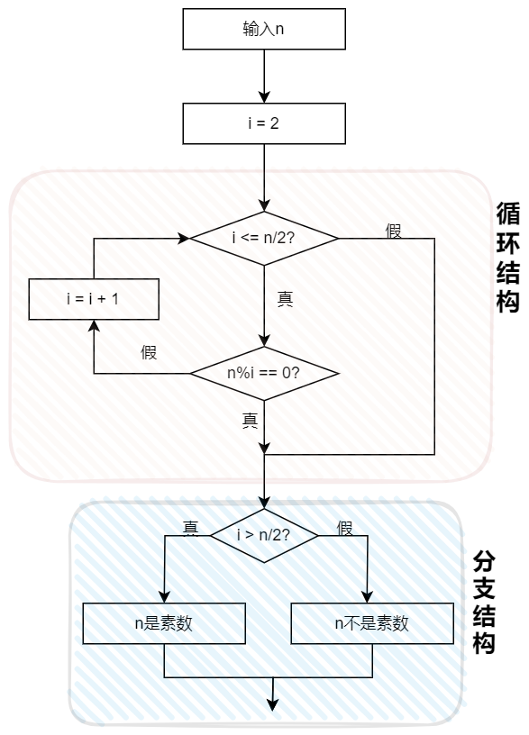

# C语言程序设计(第3版) 何钦铭 颜晖 主编

## 课后习题答案

### 习题1-认识C语言

##### 1.合法的标识符

对C语言来说，下列标识符中哪些是合法的，哪些是不合法的?

```c
total _debug Counter1 begin_  合法
```

```c
Large&Tall 非法
```

C语言的标识符由字母、数字、下划线组成，其中第一个字符必须是字母或下划线。

&是特殊字符，所以Large&Tall非法

小知识：main不是C的保留字，可以把main定义为局部变量，如果和在前者在同一翻译单元（经过预处理、包含了头文件的源文件）中，会产生重定义的编译错误。“-”不是标识符的合法组成，不要看错了。

##### 2.改写本章 1.4 节中的流程图 1.2

求 1～100 中能被 6 整除的所有整数的和。


<center style="color:#C0C0C0">图1.2 改写流程图</center>

##### 3.改写本章 1.4 节中的程序

求 1～100 中能被 6 整除的所有整数的和，并在编程环境中验证该程序的运行结果。

```c
#include<stdio.h>

int main(){
    int sum = 0;
    int i = 1;
    for(i = 1; i <= 100; i++){
    	if(i % 6 == 0)
    		sum += i;
	}
    printf("%d", sum);
    
    return 0;
}

运行结果：816
```

##### 4.判断素数

对于给定的整数 n（n＞1），请设计一个流程图判别 n 是否为一个素数（只能被 1 和自己整除的整数），并分析该流程图中哪些是顺序结构、哪些是分支结构与循环结构

答：循环结构和分支结构如下图，从最上边的两个实线框和下面两个大的阴影框一同构成了顺序结构。



<center style="color:#C0C0C0">图1.4 判定素数流程图</center>

### 练习2-用C语言编写简单程序

##### 【练习 2-1】显示短句

编写程序，在屏幕上显示一个短句“Programming in C is fun!”。

```c
#include<stdio.h>

int main()
{
	printf("Programming in C is fun!\n");
	
	return 0;
}
```

##### 【练习 2-2】 运行结果是什么？

下列语句的运行结果是什么？与例 2-2 的运行结果有何不同？为什么？

```c
printf("Programming is fun. And Programming in C is even more fun!\n");
```

答：运行结果：Programming is fun. And Programming in C is even more fun!

例2-2是分两行输出结果，因为两行都采用了换行符号。

##### 【练习 2-3】显示图案

编写程序，在屏幕上显示如下图案。

```c
* * * *
 * * *
  * *
   *
```

答：

```c
#include<stdio.h>

int main()
{
    printf("* * * *\n");
    printf(" * * *\n");
    printf("  * *\n");
    printf("   *\n");
    return 0;
}
```

##### 【练习 2-4】 华氏温度转换成摄氏温度

编写程序，求华氏温度 150°F 对应的摄氏温度（计算公式同例 2-3）

答：

```c
#include<stdio.h>

int main()
{
	int celsius, fahr; 
	fahr = 150;
 	celsius = 5 * (fahr - 32) / 9;
	printf("fahr = 150, celsius = %d", celsius); 
	return 0;	
}
```

##### 【练习 2-5】 改写表达式

算术表达式` 5*(fahr-32)/9 `能改写成` 5(fahr-32)/9 `吗？为什么？如果将其改写为` 5/9*(fahr-32)`，会影响运算结果吗？

答：

​		不能，` 5(fahr-32)/9 `不是合法表达式，因为`*`运算符不能省略，` 5/9*(fahr-32)`的结果为0。

##### 【练习 2-6】 自由落体

一个物体从 100 米的高空自由落下，编写程序，求它在前 3 秒内下落的垂直距离。设重力加速度为 10m/s^2。

答：

```c
#include<stdio.h>

int main()
{
    float h = 0;
    int t = 3;
    const int g = 10;
    h = 1 / 2.0 * g * t * t;

    printf("height = %.2f", h);
    
    return 0;
}
```

##### 【练习 2-7】输入、输出语句的顺序

输入提示和输入语句的顺序应该如何安排？例 2-5 中，scanf("%d%d%lf", &money, &year,  &rate) 能改写为 scanf("%d%lf%d", &money, &year, &rate) 吗？为什么？能改写为 scanf("%d%lf%d", &money, &rate, &year) 吗？如果可以，其对应的输入数据是什么？

解答：

​		前者不能，因为%lf和year的数据类型不匹配，%d和rate的数据类型不匹配。

​		后者能，对应的输入数据是1000 0.025 3。

##### 【练习 2-8】任意华氏温度转换摄氏温度

编写程序，输入华氏温度，输出对应的摄氏温度，计算公式同例 2-3。

解答：

```c
#include<stdio.h>

int main()
{
    int fahr = 0;
    int celsius = 0;
    scanf("%d", &fahr);
    celsius = 5 * (fahr - 32)/9;

    printf("Celsius = %d\n", celsius);

    return 0;
}
```

##### 【练习 2-9】整数四则运算

输入 2 个正整数，计算并输出它们的和、差、积、 商。试编写相应程序。

解答：

```c
#include<stdio.h>

int main()
{
    int a, b;
    scanf("%d %d", &a, &b);

    printf("%d + %d = %d\n", a, b, a + b);
    printf("%d - %d = %d\n", a, b, a - b);
    printf("%d * %d = %d\n", a, b, a * b);
    printf("%d / %d = %d\n", a, b, a / b);
    
    return 0;
}
```

##### 【练习 2-10】计算分段函数

（判断 x 是否不为 0）：输入 x ，计算并输出下列分 段函数 f(x) 的值（保留 1 位小数）。试编写相应程序。
$$
y = f(x) =  \begin{cases}    \frac {1}{x} & x ≠ 0 \\    0 & x = 0 \end{cases}
$$

解答：

```c
#include<stdio.h>
int main()
{
    double x = 0;
    double result = 0;
    scanf("%lf", &x);

    if(x == 0)
        result = x;
    else
        result = 1 / x;

    printf("f(%.1f) = %.1f\n", x, result);

    return 0;
}
```

##### 【练习 2-11】计算分段函数

（判断 x 是否小于 0）：输入 x ，计算并输出下列分段函数 f(x)的值（保留 2 位小数）。可包含头文件 math.h，并调用 sqrt （） 函数求平方根，调用 pow（） 函数求幂。试编写相应程序。
$$
y = f(x) =  \begin{cases}    (x+1)^2+2x+\frac {1}{x} & x < 0 \\    \sqrt{x} & x ≥ 0 \end{cases}
$$

解答：

```c
#include<stdio.h>
#include<math.h>
int main()
{
    double x = 0;
    double result = 0;
    scanf("%lf", &x);

    if(x < 0)
        result = (x + 1) * (x + 1) + 2 * x + 1 / x;
    else
        result = sqrt(x);

    printf("f(%.1f) = %.3f\n", x, result);

    return 0;
}
```

##### 【练习 2-12】输出华氏 - 摄氏温度转换表

输入两个整数 lower 和 upper，输出 一张华氏 - 摄氏温度转换表，华氏温度的取值范围是 [lower, upper] ，每次增加 2°F，计算公式同例 2-6 。试编写相应程序。

解答：

```c
#include<stdio.h>

int main()
{
    int lower, upper;
    int fahr = 0;
    double celsius = 0;
    scanf("%d %d", &lower, &upper);
    if(lower > upper)
        printf("Invalid.\n");
    else
    {
        printf("fahr celsius\n");
        for(fahr = lower; fahr <= upper; fahr = fahr + 2)
        {
            celsius = 5 * (fahr - 32)/9.0;
            printf("%d%6.1f\n", fahr, celsius);
        }
    }

    return 0;
}
```

##### 【练习 2-13】求给定序列前 n 项和

（1+1/2+1/3+ …1/n）：输入一个正整数 n ，计算序列 1+1/2+1/3+ …的前 n 项之和。试编写相应程序。

解答：

```c
#include<stdio.h>

int main()
{
    double sum = 0;
    int n;
    scanf("%d", &n);

    for(int i = 1; i <= n; i++)
        sum += 1.0/i;

    printf("sum = %.6f", sum);
    
    return 0;
}
```

##### 【练习 2-14】求给定序列前 n 项和

（1+1/3+1/5+ …）：输入一个正整数 n ，计算 序列 1+1/3+1/5+ …的前 n 项之和。试编写相应程序。

解答：

```c
#include<stdio.h>

int main()
{
    double sum = 0, denominator = 1;
    int n;
    scanf("%d", &n);
    
    for(int i = 1; i <= n; i++)
    {
        sum += 1/denominator;
        denominator += 2;
    }

    printf("sum = %.6f", sum);
    
    return 0;
}
```

##### 【练习 2-15】求给定序列前 n 项和

（ 1-1/4+1/7-1/10 …）：输入一个正整数 n ， 计算序列 1-1/4+1/7-1/10+1/13-1/16 …的前 n 项之和。试编写相应程序。

解答：

```c
#include<stdio.h>

int main()
{
    double sum = 0, denominator = 1, flag = 1;
    int n;
    scanf("%d", &n);

    for(int i = 1; i <= n; i++)
    {
        sum += flag / denominator;
        flag = flag * (-1);
        denominator += 3;
    }

    printf("sum = %.3f", sum);

    return 0;
}
```

##### 【练习 2-16】执行下列程序段后， sum的值____。

```c
for (i = 1; i <= 10; i++){ 
 sum = 0; 
 sum = sum + i; 
}
```

解答：

​		sum的值是10，注意一下每次循环sum都要先被赋值10；

##### 【练习 2-17】生成 3 的乘方表

输入一个正整数 n，生成一张 3 的乘方表，输 出 $3^0$到 $3^n$的值。可包含头文件 math.h, 并调用幂函数计算 3 的乘方。试编写相应程序。

解答：

```c
#include<stdio.h>
#include<math.h>

int main()
{
    int n;
    scanf("%d", &n);
    int value;
    for(int i = 0; i <= n; i++)
    {
        value = pow(3, i);
        printf("pow(3,%d) = %d\n", i, value);
    }

    return 0;
}
```

##### 【练习 2-18】求组合数

根据下列公式可以算出从 n 个不同元素中取出 m 个 元素（m≤n）的组合数。输入两个正整数 m 和 n （m≤n），计算并输出组合数。 要求定义和调用函数 fact(n) 计算 n! ，函数类型是 double 。
$$
C^m_n = \frac{n!}{m!(n-m)!}
$$

解答：

```c
#include<stdio.h>

double fact(int n)
{
    int i;
    double product = 1;

    for(int i = 1; i <= n; i++)
        product *= i;

    return product;
}

int main()
{
    int n, m;
    scanf("%d %d", &m, &n);
    int result = fact(n)/(fact(m) * fact(n - m));

    printf("result = %d", result);

    return 0;
}
```

### 习题2-用C语言编写简单程序

##### 1.求整数均值

输入 4 个整数，计算并输出这些整数的和与平均值，其中平均 值精确到小数点后 1 位。试编写相应程序。

解答：

```c
#include<stdio.h>

int main()
{
    int a, b, c, d, sum;
    double average;
    scanf("%d %d %d %d", &a, &b, &c, &d);

    sum = a + b + c + d;
    average = sum / 4.0;
    printf("Sum = %d; Average = %.1f", sum, average);

    return 0;
}
```

##### 2.阶梯电价

为了倡导居民节约用电， 某省电力公司执行“阶梯电价”， 安装一 户一表的居民用户电价分两个“阶梯”：月用电量 50 千瓦时（含 50 千瓦时） 以内的，电价为 0.53 元/ 千瓦时；超过 50 千瓦时，超出的用电量电价上调 0.05  元/ 千瓦时。输入用户的月用电量（千瓦时） ，计算并输出该用户应支付的电费 （元）。试编写相应程序。

解答：

```c
#include<stdio.h>

int main()
{
    double x, cost;
    scanf("%lf", &x);

    if(x < 0)
        printf("Invalid Value!\n");
    else if(x <= 50)
        cost = x * 0.53;
    else
        cost = (x - 50) * 0.58 + 50 * 0.53;
    if(x >= 0)
        printf("cost = %.2f", cost);

    return 0;
}
```

##### 3.序列求和

输入两个正整数*m*和*n*（0<*m*≤*n*），求$\sum_{i=m}^{n}(i^2 + \frac{1}{i})$，结果保留6位小数。试编写相应程序。

解答：

```c
#include<stdio.h>

int main()
{
    int m, n;
    scanf("%d %d", &m, &n);
    double sum = 0;
    for(int i = m; i <= n; i++)
    	sum += 1.0 * i * i + 1.0 / i;
   
    printf("sum = %.6f", sum);

    return 0;
}
```

##### 4.求交错数列前n项和

输入一个正整数n，计算交错序列 1-2/3+3/5-4/7+5/9-6/11+... 的前n项之和。试编写相应程序。

解答：

```c
#include<stdio.h>

int main()
{
    double sum = 0, denominator = 1, numerator = 1;
    int n;
    scanf("%d", &n);
    double flag = 1;

    for(int i = 1; i <= n; i++)
    {
        sum += flag * numerator / denominator;
        flag = -flag;
        numerator ++;
        denominator += 2;
    }

    printf("%.3f\n", sum);
    
    return 0;
}
```

##### 5.平方根求和

输入一个正整数n，计算平方根序列$1+\sqrt{2}+\sqrt{3}+⋯+\sqrt{n}$的值（保留2位小数）。可包含头文件`math.h`，并调用`sqrt`函数求平方根。试编写相应程序。

解答：

```c
#include<stdio.h>
#include<math.h>

int main()
{
    double sum = 0;
    int n;
    scanf("%d", &n);

    for(int i = 1; i <= n; i++)
        sum += sqrt(i);

    printf("sum = %.2f", sum);

    return 0;
}
```

##### 6.求给定序列前 n 项和

（1！+2！+…）：输入一个正整数 n ，求 e=1！+2！3！+… +n！的值。要求定义和调用 fact （n）计算 n！，函数类型是 double 。试编写相应程序。

解答：

```c
#include<stdio.h>

double factorial(int n)
{
    double product = 1;
    for(double i = 1; i <= n; i++)
        product *= i;

    return product;
}

int main()
{
    int n;
    scanf("%d", &n);
    int sum = 0;
    
    for(int i = 1; i <=n; i++)
        sum += factorial(i);

    printf("%d", sum);
    
    return 0;
}
```


### 练习3-分支结构

##### 【练习 3-1 】还需要增加测试用例吗

例 3-4 中使用 else-if 语句求解多分段函数， 为了检查 else-if  语句的三个分支是否正确， 已经设计了三组测试用例， 请问还需要增加测试用例吗？为什么？如果要增加，请给出具体的测试用例并运行程序。

解答：

​		最好再增加两组测试用例：x = 0、x = 15，对分段函数的边界情况进行测试。

##### 【练习 3-2 】计算符号函数的值

 输入一个整数 x ，计算并输出下列分段函数 sign(x) 的值。
$$
y = sign(x) =  \begin{cases}    -1 & x < 0 \\ 0 & x = 0 \\  1 & x > 0 \end{cases}
$$

解答：

```c
int main()
{
    int x;
    scanf("%d", &x);
    int y = 0;

    if(x < 0)
        y = -1;
    else if(x == 0)
        y = 0;
    else
        y = 1;

    printf("sign(%d) = %d", x, y);

    return 0;
}
```

##### 【练习 3-3 】统计学生平均成绩与及格人数

输入一个正整数 n ，再输入 n 个 学生的成绩，计算平均成绩，并统计所有及格学生的人数。试编写相应程序。

解答：

​		注意没有学生要特殊处理一下，否则有可能发生除零错误。

```c
#include<stdio.h>

int main()
{
    int n, count = 0;
    double total = 0, average = 0;

    scanf("%d", &n);
    int stu;
    for(int i = 0; i < n; i ++)
    {
        scanf("%d ", &stu);
        total += stu;
        if(stu >= 60)
            count ++;
    }
    if(n > 0)
    	average = total / n;

    printf("average = %.1f\ncount = %d", average, count);
    
    return 0;
}
```

##### 【练习 3-4 】统计字符

输入 10 个字符，统计其中英文字母、空格或回车、数字字符和其他字符的个数。试编写相应程序。

解答：

```c
#include<stdio.h>

int main()
{
    int letter, blank, digit, other;
    char ch;
    letter = blank = digit = other = 0;

    for(int i = 1; i <= 10; i++)
    {
        ch = getchar();
        if(ch >= 'A' && ch <= 'Z' || ch >= 'a' && ch <= 'z')
            letter ++;
        else if(ch == ' ' || ch == '\n')
            blank ++;
        else if(ch >= '0' && ch <= '9')
            digit ++;
        else
            other ++;
    }

    printf("letter = %d, blank = %d, digit = %d, other = %d", letter, blank, digit, other);
        
    return 0;
}
```

##### 【练习 3-5】输出闰年

输出 21 世纪中截至某个年份之前的所有闰年年份。判断闰年的条件是： 能被 4 整除但不能被 100整除，或者能被 400 整除。试编写相应程序。

解答：

```c
#include<stdio.h>
#define YEAR_BEGIN 2001
#define YEAR_END 2100

int main()
{
    int year;
    int count = 0;
    scanf("%d", &year);

    if(year < YEAR_BEGIN || year > YEAR_END)
        printf("Invalid year!\n");
    else
    {
        for(int i = YEAR_BEGIN; i <= year; i ++)
        {
            if((i % 4 == 0 && i % 100 != 0) || (i % 400 == 0))
            {
                count ++;
                printf("%d\n", i);
            }
        }
        if(count == 0)
        printf("None\n");
    }
    
    return 0;
}
```

##### 【练习 3-6 】去掉break会怎样？

在例 3-8 程序中，如果把 switch 语句中所有的 break 都去掉，运行结果会改变吗？如果有变化，输出什么？为什么？

解答：

​		会改变，会从满足输入的常量表达式那个case开始顺序执行所有语句，直到执行default后面的price = 0.0，所以会输出price = 0。

##### 【练习 3-7 】成绩转换

输入一个百分制成绩，将其转换为五分制成绩。百分制成绩到五分制成绩的转换规则：大于或等于 90 分为 A，小于 90 分且大于或等于 80 分为 B，小于 80分且大于或等于 70分为 C，小于 70 分且大于或等于 60 分为 D，小于 60 分为 E。试编写相应程序。

解答：

```c
#include<stdio.h>

int main()
{
    int grade;
    scanf("%d", &grade);
    grade /= 10;

    switch( grade )
    {
        case 10:
        case 9:
            printf("A\n");
            break;
         case 8:
            printf("B\n");
            break;
         case 7:
            printf("C\n");
            break;
         case 6:
            printf("D\n");
            break;
         default:
            printf("E\n");
            break;
    }

    return 0;
}
```

##### 【练习 3-8 】查询水果的单价

有 4 种水果，苹果（ apples ）、梨（pears）、桔子（oranges）和葡萄（ grapes），单价分别是 3.00 元/ 公斤，2.50 元/ 公斤， 4.10 元/ 公斤和 10.20 元/ 公斤。在屏幕上显示以下菜单（编号和选项） ，用户 可以连续查询水果的单价， 当查询次数超过 5 次时，自动退出查询； 不到 5 次 时，用户可以选择退出。当用户输入编号 1 ～4，显示相应水果的单价（保留两位小数）；输入 0 ，退出查询；输入其他编号，显示价格为 0 。试编写相应程序。 

​		[1] apples

​		[2] pears  

​		[3] oranges  

​		[4] grapes  

​		[0] Exit

解答：

```c
#include<stdio.h>

int main()
{
    double price;
    int choice, i;

    printf("[1] apple\n");
    printf("[2] pear\n");
    printf("[3] orange\n");
    printf("[4] grape\n");
    printf("[0] exit\n");

    for(i = 1; i <= 5; i ++)
    {
    scanf("%d", &choice);

    if(choice == 0)
        break;

    switch(choice)
    {
        case 1:price = 3.00; break;
        case 2:price = 2.50; break;
        case 3:price = 4.10; break;
        case 4:price = 10.20; break;
        default: price = 0.0; break;
    }

    printf("price = %.2f\n", price);
    }
    
    return 0;
}
```

##### 【练习 3-9】 使用嵌套if-else语句重新编写3-4

请读者重新编写例 3-4 的程序，要求使用嵌套的 if - else 语句，并上机运行。

解答：

```c
#include<stdio.h>

int main()
{
		double x, y;
		
		printf("Enter x:");
		scanf("%lf", &x);
		if(x < 0)
		{
			y = 0;
		}
		else
		{
			if(x <= 15)
			{
				y = 4 * x / 3;
			}
			else
			{
				y = 2.5 * x - 10.5;
			}
		}
		printf("f(%.2f) = %.2f\n", x, y);
		
		return 0;
}
```

##### 【练习 3-10 】嵌套的if-else语句条件判断

在例 3-12 中，改写 if 语句前， y= x + 1; 和 y= x + 2; 两条语句的执行条件是什么？改写后呢？

解答：

​		改写前，x∈[-∞，1)时执行 y = x + 1，x∈[1，2）时执行y = x + 2；

​		改写后，x∈[-∞，1)时执行 y = x + 1，x∈[2，+∞）时执行y = x + 2

### 习题3-分支结构

#### 一、选择题

(见参考答案)

#### 二、填空题

(见参考答案)

#### 三、程序设计题

##### 1.比较大小

输入 3 个整数，按从小到大的顺序输出。试编写相应程序。

解答：

```c
#include<stdio.h>

int main()
{
    int a, b, c;
    scanf("%d %d %d", &a, &b, &c);
    int tmp;

    if(a > b)
    {
        tmp = a;
        a = b;
        b = tmp;
    }
    if(a > c)
    {
        tmp = a;
        a = c;
        c = tmp;
    }
    if(b > c)
    {
        tmp = b;
        b = c;
        c = tmp;
    }

    printf("%d->%d->%d\n", a, b, c);

    return 0;
}
```

##### 2.高速公路超速处罚

按照规定，在高速公路上行驶的机动车，超过本车道限 速的 10%则处 200 元罚款；若超出50%，就要吊销驾驶证。请编写程序根据车速和限速判别对该机动车的处理。

解答：

​		注意一下，`%`在C语言中有其他功能，要用`printf()`输出百分号字符，需要使用双写的`%%`。

```c
#include<stdio.h>

int main()
{
    int speed, limit;
    scanf("%d %d", &speed, &limit);
	double q;
	
    q = 1.0 * (speed - limit) / limit;

    if(q < 0.1)
        printf("OK\n");
    else if(q >= 0.1 && q < 0.5)
        printf("Exceed %.f%%. Ticket 200", 100 * q);
    else
        printf("Exceed %.f%%. License Revoked", 100 * q);

    return 0;
}
```

##### 3.出租车计价

某城市普通出租车收费标准如下： 起步里程 3 公里，起步费 10 元；超起步里程后 10 公里内，每公里 2 元，超过 10 公里以上的部分加收 50% 的空驶补贴费，即每公里 3 元；营运过程中，因路阻及乘客要求临时停车的，按每 5 分钟 2 元计收（不足 5 分钟则不收费）。运价计费尾数四舍五入， 保留到元。 编写程序，输入行驶里程 ( 公里) 与等待时间 ( 分钟) ，计算并输出乘客应支付的车费( 元) 。

答案：

​		很明显参考答案是错的，超起步里程后 10 公里内，指的是3~10公里是2元/公里。

```c
#include<stdio.h>

int main()
{
    double mile, price;
    int time;

    price = 0;
    
    scanf("%lf %d", &mile, &time);

    if(mile <= 3)
        price += 10;
    else if(mile <= 10)
        price += 10 + 2 * (mile - 3);
    else
        price += 10 + 2 * 7 + 3 * (mile - 10);

    price += (time / 5) * 2;

    printf("%.0f", price);

    return 0;
}
```

##### 4.统计学生成绩

输入一个正整数 n ，再输入 n 个学生的成绩，统计五分制成绩的分布。百分制成绩到五分制成绩的转换规则：大于或等于 90 分为 A，小于 90 分且大于或等于 80 分为 B，小于 80分且大于或等于 70 分为 C，小于 70 分且 大于或等于 60 分为 D，小于 60分为 E。试编写相应程序。

解答：

```c
#include<stdio.h>

int main()
{
    int grade;
    int n;
    int A, B, C, D, E;
    A = B = C = D = E = 0;
    scanf("%d", &n);

    for(int i = 0; i < n; i ++)
    {
        scanf("%d", &grade);
        grade /= 10;
        switch(grade)
        {
            case 10:
            case 9:
                A ++;
                break;
            case 8:
                B ++;
                break;
            case 7:
                C ++;
                break;
            case 6:
                D ++;
                break;
            case 5:
            case 4:
            case 3:
            case 2:
            case 1:
            case 0:
                E ++;
                break;
        }
    }

    printf("%d %d %d %d %d", A, B, C, D, E);

    return 0;
}
```

##### 5.三角形判断

输入平面上任意三个点的坐标（ x1，y1）、（x2，y2）、（x3，y3）， 检验他们能否构成三角形。 如果这 3 个点能构成一个三角形， 输出周长和面积（保留 2 位小数）；否则，输出“ Impossible ”。试编写相应程序。

提示：在一个三角形中，任意两边之和大于第三边。三角形面积计算公式如下：
$$
area = \sqrt{s(s-a)(s-b)(s-c)},其中s=(a+b+c)/2
$$
解答：

```c
#include<stdio.h>
#include<math.h>

int main()
{
    double a, b, c, s, area;
    double x1, y1, x2, y2, x3, y3;
    scanf("%lf %lf %lf %lf %lf %lf", &x1, &y1, &x2, &y2, &x3, &y3);

    a = sqrt(pow((x1 - x2),2) + pow((y1 - y2),2));
    b = sqrt(pow((x2 - x3),2) + pow((y2 - y3),2));
    c = sqrt(pow((x1 - x3),2) + pow((y1 - y3),2));

    s = (a + b + c)/2;
    area = sqrt(s * (s - a) * (s - b) * (s - c));

    if(area == 0)
        printf("Impossible");
    else
        printf("L = %.2f, A = %.2f\n", 2 * s, area);
    
    return 0;
}
```

### 练习4-循环结构

##### 【练习 4-1 】修改例4-1程序

在例 4-1 程序中，如果对 item 赋初值 0 ，运行结果是什么？为什么？如果将精度改为 $10^{-3}$，运行结果有变化吗？为什么？

解答：

​		运行结果是0，因为fabs(0) = 0，不满足while循环的条件，所以会跳过while循环，pi = 0。

​		把精度改小(值增大)会导致循环次数减少，运行结果会发生改变，改之前的结果是3.1418，改之后的结果是3.1436。

##### 【练习 4-2 】 修改例 4-2 程序

运行例 4-2 程序时，如果将最后一个输入数据改为 -2，运行结果有变化吗？如果第一个输入数据是 -1 ，运行结果是什么？为什么？

解答：

​		不会有变化，因为都是负数，都可以满足循环终止条件，负数并不会被统计。

​		如果第一个输入的数据是-1，那就不会执行while循环，直接执行最后的语句，打印“Grade average is 0 \n”。

##### 【练习 4-3 】有精度要求的序列求和

序列求和$（1-1/4+1/7-1/10+1/13-1/16+ …）$：输入一个正实数 eps ， 计算序列 $1-1/4+1/7-1/10+1/13-1/16+ …$的值，精确到最后一项的绝对值小于 eps（保留 6 位小数）。试编写相应程序。

解答：

​		为什么要用do-while，因为有两个特殊的边界点要过，如果eps>=精度，那么应该直接输出首项1，如果用while会导致sum对序列一项都不统计，导致错误。故使用do-while，无论如何先走一遍循环，统计第一项的值。

```c
#include<stdio.h>
#include<math.h>

int main()
{
    double denominator, flag;
    double sum, eps, item;

    scanf("%lf", &eps);
    denominator = flag = item = 1.0;
    sum = 0.0;

    do
    {
        item = flag / denominator;
        sum += item;
        flag = - flag;
        denominator += 3;
    }while(fabs(item) > eps );

    printf("sum = %f", sum);

    return 0;
}
```

##### 【练习 4-4 】修改例 4-3 程序

如果将例 4-3 程序中的 do-while 语句改为下列 while 语句，会影响程序的功能吗？为什么？再增加一条什么语句，就可以实现同样的功能？

```c
while(number != 0){ 
 number = number / 10; 
 count ++; 
} 
```

解答：

​		会影响功能，如果输入0，则不会进入while循环，导致输出0位数，不符合题意。

​		可以添加一句条件判断语句，对number == 0单独处理即可。

```c
if(number == 0) count ++;
```

##### 【练习 4-5 】修改例 4-4 程序

例 4-4 程序中的第 9 ～15 行可以用下列 for 语句替代吗？为什么？

```c
	for(i = 2; i <= m / 2; i ++)
		if(m % i == 0) printf("No!\n");
		else printf("%d is a prime number!\n", m);
```

解答：

​		不可以，替换后的语句等价于下面的语句，某个`i`满足`m%i != 0`不能得出任何结论，而修改后的程序，每遇到一个不能整除`m`的`i`都会输出一次`printf("%d is a prime number!\n", m);`显然是不对的。

```c
#include<stdio.h>

int main(void)
{
	int i, m;
	
	printf("Enter a number:");
	scanf("%d", &m);
	
	for(i = 2; i <= m / 2; i ++)
    {
		if(m % i == 0) printf("No!\n");
		else printf("%d is a prime number!\n", m);
    }
    
	return 0;
}
```

##### 【练习 4-6】猜数字游戏

先输入 2 个不超过 100 的正整数，分别是被猜数 mynumber和允许猜测的最大次数 n，再输入你所猜的数 yournumber，与被猜数 mynumber进行比较，若相等，显示猜中， ；若不等，显示与被猜数的大小关系， 最多允许猜 n 次。如果 1 次就猜出该数，提示“ Bingo! ”；如果 3 次以内猜到该数，则提示“Lucky You! ”; 如果超过 3 次但不超过 n 次猜到该数，则提示“Good  Guess!”; 如果超过 n 次都没有猜到，则提示“ Game Over”; 如果在到达 n 次之前，用户输入了一个负数， 也输出“Game Over”，并结束程序。 试编写相应程序。

解答：

​		本题内层不要用switch语句，否则跳出循环比较麻烦。

```c
#include<stdio.h>

int main()
{
    int num, n;
    int count = 0;
    int guess;
    scanf("%d %d", &num, &n);

    do{
        scanf("%d", &guess);
        count ++;
        if(guess < 0)
        {
            printf("Game Over\n");
            break;
        }
        else if(guess > num)
        {
            printf("Too big\n");
        }
        else if(guess < num)
        {
            printf("Too small\n");
        }
        else
        {
            if(count == 1)
            {
                printf("Bingo!\n");
                break;
            }
            else if(count <= 3)
            {
                printf("Lucky You!");
                break;
            }
            else if(count <= n)
            {
                printf("Good Guess!");
                break;
            }
            else
            {
                printf("Game Over");
                break;
            }
        }
    }while(guess > 0);

    return 0;
}
```

##### 【练习 4-7 】求 e 的值

自然常数 *e* 可以用级数 $1+1/1!+1/2!+⋯+1/n!+⋯ $来近似计算。本题要求对给定的非负整数 *n*，求该级数的前 *n*+1 项和。要求使用嵌套循环。试编写相应程序。

解答：

​		注意一下item的初始化位置、e求和语句的位置即可。

```c
#include<stdio.h>

int main()
{
    double n;
    double e, item;
    e = 0;

    scanf("%lf", &n);
    for(int i = 1; i <= n + 1; i ++)
    {
        item = 1;
        for(int j = 1; j < i; j ++)
        {
            item *= j;
        }
        e += 1 / item;
    }

    printf("%.8f\n", e);

    return 0;
}
```

##### 【练习 4-8 】例4-8-1输入0会怎样

运行例 4-8 的源程序 1 时，如果先输入 0 ，即输入数据个数 n=0 ， 表示不再输入任何成绩，运行结果是什么？如何修改程序以应对这种情况？

解答：

​		程序不会结束运行，而是等待用户输入学生成绩，这与n = 0矛盾。

​		可以在第二个`scanf()`前加一条n > 0才执行后面语句的if条件判断。

##### 【练习 4-9 】例4-8-2输入第一个数为负

运行例 4-8 的源程序 2 时，如果输入的第一个数就是负数， 表示 不再输入任何成绩，运行结果是什么？如何修改程序以应对这种情况？

解答：

​		运行结果最大值是个负数；需要加一条单独的if语句判断为负数时特殊处理。

##### 【练习 4-10 】找出最小的值

输入一个正整数 n, 再输入 n 个整数，输出最小值。试编写相应程序。

解答：

​		方法一：先把min定义为一个最大正整数，可以少写一个`scanf()`。

```c
#include<stdio.h>
#define max 2147483647

int main()
{
    int n, num, min;
    scanf("%d", &n);
    min = max;
    
    for(int i = 1; i <= n ; i ++)
    {
        scanf("%d", &num);
        if(num < min)
            min = num;
    }

    printf("min = %d", min);

    return 0;
}
```

​		方法二：循环前先把min定义为第一个数，后面正常写，和第一个方法相比for的循环条件也要改变。

```c
#include<stdio.h>

int main()
{
    int n, num, min;
    scanf("%d", &n);
    scanf("%d", &num);

    min = num;
    for(int i = 1; i < n ; i ++)
    {
        scanf("%d", &num);
        if(num < min)
            min = num;
    }

    printf("min = %d", min);

    return 0;
}
```

##### 【练习 4-11 】统计素数并求和

输入 2 个正整数 m和 n（1≤m≤n≤500），统计并输出 m和 n 之间素数的个数以及这些素数的和。素数就是只能被 1 和自身整除的正整数， 1 不是素数，2 是素数。试编写相应程序。

解答：

​		使用优化过的素数算法通过OJ测试点运行时间为2ms，比没优化的算法快了2ms :）

```c
#include<stdio.h>
#include<math.h>

int main()
{
    int count, sum;
    int isPrime;
    int m, n, k;

    scanf("%d %d", &m, &n);
    sum = count = 0;

    for(int i = 2; i <= n; i ++)
    {
        isPrime = 1;
        k = sqrt(i);
        for(int j = 2; j <= k; j ++)
        {
            if(i % j == 0)
            {
            	isPrime = 0;
                break;
            }
        }
        if(isPrime == 1)
        {
            if(i >= m && i <= n)
            {
                count ++;
                sum += i;
            }
        }
    }

    printf("%d %d\n", count, sum);
    
    return 0;
}
```

### 习题4-循环结构

#### 一、选择题

(见参考答案)

#### 二、填空题

(见参考答案)

#### 三、程序设计题

##### 1.求奇数和

解答：

​		do-while里面不要再加多余的条件判断了，因为如果取了负数或者0，取余也不会满足 n % 2 == 1，所以可以放心只保留while后面的条件判断。

```c
#include<stdio.h>

int main()
{
    int num;
    int sum = 0;
    
    do
    {
        scanf("%d", &num);
		if(num % 2 == 1)
        {
            sum += num;
        }
    }while(num > 0);

    printf("%d\n", sum);

    return 0;
}
```

##### 2.展开式求和

已知函数$e^x$可以展开为下面的幂级数。输入 1 个实数 x，计算并输出下式的值，直到最后一项的绝对值小于 0.00001，计算结果保留 4 位小数。要求定义和调用函数 fact(n) 计算 n 的阶乘，可以调用 pow( ) 函数求幂。试编写相应程序。
$$
e^x=1+x+\frac{x^2}{2!}+\frac{x^3}{3!}+\frac{x^4}{4!}+…+\frac{x^k}{k!}+ …
$$

解答：

```c
#include<stdio.h>
#include<math.h>

double fact(double x)
{
    double product = 1;
    for(int i = 2; i <= x; i ++)
    {
        product *= i;
    }

    return product;
}

int main()
{
    double x, sum, item;
    int i;

    scanf("%lf", &x);
    i = sum = 0;                     //第6行

    do
    {
        item = pow(x, i) / fact(i);
        sum += item;
        i ++;
    }while(fabs(item) >= 0.00001);  //第13行

    printf("%.4f", sum);

    return 0;
}
```

​		本题和4-3有点区别，精度值已经给定了，所以可以不用do-while，提前把item的值赋1，让while循环可以正常进入即可。把上述代码6~13行替换为以下代码，可以实现相同功能。

```c
	i = sum = item = 1;

    while(fabs(item) >= 0.00001)
    {
        item = pow(x, i) / fact(i);
        sum += item;
        i ++;
    }
```

##### 3.求序列和

输入一个正整数 n ，输出 2/1+3/2+5/3+8/5 + …的前 n 项之和， 保留 2 位小数。该序列从第 2 项起，每一项的分子是前一项分子与分母的和， 分母是前一项的分子。试编写相应程序。

解答：

```c
#include<stdio.h>

int main()
{
    double sum;
    double numerator, denominator, tmp;
    int n;

    scanf("%d", &n);
    numerator = 2;
    denominator = 1;
    sum = 0;

    for(int i = 1; i <= n; i ++)
    {
        sum += numerator / denominator;
        tmp = numerator;
        numerator += denominator;
        denominator = tmp;
    }

    printf("%.2f", sum);

    return 0;
}
```

##### 4.求序列和

输入 2 个正整数 a 和 n，求 a+aa+aaa+aa…a(n 个 a)之和。例如， 输入 2 和 3，输出 246(2+22+222)。试编写相应程序。

解答：

```c
#include<stdio.h>

int main()
{
    int n, a, t, sum;

    t = sum = 0;
    scanf("%d %d", &a, &n);

    for(int i = 1; i <= n; i ++)
    {
        t = a + 10 * t;
        sum += t;
    }

    printf("s = %d\n", sum);
    
    return 0;
}
```

##### 5.换硬币

将一笔零钱换成5分、2分和1分的硬币，要求每种硬币至少有一枚，有几种不同的换法？

要求按5分、2分和1分硬币的**数量依次从大到小**的顺序，输出各种换法。每行输出一种换法，格式为：“fen5:5分硬币数量, fen2:2分硬币数量，fen1:1分硬币数量, total:硬币总数量”。最后一行输出“count = 换法个数”。

解答：

​		注意题目要求，要按**优先换大面额零钱**的规则来换硬币，所以要从最外层换5分，最内层换1分，而且从最大值递减考虑所有方案。

```c
#include<stdio.h>

int main()
{
    int five, two, one;
    int count = 0;
    int x;
    
    scanf("%d", &x);
    for(five = x / 5; five > 0; five --)
    {
        for(two = x / 2; two > 0; two --)
        {
            for(one = x; one > 0; one --)
            {
                if(x == 5 * five + 2 * two + 1 * one)
                {
                    count ++;
                    printf("fen5:%d, fen2:%d, fen1:%d, total:%d\n", five, two, one, five + two + one);
                }
            }
        }
    }

    printf("count = %d", count);

    return 0;
}
```

##### 6.输出水仙花数

水仙花数是指一个*N*位正整数（*N*≥3），它的每个位上的数字的*N*次幂之和等于它本身。例如：$153=1^3+5^3+3^3$。 本题要求编写程序，计算所有*N*位水仙花数。

解答：

​		PTA上OJ的pow()执行效率太低了，放到OJ上运行会超时(3600ms/2500ms)。需要自己写一个mypow()，顺便学习一下简易的求幂函数怎么写，后来实践发现二者运行速度大约差8倍(400ms/2500ms)。

```c
#include<stdio.h>

int mypow(int a, int n)
{
    int result = 1;
    for(int i = 0; i < n; i ++)
    {
        result *= a;
    }

    return result;
}

int main()
{
    int tmp, n, digit, sum;

    scanf("%d", &n);
    
    for(int i = mypow(10, n - 1); i <= mypow(10, n) - 1; i ++)
    {
        tmp = i;
        sum = 0;
        while(tmp > 0)
        {
            digit = tmp % 10;
            sum += mypow(digit, n);
            tmp = tmp/10;
        }
        if(i == sum)
        {
            printf("%d\n", i);
        }
    }

    return 0;
}
```

##### 7.求最大公约数和最小公倍数

输入两个正整数 m和 n（m≤1000，n≤1000）， 求其最大公约数和最小公倍数。试编写相应程序。

解答：

​		方法一：要先用lcm记录下m和n的乘积，防止辗转相除法之后m和n的值改变，然后利用gcd和m*n的关系解出lcm

```c
#include<stdio.h>

int main()
{
    int gcd, lcm, m, n, t;

    scanf("%d %d", &m, &n);
    lcm = m * n;
    while(n != 0)
    {
        t = m % n;
        m = n;
        n = t;
    }
    gcd = m;
    lcm /= gcd;

    printf("%d %d\n", gcd, lcm);
    
    return 0;
}
```

​		方法二：如果你忘了gcd和lcm的关系，那这题就惨了（数学好，算法才能好！），要多写很多步骤，不过不用担心，暴力破解也是可以的。先求lcm，因为先求gcd会改变m、n的值，还要设置辅助变量。

```c
#include<stdio.h>

int main()
{
    int gcd, lcm, m, n, t;

    scanf("%d %d", &m, &n);
    
    lcm = m * n;
    for(int i = 1; i <= n; i ++)
    {
        for(int j = 1; j <= m; j ++)
        {
            if(m * i ==  n * j && m * i < lcm)
            {
                lcm = m * i;
            }
        }
    }
    
    while(n != 0)
    {
        t = m % n;
        m = n;
        n = t;
    }
    gcd = m;

    printf("%d %d\n", gcd, lcm);
    
    return 0;
}
```

##### 8.高空坠球

皮球从 height （米）高度自由落下， 触地后反弹到原高度的一半， 再落下，再反弹……如此反复。 问皮球在第 n 次落地时， 在空中一共经过多少距离？第 n 次反弹的高度是多少？输出保留 1 位小数。试编写相应程序。

解答：

​		本题难点在于n = 0、n = 1都是特殊情况，n = 0自然不用说，n = 1其实是唯一一次小球落地时只走半程的情况，n取其它正整数时，小球每次落地都走了一段上升和一段下降，所以你很难用一段相对统一的表达式表达各变量之间的关系，但分类讨论就使得问题变得容易。

```c
#include<stdio.h>
typedef long long ll;

int main()
{
    ll h, n;
    int count;
    double s, ns, t;

    scanf("%lld %lld", &h, &n);
    
    if(n == 0)
    {
    	s = 0;
    	ns = 0;
	}
	else
	{
		s = h;
		ns = h / 2.0;
		for(int i = 1; i < n; i ++)
    	{
	        s += 2 * ns;
	        ns /= 2;
    	}
	}

    printf("%.1f %.1f\n", s, ns);

    return 0;
}
```

##### 9.打菱形星号“ *”图案

输入一个正整数 n（n 为奇数），打印一个高度为 n 的 “*”菱形图案。例如，当 n 为 7 时，打印出以下图案。试编写相应程序。

```c
      * 
    * * * 
  * * * * * 
* * * * * * * 
  * * * * * 
    * * * 
      * 
```

解答：

​		两个for循环可以遍历n * n的方阵，关键就是何时打印“空格”、何时打印“*”、何时换行。

​		利用空格变量blank和五角星打印统计变量count，找出变量和行数的对应关系。注意可以利用绝对值函数，从正中间向两端找出关于变量和行数i上下半对称的表达式，以避免对菱形上下半分类讨论。

​		每行打印完把count值和blank值复位，准备进行下一行打印。

```c
#include<stdio.h>
#include<math.h>

int main()
{
    int n;
    int blank, count;

    scanf("%d", &n);
    for(int i = 1; i <= n; i ++)
    {
        blank = 2 * fabs(n / 2 + 1 - i);
        count = 0;
       for(int j = 1; j <= n; j ++)
       {
           if(blank > 0)
           {
               printf(" ");
               blank --;
           }
           else if(blank == 0)
           {
               printf("* ");
               count ++;
           }
           if(count == (n - 2 * fabs(n / 2 + 1 - i)))
           {
               printf("\n");
               break;
           }
       }
    }

    return 0;
}
```


##### 10.猴子吃桃问题

猴子第一天摘下若干个桃子，当即吃了一半，还不过瘾，又多吃了一个； 第二天早上将剩下的桃子吃掉一半， 又多吃了一个。 以后每天早上都吃了前一天剩下的一半加一个。 到第 n 天早上想再吃时，见只剩下一个桃子了。 问：第一天共摘了多少桃子？试编写相应程序。 （提示：采取逆向思维的方法， 从后往前推断。）

解答：

```c
#include<stdio.h>

int main()
{
    int n;
    int x;

    x = 1;
    scanf("%d", &n);
    while(n > 1)
    {
        x = (1 + x) * 2;
        n --;
    }

    printf("%d", x);
    
    return 0;
}
```


##### 11.兔子繁衍问题

一对兔子，从出生后第 3 个月起每个月都生一对兔子。小兔子长到第 3 个月后每个月又生一对兔子。 假如兔子都不死， 请问第 1 个月出生的一对兔子，至少需要繁衍到第几个月时兔子总数才可以达到 n 对？输入一个不超过 10000 的正整数 n，输出兔子总数达到 n 最少需要的月数。试编写相应程序。

解答：

​		表面上是兔子繁衍问题，实际上找规律就知道是求斐波那契数列的第month项的问题。

```c
#include<stdio.h>

int main()
{
    int x1, x2, tmp, n, month;

    scanf("%d", &n);
    x1 = x2 = 1;
    if(n == 1)
        month = 1;
    else
    {
        month = 2;
        while(x2 < n)
        {
            tmp = x1 + x2;
            x1 = x2;
            x2 = tmp;
            month ++;
        }
    }
    
    printf("%d", month);
    
    return 0;
}
```

